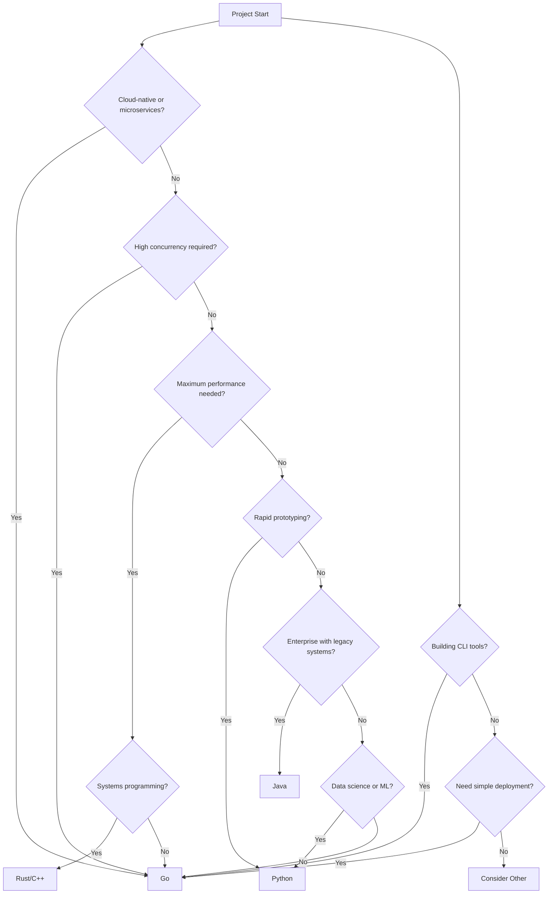
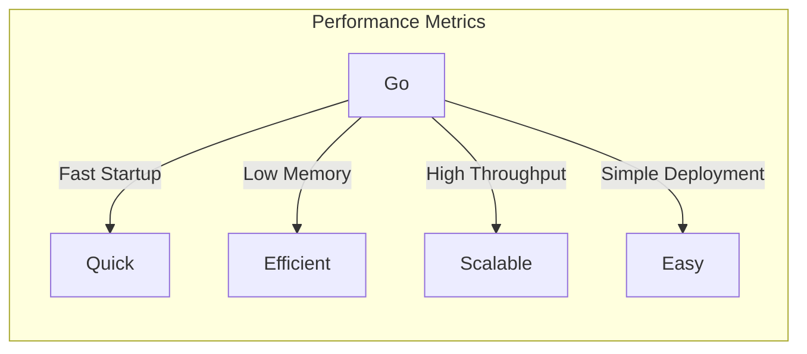

# Decision Tree: When to Use Go vs Others

## Overview
Go excels in cloud-native development and performance-critical services. Use this guide to determine when Go is the right choice.

## Decision Flow

## Go Advantages

### When Go Excels
- Cloud-native applications and microservices
- High-concurrency servers and APIs
- CLI tools and DevOps automation
- Network services and proxies
- Container-based applications
- Distributed systems

### Go Limitations
- Not ideal for complex domain models
- Limited GUI framework support
- Less mature data science ecosystem
- Simpler type system than Java/C++
- Limited metaprogramming capabilities

## Language Comparison

| Criteria | Go | Java | Python | Rust |
|----------|-----|------|--------|------|
| Performance | Very Fast | Fast | Slow | Very Fast |
| Concurrency | Excellent | Good | Limited | Excellent |
| Memory Safety | Yes | Yes | Yes | Yes |
| Learning Curve | Easy | Moderate | Easy | Steep |
| Deployment | Single Binary | JVM Required | Runtime Needed | Single Binary |
| Garbage Collection | Yes | Yes | Yes | No (Ownership) |
| Startup Time | Instant | Slow | Fast | Instant |
| Binary Size | Medium | Large | N/A | Small-Medium |
| Error Handling | Explicit | Exceptions | Exceptions | Result Type |

## Use Case Scenarios

### Perfect for Go:
- RESTful APIs and microservices
- Real-time streaming services
- Container orchestration tools
- Network proxies and load balancers
- DevOps and infrastructure tools
- Command-line applications

### Consider Alternatives:
- Complex business logic: Java or C#
- Data science/ML: Python
- Systems programming: Rust or C++
- Mobile apps: Swift or Kotlin
- Desktop GUI: C# or JavaScript

## Performance Comparison

## Concurrency Model

### Go's Goroutines vs Alternatives

| Language | Concurrency Model | Performance |
|----------|-------------------|-------------|
| Go | Goroutines | Excellent |
| Java | Virtual Threads (Project Loom) | Good |
| Python | GIL + Multiprocessing | Limited |
| Node.js | Event Loop | Good |
| Rust | Async/Await + Tokio | Excellent |

## Architecture Patterns

### Go Fits Well In:
- Microservices architecture
- Event-driven systems
- CQRS patterns
- Service mesh proxies
- API gateways
- Message queue consumers

## Migration Paths

### To Go:
- From Python: Rewrite performance-critical services
- From Node.js: Similar async model, better performance
- From Java: Simplify deployment, improve startup
- From Ruby: Better performance and concurrency

### From Go:
- To Rust: For systems-level code
- To Java: For complex enterprise systems
- To Python: For data-intensive components

## Decision Checklist

Choose Go if you check 3 or more:
- [ ] Building cloud-native services
- [ ] High concurrency requirements
- [ ] Need fast startup and low memory
- [ ] Want simple deployment
- [ ] Team values simplicity
- [ ] Building infrastructure tools
- [ ] Need excellent performance