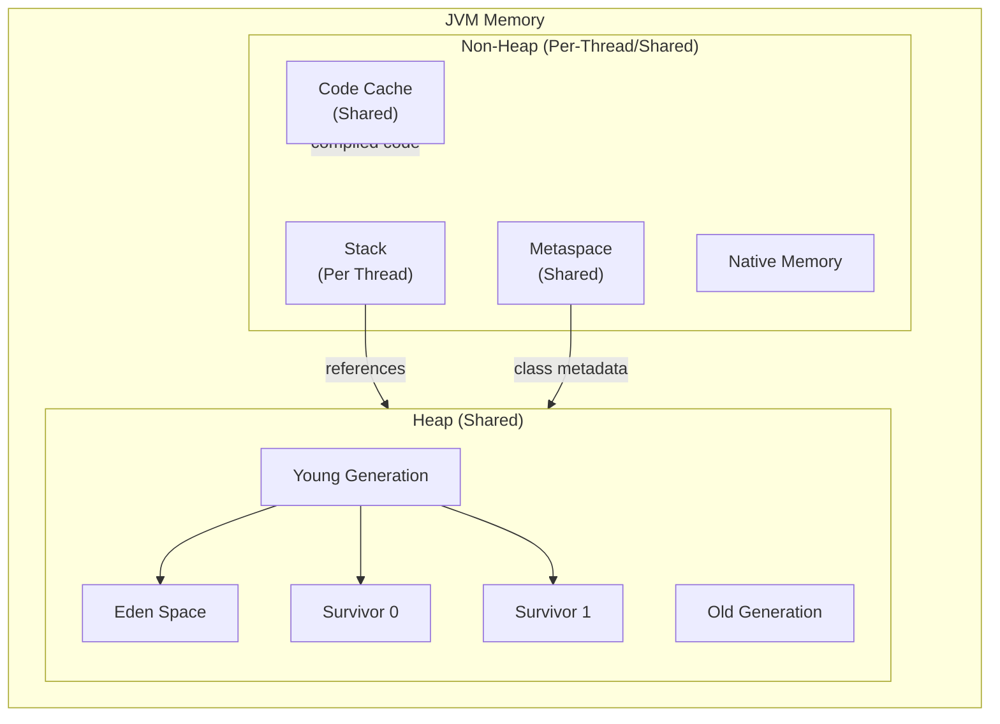
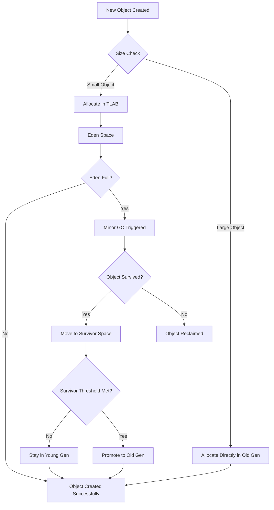
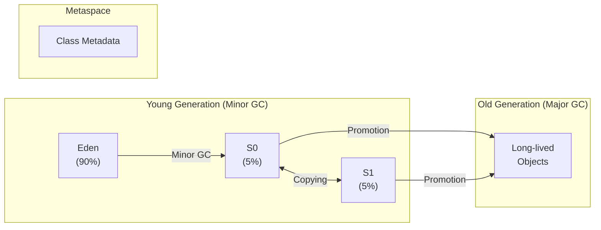

# Java Memory Model

## Overview

The Java Memory Model (JMM) defines how threads interact through memory, and what behaviors are allowed when one thread modifies shared data that another thread reads. Understanding the memory model is crucial for writing correct concurrent programs and for performance optimization.

---

## JVM Memory Layout



---

## Object Allocation Flow



---

## GC Generations



---

## Heap vs Stack vs Metaspace

### Stack Memory

The stack is a thread-local memory area used for method execution. Each thread has its own stack, and each method call creates a **stack frame** that holds:

- Local variables
- Partial results
- Method return addresses

```java
public int calculate() {
    int x = 10;       // x lives on the stack
    int y = 20;        // y lives on the stack
    return x + y;      // stack frame is popped after return
}
```

Stack memory is automatically managed — frames are pushed on method entry and popped on exit. Stack size is typically small (512KB to 1MB) and configured via `-Xss`.

**Key properties:**
- Thread-local (no synchronization needed)
- Fast allocation and deallocation
- Fixed size (can throw `StackOverflowError`)
- No garbage collection required

### Heap Memory

The heap is the shared memory area where all objects and arrays are allocated. Every JVM instance has exactly one heap, shared across all threads.

```java
public void createObjects() {
    int[] numbers = new int[100];      // array on the heap
    String name = new String("Java");  // String object on the heap
    // 'numbers' and 'name' are references on the stack
    // pointing to objects on the heap
}
```

Heap is managed by the Garbage Collector and is configured via `-Xms` (initial) and `-Xmx` (maximum).

**Key properties:**
- Shared across all threads
- Requires synchronization for concurrent access
- Managed by the Garbage Collector
- Can throw `OutOfMemoryError`

### Metaspace

Metaspace (introduced in Java 8, replacing PermGen) stores class metadata, method metadata, constant pools, and field information. It resides in native memory (outside the heap).

```java
// Class metadata is stored in Metaspace
public class MyClass {
    // Field metadata, method bytecode, annotations
    // are all stored in Metaspace
}
```

Metaspace grows by default but can be limited via `-XX:MaxMetaspaceSize`.

**Key properties:**
- Stores class metadata (not objects)
- Native memory (not on the heap)
- Can throw `OutOfMemoryError: Metaspace`
- Cleaned when classes are unloaded

---

## Where Objects Live

| Memory Area | What Lives There |
|-------------|------------------|
| Stack | Local variables, method parameters, return addresses, intermediate calculations |
| Heap | All objects, arrays, instance fields |
| Metaspace | Class metadata, method bytecode, constant pools |
| Native Memory | JIT code cache, direct buffers, thread stacks |

---

## Where Primitives Live

Java primitives (`int`, `double`, `boolean`, etc.) have specific storage locations depending on context:

### Local Primitives (Stack)
```java
public void method() {
    int count = 42;           // lives on the stack
    double price = 9.99;      // lives on the stack
    boolean active = true;    // lives on the stack
}
```

### Instance Primitives (Heap)
```java
public class Account {
    private double balance;   // lives on the heap (inside the Account object)
    private int id;           // lives on the heap (inside the Account object)
}
```

### Static Primitives (Metaspace)
```java
public class Config {
    private static int MAX_SIZE = 100;  // static field lives in Metaspace
}
```

### Primitive Arrays (Heap)
```java
int[] data = new int[1000];  // the array object AND its elements live on the heap
```

---

## Object Creation and Memory Allocation

When you create an object, several steps occur:

### Step 1: Class Loading
```java
// When JVM encounters 'new MyClass()' for the first time:
// 1. Load the class bytecode from .class file
// 2. Verify bytecode structure
// 3. Prepare static fields
// 4. Execute static initializers
// 5. Store metadata in Metaspace
```

### Step 2: Memory Allocation
```java
MyClass obj = new MyClass();
// JVM allocates memory on the heap for:
// - Object header (12-16 bytes on 64-bit JVM)
// - Instance fields (in declaration order, with padding)
// - Reference to the class metadata in Metaspace
```

### Step 3: Initialization
```java
// After allocation:
// 1. All fields are set to default values (0, null, false)
// 2. Constructor is called
// 3. Constructor chaining (super() first)
// 4. Instance initializer blocks execute
// 5. Constructor body executes
```

### Memory Allocation Strategies

- **Bump-the-pointer**: JVM tracks the next free position in Eden. Allocation is just moving a pointer.
- **TLAB (Thread Local Allocation Buffer)**: Each thread gets a small chunk of Eden for allocation, eliminating contention.
- **Direct allocation**: For large objects, allocation may go directly to Old Generation or use `mmap`.

---

## Memory Layout of Objects

A typical 64-bit JVM object layout:

```
Object Header (12 bytes):
├── Mark Word (8 bytes)
│   ├── Lock state
│   ├── GC age
│   ├── Hash code
│   └── Thread pointer (for biased locking)
└── Klass Pointer (4 bytes)
    └── Reference to class metadata in Metaspace

Instance Fields (variable):
├── long a       (8 bytes)
├── int b        (4 bytes)
├── short c      (2 bytes)
└── byte d       (1 byte)
    + padding    (3 bytes to align to 8-byte boundary)

Total: 12 + 12 + 4 (padding) = 32 bytes
```

### Field Ordering Rules

1. Fields are ordered by type size (largest first)
2. Each field must start at an offset that is a multiple of its size
3. Reference fields are 4 or 8 bytes (compressed oops may make them 4 bytes)

### Use JOL (Java Object Layout) to Inspect
```java
import org.openjdk.jol.info.ClassLayout;

public class LayoutDemo {
    private long id;
    private String name;
    private boolean active;

    public static void main(String[] args) {
        System.out.println(ClassLayout.parseInstance(new LayoutDemo()).toPrintable());
    }
}
```

---

## Reference Types vs Primitive Types

### Primitives
```java
int count = 42;           // 4 bytes, stored on stack (local) or in object (field)
double price = 19.99;     // 8 bytes
boolean active = true;    // 1 byte (as per JVM spec)
// Total 8 primitives: byte, short, int, long, float, double, char, boolean
```

**Properties:**
- Fixed size
- No methods
- No null value
- Stored directly (no object overhead)
- Passed by value

### References
```java
String name = "Hello";    // reference on stack (4-8 bytes) pointing to object on heap
int[] arr = new int[5];   // reference on stack pointing to array object on heap
```

**Properties:**
- Size depends on JVM (4 bytes with compressed oops, 8 bytes without)
- Can be null
- Can point to any object of compatible type
- Subject to garbage collection
- Support polymorphism

### Reference Types in Detail

Java has four reference types:

```java
// Strong Reference (default) - prevents GC
Object strong = new Object();

// Soft Reference - GC'd only when memory is low
SoftReference<Object> soft = new SoftReference<>(new Object());

// Weak Reference - GC'd at next collection cycle
WeakReference<Object> weak = new WeakReference<>(new Object());

// Phantom Reference - used for cleanup after finalization
PhantomReference<Object> phantom = new PhantomReference<>(new Object(), new ReferenceQueue<>());
```

### Array References
```java
int[] primitives = {1, 2, 3};           // array of primitives
String[] references = {"a", "b", "c"}; // array of references
// The array object itself is on the heap
// For primitives: elements are stored directly in the array
// For references: elements are pointers to objects
```

---

## Memory Model and Concurrency

The JMM defines **happens-before** relationships that guarantee visibility of memory operations between threads:

```java
// Without proper synchronization, this can fail:
private boolean running = true;

public void start() {
    new Thread(() -> {
        while (running) {  // may see stale value!
            // work
        }
    }).start();
}

public void stop() {
    running = false;  // may not be visible to the other thread
}
```

### Key happens-before rules:
1. **Monitor lock**: Unlock happens-before every subsequent lock on the same monitor
2. **Volatile**: Write to volatile field happens-before every subsequent read of that field
3. **Thread**: `Thread.start()` happens-before any action in the started thread
4. **Thread join**: All actions in a thread happen-before another thread returns from `join()`
5. **Transitivity**: If A happens-before B, and B happens-before C, then A happens-before C

---

## Summary

| Concept | Stack | Heap | Metaspace |
|---------|-------|------|-----------|
| Size | Small (KB-MB) | Large (GB) | Medium (MB) |
| Scope | Thread-local | Shared | Shared |
| Lifetime | Method call | Until GC | Until class unload |
| Allocation | Automatic | GC-managed | GC-managed |
| Errors | StackOverflowError | OutOfMemoryError | OutOfMemoryError |
| Speed | Very fast | Fast (TLAB) | Moderate |
| What lives there | Local vars, frames | Objects, arrays | Class metadata |
