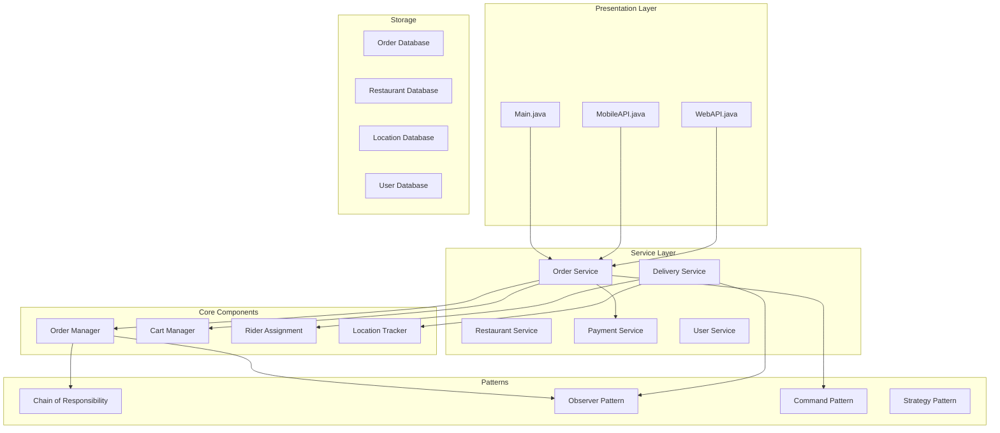
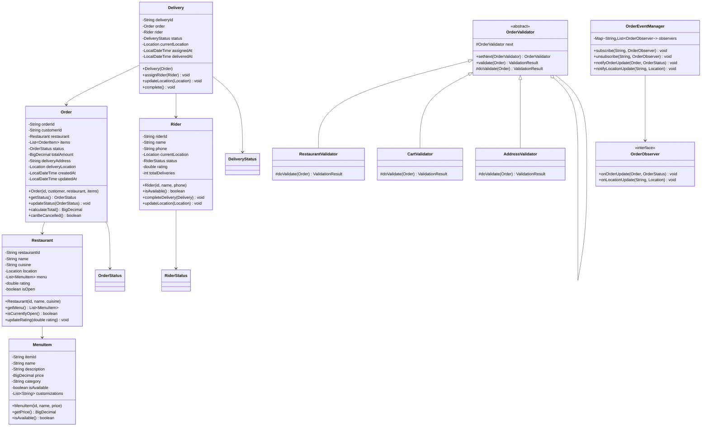

# Food Delivery System

## Project Overview

A Food Delivery System (similar to UberEats or DoorDash) that manages restaurants, menus, orders, delivery tracking, and rider assignment. This advanced project introduces the Chain of Responsibility pattern for order validation, the Observer pattern for real-time tracking, and the Command pattern for order management. Students will design a system that handles the complete food delivery lifecycle.

## Learning Outcomes

- Implement the Chain of Responsibility pattern for order validation
- Use the Observer pattern for real-time order tracking
- Apply the Command pattern for order operations
- Design for real-time location tracking
- Handle complex business rules and validations
- Implement retry mechanisms for failed operations
- Design for scalability and reliability

## Requirements

### Functional Requirements

| ID | Requirement | Priority |
|----|-------------|----------|
| FR01 | Manage restaurants with menus and categories | Must |
| FR02 | Browse restaurants by cuisine, rating, distance | Must |
| FR03 | Add items to cart with customization | Must |
| FR04 | Place orders with address validation | Must |
| FR05 | Real-time order status tracking | Must |
| FR06 | Rider assignment and tracking | Must |
| FR07 | Payment processing with multiple methods | Must |
| FR08 | Order cancellation with refund policy | Should |
| FR09 | Delivery time estimation | Should |
| FR10 | Rating and review system | Could |

### Non-Functional Requirements

| ID | Requirement |
|----|-------------|
| NFR01 | Real-time location updates every 5 seconds |
| NFR02 | Order status updates within 2 seconds |
| NFR03 | Support 10,000+ concurrent orders |
| NFR04 | Graceful degradation on service failure |

## Architecture



## Package Structure

```
food-delivery/
├── README.md
├── src/
│   └── main/
│       └── java/
│           └── com/
│               └── academy/
│                   └── delivery/
│                       ├── Main.java
│                       ├── model/
│                       │   ├── Restaurant.java
│                       │   ├── MenuItem.java
│                       │   ├── Cart.java
│                       │   ├── CartItem.java
│                       │   ├── Order.java
│                       │   ├── Delivery.java
│                       │   ├── Rider.java
│                       │   ├── Location.java
│                       │   ├── Customer.java
│                       │   └── enums/
│                       │       ├── OrderStatus.java
│                       │       ├── DeliveryStatus.java
│                       │       ├── RiderStatus.java
│                       │       └── PaymentMethod.java
│                       ├── chain/
│                       │   ├── OrderValidator.java
│                       │   ├── RestaurantValidator.java
│                       │   ├── CartValidator.java
│                       │   ├── AddressValidator.java
│                       │   └── ValidationResult.java
│                       ├── observer/
│                       │   ├── OrderObserver.java
│                       │   ├── OrderEventManager.java
│                       │   ├── CustomerNotification.java
│                       │   └── RestaurantNotification.java
│                       ├── command/
│                       │   ├── Command.java
│                       │   ├── PlaceOrderCommand.java
│                       │   ├── CancelOrderCommand.java
│                       │   ├── UpdateOrderCommand.java
│                       │   └── CommandHistory.java
│                       ├── strategy/
│                       │   ├── DeliveryStrategy.java
│                       │   ├── NearestRiderStrategy.java
│                       │   ├── FastestRiderStrategy.java
│                       │   └── RatingBasedStrategy.java
│                       ├── service/
│                       │   ├── OrderService.java
│                       │   ├── RestaurantService.java
│                       │   ├── DeliveryService.java
│                       │   ├── PaymentService.java
│                       │   ├── LocationService.java
│                       │   └── RiderService.java
│                       └── exception/
│                           ├── OrderException.java
│                           ├── NoRiderAvailableException.java
│                           ├── RestaurantClosedException.java
│                           └── DeliveryException.java
└── src/
    └── test/
        └── java/
            └── com/
                └── academy/
                    └── delivery/
                        ├── OrderServiceTest.java
                        ├── DeliveryServiceTest.java
                        ├── ValidationChainTest.java
                        └── ObserverTest.java
```

## Class Diagram



---

**[Continue to Part 2: Implementation Guide →](README-part2.md)**