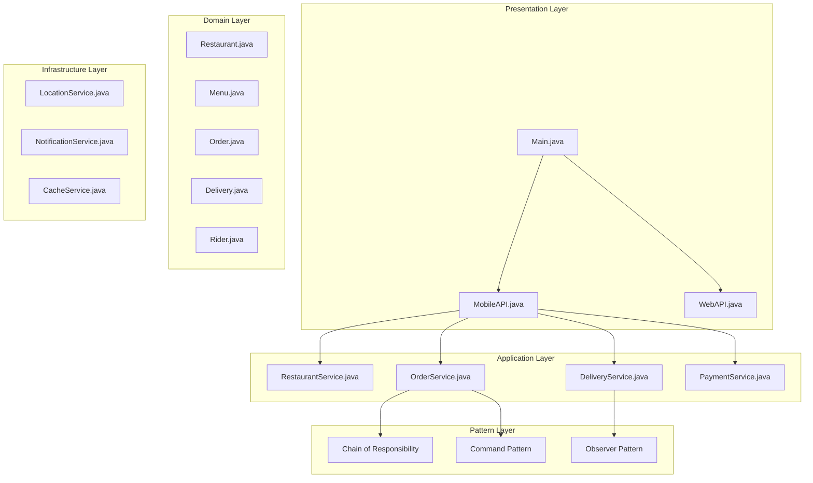
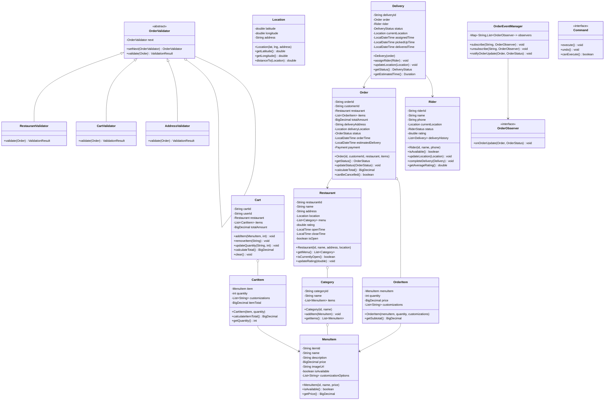

# Food Delivery System

## Project Overview

A Food Delivery System (similar to UberEats or DoorDash) that manages restaurants, menus, orders, delivery tracking, and rider assignment. This advanced project introduces the Chain of Responsibility pattern for order validation, the Observer pattern for real-time tracking, and the Command pattern for order management. Students will design a system that handles the complete food delivery lifecycle.

## Learning Outcomes

- Implement the Chain of Responsibility pattern for order validation
- Use the Observer pattern for real-time order tracking
- Apply the Command pattern for order operations
- Design for real-time location tracking
- Handle complex business rules and validations
- Implement retry mechanisms for failed operations
- Design for scalability and reliability

## Requirements

### Functional Requirements

| ID | Requirement | Priority |
|----|-------------|----------|
| FR01 | Manage restaurants with menus and categories | Must |
| FR02 | Browse restaurants by cuisine, rating, distance | Must |
| FR03 | Add items to cart with customization | Must |
| FR04 | Place orders with address validation | Must |
| FR05 | Real-time order status tracking | Must |
| FR06 | Rider assignment and tracking | Must |
| FR07 | Payment processing with multiple methods | Must |
| FR08 | Order cancellation with refund policy | Should |
| FR09 | Delivery time estimation | Should |
| FR10 | Rating and review system | Could |

### Non-Functional Requirements

| ID | Requirement |
|----|-------------|
| NFR01 | Real-time location updates every 5 seconds |
| NFR02 | Order status updates within 2 seconds |
| NFR03 | Support 10,000+ concurrent orders |
| NFR04 | Graceful degradation on service failure |

## Architecture



## Package Structure

```
food-delivery/
├── README.md
├── src/
│   └── main/
│       └── java/
│           └── com/
│               └── academy/
│                   └── delivery/
│                       ├── Main.java
│                       ├── model/
│                       │   ├── Restaurant.java
│                       │   ├── Menu.java
│                       │   ├── MenuItem.java
│                       │   ├── Category.java
│                       │   ├── Order.java
│                       │   ├── OrderItem.java
│                       │   ├── Cart.java
│                       │   ├── Delivery.java
│                       │   ├── Rider.java
│                       │   ├── Location.java
│                       │   └── enums/
│                       │       ├── OrderStatus.java
│                       │       ├── DeliveryStatus.java
│                       │       ├── RiderStatus.java
│                       │       └── PaymentMethod.java
│                       ├── chain/
│                       │   ├── OrderValidator.java
│                       │   ├── AddressValidator.java
│                       │   ├── CartValidator.java
│                       │   ├── PaymentValidator.java
│                       │   └── RestaurantValidator.java
│                       ├── observer/
│                       │   ├── OrderObserver.java
│                       │   ├── OrderEventManager.java
│                       │   ├── CustomerNotification.java
│                       │   ├── RestaurantNotification.java
│                       │   └── LocationTracker.java
│                       ├── command/
│                       │   ├── Command.java
│                       │   ├── PlaceOrderCommand.java
│                       │   ├── CancelOrderCommand.java
│                       │   ├── UpdateOrderStatusCommand.java
│                       │   └── CommandHistory.java
│                       ├── service/
│                       │   ├── RestaurantService.java
│                       │   ├── OrderService.java
│                       │   ├── DeliveryService.java
│                       │   ├── CartService.java
│                       │   └── PaymentService.java
│                       ├── strategy/
│                       │   ├── DeliveryStrategy.java
│                       │   ├── FastestDeliveryStrategy.java
│                       │   └── NearestRiderStrategy.java
│                       └── exception/
│                           ├── RestaurantClosedException.java
│                           ├── ItemUnavailableException.java
│                           ├── DeliveryAddressException.java
│                           └── PaymentFailedException.java
└── src/
    └── test/
        └── java/
            └── com/
                └── academy/
                    └── delivery/
                        ├── OrderServiceTest.java
                        ├── ChainValidationTest.java
                        └── ObserverTrackingTest.java
```

## Class Diagram



## Implementation Guide

### Step 1: Implement Chain of Responsibility for Validation

```java
package com.academy.delivery.chain;

public abstract class OrderValidator {
    protected OrderValidator next;

    public OrderValidator setNext(OrderValidator next) {
        this.next = next;
        return next;
    }

    public ValidationResult validate(Order order) {
        ValidationResult result = doValidate(order);
        if (!result.isValid() || next == null) {
            return result;
        }
        return next.validate(order);
    }

    protected abstract ValidationResult doValidate(Order order);
}

package com.academy.delivery.chain;

public class RestaurantValidator extends OrderValidator {
    @Override
    protected ValidationResult doValidate(Order order) {
        Restaurant restaurant = order.getRestaurant();
        
        if (!restaurant.isCurrentlyOpen()) {
            return ValidationResult.failure("Restaurant is currently closed");
        }
        
        boolean allAvailable = order.getItems().stream()
            .allMatch(item -> item.getMenuItem().isAvailable());
        
        if (!allAvailable) {
            return ValidationResult.failure("Some items are no longer available");
        }
        
        return ValidationResult.success();
    }
}

public class CartValidator extends OrderValidator {
    @Override
    protected ValidationResult doValidate(Order order) {
        if (order.getItems().isEmpty()) {
            return ValidationResult.failure("Cart is empty");
        }
        
        if (order.calculateTotal().compareTo(BigDecimal.ZERO) <= 0) {
            return ValidationResult.failure("Invalid order total");
        }
        
        return ValidationResult.success();
    }
}

public class AddressValidator extends OrderValidator {
    @Override
    protected ValidationResult doValidate(Order order) {
        if (order.getDeliveryAddress() == null || order.getDeliveryAddress().isEmpty()) {
            return ValidationResult.failure("Delivery address is required");
        }
        
        if (order.getDeliveryLocation() == null) {
            return ValidationResult.failure("Unable to geocode delivery address");
        }
        
        return ValidationResult.success();
    }
}

// Usage
OrderValidator chain = new RestaurantValidator();
chain.setNext(new CartValidator())
     .setNext(new AddressValidator());

ValidationResult result = chain.validate(order);
```

### Step 2: Implement Observer Pattern for Tracking

```java
package com.academy.delivery.observer;

public interface OrderObserver {
    void onOrderUpdate(Order order, OrderStatus newStatus);
    void onLocationUpdate(String orderId, Location location);
}

package com.academy.delivery.observer;

public class CustomerNotification implements OrderObserver {
    private final String customerId;
    private final NotificationService notificationService;

    @Override
    public void onOrderUpdate(Order order, OrderStatus newStatus) {
        String message = getStatusMessage(newStatus);
        notificationService.sendPush(customerId, "Order Update", message);
    }

    @Override
    public void onLocationUpdate(String orderId, Location location) {
        notificationService.sendPush(customerId, "Rider Location", 
            "Your rider is nearby at " + location.getAddress());
    }

    private String getStatusMessage(OrderStatus status) {
        switch (status) {
            case CONFIRMED: return "Your order has been confirmed!";
            case PREPARING: return "Restaurant is preparing your order";
            case OUT_FOR_DELIVERY: return "Rider is on the way!";
            case DELIVERED: return "Order delivered. Enjoy your meal!";
            default: return "Order status updated";
        }
    }
}

package com.academy.delivery.observer;

public class OrderEventManager {
    private final Map<String, List<OrderObserver>> observers = new ConcurrentHashMap<>();

    public void subscribe(String orderId, OrderObserver observer) {
        observers.computeIfAbsent(orderId, k -> new CopyOnWriteArrayList<>()).add(observer);
    }

    public void notifyOrderUpdate(Order order, OrderStatus newStatus) {
        List<OrderObserver> orderObservers = observers.get(order.getOrderId());
        if (orderObservers != null) {
            for (OrderObserver observer : orderObservers) {
                observer.onOrderUpdate(order, newStatus);
            }
        }
    }

    public void notifyLocationUpdate(String orderId, Location location) {
        List<OrderObserver> orderObservers = observers.get(orderId);
        if (orderObservers != null) {
            for (OrderObserver observer : orderObservers) {
                observer.onLocationUpdate(orderId, location);
            }
        }
    }
}
```

### Step 3: Implement Command Pattern

```java
package com.academy.delivery.command;

public interface Command {
    void execute() throws Exception;
    void undo();
    boolean canExecute();
}

package com.academy.delivery.command;

public class PlaceOrderCommand implements Command {
    private final OrderService orderService;
    private final Order order;
    private String orderId;

    public PlaceOrderCommand(OrderService orderService, Order order) {
        this.orderService = orderService;
        this.order = order;
    }

    @Override
    public void execute() throws Exception {
        this.orderId = orderService.placeOrder(order);
    }

    @Override
    public void undo() {
        if (orderId != null) {
            orderService.cancelOrder(orderId);
        }
    }

    @Override
    public boolean canExecute() {
        return order.getRestaurant().isCurrentlyOpen();
    }
}

public class CancelOrderCommand implements Command {
    private final OrderService orderService;
    private final String orderId;
    private Order previousState;

    public CancelOrderCommand(OrderService orderService, String orderId) {
        this.orderService = orderService;
        this.orderId = orderId;
    }

    @Override
    public void execute() throws Exception {
        this.previousState = orderService.getOrder(orderId);
        orderService.cancelOrder(orderId);
    }

    @Override
    public void undo() {
        if (previousState != null) {
            orderService.restoreOrder(previousState);
        }
    }

    @Override
    public boolean canExecute() {
        Order order = orderService.getOrder(orderId);
        return order != null && order.canBeCancelled();
    }
}
```

### Step 4: Implement Delivery Service with Rider Assignment

```java
package com.academy.delivery.service;

import com.academy.delivery.strategy.*;

public class DeliveryService {
    private final RiderService riderService;
    private final LocationService locationService;
    private final OrderEventManager eventManager;
    private DeliveryStrategy deliveryStrategy;

    public DeliveryService() {
        this.riderService = new RiderService();
        this.locationService = new LocationService();
        this.eventManager = new OrderEventManager();
        this.deliveryStrategy = new NearestRiderStrategy();
    }

    public Delivery assignRider(Order order) {
        Location restaurantLocation = order.getRestaurant().getLocation();
        
        Rider availableRider = deliveryStrategy.findBestRider(
            riderService.getAvailableRiders(),
            restaurantLocation
        );

        if (availableRider == null) {
            throw new NoRiderAvailableException("No riders available in the area");
        }

        Delivery delivery = new Delivery(order);
        delivery.assignRider(availableRider);
        
        availableRider.setCurrentStatus(RiderStatus.BUSY);
        
        eventManager.notifyOrderUpdate(order, OrderStatus.OUT_FOR_DELIVERY);
        
        return delivery;
    }

    public void updateRiderLocation(String deliveryId, Location newLocation) {
        Delivery delivery = deliveryService.getDelivery(deliveryId);
        delivery.updateLocation(newLocation);
        
        eventManager.notifyLocationUpdate(delivery.getOrder().getOrderId(), newLocation);
    }

    public void completeDelivery(String deliveryId) {
        Delivery delivery = deliveryService.getDelivery(deliveryId);
        delivery.complete();
        
        Rider rider = delivery.getRider();
        rider.completeDelivery(delivery);
        rider.setCurrentStatus(RiderStatus.AVAILABLE);
        
        eventManager.notifyOrderUpdate(delivery.getOrder(), OrderStatus.DELIVERED);
    }
}
```

## Unit Tests

```java
package com.academy.delivery;

import com.academy.delivery.model.*;
import com.academy.delivery.service.*;
import com.academy.delivery.chain.*;
import com.academy.delivery.observer.*;
import org.junit.jupiter.api.BeforeEach;
import org.junit.jupiter.api.Test;
import java.math.BigDecimal;
import java.time.LocalDateTime;
import static org.junit.jupiter.api.Assertions.*;

public class OrderServiceTest {
    private OrderService orderService;
    private DeliveryService deliveryService;

    @BeforeEach
    void setUp() {
        orderService = new OrderService();
        deliveryService = new DeliveryService();
    }

    @Test
    void testOrderValidationChain() {
        Restaurant restaurant = createTestRestaurant();
        Cart cart = createTestCart(restaurant);
        Order order = new Order("O001", "C001", restaurant, cart.getItems());

        OrderValidator chain = new RestaurantValidator();
        chain.setNext(new CartValidator())
             .setNext(new AddressValidator());

        ValidationResult result = chain.validate(order);
        assertTrue(result.isValid());
    }

    @Test
    void testPlaceOrder() throws Exception {
        Order order = createTestOrder();
        String orderId = orderService.placeOrder(order);
        
        assertNotNull(orderId);
        assertEquals(OrderStatus.CONFIRMED, orderService.getOrder(orderId).getStatus());
    }

    @Test
    void testCancelOrder() throws Exception {
        Order order = createTestOrder();
        String orderId = orderService.placeOrder(order);
        
        orderService.cancelOrder(orderId);
        assertEquals(OrderStatus.CANCELLED, orderService.getOrder(orderId).getStatus());
    }

    @Test
    void testRiderAssignment() {
        Order order = createTestOrder();
        Delivery delivery = deliveryService.assignRider(order);
        
        assertNotNull(delivery);
        assertNotNull(delivery.getRider());
        assertEquals(DeliveryStatus.ASSIGNED, delivery.getStatus());
    }

    @Test
    void testOrderTracking() {
        Order order = createTestOrder();
        String orderId = orderService.placeOrder(order);
        
        CustomerNotification notification = new CustomerNotification("C001");
        orderEventManager.subscribe(orderId, notification);
        
        orderService.updateOrderStatus(orderId, OrderStatus.PREPARING);
        // Verify notification was sent
    }

    @Test
    void testDeliveryCompletion() {
        Delivery delivery = createTestDelivery();
        deliveryService.completeDelivery(delivery.getDeliveryId());
        
        assertEquals(DeliveryStatus.DELIVERED, delivery.getStatus());
        assertEquals(RiderStatus.AVAILABLE, delivery.getRider().getStatus());
    }
}
```

## Extension Challenges

1. **Promotions Engine**: Implement discount codes, referral bonuses, and loyalty points
2. **Group Orders**: Allow multiple users to contribute to a single order
3. **Scheduled Orders**: Support advance order scheduling
4. **Multi-Rider Delivery**: Handle deliveries requiring multiple riders
5. **Restaurant Analytics**: Provide restaurants with order and revenue analytics

## Interview Questions

1. **Why use Chain of Responsibility for order validation?**
   - Discuss separation of concerns, easy addition of new validations, single responsibility

2. **How would you handle 100,000 concurrent location updates?**
   - Discuss message queues, WebSocket optimization, geographic partitioning

3. **What are the trade-offs of the Observer pattern here?**
   - Discuss loose coupling vs debugging difficulty, event ordering guarantees

4. **How would you optimize rider assignment for a city-wide system?**
   - Discuss geospatial indexing, zone-based assignment, machine learning prediction

5. **How would you design this for a multi-country deployment?**
   - Discuss localization, currency handling, regional compliance, time zones

## References

- [Chain of Responsibility Pattern](https://www.baeldung.com/java-chain-of-responsibility-pattern)
- [Observer Pattern](https://www.baeldung.com/java-observer-pattern)
- [Command Pattern](https://www.baeldung.com/java-command-pattern)
