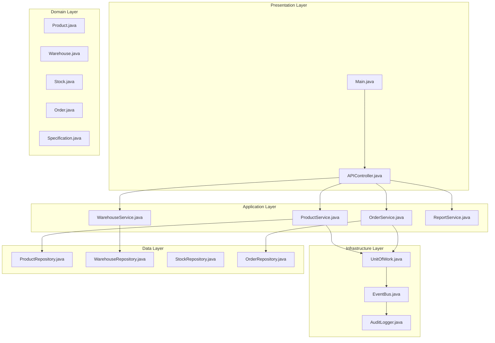
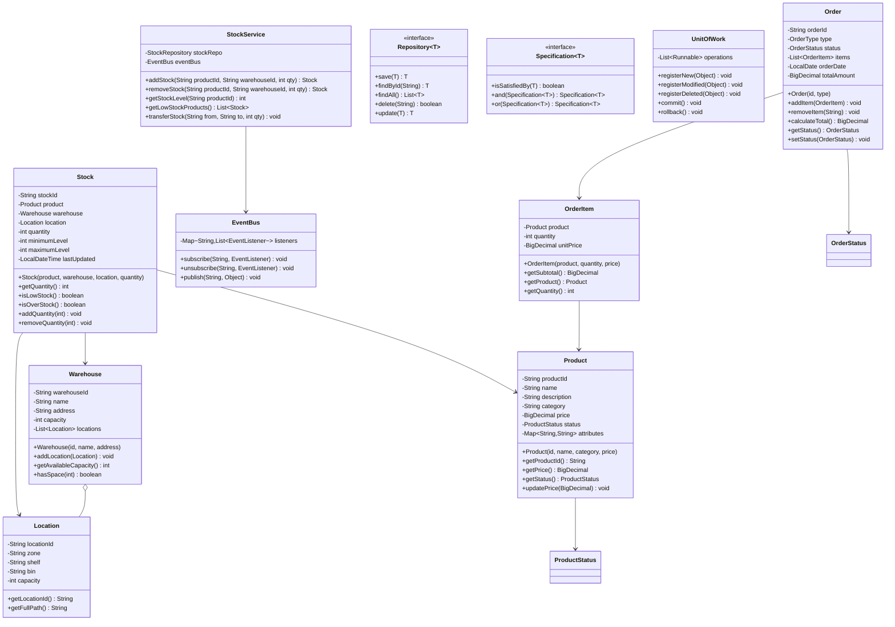

# Inventory Management System

## Project Overview

An enterprise-grade Inventory Management System that handles products, warehouses, stock tracking, orders, and comprehensive reporting. This advanced project introduces design patterns like Repository, Unit of Work, and Specification pattern. Students will build a scalable system that demonstrates proper layering, abstraction, and extensibility.

## Learning Outcomes

- Implement Repository pattern for data access abstraction
- Use Specification pattern for complex queries
- Apply Unit of Work pattern for transaction management
- Implement the Observer pattern for stock alerts
- Design for scalability and performance
- Use interfaces extensively for loose coupling
- Implement proper audit logging

## Requirements

### Functional Requirements

| ID | Requirement | Priority |
|----|-------------|----------|
| FR01 | Manage products with categories and attributes | Must |
| FR02 | Multi-warehouse support with location tracking | Must |
| FR03 | Stock management with min/max levels | Must |
| FR04 | Purchase order creation and tracking | Must |
| FR05 | Sales order processing with inventory deduction | Must |
| FR06 | Low stock alerts and notifications | Must |
| FR07 | Inventory reports (value, movement, aging) | Should |
| FR08 | Product search with multiple criteria | Should |
| FR09 | Batch/lot tracking | Could |
| FR10 | Barcode/QR code integration | Could |

### Non-Functional Requirements

| ID | Requirement |
|----|-------------|
| NFR01 | Handle 100,000+ products efficiently |
| NFR02 | Real-time stock updates |
| NFR03 | Audit trail for all operations |
| NFR04 | Support concurrent operations |

## Architecture



## Package Structure

```
inventory-management/
├── README.md
├── src/
│   └── main/
│       └── java/
│           └── com/
│               └── academy/
│                   └── inventory/
│                       ├── Main.java
│                       ├── model/
│                       │   ├── Product.java
│                       │   ├── Warehouse.java
│                       │   ├── Stock.java
│                       │   ├── Location.java
│                       │   ├── Order.java
│                       │   ├── OrderItem.java
│                       │   └── enums/
│                       │       ├── ProductStatus.java
│                       │       ├── OrderStatus.java
│                       │       └── MovementType.java
│                       ├── repository/
│                       │   ├── Repository.java
│                       │   ├── ProductRepository.java
│                       │   ├── WarehouseRepository.java
│                       │   ├── StockRepository.java
│                       │   └── OrderRepository.java
│                       ├── specification/
│                       │   ├── Specification.java
│                       │   ├── ProductSpecification.java
│                       │   ├── AndSpecification.java
│                       │   ├── OrSpecification.java
│                       │   └── ByCategorySpec.java
│                       ├── service/
│                       │   ├── ProductService.java
│                       │   ├── WarehouseService.java
│                       │   ├── StockService.java
│                       │   └── OrderService.java
│                       ├── pattern/
│                       │   ├── UnitOfWork.java
│                       │   ├── EventBus.java
│                       │   └── EventListener.java
│                       ├── report/
│                       │   ├── ReportGenerator.java
│                       │   ├── InventoryReport.java
│                       │   └── MovementReport.java
│                       ├── audit/
│                       │   ├── AuditLogger.java
│                       │   └── AuditEntry.java
│                       └── exception/
│                           ├── InsufficientStockException.java
│                           ├── ProductNotFoundException.java
│                           └── DuplicateProductException.java
└── src/
    └── test/
        └── java/
            └── com/
                └── academy/
                    └── inventory/
                        ├── ProductServiceTest.java
                        ├── StockServiceTest.java
                        └── SpecificationTest.java
```

## Class Diagram



## Implementation Guide

### Step 1: Implement Repository Pattern

```java
package com.academy.inventory.repository;

import java.util.List;
import java.util.Optional;

public interface Repository<T> {
    T save(T entity);
    Optional<T> findById(String id);
    List<T> findAll();
    boolean delete(String id);
    T update(T entity);
}

package com.academy.inventory.repository;

import com.academy.inventory.model.Product;
import java.util.*;
import java.util.concurrent.ConcurrentHashMap;

public class ProductRepository implements Repository<Product> {
    private final Map<String, Product> products = new ConcurrentHashMap<>();

    @Override
    public Product save(Product product) {
        products.put(product.getProductId(), product);
        return product;
    }

    @Override
    public Optional<Product> findById(String id) {
        return Optional.ofNullable(products.get(id));
    }

    @Override
    public List<Product> findAll() {
        return new ArrayList<>(products.values());
    }

    @Override
    public boolean delete(String id) {
        return products.remove(id) != null;
    }

    public List<Product> findBySpecification(Specification<Product> spec) {
        return products.values().stream()
            .filter(spec::isSatisfiedBy)
            .collect(Collectors.toList());
    }
}
```

### Step 2: Implement Specification Pattern

```java
package com.academy.inventory.specification;

public interface Specification<T> {
    boolean isSatisfiedBy(T entity);

    default Specification<T> and(Specification<T> other) {
        return entity -> this.isSatisfiedBy(entity) && other.isSatisfiedBy(entity);
    }

    default Specification<T> or(Specification<T> other) {
        return entity -> this.isSatisfiedBy(entity) || other.isSatisfiedBy(entity);
    }

    default Specification<T> not() {
        return entity -> !this.isSatisfiedBy(entity);
    }
}

package com.academy.inventory.specification;

import com.academy.inventory.model.Product;

public class ByCategorySpec implements Specification<Product> {
    private final String category;

    public ByCategorySpec(String category) {
        this.category = category;
    }

    @Override
    public boolean isSatisfiedBy(Product product) {
        return product.getCategory().equalsIgnoreCase(category);
    }
}

public class PriceRangeSpec implements Specification<Product> {
    private final BigDecimal minPrice;
    private final BigDecimal maxPrice;

    public PriceRangeSpec(BigDecimal min, BigDecimal max) {
        this.minPrice = min;
        this.maxPrice = max;
    }

    @Override
    public boolean isSatisfiedBy(Product product) {
        return product.getPrice().compareTo(minPrice) >= 0 &&
               product.getPrice().compareTo(maxPrice) <= 0;
    }
}
```

### Step 3: Implement Observer Pattern for Stock Alerts

```java
package com.academy.inventory.pattern;

public interface EventListener {
    void onEvent(String eventType, Object data);
}

package com.academy.inventory.pattern;

import java.util.*;

public class EventBus {
    private final Map<String, List<EventListener>> listeners = new HashMap<>();

    public void subscribe(String eventType, EventListener listener) {
        listeners.computeIfAbsent(eventType, k -> new ArrayList<>()).add(listener);
    }

    public void publish(String eventType, Object data) {
        List<EventListener> eventListeners = listeners.get(eventType);
        if (eventListeners != null) {
            for (EventListener listener : eventListeners) {
                listener.onEvent(eventType, data);
            }
        }
    }
}

package com.academy.inventory.audit;

public class AuditLogger implements EventListener {
    @Override
    public void onEvent(String eventType, Object data) {
        AuditEntry entry = new AuditEntry(
            LocalDateTime.now(),
            eventType,
            data.toString(),
            getCurrentUser()
        );
        saveAuditEntry(entry);
    }
}
```

### Step 4: Implement Unit of Work

```java
package com.academy.inventory.pattern;

import java.util.ArrayList;
import java.util.List;

public class UnitOfWork {
    private final List<Runnable> newEntities = new ArrayList<>();
    private final List<Runnable> modifiedEntities = new ArrayList<>();
    private final List<Runnable> deletedEntities = new ArrayList<>();
    private final EventBus eventBus;

    public UnitOfWork(EventBus eventBus) {
        this.eventBus = eventBus;
    }

    public void registerNew(Runnable operation) {
        newEntities.add(operation);
    }

    public void registerModified(Runnable operation) {
        modifiedEntities.add(operation);
    }

    public void registerDeleted(Runnable operation) {
        deletedEntities.add(operation);
    }

    public void commit() {
        try {
            newEntities.forEach(Runnable::run);
            modifiedEntities.forEach(Runnable::run);
            deletedEntities.forEach(Runnable::run);
            eventBus.publish("unitOfWork.committed", this);
            clear();
        } catch (Exception e) {
            rollback();
            throw e;
        }
    }

    public void rollback() {
        newEntities.clear();
        modifiedEntities.clear();
        deletedEntities.clear();
    }
}
```

## Unit Tests

```java
package com.academy.inventory;

import com.academy.inventory.model.*;
import com.academy.inventory.service.*;
import com.academy.inventory.specification.*;
import org.junit.jupiter.api.BeforeEach;
import org.junit.jupiter.api.Test;
import java.math.BigDecimal;
import java.util.List;
import static org.junit.jupiter.api.Assertions.*;

public class ProductServiceTest {
    private ProductService productService;
    private StockService stockService;

    @BeforeEach
    void setUp() {
        productService = new ProductService();
        stockService = new StockService();
    }

    @Test
    void testAddProduct() {
        Product product = new Product("P001", "Laptop", "Electronics", new BigDecimal("999.99"));
        assertTrue(productService.addProduct(product));
    }

    @Test
    void testFindBySpecification() {
        productService.addProduct(new Product("P001", "Laptop", "Electronics", new BigDecimal("999.99")));
        productService.addProduct(new Product("P002", "Phone", "Electronics", new BigDecimal("699.99")));
        productService.addProduct(new Product("P003", "Shirt", "Clothing", new BigDecimal("29.99")));

        Specification<Product> spec = new ByCategorySpec("Electronics");
        List<Product> results = productService.findBySpecification(spec);
        assertEquals(2, results.size());
    }

    @Test
    void testCompoundSpecification() {
        Specification<Product> electronics = new ByCategorySpec("Electronics");
        Specification<Product> priceRange = new PriceRangeSpec(
            new BigDecimal("500"), new BigDecimal("1000"));
        
        Specification<Product> combined = electronics.and(priceRange);
        
        List<Product> results = productService.findBySpecification(combined);
        // Should return only products matching both criteria
    }

    @Test
    void testStockManagement() throws Exception {
        Product product = new Product("P001", "Laptop", "Electronics", new BigDecimal("999.99"));
        Warehouse warehouse = new Warehouse("W001", "Main Warehouse", "123 Main St");
        
        productService.addProduct(product);
        stockService.addStock("P001", "W001", 100);
        
        assertEquals(100, stockService.getStockLevel("P001"));
    }

    @Test
    void testLowStockAlert() throws Exception {
        Product product = new Product("P001", "Laptop", "Electronics", new BigDecimal("999.99"));
        Stock stock = new Stock(product, warehouse, location, 10);
        stock.setMinimumLevel(20);
        
        assertTrue(stock.isLowStock());
    }

    @Test
    void testInsufficientStockException() {
        // Test that removing more stock than available throws exception
    }
}
```

## Extension Challenges

1. **Multi-Currency Support**: Handle products with different currencies and exchange rates
2. **Barcode Integration**: Generate and scan barcodes for products
3. **Forecasting**: Implement demand forecasting based on historical data
4. **Supplier Management**: Add supplier entities and purchase order automation
5. **Mobile App**: Design API for mobile inventory management

## Interview Questions

1. **Why use the Repository pattern instead of direct database access?**
   - Discuss testability, abstraction, separation of concerns

2. **How would you handle concurrent stock updates?**
   - Discuss optimistic locking, pessimistic locking, eventual consistency

3. **What are the benefits of the Specification pattern?**
   - Discuss composable queries, open/closed principle, testability

4. **How would you implement barcode/QR code support?**
   - Discuss third-party libraries, scanning hardware integration

5. **How would you scale this for a global retail chain?**
   - Discuss distributed databases, caching, microservices

## References

- [Repository Pattern](https://www.baeldung.com/java-repository-pattern)
- [Specification Pattern](https://www.baeldung.com/specification-pattern)
- [Unit of Work Pattern](https://www.baeldung.com/unit-of-work-pattern)
