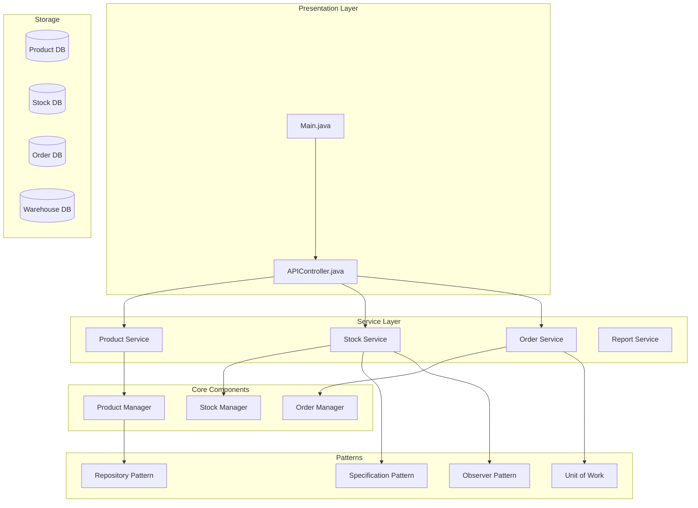
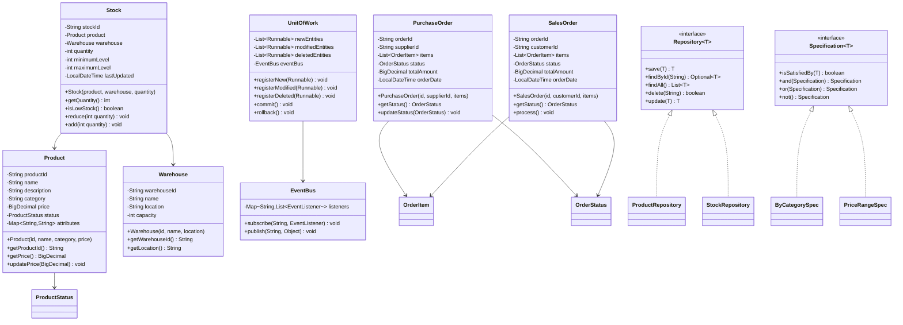

# Inventory Management System

## Project Overview

An enterprise-grade Inventory Management System that handles products, warehouses, stock tracking, orders, and comprehensive reporting. This advanced project introduces design patterns like Repository, Unit of Work, and Specification pattern. Students will build a scalable system that demonstrates proper layering, abstraction, and extensibility.

## Learning Outcomes

- Implement Repository pattern for data access abstraction
- Use Specification pattern for complex queries
- Apply Unit of Work pattern for transaction management
- Implement the Observer pattern for stock alerts
- Design for scalability and performance
- Use interfaces extensively for loose coupling
- Implement proper audit logging

## Requirements

### Functional Requirements

| ID | Requirement | Priority |
|----|-------------|----------|
| FR01 | Manage products with categories and attributes | Must |
| FR02 | Multi-warehouse support with location tracking | Must |
| FR03 | Stock management with min/max levels | Must |
| FR04 | Purchase order creation and tracking | Must |
| FR05 | Sales order processing with inventory deduction | Must |
| FR06 | Low stock alerts and notifications | Must |
| FR07 | Inventory reports (value, movement, aging) | Should |
| FR08 | Product search with multiple criteria | Should |
| FR09 | Batch/lot tracking | Could |
| FR10 | Barcode/QR code integration | Could |

### Non-Functional Requirements

| ID | Requirement |
|----|-------------|
| NFR01 | Handle 100,000+ products efficiently |
| NFR02 | Real-time stock updates |
| NFR03 | Audit trail for all operations |
| NFR04 | Support concurrent operations |

## Architecture



## Package Structure

```
inventory-management/
├── README.md
├── src/
│   └── main/
│       └── java/
│           └── com/
│               └── academy/
│                   └── inventory/
│                       ├── Main.java
│                       ├── model/
│                       │   ├── Product.java
│                       │   ├── Warehouse.java
│                       │   ├── Stock.java
│                       │   ├── PurchaseOrder.java
│                       │   ├── SalesOrder.java
│                       │   ├── OrderItem.java
│                       │   └── enums/
│                       │       ├── ProductStatus.java
│                       │       ├── OrderStatus.java
│                       │       ├── StockStatus.java
│                       │       └── MovementType.java
│                       ├── repository/
│                       │   ├── Repository.java
│                       │   ├── ProductRepository.java
│                       │   ├── StockRepository.java
│                       │   └── OrderRepository.java
│                       ├── specification/
│                       │   ├── Specification.java
│                       │   ├── ByCategorySpec.java
│                       │   ├── PriceRangeSpec.java
│                       │   └── StockLevelSpec.java
│                       ├── pattern/
│                       │   ├── UnitOfWork.java
│                       │   ├── EventBus.java
│                       │   └── EventListener.java
│                       ├── service/
│                       │   ├── ProductService.java
│                       │   ├── StockService.java
│                       │   ├── OrderService.java
│                       │   └── ReportService.java
│                       ├── audit/
│                       │   ├── AuditLogger.java
│                       │   └── AuditEntry.java
│                       └── exception/
│                           ├── ProductNotFoundException.java
│                           ├── InsufficientStockException.java
│                           ├── OrderException.java
│                           └── ValidationException.java
└── src/
    └── test/
        └── java/
            └── com/
                └── academy/
                    └── inventory/
                        ├── ProductServiceTest.java
                        ├── StockServiceTest.java
                        ├── SpecificationTest.java
                        └── OrderServiceTest.java
```

## Class Diagram



---

**[Continue to Part 2: Implementation Guide →](README-part2.md)**