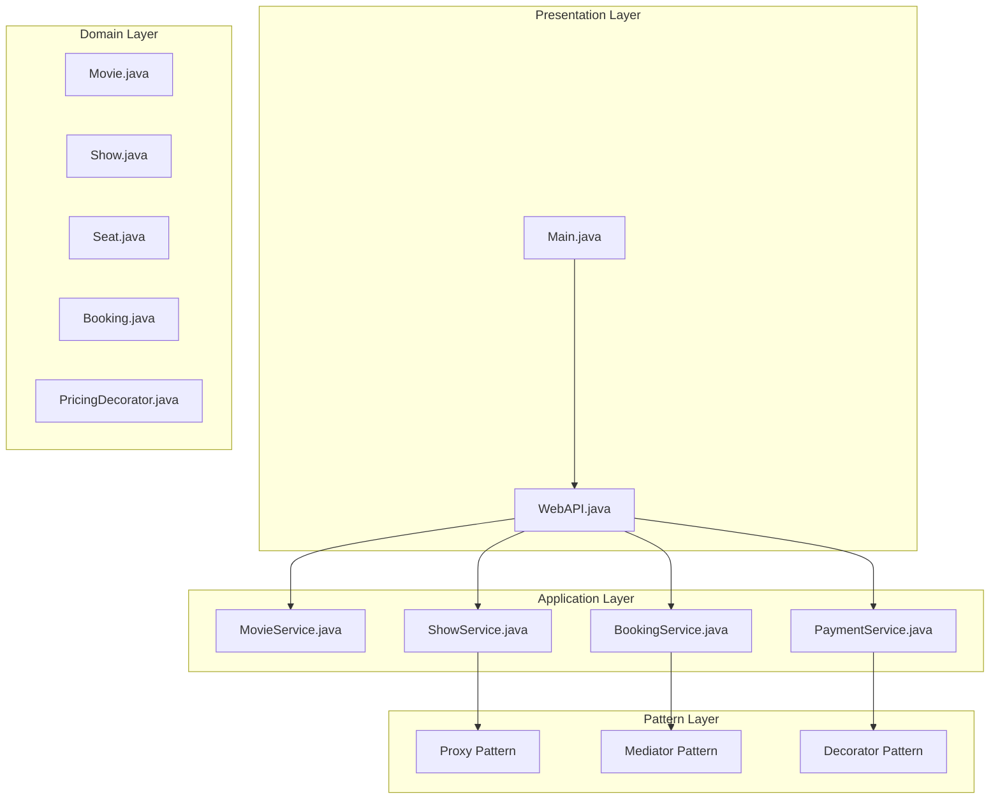
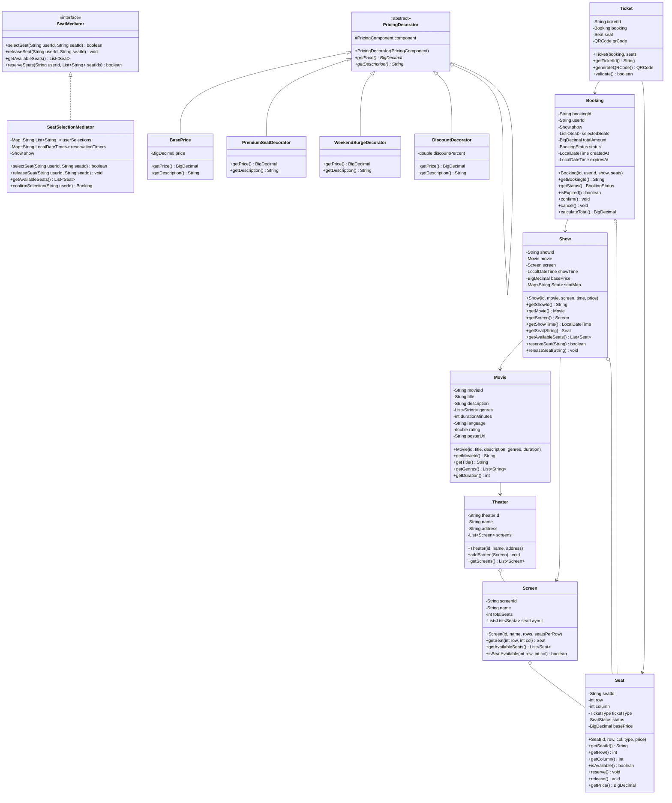

# Movie Booking System

## Project Overview

A Movie Booking System (similar to BookMyShow or Fandango) that handles movie listings, showtimes, seat selection, booking, and payment processing. This advanced project introduces the Proxy pattern for lazy loading, the Mediator pattern for seat selection coordination, and the Decorator pattern for dynamic pricing. Students will design a system that handles complex booking scenarios.

## Learning Outcomes

- Implement the Proxy pattern for lazy loading and access control
- Use the Mediator pattern for coordinating seat selection
- Apply the Decorator pattern for dynamic pricing
- Handle concurrent seat reservations
- Implement complex business rules
- Design for high availability scenarios
- Use immutability for booking records

## Requirements

### Functional Requirements

| ID | Requirement | Priority |
|----|-------------|----------|
| FR01 | Browse movies with details (title, genre, duration, rating) | Must |
| FR02 | View showtimes by date and theater | Must |
| FR03 | Interactive seat selection with real-time availability | Must |
| FR04 | Create bookings with seat hold timeout | Must |
| FR05 | Process payments with multiple methods | Must |
| FR06 | Support different ticket types (Regular, Premium, VIP) | Must |
| FR07 | Cancel bookings with refund policy | Should |
| FR08 | Apply discount codes and offers | Should |
| FR09 | Seat pricing by location (front, middle, back) | Should |
| FR10 | Food and beverage add-ons | Could |

### Non-Functional Requirements

| ID | Requirement |
|----|-------------|
| NFR01 | Seat hold timeout (5 minutes) |
| NFR02 | Prevent double-booking |
| NFR03 | Handle 1000+ concurrent users |
| NFR04 | Booking confirmation within 30 seconds |

## Architecture



## Package Structure

```
movie-booking/
├── README.md
├── src/
│   └── main/
│       └── java/
│           └── com/
│               └── academy/
│                   └── booking/
│                       ├── Main.java
│                       ├── model/
│                       │   ├── Movie.java
│                       │   ├── Show.java
│                       │   ├── Theater.java
│                       │   ├── Screen.java
│                       │   ├── Seat.java
│                       │   ├── Booking.java
│                       │   ├── Ticket.java
│                       │   ├── Payment.java
│                       │   └── enums/
│                       │       ├── SeatStatus.java
│                       │       ├── BookingStatus.java
│                       │       ├── TicketType.java
│                       │       └── PaymentStatus.java
│                       ├── proxy/
│                       │   ├── MovieProxy.java
│                       │   ├── ShowProxy.java
│                       │   └── ImageProxy.java
│                       ├── mediator/
│                       │   ├── SeatMediator.java
│                       │   ├── SeatSelectionMediator.java
│                       │   └── BookingMediator.java
│                       ├── decorator/
│                       │   ├── PricingDecorator.java
│                       │   ├── BasePrice.java
│                       │   ├── PremiumSeatDecorator.java
│                       │   ├── WeekendSurgeDecorator.java
│                       │   └── DiscountDecorator.java
│                       ├── service/
│                       │   ├── MovieService.java
│                       │   ├── ShowService.java
│                       │   ├── BookingService.java
│                       │   └── PaymentService.java
│                       ├── reservation/
│                       │   ├── SeatReservationManager.java
│                       │   └── ReservationTimer.java
│                       └── exception/
│                           ├── SeatAlreadyBookedException.java
│                           ├── BookingTimeoutException.java
│                           ├── ShowNotFoundException.java
│                           └── PaymentFailedException.java
└── src/
    └── test/
        └── java/
            └── com/
                └── academy/
                    └── booking/
                        ├── BookingServiceTest.java
                        ├── SeatMediatorTest.java
                        └── PricingDecoratorTest.java
```

## Class Diagram



## Implementation Guide

### Step 1: Implement Proxy Pattern

```java
package com.academy.booking.proxy;

import com.academy.booking.model.Movie;

public class MovieProxy implements Movie {
    private final String movieId;
    private Movie realMovie;
    private final MovieService movieService;

    public MovieProxy(String movieId, MovieService movieService) {
        this.movieId = movieId;
        this.movieService = movieService;
    }

    private void loadRealMovie() {
        if (realMovie == null) {
            realMovie = movieService.loadMovieDetails(movieId);
        }
    }

    @Override
    public String getTitle() {
        loadRealMovie();
        return realMovie.getTitle();
    }

    @Override
    public String getDescription() {
        loadRealMovie();
        return realMovie.getDescription();
    }

    @Override
    public List<String> getGenres() {
        loadRealMovie();
        return realMovie.getGenres();
    }
}
```

### Step 2: Implement Mediator Pattern for Seat Selection

```java
package com.academy.booking.mediator;

import java.util.concurrent.ConcurrentHashMap;
import java.util.concurrent.TimeUnit;

public class SeatSelectionMediator implements SeatMediator {
    private final Show show;
    private final Map<String, List<String>> userSelections;
    private final Map<String, ScheduledFuture<?>> reservationTimers;
    private static final int HOLD_TIMEOUT_MINUTES = 5;

    public SeatSelectionMediator(Show show) {
        this.show = show;
        this.userSelections = new ConcurrentHashMap<>();
        this.reservationTimers = new ConcurrentHashMap<>();
    }

    @Override
    public synchronized boolean selectSeat(String userId, String seatId) {
        Seat seat = show.getSeat(seatId);
        
        if (seat == null || !seat.isAvailable()) {
            return false;
        }

        userSelections.computeIfAbsent(userId, k -> new ArrayList<>()).add(seatId);
        seat.reserve();
        
        startReservationTimer(userId, seatId);
        
        return true;
    }

    private void startReservationTimer(String userId, String seatId) {
        ScheduledExecutorService executor = Executors.newSingleThreadScheduledExecutor();
        ScheduledFuture<?> future = executor.schedule(() -> {
            releaseSeat(userId, seatId);
        }, HOLD_TIMEOUT_MINUTES, TimeUnit.MINUTES);
        
        reservationTimers.put(seatId, future);
    }

    @Override
    public synchronized Booking confirmSelection(String userId) {
        List<String> seatIds = userSelections.get(userId);
        if (seatIds == null || seatIds.isEmpty()) {
            throw new IllegalStateException("No seats selected");
        }

        List<Seat> seats = seatIds.stream()
            .map(id -> show.getSeat(id))
            .collect(Collectors.toList());

        Booking booking = new Booking(
            UUID.randomUUID().toString(),
            userId,
            show,
            seats
        );

        cancelTimers(seatIds);
        userSelections.remove(userId);
        
        return booking;
    }
}
```

### Step 3: Implement Decorator Pattern for Pricing

```java
package com.academy.booking.decorator;

import java.math.BigDecimal;

public interface PricingComponent {
    BigDecimal getPrice();
    String getDescription();
}

package com.academy.booking.decorator;

public abstract class PricingDecorator implements PricingComponent {
    protected PricingComponent component;

    public PricingDecorator(PricingComponent component) {
        this.component = component;
    }
}

public class BasePrice implements PricingComponent {
    private final BigDecimal price;

    public BasePrice(BigDecimal price) {
        this.price = price;
    }

    @Override
    public BigDecimal getPrice() {
        return price;
    }

    @Override
    public String getDescription() {
        return "Base price";
    }
}

public class PremiumSeatDecorator extends PricingDecorator {
    private static final BigDecimal PREMIUM_MULTIPLIER = new BigDecimal("1.5");

    public PremiumSeatDecorator(PricingComponent component) {
        super(component);
    }

    @Override
    public BigDecimal getPrice() {
        return component.getPrice().multiply(PREMIUM_MULTIPLIER);
    }

    @Override
    public String getDescription() {
        return component.getDescription() + " + Premium seat (50% extra)";
    }
}

public class WeekendSurgeDecorator extends PricingDecorator {
    private static final BigDecimal SURGE_MULTIPLIER = new BigDecimal("1.25");

    public WeekendSurgeDecorator(PricingComponent component) {
        super(component);
    }

    @Override
    public BigDecimal getPrice() {
        return component.getPrice().multiply(SURGE_MULTIPLIER);
    }

    @Override
    public String getDescription() {
        return component.getDescription() + " + Weekend surge (25% extra)";
    }
}

public class DiscountDecorator extends PricingDecorator {
    private final double discountPercent;

    public DiscountDecorator(PricingComponent component, double discount) {
        super(component);
        this.discountPercent = discount;
    }

    @Override
    public BigDecimal getPrice() {
        BigDecimal discount = BigDecimal.valueOf(discountPercent / 100);
        return component.getPrice().multiply(BigDecimal.ONE.subtract(discount));
    }

    @Override
    public String getDescription() {
        return component.getDescription() + " - " + discountPercent + "% discount";
    }
}
```

### Step 4: Implement Booking Service

```java
package com.academy.booking.service;

import com.academy.booking.model.*;
import com.academy.booking.mediator.SeatSelectionMediator;
import com.academy.booking.exception.*;
import java.util.concurrent.*;

public class BookingService {
    private final Map<String, SeatSelectionMediator> mediators;
    private final Map<String, Booking> bookings;
    private final PaymentService paymentService;
    private final ScheduledExecutorService executor;

    public BookingService(PaymentService paymentService) {
        this.mediators = new ConcurrentHashMap<>();
        this.bookings = new ConcurrentHashMap<>();
        this.paymentService = paymentService;
        this.executor = Executors.newScheduledThreadPool(10);
    }

    public SeatSelectionMediator getMediator(String showId) {
        return mediators.computeIfAbsent(showId, id -> {
            Show show = showService.getShow(id);
            return new SeatSelectionMediator(show);
        });
    }

    public Booking createBooking(String userId, String showId, List<String> seatIds) 
            throws SeatAlreadyBookedException, BookingTimeoutException {
        
        SeatSelectionMediator mediator = getMediator(showId);
        
        boolean allReserved = mediator.reserveSeats(userId, seatIds);
        if (!allReserved) {
            throw new SeatAlreadyBookedException("One or more seats are no longer available");
        }

        Booking booking = mediator.confirmSelection(userId);
        bookings.put(booking.getBookingId(), booking);

        scheduleBookingTimeout(booking.getBookingId(), 10, TimeUnit.MINUTES);
        
        return booking;
    }

    private void scheduleBookingTimeout(String bookingId, long timeout, TimeUnit unit) {
        executor.schedule(() -> {
            Booking booking = bookings.get(bookingId);
            if (booking != null && booking.getStatus() == BookingStatus.PENDING) {
                booking.cancel();
                // Release seats back
            }
        }, timeout, unit);
    }
}
```

## Unit Tests

```java
package com.academy.booking;

import com.academy.booking.model.*;
import com.academy.booking.service.BookingService;
import com.academy.booking.mediator.SeatSelectionMediator;
import com.academy.booking.decorator.*;
import org.junit.jupiter.api.BeforeEach;
import org.junit.jupiter.api.Test;
import java.math.BigDecimal;
import java.time.LocalDateTime;
import java.util.Arrays;
import static org.junit.jupiter.api.Assertions.*;

public class BookingServiceTest {
    private BookingService service;
    private Show show;

    @BeforeEach
    void setUp() {
        service = new BookingService();
        show = createTestShow();
    }

    @Test
    void testSeatSelection() {
        SeatSelectionMediator mediator = service.getMediator(show.getShowId());
        
        assertTrue(mediator.selectSeat("user1", "A1"));
        assertFalse(mediator.selectSeat("user1", "A1")); // Already selected
        assertFalse(mediator.selectSeat("user2", "A1")); // Reserved by user1
    }

    @Test
    void testCreateBooking() throws Exception {
        Booking booking = service.createBooking("user1", show.getShowId(), Arrays.asList("A1", "A2"));
        
        assertNotNull(booking);
        assertEquals(BookingStatus.PENDING, booking.getStatus());
        assertEquals(2, booking.getSelectedSeats().size());
    }

    @Test
    void testPricingDecorator() {
        PricingComponent base = new BasePrice(new BigDecimal("10.00"));
        PricingComponent withPremium = new PremiumSeatDecorator(base);
        PricingComponent withWeekend = new WeekendSurgeDecorator(withPremium);
        PricingComponent withDiscount = new DiscountDecorator(withWeekend, 10);

        // Base: 10.00
        // Premium: 15.00 (10 * 1.5)
        // Weekend: 18.75 (15 * 1.25)
        // Discount: 16.88 (18.75 * 0.9)
        assertEquals(new BigDecimal("16.88"), withDiscount.getPrice().setScale(2));
    }

    @Test
    void testConcurrentSeatSelection() throws InterruptedException {
        SeatSelectionMediator mediator = service.getMediator(show.getShowId());
        
        Thread t1 = new Thread(() -> mediator.selectSeat("user1", "A1"));
        Thread t2 = new Thread(() -> mediator.selectSeat("user2", "A1"));
        
        t1.start();
        t2.start();
        t1.join();
        t2.join();
        
        // Only one should succeed
        long selectedCount = mediator.getAvailableSeats().stream()
            .filter(s -> s.getSeatId().equals("A1"))
            .count();
        assertEquals(0, selectedCount); // Seat should be reserved
    }

    @Test
    void testBookingCancellation() throws Exception {
        Booking booking = service.createBooking("user1", show.getShowId(), Arrays.asList("A1"));
        service.cancelBooking(booking.getBookingId());
        
        assertEquals(BookingStatus.CANCELLED, booking.getStatus());
    }
}
```

## Extension Challenges

1. **Food & Beverage**: Add combo deals with movie tickets
2. **Loyalty Program**: Implement points and rewards system
3. **Social Seating**: Allow groups to find adjacent seats
4. **Movie Recommendations**: Suggest movies based on viewing history
5. **Live Sports Events**: Extend to support live event bookings

## Interview Questions

1. **Why use the Mediator pattern for seat selection?**
   - Discuss centralized coordination, avoiding complex object-to-object dependencies

2. **How would you handle 10,000 users trying to book the same popular show?**
   - Discuss queuing, virtual waiting rooms, optimistic locking

3. **What are the trade-offs of the Decorator pattern for pricing?**
   - Discuss flexibility vs complexity, runtime composition benefits

4. **How would you implement seat hold timeout efficiently?**
   - Discuss scheduled executors, Redis TTL, distributed locks

5. **How would you design for a streaming platform (like Netflix) instead?**
   - Discuss content delivery, DRM, subscription management

## References

- [Mediator Pattern](https://www.baeldung.com/java-mediator-pattern)
- [Decorator Pattern](https://www.baeldung.com/java-decorator-pattern)
- [Proxy Pattern](https://www.baeldung.com/java-proxy-pattern)
