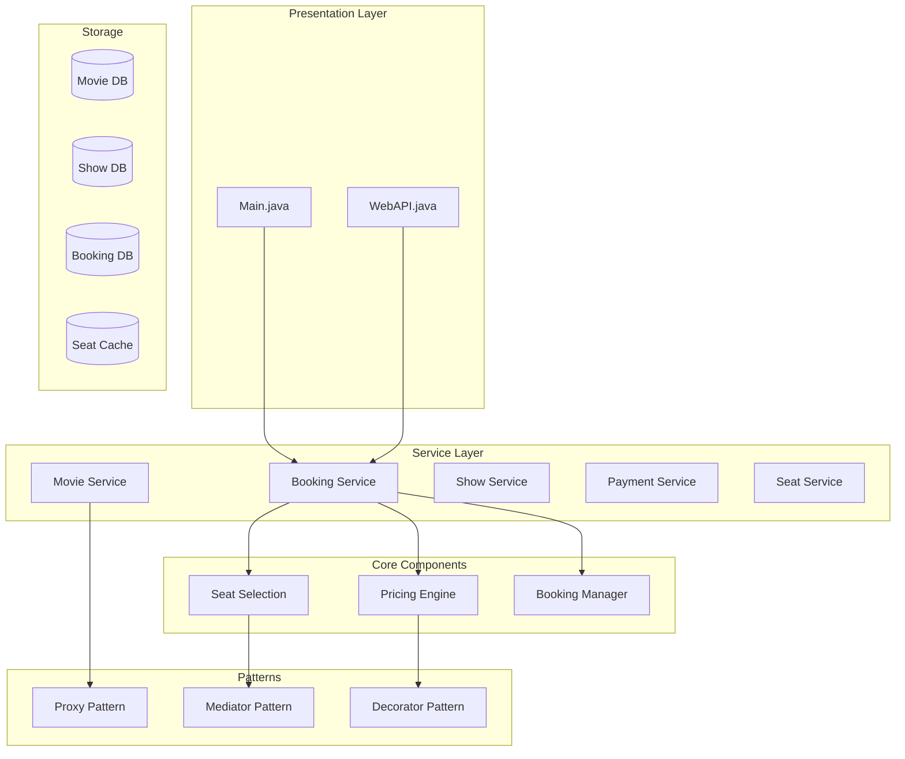
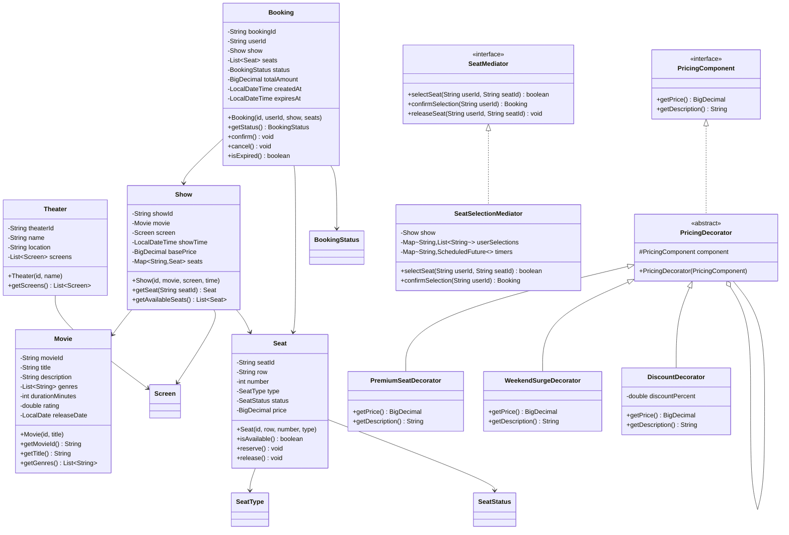

# Movie Booking System

## Project Overview

A Movie Booking System (similar to BookMyShow or Fandango) that handles movie listings, showtimes, seat selection, booking, and payment processing. This advanced project introduces the Proxy pattern for lazy loading, the Mediator pattern for seat selection coordination, and the Decorator pattern for dynamic pricing. Students will design a system that handles complex booking scenarios.

## Learning Outcomes

- Implement the Proxy pattern for lazy loading and access control
- Use the Mediator pattern for coordinating seat selection
- Apply the Decorator pattern for dynamic pricing
- Handle concurrent seat reservations
- Implement complex business rules
- Design for high availability scenarios
- Use immutability for booking records

## Requirements

### Functional Requirements

| ID | Requirement | Priority |
|----|-------------|----------|
| FR01 | Browse movies with details (title, genre, duration, rating) | Must |
| FR02 | View showtimes by date and theater | Must |
| FR03 | Interactive seat selection with real-time availability | Must |
| FR04 | Create bookings with seat hold timeout | Must |
| FR05 | Process payments with multiple methods | Must |
| FR06 | Support different ticket types (Regular, Premium, VIP) | Must |
| FR07 | Cancel bookings with refund policy | Should |
| FR08 | Apply discount codes and offers | Should |
| FR09 | Seat pricing by location (front, middle, back) | Should |
| FR10 | Food and beverage add-ons | Could |

### Non-Functional Requirements

| ID | Requirement |
|----|-------------|
| NFR01 | Seat hold timeout (5 minutes) |
| NFR02 | Prevent double-booking |
| NFR03 | Handle 1000+ concurrent users |
| NFR04 | Booking confirmation within 30 seconds |

## Architecture



## Package Structure

```
movie-booking/
├── README.md
├── src/
│   └── main/
│       └── java/
│           └── com/
│               └── academy/
│                   └── booking/
│                       ├── Main.java
│                       ├── model/
│                       │   ├── Movie.java
│                       │   ├── Theater.java
│                       │   ├── Screen.java
│                       │   ├── Show.java
│                       │   ├── Seat.java
│                       │   ├── Booking.java
│                       │   ├── Ticket.java
│                       │   └── enums/
│                       │       ├── BookingStatus.java
│                       │       ├── SeatStatus.java
│                       │       ├── SeatType.java
│                       │       └── TicketType.java
│                       ├── proxy/
│                       │   ├── MovieProxy.java
│                       │   └── LazyLoader.java
│                       ├── mediator/
│                       │   ├── SeatMediator.java
│                       │   ├── SeatSelectionMediator.java
│                       │   └── SeatComponent.java
│                       ├── decorator/
│                       │   ├── PricingComponent.java
│                       │   ├── PricingDecorator.java
│                       │   ├── BasePrice.java
│                       │   ├── PremiumSeatDecorator.java
│                       │   ├── WeekendSurgeDecorator.java
│                       │   └── DiscountDecorator.java
│                       ├── service/
│                       │   ├── BookingService.java
│                       │   ├── MovieService.java
│                       │   ├── ShowService.java
│                       │   ├── PaymentService.java
│                       │   └── SeatService.java
│                       └── exception/
│                           ├── SeatAlreadyBookedException.java
│                           ├── BookingTimeoutException.java
│                           ├── ShowNotFoundException.java
│                           └── InvalidSeatException.java
└── src/
    └── test/
        └── java/
            └── com/
                └── academy/
                    └── booking/
                        ├── BookingServiceTest.java
                        ├── SeatSelectionTest.java
                        ├── PricingDecoratorTest.java
                        └── ProxyTest.java
```

## Class Diagram



---

**[Continue to Part 2: Implementation Guide →](README-part2.md)**