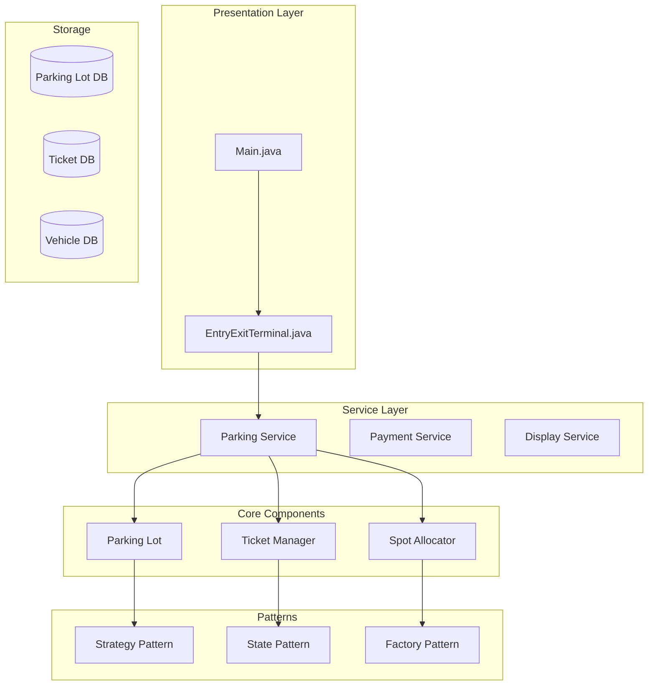
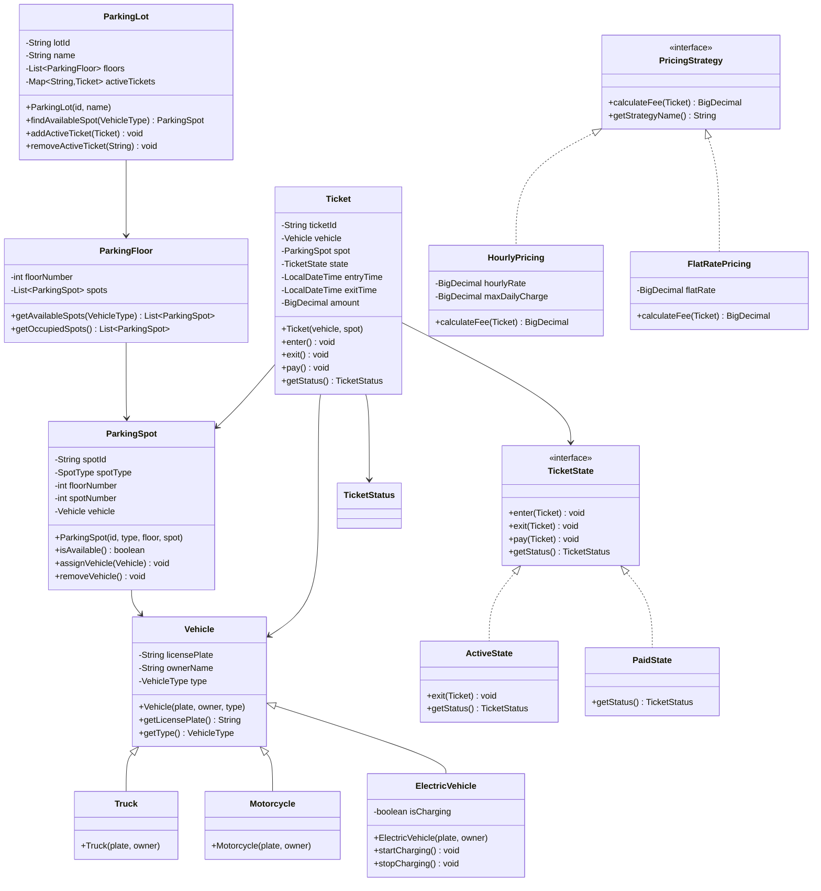

# Parking Lot Management System

## Project Overview

A Parking Lot Management System that handles vehicle entry/exit, parking spot allocation, ticket management, and payment processing. This advanced project introduces the Strategy pattern for pricing, the State pattern for ticket states, and the Factory pattern for vehicle types. Students will design a system that efficiently manages limited parking resources.

## Learning Outcomes

- Implement the Strategy pattern for flexible pricing models
- Use the State pattern for ticket lifecycle management
- Apply the Factory pattern for vehicle creation
- Design efficient allocation algorithms
- Handle concurrent access to shared resources
- Implement time-based calculations
- Design for different vehicle types

## Requirements

### Functional Requirements

| ID | Requirement | Priority |
|----|-------------|----------|
| FR01 | Vehicle entry with ticket generation | Must |
| FR02 | Parking spot allocation by vehicle type | Must |
| FR03 | Vehicle exit with fee calculation | Must |
| FR04 | Multiple pricing strategies (hourly, daily, flat) | Must |
| FR05 | Display available spots | Must |
| FR06 | Support different vehicle types (car, truck, motorcycle) | Must |
| FR07 | Payment processing | Should |
| FR08 | Spot reservation system | Should |
| FR09 | Membership/subscription pricing | Could |
| FR10 | EV charging station integration | Could |

### Non-Functional Requirements

| ID | Requirement |
|----|-------------|
| NFR01 | Thread-safe spot allocation |
| NFR02 | Real-time availability updates |
| NFR03 | Handle 1000+ vehicles |
| NFR04 | Minimal allocation time |

## Architecture



## Package Structure

```
parking-lot/
├── README.md
├── src/
│   └── main/
│       └── java/
│           └── com/
│               └── academy/
│                   └── parking/
│                       ├── Main.java
│                       ├── model/
│                       │   ├── Vehicle.java
│                       │   ├── Truck.java
│                       │   ├── Motorcycle.java
│                       │   ├── ElectricVehicle.java
│                       │   ├── ParkingLot.java
│                       │   ├── ParkingFloor.java
│                       │   ├── ParkingSpot.java
│                       │   ├── Ticket.java
│                       │   ├── Payment.java
│                       │   └── enums/
│                       │       ├── VehicleType.java
│                       │       ├── SpotType.java
│                       │       ├── TicketStatus.java
│                       │       └── PaymentStatus.java
│                       ├── strategy/
│                       │   ├── PricingStrategy.java
│                       │   ├── HourlyPricing.java
│                       │   ├── DailyPricing.java
│                       │   └── FlatRatePricing.java
│                       ├── state/
│                       │   ├── TicketState.java
│                       │   ├── ActiveState.java
│                       │   ├── PendingPaymentState.java
│                       │   └── PaidState.java
│                       ├── factory/
│                       │   └── VehicleFactory.java
│                       ├── service/
│                       │   ├── ParkingService.java
│                       │   ├── PaymentService.java
│                       │   └── DisplayService.java
│                       └── exception/
│                           ├── ParkingLotFullException.java
│                           ├── VehicleNotFoundException.java
│                           ├── InvalidTicketException.java
│                           └── PaymentFailedException.java
└── src/
    └── test/
        └── java/
            └── com/
                └── academy/
                    └── parking/
                        ├── ParkingServiceTest.java
                        ├── PricingStrategyTest.java
                        ├── TicketStateTest.java
                        └── VehicleFactoryTest.java
```

## Class Diagram



---

**[Continue to Part 2: Implementation Guide →](README-part2.md)**