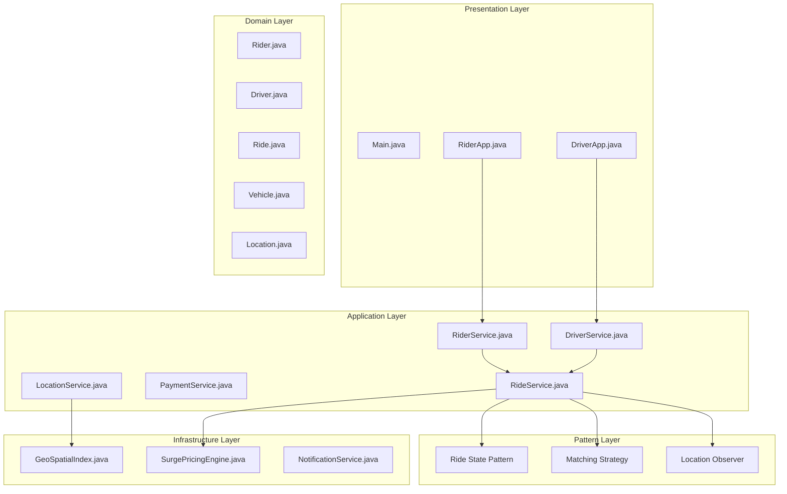

# Ride Sharing System

## Project Overview

A Ride Sharing System (similar to Uber or Lyft) that handles rider requests, driver matching, ride tracking, payment processing, and surge pricing. This advanced project introduces the State pattern for ride lifecycle, the Strategy pattern for matching algorithms, and the Observer pattern for real-time updates. Students will design a system that handles complex real-time operations.

## Learning Outcomes

- Implement the State pattern for ride lifecycle management
- Use the Strategy pattern for driver matching algorithms
- Apply the Observer pattern for real-time ride updates
- Design geospatial indexing for location-based queries
- Handle surge pricing with dynamic algorithms
- Implement rating systems
- Design for high availability and fault tolerance

## Requirements

### Functional Requirements

| ID | Requirement | Priority |
|----|-------------|----------|
| FR01 | Rider registration with profile management | Must |
| FR02 | Driver registration with vehicle and license info | Must |
| FR03 | Request ride with pickup and dropoff locations | Must |
| FR04 | Match riders with available drivers | Must |
| FR05 | Real-time ride tracking on map | Must |
| FR06 | Dynamic fare calculation with surge pricing | Must |
| FR07 | Payment processing with multiple methods | Must |
| FR08 | Driver availability toggle | Should |
| FR09 | Ride history and receipts | Should |
| FR10 | Rating and feedback system | Could |

### Non-Functional Requirements

| ID | Requirement |
|----|-------------|
| NFR01 | Driver location update every 5 seconds |
| NFR02 | Match rider within 30 seconds |
| NFR03 | Support 100,000+ concurrent users |
| NFR04 | 99.9% uptime requirement |

## Architecture



## Package Structure

```
ride-sharing/
├── README.md
├── src/
│   └── main/
│       └── java/
│           └── com/
│               └── academy/
│                   └── rideshare/
│                       ├── Main.java
│                       ├── model/
│                       │   ├── Rider.java
│                       │   ├── Driver.java
│                       │   ├── Vehicle.java
│                       │   ├── Ride.java
│                       │   ├── Location.java
│                       │   ├── RideRequest.java
│                       │   ├── Payment.java
│                       │   ├── Rating.java
│                       │   └── enums/
│                       │       ├── RideStatus.java
│                       │       ├── DriverStatus.java
│                       │       ├── VehicleType.java
│                       │       └── PaymentMethod.java
│                       ├── state/
│                       │   ├── RideState.java
│                       │   ├── RequestedState.java
│                       │   ├── MatchedState.java
│                       │   ├── EnRouteState.java
│                       │   ├── InProgressState.java
│                       │   ├── CompletedState.java
│                       │   └── CancelledState.java
│                       ├── strategy/
│                       │   ├── MatchingStrategy.java
│                       │   ├── NearestDriverStrategy.java
│                       │   ├── RatingBasedStrategy.java
│                       │   └── SurgeAwareStrategy.java
│                       ├── observer/
│                       │   ├── RideObserver.java
│                       │   ├── RideEventManager.java
│                       │   ├── RiderLocationTracker.java
│                       │   └── DriverLocationTracker.java
│                       ├── service/
│                       │   ├── RiderService.java
│                       │   ├── DriverService.java
│                       │   ├── RideService.java
│                       │   ├── PaymentService.java
│                       │   └── LocationService.java
│                       ├── geo/
│                       │   ├── GeoSpatialIndex.java
│                       │   ├── QuadTree.java
│                       │   └── GeoUtils.java
│                       ├── pricing/
│                       │   ├── SurgePricingEngine.java
│                       │   ├── FareCalculator.java
│                       │   └── PricingPolicy.java
│                       └── exception/
│                           ├── NoDriverAvailableException.java
│                           ├── RideNotFoundException.java
│                           └── PaymentFailedException.java
└── src/
    └── test/
        └── java/
            └── com/
                └── academy/
                    └── rideshare/
                        ├── RideServiceTest.java
                        ├── MatchingStrategyTest.java
                        ├── SurgePricingTest.java
                        └── RideStateTest.java
```

## Class Diagram

```mermaid
classDiagram
    class Rider {
        -String riderId
        -String name
        -String phone
        -String email
        -Location currentLocation
        -double rating
        -List~Ride~ rideHistory
        +Rider(id, name, phone, email)
        +requestRide(RideRequest) Ride
        +cancelRide(String) void
        +rateDriver(String, int, String) void
        +getRideHistory() List~Ride~
    }
    
    class Driver {
        -String driverId
        -String name
        -String phone
        -Vehicle vehicle
        -Location currentLocation
        -DriverStatus status
        -double rating
        -int totalRides
        +Driver(id, name, phone, vehicle)
        +acceptRide(Ride) void
        +startRide(String) void
        -completeRide(String) void
        +updateLocation(Location) void
        +toggleAvailability() void
        +isAvailable() boolean
    }
    
    class Vehicle {
        -String vehicleId
        -String make
        -String model
        -int year
        -String licensePlate
        -VehicleType type
        -String color
        +Vehicle(id, make, model, year, plate, type)
        +getVehicleId() String
        +getType() VehicleType
    }
    
    class Ride {
        -String rideId
        -Rider rider
        -Driver driver
        -Location pickupLocation
        -Location dropoffLocation
        -RideStatus status
        -BigDecimal fare
        -LocalDateTime requestTime
        -LocalDateTime startTime
        -LocalDateTime endTime
        -double distance
        -int duration
        +Ride(id, rider, pickup, dropoff)
        +getRideId() String
        +getStatus() RideStatus
        +updateStatus(RideStatus) void
        +calculateFare(BigDecimal) void
        +getDuration() int
        +getDistance() double
    }
    
    class RideRequest {
        -String requestId
        -Rider rider
        -Location pickupLocation
        -Location dropoffLocation
        -VehicleType preferredVehicle
        -LocalDateTime requestTime
        +RideRequest(rider, pickup, dropoff)
        +getRequestId() String
        +getPickupLocation() Location
        +getDropoffLocation() Location
    }
    
    class Location {
        -double latitude
        -double longitude
        -String address
        -String city
        -String zipCode
        +Location(lat, lng, address)
        +getLatitude() double
        +getLongitude() double
        +distanceTo(Location) double
        +equals(Object) boolean
        +hashCode() int
    }
    
    class RideState {
        <<interface>>
        +request(Ride) void
        +match(Ride, Driver) void
        +start(Ride) void
        +complete(Ride) void
        +cancel(Ride) void
        +getStatus() RideStatus
    }
    
    class RequestedState {
        +match(Ride, Driver) void
        +cancel(Ride) void
        +getStatus() RideStatus
    }
    
    class MatchedState {
        +start(Ride) void
        +cancel(Ride) void
        +getStatus() RideStatus
    }
    
    class InProgressState {
        +complete(Ride) void
        +getStatus() RideStatus
    }
    
    class CompletedState {
        +getStatus() RideStatus
    }
    
    class CancelledState {
        +getStatus() RideStatus
    }
    
    class MatchingStrategy {
        <<interface>>
        +findBestDriver(List~Driver~, RideRequest) Driver
    }
    
    class NearestDriverStrategy {
        +findBestDriver(List~Driver~, RideRequest) Driver
    }
    
    class RatingBasedStrategy {
        +findBestDriver(List~Driver~, RideRequest) Driver
    }
    
    class SurgePricingEngine {
        -Map~String,BigDecimal~ surgeMultipliers
        -int demandThreshold
        +calculateSurge(Location, int) BigDecimal
        +updateSurgePricing(String zone) void
        +getSurgeMultiplier(Location) BigDecimal
    }
    
    class FareCalculator {
        -BigDecimal baseFare
        -BigDecimal perKmRate
        -BigDecimal perMinuteRate
        -SurgePricingEngine surgeEngine
        +calculateFare(Ride) BigDecimal
        +applySurge(BigDecimal, BigDecimal) BigDecimal
    }
    
    Rider --> Location
    Driver --> Vehicle
    Driver --> Location
    Ride --> Rider
    Ride --> Driver
    Ride --> Location
    Ride --> RideStatus
    RideRequest --> Rider
    RideRequest --> Location
    RideRequest --> VehicleType
    RideState <|.. RequestedState
    RideState <|.. MatchedState
    RideState <|.. InProgressState
    RideState <|.. CompletedState
    RideState <|.. CancelledState
    MatchingStrategy <|.. NearestDriverStrategy
    MatchingStrategy <|.. RatingBasedStrategy
    FareCalculator --> SurgePricingEngine
```



## Implementation Guide

### Step 1: Implement State Pattern for Ride

```java
package com.academy.rideshare.state;

import com.academy.rideshare.model.Ride;
import com.academy.rideshare.model.Driver;
import com.academy.rideshare.model.enums.RideStatus;

public interface RideState {
    void request(Ride ride);
    void match(Ride ride, Driver driver);
    void start(Ride ride);
    void complete(Ride ride);
    void cancel(Ride ride);
    RideStatus getStatus();
}

package com.academy.rideshare.state;

public class RequestedState implements RideState {
    private final RideService rideService;

    public RequestedState(RideService rideService) {
        this.rideService = rideService;
    }

    @Override
    public void match(Ride ride, Driver driver) {
        driver.acceptRide(ride);
        ride.setDriver(driver);
        ride.setStatus(RideStatus.MATCHED);
        ride.setState(new MatchedState(rideService));
        
        rideService.notifyRideMatched(ride);
    }

    @Override
    public void cancel(Ride ride) {
        ride.setStatus(RideStatus.CANCELLED);
        ride.setState(new CancelledState());
    }

    @Override
    public RideStatus getStatus() {
        return RideStatus.REQUESTED;
    }
}

public class InProgressState implements RideState {
    @Override
    public void complete(Ride ride) {
        ride.setEndTime(LocalDateTime.now());
        ride.setStatus(RideStatus.COMPLETED);
        ride.setState(new CompletedState());
        
        // Trigger payment processing
        rideService.processPayment(ride);
    }

    @Override
    public RideStatus getStatus() {
        return RideStatus.IN_PROGRESS;
    }
}
```

### Step 2: Implement Strategy Pattern for Driver Matching

```java
package com.academy.rideshare.strategy;

import com.academy.rideshare.model.*;
import java.util.List;
import java.util.Optional;

public interface MatchingStrategy {
    Driver findBestDriver(List<Driver> availableDrivers, RideRequest request);
}

package com.academy.rideshare.strategy;

import java.util.Comparator;
import java.util.Optional;

public class NearestDriverStrategy implements MatchingStrategy {
    @Override
    public Driver findBestDriver(List<Driver> availableDrivers, RideRequest request) {
        Location pickup = request.getPickupLocation();
        
        return availableDrivers.stream()
            .filter(Driver::isAvailable)
            .min(Comparator.comparingDouble(d -> 
                d.getCurrentLocation().distanceTo(pickup)))
            .orElse(null);
    }
}

public class RatingBasedStrategy implements MatchingStrategy {
    @Override
    public Driver findBestDriver(List<Driver> availableDrivers, RideRequest request) {
        Location pickup = request.getPickupLocation();
        
        return availableDrivers.stream()
            .filter(Driver::isAvailable)
            .filter(d -> d.getCurrentLocation().distanceTo(pickup) < 5.0)
            .max(Comparator.comparingDouble(Driver::getRating))
            .orElse(null);
    }
}

public class SurgeAwareStrategy implements MatchingStrategy {
    private final NearestDriverStrategy nearestStrategy;
    private final SurgePricingEngine surgeEngine;

    @Override
    public Driver findBestDriver(List<Driver> availableDrivers, RideRequest request) {
        BigDecimal surge = surgeEngine.getSurgeMultiplier(request.getPickupLocation());
        
        if (surge.compareTo(new BigDecimal("2.0")) > 0) {
            return nearestStrategy.findBestDriver(availableDrivers, request);
        }
        
        return availableDrivers.stream()
            .filter(Driver::isAvailable)
            .max(Comparator.comparingDouble(Driver::getRating))
            .orElse(null);
    }
}
```

### Step 3: Implement Surge Pricing Engine

```java
package com.academy.rideshare.pricing;

import com.academy.rideshare.model.Location;
import java.math.BigDecimal;
import java.math.RoundingMode;
import java.util.HashMap;
import java.util.Map;

public class SurgePricingEngine {
    private final Map<String, BigDecimal> zoneSurgeMultipliers;
    private final GeoSpatialIndex geoIndex;
    private static final int DEMAND_THRESHOLD = 10;
    private static final BigDecimal BASE_MULTIPLIER = new BigDecimal("1.0");
    private static final BigDecimal SURGE_INCREMENT = new BigDecimal("0.25");

    public SurgePricingEngine() {
        this.zoneSurgeMultipliers = new HashMap<>();
        this.geoIndex = new GeoSpatialIndex();
    }

    public BigDecimal calculateSurge(Location location, int demandCount) {
        if (demandCount < DEMAND_THRESHOLD) {
            return BASE_MULTIPLIER;
        }
        
        int surgeLevels = (demandCount - DEMAND_THRESHOLD) / 5 + 1;
        BigDecimal surge = BASE_MULTIPLIER.add(
            SURGE_INCREMENT.multiply(BigDecimal.valueOf(surgeLevels))
        );
        
        return surge.min(new BigDecimal("5.0")).setScale(2, RoundingMode.HALF_UP);
    }

    public BigDecimal getSurgeMultiplier(Location location) {
        String zone = geoIndex.getZone(location);
        return zoneSurgeMultipliers.getOrDefault(zone, BASE_MULTIPLIER);
    }
}
```

### Step 4: Implement Geospatial Index

```java
package com.academy.rideshare.geo;

import com.academy.rideshare.model.Location;
import java.util.ArrayList;
import java.util.List;
import java.util.stream.Collectors;

public class GeoSpatialIndex {
    private final List<IndexedLocation> indexedLocations;
    private final double gridSize;

    public GeoSpatialIndex() {
        this.indexedLocations = new ArrayList<>();
        this.gridSize = 0.01; // ~1km grid
    }

    public void addLocation(Location location, String id) {
        indexedLocations.add(new IndexedLocation(id, location));
    }

    public List<String> findNearby(Location center, double radiusKm) {
        return indexedLocations.stream()
            .filter(il -> il.location.distanceTo(center) <= radiusKm)
            .map(il -> il.id)
            .collect(Collectors.toList());
    }

    public List<String> findInGrid(double lat, double lng) {
        int gridX = (int) (lat / gridSize);
        int gridY = (int) (lng / gridSize);
        
        return indexedLocations.stream()
            .filter(il -> {
                int ilGridX = (int) (il.location.getLatitude() / gridSize);
                int ilGridY = (int) (il.location.getLongitude() / gridSize);
                return Math.abs(ilGridX - gridX) <= 1 && Math.abs(ilGridY - gridY) <= 1;
            })
            .map(il -> il.id)
            .collect(Collectors.toList());
    }

    private static class IndexedLocation {
        final String id;
        final Location location;

        IndexedLocation(String id, Location location) {
            this.id = id;
            this.location = location;
        }
    }
}
```

## Unit Tests

```java
package com.academy.rideshare;

import com.academy.rideshare.model.*;
import com.academy.rideshare.service.RideService;
import com.academy.rideshare.strategy.*;
import com.academy.rideshare.state.*;
import com.academy.rideshare.pricing.SurgePricingEngine;
import org.junit.jupiter.api.BeforeEach;
import org.junit.jupiter.api.Test;
import java.math.BigDecimal;
import java.util.Arrays;
import static org.junit.jupiter.api.Assertions.*;

public class RideServiceTest {
    private RideService rideService;
    private DriverService driverService;
    private SurgePricingEngine surgeEngine;

    @BeforeEach
    void setUp() {
        rideService = new RideService();
        driverService = new DriverService();
        surgeEngine = new SurgePricingEngine();
    }

    @Test
    void testRequestRide() {
        Rider rider = createTestRider();
        RideRequest request = new RideRequest(rider, 
            new Location(40.7128, -74.0060, "NYC"),
            new Location(40.7580, -73.9855, "Times Square"));

        Ride ride = rideService.requestRide(request);
        
        assertNotNull(ride);
        assertEquals(RideStatus.REQUESTED, ride.getStatus());
    }

    @Test
    void testDriverMatching() {
        RideRequest request = createTestRequest();
        List<Driver> drivers = createAvailableDrivers();
        
        MatchingStrategy strategy = new NearestDriverStrategy();
        Driver matched = strategy.findBestDriver(drivers, request);
        
        assertNotNull(matched);
        assertTrue(matched.isAvailable());
    }

    @Test
    void testRideStateTransitions() {
        Ride ride = createTestRide();
        Driver driver = createTestDriver();
        
        assertEquals(RideStatus.REQUESTED, ride.getStatus());
        
        ride.match(driver);
        assertEquals(RideStatus.MATCHED, ride.getStatus());
        
        ride.start();
        assertEquals(RideStatus.IN_PROGRESS, ride.getStatus());
        
        ride.complete();
        assertEquals(RideStatus.COMPLETED, ride.getStatus());
    }

    @Test
    void testSurgePricing() {
        Location location = new Location(40.7128, -74.0060, "NYC");
        
        BigDecimal lowDemand = surgeEngine.calculateSurge(location, 5);
        assertEquals(new BigDecimal("1.00"), lowDemand);
        
        BigDecimal highDemand = surgeEngine.calculateSurge(location, 20);
        assertTrue(highDemand.compareTo(new BigDecimal("1.0")) > 0);
    }

    @Test
    void testFareCalculation() {
        Ride ride = createTestRideWithDistance(10.0, 30);
        FareCalculator calculator = new FareCalculator(surgeEngine);
        
        BigDecimal fare = calculator.calculateFare(ride);
        assertTrue(fare.compareTo(BigDecimal.ZERO) > 0);
    }

    @Test
    void testCancelRide() {
        Ride ride = createTestRide();
        ride.cancel();
        
        assertEquals(RideStatus.CANCELLED, ride.getStatus());
    }
}
```

## Extension Challenges

1. **Ride Pooling**: Implement UberPool-style shared rides
2. **Scheduled Rides**: Allow advance ride scheduling
3. **Multi-Stop Rides**: Support rides with multiple destinations
4. **Driver Heatmap**: Show demand heatmap for drivers
5. **Accessibility Features**: Add wheelchair-accessible vehicle options

## Interview Questions

1. **Why use the State pattern for ride lifecycle?**
   - Discuss encapsulation of state-specific behavior, clean transitions, avoiding large conditionals

2. **How would you find nearby drivers in under 100ms?**
   - Discuss geospatial indexing, quad-trees, Redis geospatial, database indexing

3. **What are the challenges of surge pricing?**
   - Discuss fairness, user perception, regulatory concerns, demand prediction

4. **How would you handle driver location updates at scale?**
   - Discuss WebSocket connections, message queues, geographic partitioning

5. **How would you design for a multi-city ride sharing service?**
   - Discuss data partitioning, regional pricing, driver portability

## References

- [State Pattern](https://www.baeldung.com/java-state-pattern)
- [Strategy Pattern](https://www.baeldung.com/java-strategy-pattern)
- [Geospatial Indexing](https://medium.com/@anthropoco/a-very-basic-intro-to-geo-spatial-indexing-203618f06b4b)
