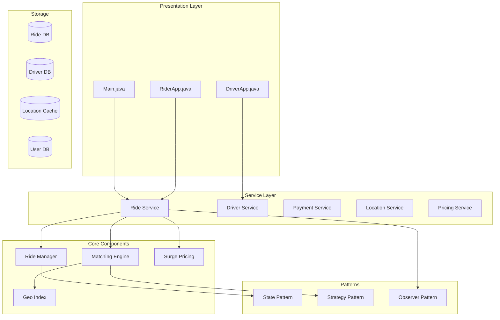
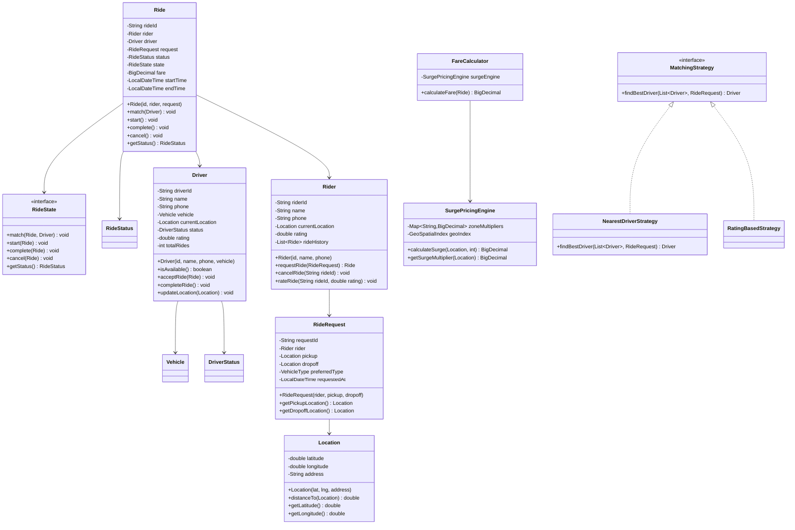

# Ride Sharing System

## Project Overview

A Ride Sharing System (similar to Uber or Lyft) that handles rider requests, driver matching, ride tracking, payment processing, and surge pricing. This advanced project introduces the State pattern for ride lifecycle, the Strategy pattern for matching algorithms, and the Observer pattern for real-time updates. Students will design a system that handles complex real-time operations.

## Learning Outcomes

- Implement the State pattern for ride lifecycle management
- Use the Strategy pattern for driver matching algorithms
- Apply the Observer pattern for real-time ride updates
- Design geospatial indexing for location-based queries
- Handle surge pricing with dynamic algorithms
- Implement rating systems
- Design for high availability and fault tolerance

## Requirements

### Functional Requirements

| ID | Requirement | Priority |
|----|-------------|----------|
| FR01 | Rider registration with profile management | Must |
| FR02 | Driver registration with vehicle and license info | Must |
| FR03 | Request ride with pickup and dropoff locations | Must |
| FR04 | Match riders with available drivers | Must |
| FR05 | Real-time ride tracking on map | Must |
| FR06 | Dynamic fare calculation with surge pricing | Must |
| FR07 | Payment processing with multiple methods | Must |
| FR08 | Driver availability toggle | Should |
| FR09 | Ride history and receipts | Should |
| FR10 | Rating and feedback system | Could |

### Non-Functional Requirements

| ID | Requirement |
|----|-------------|
| NFR01 | Driver location update every 5 seconds |
| NFR02 | Match rider within 30 seconds |
| NFR03 | Support 100,000+ concurrent users |
| NFR04 | 99.9% uptime requirement |

## Architecture



## Package Structure

```
ride-sharing/
├── README.md
├── src/
│   └── main/
│       └── java/
│           └── com/
│               └── academy/
│                   └── rideshare/
│                       ├── Main.java
│                       ├── model/
│                       │   ├── Rider.java
│                       │   ├── Driver.java
│                       │   ├── Ride.java
│                       │   ├── RideRequest.java
│                       │   ├── Vehicle.java
│                       │   ├── Location.java
│                       │   ├── Payment.java
│                       │   └── enums/
│                       │       ├── RideStatus.java
│                       │       ├── DriverStatus.java
│                       │       ├── VehicleType.java
│                       │       └── PaymentMethod.java
│                       ├── state/
│                       │   ├── RideState.java
│                       │   ├── RequestedState.java
│                       │   ├── MatchedState.java
│                       │   ├── InProgressState.java
│                       │   ├── CompletedState.java
│                       │   └── CancelledState.java
│                       ├── strategy/
│                       │   ├── MatchingStrategy.java
│                       │   ├── NearestDriverStrategy.java
│                       │   ├── RatingBasedStrategy.java
│                       │   └── SurgeAwareStrategy.java
│                       ├── observer/
│                       │   ├── RideObserver.java
│                       │   ├── RideEventManager.java
│                       │   ├── RiderNotification.java
│                       │   └── DriverNotification.java
│                       ├── pricing/
│                       │   ├── FareCalculator.java
│                       │   ├── SurgePricingEngine.java
│                       │   └── PricingStrategy.java
│                       ├── geo/
│                       │   ├── GeoSpatialIndex.java
│                       │   └── GeoHash.java
│                       ├── service/
│                       │   ├── RideService.java
│                       │   ├── DriverService.java
│                       │   ├── PaymentService.java
│                       │   ├── LocationService.java
│                       │   └── NotificationService.java
│                       └── exception/
│                           ├── NoDriverAvailableException.java
│                           ├── RideNotFoundException.java
│                           ├── InvalidLocationException.java
│                           └── PaymentFailedException.java
└── src/
    └── test/
        └── java/
            └── com/
                └── academy/
                    └── rideshare/
                        ├── RideServiceTest.java
                        ├── MatchingStrategyTest.java
                        ├── SurgePricingTest.java
                        └── GeoIndexTest.java
```

## Class Diagram



---

**[Continue to Part 2: Implementation Guide →](README-part2.md)**