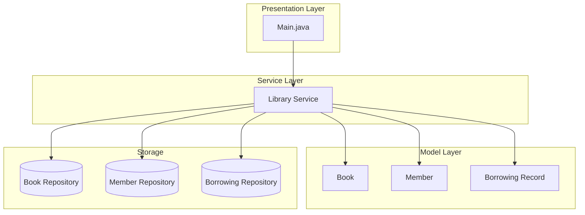
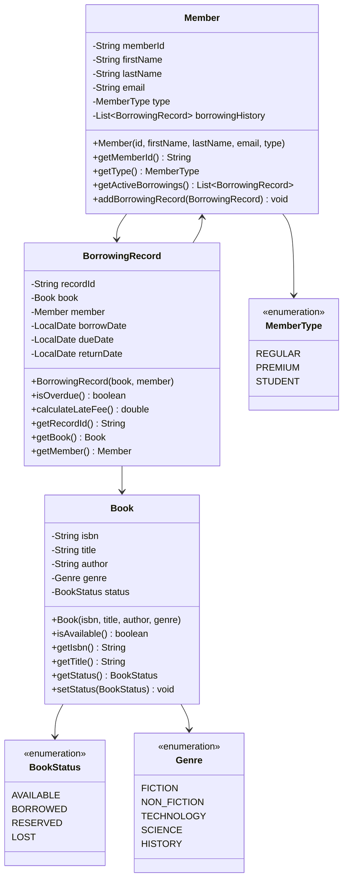

# Library Management System

## Project Overview

A console-based Library Management System that enables library staff to manage books, members, and borrowing/returning operations. This project reinforces OOP fundamentals including encapsulation, associations between objects, and exception handling. Students will implement a system that tracks book availability, manages member accounts, and maintains borrowing history.

## Learning Outcomes

- Design and implement class associations (has-a relationships)
- Use enums for constant values (BookStatus, MemberType)
- Implement bidirectional relationships between objects
- Practice exception handling with custom exceptions
- Use interfaces for polymorphic behavior
- Implement search algorithms with different criteria
- Write comprehensive unit tests

## Requirements

### Functional Requirements

| ID | Requirement | Priority |
|----|-------------|----------|
| FR01 | Add new books with ISBN, title, author, genre | Must |
| FR02 | Register library members with ID, name, email | Must |
| FR03 | Borrow book (check availability) | Must |
| FR04 | Return book (update availability) | Must |
| FR05 | Search books by title, author, ISBN | Must |
| FR06 | View borrowing history for member | Must |
| FR07 | View all currently borrowed books | Must |
| FR08 | Reserve a book when unavailable | Should |
| FR09 | Calculate late fees for overdue books | Should |
| FR10 | Generate borrowing statistics report | Could |

### Non-Functional Requirements

| ID | Requirement |
|----|-------------|
| NFR01 | Prevent concurrent borrowing of same book |
| NFR02 | Validate email format for members |
| NFR03 | ISBN must be 10 or 13 digits |
| NFR04 | Maximum 5 books per member at a time |

## Architecture



## Package Structure

```
library-management/
├── README.md
├── src/
│   └── main/
│       └── java/
│           └── com/
│               └── academy/
│                   └── library/
│                       ├── Main.java
│                       ├── model/
│                       │   ├── Book.java
│                       │   ├── Member.java
│                       │   ├── BorrowingRecord.java
│                       │   └── enums/
│                       │       ├── BookStatus.java
│                       │       ├── MemberType.java
│                       │       └── Genre.java
│                       ├── repository/
│                       │   ├── BookRepository.java
│                       │   ├── MemberRepository.java
│                       │   └── BorrowingRepository.java
│                       ├── service/
│                       │   └── LibraryService.java
│                       └── exception/
│                           ├── BookNotAvailableException.java
│                           ├── MaxBooksExceededException.java
│                           ├── MemberNotFoundException.java
│                           └── InvalidISBNException.java
└── src/
    └── test/
        └── java/
            └── com/
                └── academy/
                    └── library/
                        ├── LibraryServiceTest.java
                        ├── BookTest.java
                        ├── MemberTest.java
                        └── BorrowingRecordTest.java
```

## Class Diagram



---

**[Continue to Part 2: Implementation Guide →](README-part2.md)**