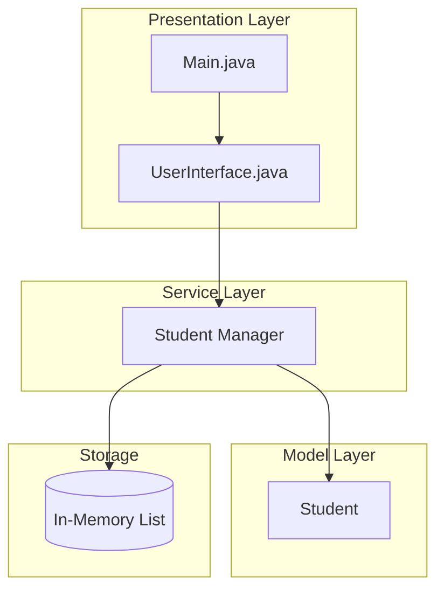
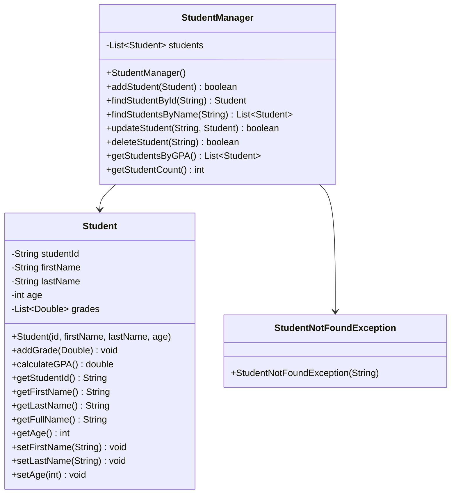

# Student Management System

## Project Overview

A console-based Student Management System that allows users to manage student records with full CRUD operations. This project introduces fundamental OOP concepts including classes, objects, encapsulation, and basic data structures. Students will build a practical application that demonstrates how to organize code into logical packages and implement real-world business logic.

## Learning Outcomes

- Understand class design and object creation
- Implement encapsulation with private fields and public methods
- Use collections (ArrayList) for data storage
- Practice method overloading
- Implement input validation
- Write unit tests for business logic
- Understand package organization

## Requirements

### Functional Requirements

| ID | Requirement | Priority |
|----|-------------|----------|
| FR01 | Add new student with ID, name, age, grade | Must |
| FR02 | Display all students | Must |
| FR03 | Search student by ID | Must |
| FR04 | Search student by name | Must |
| FR05 | Update student information | Must |
| FR06 | Delete student by ID | Must |
| FR07 | Calculate GPA from grades | Must |
| FR08 | Display students sorted by GPA | Should |
| FR09 | Export student data to file | Could |
| FR10 | Import student data from file | Could |

### Non-Functional Requirements

| ID | Requirement |
|----|-------------|
| NFR01 | Response time < 100ms for all operations |
| NFR02 | Handle up to 10,000 students |
| NFR03 | Input validation for all user inputs |
| NFR04 | Graceful error handling |

## Architecture



## Package Structure

```
student-management/
├── README.md
├── src/
│   └── main/
│       └── java/
│           └── com/
│               └── academy/
│                   └── student/
│                       ├── Main.java
│                       ├── model/
│                       │   └── Student.java
│                       ├── manager/
│                       │   └── StudentManager.java
│                       └── exception/
│                           └── StudentNotFoundException.java
└── src/
    └── test/
        └── java/
            └── com/
                └── academy/
                    └── student/
                        ├── StudentManagerTest.java
                        └── StudentTest.java
```

## Class Diagram



---

**[Continue to Part 2: Implementation Guide →](README-part2.md)**