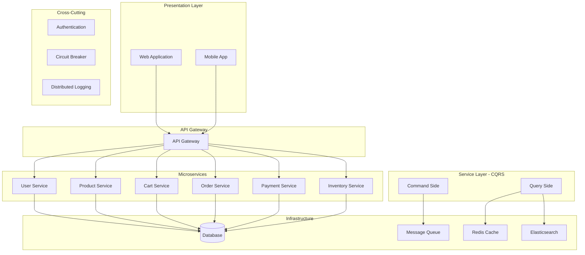
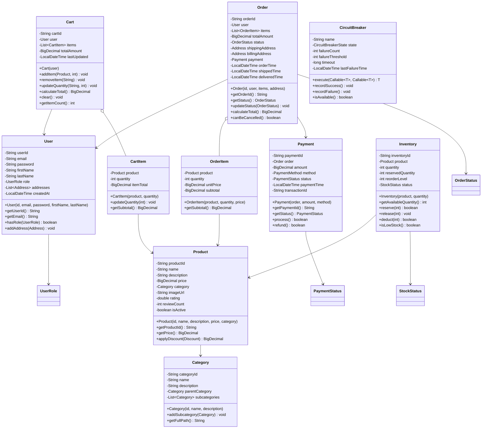

# E-Commerce Platform

## Project Overview

A comprehensive E-Commerce Platform that handles product catalog, shopping cart, order processing, payment, user management, and inventory tracking. This enterprise project introduces microservice architecture concepts, the Circuit Breaker pattern for fault tolerance, and CQRS for read/write optimization. Students will design a scalable system that demonstrates enterprise-level architecture patterns.

## Learning Outcomes

- Design microservice-style architecture within a monolith
- Implement Circuit Breaker pattern for fault tolerance
- Use CQRS pattern for read/write optimization
- Design event-driven architecture with domain events
- Implement comprehensive validation and security
- Use DTOs for API layer separation
- Design for horizontal scalability

## Requirements

### Functional Requirements

| ID | Requirement | Priority |
|----|-------------|----------|
| FR01 | User registration and authentication | Must |
| FR02 | Product catalog with categories and search | Must |
| FR03 | Shopping cart management | Must |
| FR04 | Order placement and tracking | Must |
| FR05 | Payment processing (multiple methods) | Must |
| FR06 | Inventory management with stock tracking | Must |
| FR07 | Order history and user profiles | Should |
| FR08 | Product reviews and ratings | Should |
| FR09 | Discount and coupon system | Could |
| FR10 | Recommendation engine | Could |

### Non-Functional Requirements

| ID | Requirement |
|----|-------------|
| NFR01 | Support 10,000 concurrent users |
| NFR02 | Page load time < 2 seconds |
| NFR03 | Order processing < 5 seconds |
| NFR04 | 99.9% availability |
| NFR05 | Horizontal scalability |

## Architecture



## Package Structure

```
e-commerce-platform/
├── README.md
├── src/
│   └── main/
│       └── java/
│           └── com/
│               └── academy/
│                   └── ecommerce/
│                       ├── Main.java
│                       ├── api/
│                       │   ├── UserController.java
│                       │   ├── ProductController.java
│                       │   ├── CartController.java
│                       │   ├── OrderController.java
│                       │   └── PaymentController.java
│                       ├── dto/
│                       │   ├── UserDTO.java
│                       │   ├── ProductDTO.java
│                       │   ├── CartDTO.java
│                       │   ├── OrderDTO.java
│                       │   └── CreateOrderRequest.java
│                       ├── model/
│                       │   ├── User.java
│                       │   ├── Product.java
│                       │   ├── Category.java
│                       │   ├── Cart.java
│                       │   ├── CartItem.java
│                       │   ├── Order.java
│                       │   ├── OrderItem.java
│                       │   ├── Payment.java
│                       │   ├── Inventory.java
│                       │   └── enums/
│                       │       ├── OrderStatus.java
│                       │       ├── PaymentStatus.java
│                       │       ├── UserRole.java
│                       │       └── StockStatus.java
│                       ├── service/
│                       │   ├── UserService.java
│                       │   ├── ProductService.java
│                       │   ├── CartService.java
│                       │   ├── OrderService.java
│                       │   ├── PaymentService.java
│                       │   └── InventoryService.java
│                       ├── cqrs/
│                       │   ├── CommandHandler.java
│                       │   ├── QueryHandler.java
│                       │   ├── CreateOrderCommand.java
│                       │   ├── GetOrderQuery.java
│                       │   └── EventBus.java
│                       ├── resilience/
│                       │   ├── CircuitBreaker.java
│                       │   ├── RetryPolicy.java
│                       │   └── FallbackHandler.java
│                       ├── security/
│                       │   ├── AuthService.java
│                       │   ├── TokenProvider.java
│                       │   └── PasswordEncoder.java
│                       ├── validation/
│                       │   ├── Validator.java
│                       │   ├── EmailValidator.java
│                       │   └── OrderValidator.java
│                       └── exception/
│                           ├── ResourceNotFoundException.java
│                           ├── InsufficientStockException.java
│                           ├── PaymentFailedException.java
│                           └── UnauthorizedException.java
└── src/
    └── test/
        └── java/
            └── com/
                └── academy/
                    └── ecommerce/
                        ├── OrderServiceTest.java
                        ├── CartServiceTest.java
                        └── CircuitBreakerTest.java
```

## Class Diagram



## Implementation Guide

### Step 1: Implement CQRS Pattern

```java
package com.academy.ecommerce.cqrs;

public interface Command {
    String getAggregateId();
}

public interface CommandHandler<T extends Command> {
    void handle(T command);
}

public interface Query<R> {
    String getAggregateId();
}

public interface QueryHandler<T extends Query<R>, R> {
    R handle(T query);
}

package com.academy.ecommerce.cqrs;

public class CreateOrderCommand implements Command {
    private final String orderId;
    private final String userId;
    private final List<OrderItemDTO> items;
    private final AddressDTO shippingAddress;

    public CreateOrderCommand(String orderId, String userId, 
                             List<OrderItemDTO> items, AddressDTO address) {
        this.orderId = orderId;
        this.userId = userId;
        this.items = items;
        this.shippingAddress = address;
    }

    @Override
    public String getAggregateId() {
        return orderId;
    }
}

public class CreateOrderCommandHandler implements CommandHandler<CreateOrderCommand> {
    private final OrderRepository orderRepository;
    private final InventoryService inventoryService;
    private final EventBus eventBus;

    @Override
    public void handle(CreateOrderCommand command) {
        // Validate stock availability
        for (OrderItemDTO item : command.getItems()) {
            if (!inventoryService.checkStock(item.getProductId(), item.getQuantity())) {
                throw new InsufficientStockException(item.getProductId());
            }
        }

        // Create order
        Order order = OrderFactory.createOrder(command);
        orderRepository.save(order);

        // Reserve inventory
        for (OrderItemDTO item : command.getItems()) {
            inventoryService.reserve(item.getProductId(), item.getQuantity());
        }

        // Publish event
        eventBus.publish(new OrderCreatedEvent(order.getOrderId()));
    }
}

public class EventBus {
    private final Map<String, List<EventHandler>> handlers = new ConcurrentHashMap<>();

    public void subscribe(String eventType, EventHandler handler) {
        handlers.computeIfAbsent(eventType, k -> new CopyOnWriteArrayList<>()).add(handler);
    }

    public void publish(Object event) {
        String eventType = event.getClass().getSimpleName();
        List<EventHandler> eventHandlers = handlers.get(eventType);
        if (eventHandlers != null) {
            for (EventHandler handler : eventHandlers) {
                handler.handle(event);
            }
        }
    }
}
```

### Step 2: Implement Circuit Breaker

```java
package com.academy.ecommerce.resilience;

import java.util.concurrent.Callable;

public class CircuitBreaker {
    private final String name;
    private CircuitBreakerState state;
    private int failureCount;
    private final int failureThreshold;
    private final long timeout;
    private LocalDateTime lastFailureTime;

    public CircuitBreaker(String name, int failureThreshold, long timeoutMs) {
        this.name = name;
        this.failureThreshold = failureThreshold;
        this.timeout = timeoutMs;
        this.state = CircuitBreakerState.CLOSED;
        this.failureCount = 0;
    }

    public <T> T execute(Callable<T> operation, Callable<T> fallback) throws Exception {
        if (state == CircuitBreakerState.OPEN) {
            if (System.currentTimeMillis() - lastFailureTime.toEpochMilli() > timeout) {
                state = CircuitBreakerState.HALF_OPEN;
            } else {
                return fallback.call();
            }
        }

        try {
            T result = operation.call();
            recordSuccess();
            return result;
        } catch (Exception e) {
            recordFailure();
            return fallback.call();
        }
    }

    public void recordSuccess() {
        failureCount = 0;
        state = CircuitBreakerState.CLOSED;
    }

    public void recordFailure() {
        failureCount++;
        lastFailureTime = LocalDateTime.now();
        if (failureCount >= failureThreshold) {
            state = CircuitBreakerState.OPEN;
        }
    }
}

// Usage
CircuitBreaker paymentBreaker = new CircuitBreaker("payment", 3, 30000);

PaymentResult result = paymentBreaker.execute(
    () -> paymentService.processPayment(order),
    () -> PaymentResult.pending("Service temporarily unavailable")
);
```

### Step 3: Implement Cart Service with Cache

```java
package com.academy.ecommerce.service;

import org.springframework.cache.annotation.Cacheable;
import org.springframework.cache.annotation.CacheEvict;

public class CartService {
    private final CartRepository cartRepository;
    private final RedisTemplate<String, Object> redisTemplate;

    @Cacheable(value = "cart", key = "#userId")
    public Cart getCart(String userId) {
        return cartRepository.findByUserId(userId)
            .orElse(new Cart(userId));
    }

    @CacheEvict(value = "cart", key = "#userId")
    public Cart addItem(String userId, String productId, int quantity) {
        Cart cart = getCart(userId);
        Product product = productService.getProduct(productId);
        
        cart.addItem(product, quantity);
        cartRepository.save(cart);
        
        return cart;
    }

    @CacheEvict(value = "cart", key = "#userId")
    public Cart removeItem(String userId, String productId) {
        Cart cart = getCart(userId);
        cart.removeItem(productId);
        cartRepository.save(cart);
        
        return cart;
    }
}
```

### Step 4: Implement Order Service with Validation

```java
package com.academy.ecommerce.service;

public class OrderService {
    private final OrderRepository orderRepository;
    private final CartService cartService;
    private final InventoryService inventoryService;
    private final PaymentService paymentService;
    private final EventBus eventBus;

    @Transactional
    public Order placeOrder(String userId, CreateOrderRequest request) {
        // Validate order
        ValidationResult validation = orderValidator.validate(request);
        if (!validation.isValid()) {
            throw new ValidationException(validation.getErrors());
        }

        // Check inventory
        for (OrderItemDTO item : request.getItems()) {
            if (!inventoryService.checkAvailability(item.getProductId(), item.getQuantity())) {
                throw new InsufficientStockException(item.getProductId());
            }
        }

        // Create order
        Order order = Order.create(userId, request.getItems(), request.getAddress());
        orderRepository.save(order);

        // Reserve inventory
        inventoryService.reserveItems(order.getItems());

        // Process payment
        Payment payment = paymentService.processPayment(order);
        order.setPayment(payment);

        // Clear cart
        cartService.clearCart(userId);

        // Publish event
        eventBus.publish(new OrderPlacedEvent(order.getOrderId()));

        return order;
    }
}
```

## Unit Tests

```java
package com.academy.ecommerce;

import com.academy.ecommerce.model.*;
import com.academy.ecommerce.service.*;
import com.academy.ecommerce.resilience.CircuitBreaker;
import org.junit.jupiter.api.BeforeEach;
import org.junit.jupiter.api.Test;
import org.junit.jupiter.api.extension.ExtendWith;
import org.mockito.Mock;
import org.mockito.junit.jupiter.MockitoExtension;
import java.math.BigDecimal;
import static org.junit.jupiter.api.Assertions.*;
import static org.mockito.Mockito.*;

@ExtendWith(MockitoExtension.class)
public class OrderServiceTest {
    
    @Mock
    private OrderRepository orderRepository;
    
    @Mock
    private InventoryService inventoryService;
    
    @Mock
    private PaymentService paymentService;
    
    private OrderService orderService;

    @BeforeEach
    void setUp() {
        orderService = new OrderService(orderRepository, inventoryService, paymentService);
    }

    @Test
    void testPlaceOrder() {
        CreateOrderRequest request = createTestRequest();
        when(inventoryService.checkAvailability(anyString(), anyInt())).thenReturn(true);
        when(paymentService.processPayment(any())).thenReturn(createTestPayment());

        Order order = orderService.placeOrder("user1", request);
        
        assertNotNull(order);
        verify(orderRepository).save(any(Order.class));
        verify(inventoryService).reserveItems(anyList());
    }

    @Test
    void testPlaceOrderInsufficientStock() {
        CreateOrderRequest request = createTestRequest();
        when(inventoryService.checkAvailability(anyString(), anyInt())).thenReturn(false);

        assertThrows(InsufficientStockException.class, () -> 
            orderService.placeOrder("user1", request));
    }

    @Test
    void testCircuitBreaker() throws Exception {
        CircuitBreaker breaker = new CircuitBreaker("test", 3, 5000);
        
        // Simulate failures
        for (int i = 0; i < 3; i++) {
            try {
                breaker.execute(() -> { throw new Exception("Failure"); }, () -> null);
            } catch (Exception e) {
                // Expected
            }
        }
        
        // Circuit should be open
        assertFalse(breaker.isAvailable());
    }

    @Test
    void testCartOperations() {
        CartService cartService = new CartService();
        String userId = "user1";
        
        cartService.addItem(userId, "product1", 2);
        Cart cart = cartService.getCart(userId);
        
        assertEquals(1, cart.getItemCount());
        assertEquals(2, cart.getItems().get(0).getQuantity());
        
        cartService.removeItem(userId, "product1");
        cart = cartService.getCart(userId);
        
        assertEquals(0, cart.getItemCount());
    }
}
```

## Extension Challenges

1. **Search Integration**: Implement Elasticsearch for product search
2. **Recommendation Engine**: Suggest products based on browsing history
3. **A/B Testing**: Support different UI variants for conversion optimization
4. **Multi-Currency**: Support multiple currencies with exchange rates
5. **Seller Marketplace**: Allow third-party sellers to list products

## Interview Questions

1. **Why use CQRS in an e-commerce system?**
   - Discuss read/write optimization, different scaling needs, eventual consistency

2. **How would you handle flash sales with 100,000 concurrent users?**
   - Discuss queuing, inventory reservation, CDN caching, load balancing

3. **What are the benefits of Circuit Breaker pattern?**
   - Discuss fault tolerance, graceful degradation, system stability

4. **How would you design the payment processing system?**
   - Discuss idempotency, retry mechanisms, payment gateway integration

5. **How would you migrate from monolith to microservices?**
   - Discuss Strangler Fig pattern, domain-driven design, service boundaries

## References

- [CQRS Pattern](https://martinfowler.com/bliki/CQRS.html)
- [Circuit Breaker Pattern](https://microservices.io/patterns/resilience/circuit-breaker.html)
- [Domain-Driven Design](https://www.domainlanguage.com/ddd/)
