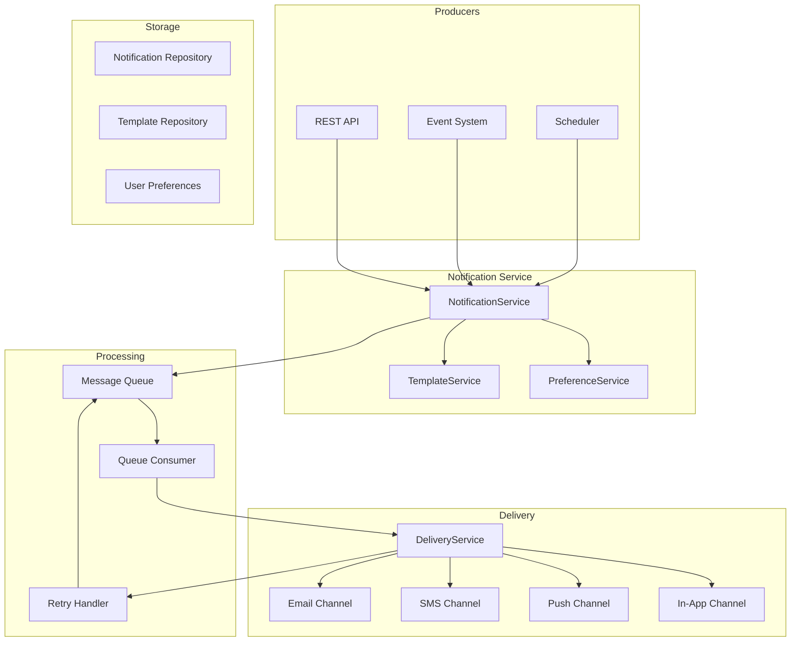
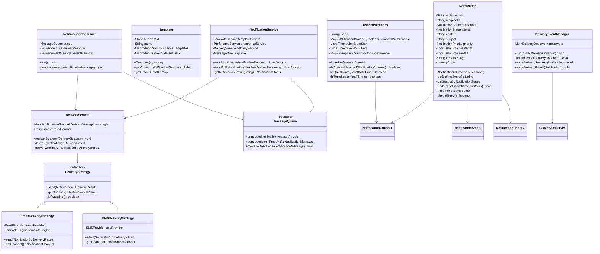

# Notification Service

## Project Overview

A Notification Service that handles sending notifications across multiple channels (Email, SMS, Push, In-App) with template management, queue-based processing, and delivery tracking. This enterprise project introduces the Strategy pattern for channel selection, the Observer pattern for delivery tracking, and the Template Method pattern for notification processing. Students will design a scalable, reliable notification system.

## Learning Outcomes

- Implement the Strategy pattern for multi-channel delivery
- Use the Observer pattern for delivery status tracking
- Apply the Template Method pattern for notification processing
- Design queue-based asynchronous processing
- Implement retry mechanisms with exponential backoff
- Design for delivery guarantees (at-least-once, exactly-once)
- Implement template engines

## Requirements

### Functional Requirements

| ID | Requirement | Priority |
|----|-------------|----------|
| FR01 | Send notifications via Email | Must |
| FR02 | Send notifications via SMS | Must |
| FR03 | Send push notifications to mobile | Must |
| FR04 | Template-based notification content | Must |
| FR05 | Delivery status tracking | Must |
| FR06 | Retry failed notifications | Must |
| FR07 | Notification scheduling | Should |
| FR08 | User preference management | Should |
| FR09 | Batch notification support | Could |
| FR10 | Notification analytics | Could |

### Non-Functional Requirements

| ID | Requirement |
|----|-------------|
| NFR01 | Process 100,000+ notifications per hour |
| NFR02 | Email delivery < 5 seconds |
| NFR03 | SMS delivery < 10 seconds |
| NFR04 | 99.9% delivery success rate |
| NFR05 | Support notification preferences |

## Architecture



## Package Structure

```
notification-service/
├── README.md
├── src/
│   └── main/
│       └── java/
│           └── com/
│               └── academy/
│                   └── notification/
│                       ├── Main.java
│                       ├── model/
│                       │   ├── Notification.java
│                       │   ├── Template.java
│                       │   ├── UserPreferences.java
│                       │   ├── NotificationRequest.java
│                       │   ├── DeliveryResult.java
│                       │   └── enums/
│                       │       ├── NotificationChannel.java
│                       │       ├── NotificationStatus.java
│                       │       ├── NotificationPriority.java
│                       │       └── DeliveryStatus.java
│                       ├── strategy/
│                       │   ├── DeliveryStrategy.java
│                       │   ├── EmailDeliveryStrategy.java
│                       │   ├── SMSDeliveryStrategy.java
│                       │   ├── PushDeliveryStrategy.java
│                       │   └── InAppDeliveryStrategy.java
│                       ├── template/
│                       │   ├── TemplateEngine.java
│                       │   ├── MustacheTemplateEngine.java
│                       │   ├── TemplateService.java
│                       │   └── RenderedContent.java
│                       ├── queue/
│                       │   ├── MessageQueue.java
│                       │   ├── InMemoryMessageQueue.java
│                       │   ├── NotificationMessage.java
│                       │   └── NotificationConsumer.java
│                       ├── observer/
│                       │   ├── DeliveryObserver.java
│                       │   ├── DeliveryEventManager.java
│                       │   ├── StatusChangeHandler.java
│                       │   └── AnalyticsHandler.java
│                       ├── service/
│                       │   ├── NotificationService.java
│                       │   ├── DeliveryService.java
│                       │   ├── PreferenceService.java
│                       │   └── TemplateRepository.java
│                       └── exception/
│                           ├── NotificationException.java
│                           ├── DeliveryFailedException.java
│                           ├── TemplateNotFoundException.java
│                           └── NoEnabledChannelException.java
└── src/
    └── test/
        └── java/
            └── com/
                └── academy/
                    └── notification/
                        ├── NotificationServiceTest.java
                        ├── DeliveryServiceTest.java
                        ├── TemplateEngineTest.java
                        └── QueueTest.java
```

## Class Diagram



---

**[Continue to Part 2: Implementation Guide →](README-part2.md)**