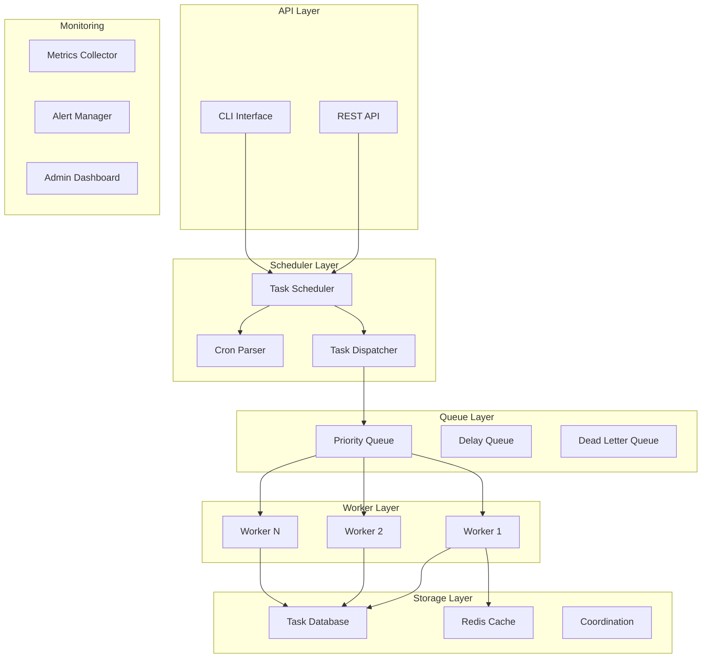

# Task Scheduler

## Project Overview

A Task Scheduler system that handles task scheduling, cron-based execution, queue management, and distributed worker processing. This enterprise project introduces the Observer pattern for task lifecycle events, the Strategy pattern for scheduling algorithms, and the Command pattern for task execution. Students will design a system that handles reliable task execution at scale.

## Learning Outcomes

- Implement the Observer pattern for task lifecycle events
- Use the Strategy pattern for different scheduling algorithms
- Apply the Command pattern for task execution and retry
- Design distributed task processing
- Implement cron expression parsing
- Handle task dependencies and priorities
- Design for fault tolerance and recovery

## Requirements

### Functional Requirements

| ID | Requirement | Priority |
|----|-------------|----------|
| FR01 | Schedule tasks with cron expressions | Must |
| FR02 | One-time and recurring task support | Must |
| FR03 | Task priority and dependency management | Must |
| FR04 | Distributed worker processing | Must |
| FR05 | Task retry with exponential backoff | Must |
| FR06 | Task status monitoring and history | Must |
| FR07 | Task cancellation and pausing | Should |
| FR08 | Resource quota management | Could |
| FR09 | Task chaining and workflows | Could |
| FR10 | Admin dashboard | Could |

### Non-Functional Requirements

| ID | Requirement |
|----|-------------|
| NFR01 | Handle 10,000+ scheduled tasks |
| NFR02 | Task execution latency < 1 second |
| NFR03 | At-least-once execution guarantee |
| NFR04 | Graceful shutdown with task completion |
| NFR05 | Horizontal scalability |

## Architecture



## Package Structure

```
task-scheduler/
├── README.md
├── src/
│   └── main/
│       └── java/
│           └── com/
│               └── academy/
│                   └── scheduler/
│                       ├── Main.java
│                       ├── model/
│                       │   ├── Task.java
│                       │   ├── TaskExecution.java
│                       │   ├── Worker.java
│                       │   ├── CronExpression.java
│                       │   ├── TaskDependency.java
│                       │   └── enums/
│                       │       ├── TaskStatus.java
│                       │       ├── TaskPriority.java
│                       │       ├── WorkerStatus.java
│                       │       └── ExecutionResult.java
│                       ├── cron/
│                       │   ├── CronParser.java
│                       │   ├── CronValidator.java
│                       │   └── NextExecutionCalculator.java
│                       ├── scheduler/
│                       │   ├── TaskScheduler.java
│                       │   ├── SchedulerStrategy.java
│                       │   ├── FixedRateStrategy.java
│                       │   ├── FixedDelayStrategy.java
│                       │   └── CronStrategy.java
│                       ├── queue/
│                       │   ├── TaskQueue.java
│                       │   ├── PriorityQueue.java
│                       │   ├── DelayQueue.java
│                       │   └── DeadLetterQueue.java
│                       ├── worker/
│                       │   ├── WorkerManager.java
│                       │   ├── TaskWorker.java
│                       │   ├── WorkerRegistry.java
│                       │   └── LoadBalancer.java
│                       ├── observer/
│                       │   ├── TaskObserver.java
│                       │   ├── TaskEventManager.java
│                       │   ├── StatusChangeHandler.java
│                       │   ├── MetricsCollector.java
│                       │   └── AlertHandler.java
│                       ├── command/
│                       │   ├── TaskCommand.java
│                       │   ├── ExecuteTaskCommand.java
│                       │   ├── RetryTaskCommand.java
│                       │   └── CancelTaskCommand.java
│                       ├── service/
│                       │   ├── TaskService.java
│                       │   ├── SchedulerService.java
│                       │   ├── WorkerService.java
│                       │   └── HistoryService.java
│                       ├── dependency/
│                       │   ├── DependencyResolver.java
│                       │   ├── DAGResolver.java
│                       │   └── DependencyGraph.java
│                       └── exception/
│                           ├── TaskNotFoundException.java
│                           ├── WorkerUnavailableException.java
│                           ├── Cron ParseException.java
│                           └── DependencyCycleException.java
└── src/
    └── test/
        └── java/
            └── com/
                └── academy/
                    └── scheduler/
                        ├── TaskSchedulerTest.java
                        ├── CronParserTest.java
                        ├── WorkerManagerTest.java
                        └── DependencyResolverTest.java
```

## Class Diagram

```mermaid
classDiagram
    class Task {
        -String taskId
        -String name
        -String description
        -TaskPriority priority
        -TaskStatus status
        -String cronExpression
        -LocalDateTime nextExecution
        -LocalDateTime lastExecution
        -int maxRetries
        -int retryCount
        -Duration timeout
        -Map~String,String~ metadata
        -List~String~ dependencies
        +Task(id, name, cronExpression)
        +getTaskId() String
        +getStatus() TaskStatus
        +updateStatus(TaskStatus) void
        +shouldRetry() boolean
        +getNextExecutionTime() LocalDateTime
    }
    
    class TaskExecution {
        -String executionId
        -String taskId
        -String workerId
        -TaskStatus status
        -LocalDateTime startTime
        -LocalDateTime endTime
        -String result
        -String errorMessage
        -int attemptNumber
        +TaskExecution(taskId, workerId)
        +getExecutionId() String
        +start() void
        -complete(String result) void
        -fail(String error) void
        +getDuration() Duration
    }
    
    class Worker {
        -String workerId
        -String hostname
        -WorkerStatus status
        -int maxConcurrentTasks
        -int currentLoad
        -List~TaskExecution~ activeExecutions
        -LocalDateTime lastHeartbeat
        +Worker(id, hostname, maxTasks)
        +getWorkerId() String
        +isAvailable() boolean
        +canAcceptTask() boolean
        +assignTask(Task) TaskExecution
        +completeExecution(String executionId) void
        +updateHeartbeat() void
    }
    
    class CronExpression {
        -String expression
        -CronField seconds
        -CronField minutes
        -CronField hours
        -CronField dayOfMonth
        -CronField month
        -CronField dayOfWeek
        +CronExpression(String expression)
        +isValid() boolean
        +getNextExecution(LocalDateTime) LocalDateTime
        +isMatching(LocalDateTime) boolean
    }
    
    class TaskQueue {
        -PriorityBlockingQueue~Task~ queue
        -Map~String,Task~ taskIndex
        +enqueue(Task) void
        +dequeue() Task
        +remove(String taskId) boolean
        +peek() Task
        +size() int
        +contains(String taskId) boolean
    }
    
    class TaskScheduler {
        -TaskQueue queue
        -WorkerManager workerManager
        -TaskEventManager eventManager
        -Map~String,SchedulerStrategy~ strategies
        +scheduleTask(Task) void
        +unscheduleTask(String taskId) void
        +triggerTask(String taskId) void
        +pauseTask(String taskId) void
        +resumeTask(String taskId) void
        +getScheduledTasks() List~Task~
    }
    
    class SchedulerStrategy {
        <<interface>>
        +calculateNextExecution(Task) LocalDateTime
        +shouldExecute(Task) boolean
    }
    
    class CronStrategy {
        -CronParser parser
        +calculateNextExecution(Task) LocalDateTime
        +shouldExecute(Task) boolean
    }
    
    class FixedRateStrategy {
        -Duration interval
        +calculateNextExecution(Task) LocalDateTime
        +shouldExecute(Task) boolean
    }
    
    class WorkerManager {
        -Map~String,Worker~ workers
        -LoadBalancer loadBalancer
        +registerWorker(Worker) void
        +unregisterWorker(String workerId) void
        +getAvailableWorker() Worker
        +getAllWorkers() List~Worker~
        +updateWorkerStatus(String workerId, WorkerStatus) void
        +distributeTask(Task) TaskExecution
    }
    
    class TaskObserver {
        <<interface>>
        +onTaskScheduled(Task) void
        +onTaskStarted(Task, TaskExecution) void
        +onTaskCompleted(Task, TaskExecution) void
        +onTaskFailed(Task, TaskExecution) void
        +onTaskRetrying(Task, int attempt) void
    }
    
    class TaskEventManager {
        -Map~String,List~TaskObserver~~ observers
        +subscribe(String taskId, TaskObserver) void
        +unsubscribe(String taskId, TaskObserver) void
        +notifyTaskScheduled(Task) void
        +notifyTaskStarted(Task, TaskExecution) void
        +notifyTaskCompleted(Task, TaskExecution) void
        +notifyTaskFailed(Task, TaskExecution) void
    }
    
    class DependencyResolver {
        -DependencyGraph graph
        +resolveDependencies(Task) List~Task~
        +hasCycle(String taskId) boolean
        +getReadyTasks(List~Task~) List~Task~
        +markComplete(String taskId) void
    }
    
    class DependencyGraph {
        -Map~String,Set~String~~ adjacencyList
        +addDependency(String taskId, String dependsOn) void
        +removeDependency(String taskId, String dependsOn) void
        +getDependencies(String taskId) Set~String~
        +getDependents(String taskId) Set~String~
        +topologicalSort() List~String~
    }
    
    Task --> TaskStatus
    Task --> TaskPriority
    TaskExecution --> TaskStatus
    Worker --> WorkerStatus
    TaskScheduler --> TaskQueue
    TaskScheduler --> WorkerManager
    TaskScheduler --> TaskEventManager
    TaskScheduler --> SchedulerStrategy
    SchedulerStrategy <|.. CronStrategy
    SchedulerStrategy <|.. FixedRateStrategy
    WorkerManager --> Worker
    TaskEventManager --> TaskObserver
    DependencyResolver --> DependencyGraph
```



---

**[Continue to Part 2: Implementation Guide →](README-part2.md)**