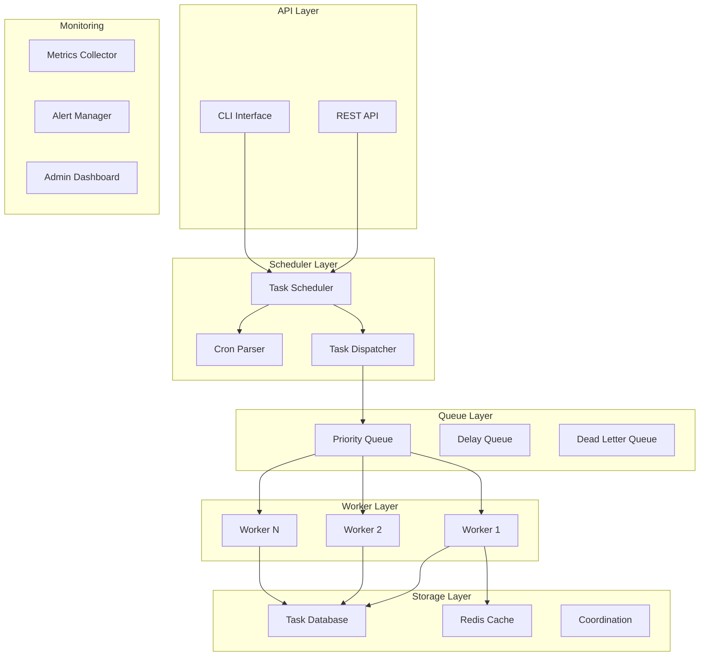

# Task Scheduler

## Project Overview

A Task Scheduler system that handles task scheduling, cron-based execution, queue management, and distributed worker processing. This enterprise project introduces the Observer pattern for task lifecycle events, the Strategy pattern for scheduling algorithms, and the Command pattern for task execution. Students will design a system that handles reliable task execution at scale.

## Learning Outcomes

- Implement the Observer pattern for task lifecycle events
- Use the Strategy pattern for different scheduling algorithms
- Apply the Command pattern for task execution and retry
- Design distributed task processing
- Implement cron expression parsing
- Handle task dependencies and priorities
- Design for fault tolerance and recovery

## Requirements

### Functional Requirements

| ID | Requirement | Priority |
|----|-------------|----------|
| FR01 | Schedule tasks with cron expressions | Must |
| FR02 | One-time and recurring task support | Must |
| FR03 | Task priority and dependency management | Must |
| FR04 | Distributed worker processing | Must |
| FR05 | Task retry with exponential backoff | Must |
| FR06 | Task status monitoring and history | Must |
| FR07 | Task cancellation and pausing | Should |
| FR08 | Resource quota management | Could |
| FR09 | Task chaining and workflows | Could |
| FR10 | Admin dashboard | Could |

### Non-Functional Requirements

| ID | Requirement |
|----|-------------|
| NFR01 | Handle 10,000+ scheduled tasks |
| NFR02 | Task execution latency < 1 second |
| NFR03 | At-least-once execution guarantee |
| NFR04 | Graceful shutdown with task completion |
| NFR05 | Horizontal scalability |

## Architecture



## Package Structure

```
task-scheduler/
├── README.md
├── src/
│   └── main/
│       └── java/
│           └── com/
│               └── academy/
│                   └── scheduler/
│                       ├── Main.java
│                       ├── model/
│                       │   ├── Task.java
│                       │   ├── TaskExecution.java
│                       │   ├── Worker.java
│                       │   ├── CronExpression.java
│                       │   ├── TaskDependency.java
│                       │   └── enums/
│                       │       ├── TaskStatus.java
│                       │       ├── TaskPriority.java
│                       │       ├── WorkerStatus.java
│                       │       └── ExecutionResult.java
│                       ├── cron/
│                       │   ├── CronParser.java
│                       │   ├── CronValidator.java
│                       │   └── NextExecutionCalculator.java
│                       ├── scheduler/
│                       │   ├── TaskScheduler.java
│                       │   ├── SchedulerStrategy.java
│                       │   ├── FixedRateStrategy.java
│                       │   ├── FixedDelayStrategy.java
│                       │   └── CronStrategy.java
│                       ├── queue/
│                       │   ├── TaskQueue.java
│                       │   ├── PriorityQueue.java
│                       │   ├── DelayQueue.java
│                       │   └── DeadLetterQueue.java
│                       ├── worker/
│                       │   ├── WorkerManager.java
│                       │   ├── TaskWorker.java
│                       │   ├── WorkerRegistry.java
│                       │   └── LoadBalancer.java
│                       ├── observer/
│                       │   ├── TaskObserver.java
│                       │   ├── TaskEventManager.java
│                       │   ├── StatusChangeHandler.java
│                       │   ├── MetricsCollector.java
│                       │   └── AlertHandler.java
│                       ├── command/
│                       │   ├── TaskCommand.java
│                       │   ├── ExecuteTaskCommand.java
│                       │   ├── RetryTaskCommand.java
│                       │   └── CancelTaskCommand.java
│                       ├── service/
│                       │   ├── TaskService.java
│                       │   ├── SchedulerService.java
│                       │   ├── WorkerService.java
│                       │   └── HistoryService.java
│                       ├── dependency/
│                       │   ├── DependencyResolver.java
│                       │   ├── DAGResolver.java
│                       │   └── DependencyGraph.java
│                       └── exception/
│                           ├── TaskNotFoundException.java
│                           ├── WorkerUnavailableException.java
│                           ├── Cron ParseException.java
│                           └── DependencyCycleException.java
└── src/
    └── test/
        └── java/
            └── com/
                └── academy/
                    └── scheduler/
                        ├── TaskSchedulerTest.java
                        ├── CronParserTest.java
                        ├── WorkerManagerTest.java
                        └── DependencyResolverTest.java
```

## Class Diagram


## Implementation Guide

### Step 1: Implement Cron Parser

```java
package com.academy.scheduler.cron;

import java.time.LocalDateTime;
import java.util.*;

public class CronExpression {
    private final String expression;
    private final CronField seconds;
    private final CronField minutes;
    private final CronField hours;
    private final CronField dayOfMonth;
    private final CronField month;
    private final CronField dayOfWeek;

    public CronExpression(String expression) {
        this.expression = expression;
        String[] parts = expression.split("\\s+");
        validate(parts);
        
        this.seconds = new CronField(parts[0], 0, 59);
        this.minutes = new CronField(parts[1], 0, 59);
        this.hours = new CronField(parts[2], 0, 23);
        this.dayOfMonth = new CronField(parts[3], 1, 31);
        this.month = new CronField(parts[4], 1, 12);
        this.dayOfWeek = new CronField(parts[5], 0, 7);
    }

    public LocalDateTime getNextExecution(LocalDateTime from) {
        LocalDateTime next = from.plusSeconds(1);
        next = next.withSecond(0).withNano(0);

        while (!isMatching(next)) {
            next = next.plusMinutes(1);
            if (next.getYear() > from.getYear() + 1) {
                throw new RuntimeException("No valid execution time found");
            }
        }

        return next;
    }

    public boolean isMatching(LocalDateTime dateTime) {
        return seconds.matches(dateTime.getSecond()) &&
               minutes.matches(dateTime.getMinute()) &&
               hours.matches(dateTime.getHour()) &&
               dayOfMonth.matches(dateTime.getDayOfMonth()) &&
               month.matches(dateTime.getMonthValue()) &&
               dayOfWeek.matches(dateTime.getDayOfWeek().getValue() % 7);
    }
}

class CronField {
    private final Set<Integer> values;
    private final int min;
    private final int max;

    public CronField(String field, int min, int max) {
        this.min = min;
        this.max = max;
        this.values = parseField(field);
    }

    private Set<Integer> parseField(String field) {
        Set<Integer> result = new TreeSet<>();
        
        if (field.equals("*")) {
            for (int i = min; i <= max; i++) {
                result.add(i);
            }
        } else if (field.contains(",")) {
            for (String part : field.split(",")) {
                result.addAll(parsePart(part));
            }
        } else if (field.contains("-")) {
            String[] range = field.split("-");
            int start = Integer.parseInt(range[0]);
            int end = Integer.parseInt(range[1]);
            for (int i = start; i <= end; i++) {
                result.add(i);
            }
        } else if (field.contains("/")) {
            String[] parts = field.split("/");
            int start = Integer.parseInt(parts[0]);
            int increment = Integer.parseInt(parts[1]);
            for (int i = start; i <= max; i += increment) {
                result.add(i);
            }
        } else {
            result.add(Integer.parseInt(field));
        }
        
        return result;
    }

    public boolean matches(int value) {
        return values.contains(value);
    }
}
```

### Step 2: Implement Scheduler with Strategy Pattern

```java
package com.academy.scheduler.scheduler;

import java.time.LocalDateTime;

public interface SchedulerStrategy {
    LocalDateTime calculateNextExecution(Task task);
    boolean shouldExecute(Task task);
}

package com.academy.scheduler.scheduler;

public class CronStrategy implements SchedulerStrategy {
    private final CronParser parser;

    @Override
    public LocalDateTime calculateNextExecution(Task task) {
        CronExpression cron = parser.parse(task.getCronExpression());
        return cron.getNextExecution(LocalDateTime.now());
    }

    @Override
    public boolean shouldExecute(Task task) {
        if (task.getNextExecution() == null) {
            return true;
        }
        return LocalDateTime.now().isAfter(task.getNextExecution());
    }
}

public class FixedRateStrategy implements SchedulerStrategy {
    private final Duration interval;

    public FixedRateStrategy(Duration interval) {
        this.interval = interval;
    }

    @Override
    public LocalDateTime calculateNextExecution(Task task) {
        LocalDateTime lastExec = task.getLastExecution();
        if (lastExec == null) {
            return LocalDateTime.now();
        }
        return lastExec.plus(interval);
    }

    @Override
    public boolean shouldExecute(Task task) {
        LocalDateTime next = calculateNextExecution(task);
        return LocalDateTime.now().isAfter(next);
    }
}

package com.academy.scheduler.scheduler;

public class TaskScheduler {
    private final TaskQueue queue;
    private final WorkerManager workerManager;
    private final TaskEventManager eventManager;
    private final Map<String, SchedulerStrategy> strategies;
    private final ScheduledExecutorService schedulerExecutor;

    public TaskScheduler() {
        this.queue = new PriorityBlockingQueue<>();
        this.workerManager = new WorkerManager();
        this.eventManager = new TaskEventManager();
        this.strategies = new HashMap<>();
        this.schedulerExecutor = Executors.newScheduledThreadPool(1);
        
        strategies.put("cron", new CronStrategy());
        strategies.put("fixed-rate", new FixedRateStrategy(Duration.ofMinutes(5)));
        strategies.put("fixed-delay", new FixedDelayStrategy(Duration.ofMinutes(5)));
        
        startSchedulerLoop();
    }

    private void startSchedulerLoop() {
        schedulerExecutor.scheduleAtFixedRate(() -> {
            List<Task> readyTasks = getReadyTasks();
            for (Task task : readyTasks) {
                dispatchTask(task);
            }
        }, 0, 1, TimeUnit.SECONDS);
    }

    private List<Task> getReadyTasks() {
        return queue.stream()
            .filter(task -> {
                SchedulerStrategy strategy = strategies.get(task.getScheduleType());
                return strategy != null && strategy.shouldExecute(task);
            })
            .collect(Collectors.toList());
    }

    private void dispatchTask(Task task) {
        Worker worker = workerManager.getAvailableWorker();
        if (worker == null) {
            return;
        }

        try {
            TaskExecution execution = worker.assignTask(task);
            eventManager.notifyTaskStarted(task, execution);
            
            task.setNextExecution(strategies.get(task.getScheduleType())
                .calculateNextExecution(task));
            
        } catch (Exception e) {
            eventManager.notifyTaskFailed(task, null);
            if (task.shouldRetry()) {
                scheduleRetry(task);
            }
        }
    }

    public void scheduleTask(Task task) {
        SchedulerStrategy strategy = strategies.get(task.getScheduleType());
        task.setNextExecution(strategy.calculateNextExecution(task));
        queue.enqueue(task);
        eventManager.notifyTaskScheduled(task);
    }

    public void unscheduleTask(String taskId) {
        queue.remove(taskId);
    }
}
```

### Step 3: Implement Worker Manager

```java
package com.academy.scheduler.worker;

import java.util.concurrent.ConcurrentHashMap;

public class WorkerManager {
    private final ConcurrentHashMap<String, Worker> workers;
    private final LoadBalancer loadBalancer;
    private final ScheduledExecutorService heartbeatChecker;

    public WorkerManager() {
        this.workers = new ConcurrentHashMap<>();
        this.loadBalancer = new RoundRobinLoadBalancer();
        this.heartbeatChecker = Executors.newSingleThreadScheduledExecutor();
        
        startHeartbeatChecker();
    }

    private void startHeartbeatChecker() {
        heartbeatChecker.scheduleAtFixedRate(() -> {
            LocalDateTime threshold = LocalDateTime.now().minusSeconds(30);
            workers.values().stream()
                .filter(w -> w.getLastHeartbeat().isBefore(threshold))
                .forEach(w -> {
                    w.setStatus(WorkerStatus.OFFLINE);
                    redistributeTasks(w);
                });
        }, 30, 30, TimeUnit.SECONDS);
    }

    public void registerWorker(Worker worker) {
        workers.put(worker.getWorkerId(), worker);
        worker.setStatus(WorkerStatus.ONLINE);
    }

    public Worker getAvailableWorker() {
        List<Worker> available = workers.values().stream()
            .filter(Worker::isAvailable)
            .filter(Worker::canAcceptTask)
            .collect(Collectors.toList());
        
        if (available.isEmpty()) {
            return null;
        }
        
        return loadBalancer.selectWorker(available);
    }

    public TaskExecution distributeTask(Task task) {
        Worker worker = getAvailableWorker();
        if (worker == null) {
            throw new WorkerUnavailableException("No available workers");
        }
        return worker.assignTask(task);
    }

    public void updateWorkerStatus(String workerId, WorkerStatus status) {
        Worker worker = workers.get(workerId);
        if (worker != null) {
            worker.setStatus(status);
            if (status == WorkerStatus.OFFLINE) {
                redistributeTasks(worker);
            }
        }
    }
}

interface LoadBalancer {
    Worker selectWorker(List<Worker> workers);
}

class RoundRobinLoadBalancer implements LoadBalancer {
    private final AtomicInteger index = new AtomicInteger(0);

    @Override
    public Worker selectWorker(List<Worker> workers) {
        int idx = Math.abs(index.getAndIncrement() % workers.size());
        return workers.get(idx);
    }
}
```

### Step 4: Implement Dependency Resolver

```java
package com.academy.scheduler.dependency;

import java.util.*;

public class DependencyGraph {
    private final Map<String, Set<String>> adjacencyList;
    private final Map<String, Set<String>> reverseAdjacencyList;

    public DependencyGraph() {
        this.adjacencyList = new HashMap<>();
        this.reverseAdjacencyList = new HashMap<>();
    }

    public void addDependency(String taskId, String dependsOn) {
        adjacencyList.computeIfAbsent(dependsOn, k -> new HashSet<>()).add(taskId);
        reverseAdjacencyList.computeIfAbsent(taskId, k -> new HashSet<>()).add(dependsOn);
    }

    public Set<String> getDependencies(String taskId) {
        return reverseAdjacencyList.getOrDefault(taskId, Collections.emptySet());
    }

    public List<String> topologicalSort() {
        List<String> result = new ArrayList<>();
        Set<String> visited = new HashSet<>();
        Set<String> recursionStack = new HashSet<>();

        for (String taskId : adjacencyList.keySet()) {
            if (!visited.contains(taskId)) {
                if (topologicalSortUtil(taskId, visited, recursionStack, result)) {
                    throw new DependencyCycleException("Cycle detected involving task: " + taskId);
                }
            }
        }

        return result;
    }

    private boolean topologicalSortUtil(String taskId, Set<String> visited, 
                                       Set<String> recursionStack, List<String> result) {
        visited.add(taskId);
        recursionStack.add(taskId);

        Set<String> dependencies = getDependencies(taskId);
        for (String dep : dependencies) {
            if (!visited.contains(dep)) {
                if (topologicalSortUtil(dep, visited, recursionStack, result)) {
                    return true;
                }
            } else if (recursionStack.contains(dep)) {
                return true;
            }
        }

        recursionStack.remove(taskId);
        result.add(taskId);
        return false;
    }
}

public class DependencyResolver {
    private final DependencyGraph graph;
    private final Set<String> completedTasks;

    public DependencyResolver() {
        this.graph = new DependencyGraph();
        this.completedTasks = new HashSet<>();
    }

    public List<Task> getReadyTasks(List<Task> allTasks) {
        return allTasks.stream()
            .filter(task -> !completedTasks.contains(task.getTaskId()))
            .filter(task -> areDependenciesMet(task))
            .collect(Collectors.toList());
    }

    private boolean areDependenciesMet(Task task) {
        Set<String> dependencies = graph.getDependencies(task.getTaskId());
        return completedTasks.containsAll(dependencies);
    }

    public void markComplete(String taskId) {
        completedTasks.add(taskId);
    }

    public void addDependency(String taskId, String dependsOn) {
        graph.addDependency(taskId, dependsOn);
    }
}
```

## Unit Tests

```java
package com.academy.scheduler;

import com.academy.scheduler.model.*;
import com.academy.scheduler.service.TaskScheduler;
import com.academy.scheduler.cron.CronExpression;
import com.academy.scheduler.worker.WorkerManager;
import com.academy.scheduler.dependency.DependencyResolver;
import org.junit.jupiter.api.BeforeEach;
import org.junit.jupiter.api.Test;
import java.time.LocalDateTime;
import java.time.Duration;
import static org.junit.jupiter.api.Assertions.*;

public class TaskSchedulerTest {
    private TaskScheduler scheduler;
    private WorkerManager workerManager;

    @BeforeEach
    void setUp() {
        scheduler = new TaskScheduler();
        workerManager = new WorkerManager();
    }

    @Test
    void testScheduleTask() {
        Task task = Task.builder()
            .taskId("task1")
            .name("Test Task")
            .cronExpression("0 * * * * *")
            .build();

        scheduler.scheduleTask(task);
        
        assertNotNull(scheduler.getTask("task1"));
        assertEquals(TaskStatus.SCHEDULED, scheduler.getTask("task1").getStatus());
    }

    @Test
    void testCronParsing() {
        CronExpression cron = new CronExpression("0 0 12 * * ?");
        
        LocalDateTime next = cron.getNextExecution(LocalDateTime.now());
        assertEquals(12, next.getHour());
        assertEquals(0, next.getMinute());
    }

    @Test
    void testWorkerRegistration() {
        Worker worker = new Worker("worker1", "host1", 10);
        workerManager.registerWorker(worker);
        
        Worker available = workerManager.getAvailableWorker();
        assertNotNull(available);
        assertEquals("worker1", available.getWorkerId());
    }

    @Test
    void testTaskPriority() {
        Task highPriority = Task.builder()
            .taskId("high")
            .priority(TaskPriority.HIGH)
            .build();
        
        Task lowPriority = Task.builder()
            .taskId("low")
            .priority(TaskPriority.LOW)
            .build();

        scheduler.scheduleTask(lowPriority);
        scheduler.scheduleTask(highPriority);
        
        Task next = scheduler.getNextTask();
        assertEquals("high", next.getTaskId());
    }

    @Test
    void testDependencyResolution() {
        DependencyResolver resolver = new DependencyResolver();
        
        resolver.addDependency("task2", "task1");
        resolver.addDependency("task3", "task2");
        
        List<Task> allTasks = Arrays.asList(
            createTask("task1"),
            createTask("task2"),
            createTask("task3")
        );
        
        List<Task> ready = resolver.getReadyTasks(allTasks);
        assertEquals(1, ready.size());
        assertEquals("task1", ready.get(0).getTaskId());
        
        resolver.markComplete("task1");
        ready = resolver.getReadyTasks(allTasks);
        assertEquals(1, ready.size());
        assertEquals("task2", ready.get(0).getTaskId());
    }

    @Test
    void testTaskRetry() {
        Task task = Task.builder()
            .taskId("retry-task")
            .maxRetries(3)
            .retryCount(0)
            .build();
        
        assertTrue(task.shouldRetry());
        task.incrementRetry();
        assertEquals(1, task.getRetryCount());
        assertTrue(task.shouldRetry());
        
        task.incrementRetry();
        task.incrementRetry();
        assertFalse(task.shouldRetry());
    }

    @Test
    void testCronExpressionMatching() {
        CronExpression everyMinute = new CronExpression("0 * * * * ?");
        
        LocalDateTime now = LocalDateTime.now();
        assertTrue(everyMinute.isMatching(now.withSecond(0)));
        assertFalse(everyMinute.isMatching(now.withSecond(30)));
    }
}
```

## Extension Challenges

1. **Workflow Engine**: Implement DAG-based task workflows with conditional branching
2. **Resource Quotas**: Limit concurrent tasks per user/organization
3. **Task Chaining**: Pass output of one task as input to the next
4. **Distributed Locking**: Implement distributed locks for singleton tasks
5. **Metrics Dashboard**: Real-time monitoring of task execution

## Interview Questions

1. **How would you ensure exactly-once task execution?**
   - Discuss idempotency keys, distributed locks, deduplication

2. **How would you handle task dependencies at scale?**
   - Discuss DAG representation, topological sorting, cycle detection

3. **What are the trade-offs of different scheduling strategies?**
   - Discuss cron vs fixed-rate vs event-driven scheduling

4. **How would you implement graceful shutdown?**
   - Discuss task completion, drain queues, worker coordination

5. **How would you design for multi-region deployment?**
   - Discuss data consistency, failover, region-aware scheduling

## References

- [Cron Expression Format](https://www.quartz-scheduler.org/documentation/quartz-2.3.0/crontrigger.html)
- [Distributed Task Scheduling](https://aws.amazon.com/blogs/compute/using-amazon-cloudwatch-events-to-schedule-tasks/)
- [Worker Pool Pattern](https://developer.confluent.io/patterns/worker-pool/)
