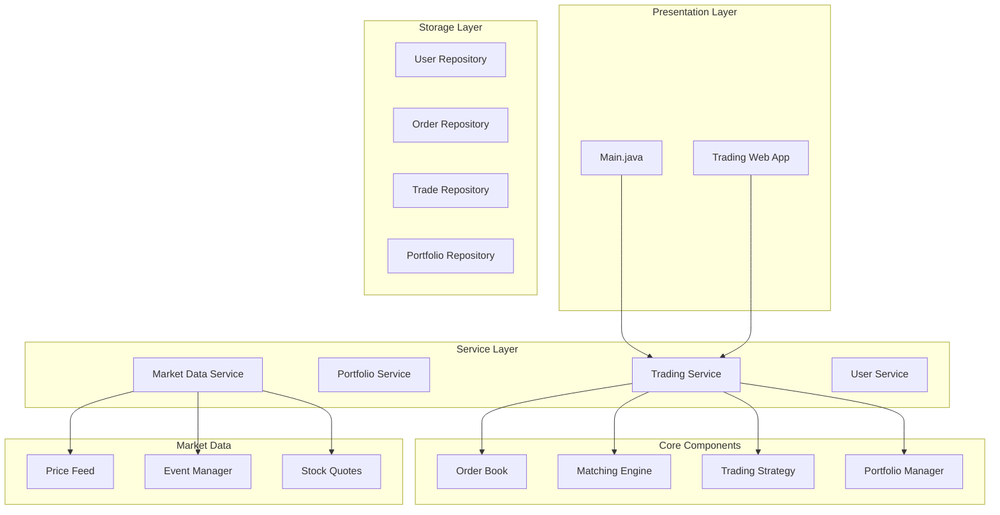
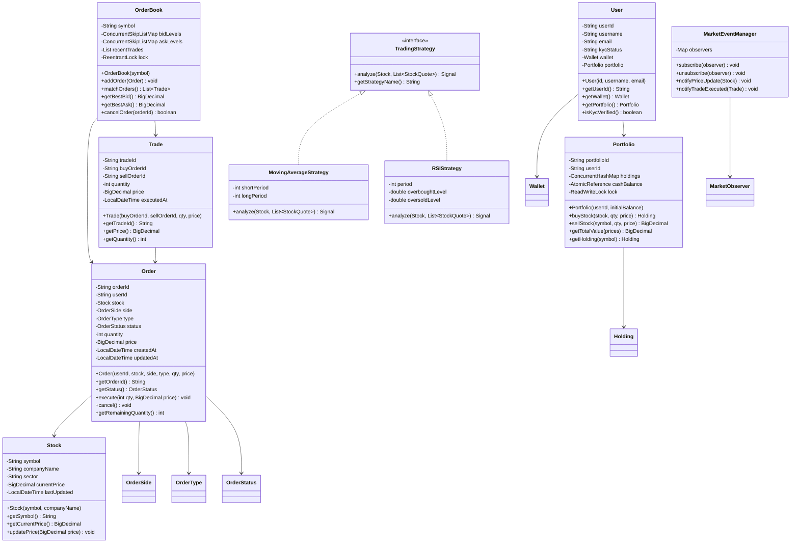

# Trading Platform

## Project Overview

A Trading Platform that handles stock trading, portfolio management, market data, and trading strategies. This enterprise project introduces the Observer pattern for real-time market updates, the Strategy pattern for trading algorithms, and the Command pattern for trade execution. Students will design a system that handles high-frequency operations with precision.

## Learning Outcomes

- Implement the Observer pattern for real-time market data
- Use the Strategy pattern for trading algorithms
- Apply the Command pattern for trade execution and undo
- Design for financial precision with BigDecimal
- Handle concurrent operations safely
- Implement audit logging for compliance
- Design event sourcing for trade history

## Requirements

### Functional Requirements

| ID | Requirement | Priority |
|----|-------------|----------|
| FR01 | User registration with KYC verification | Must |
| FR02 | Real-time stock quotes and market data | Must |
| FR03 | Place buy/sell orders (market, limit, stop) | Must |
| FR04 | Portfolio management with holdings tracking | Must |
| FR05 | Trade execution and settlement | Must |
| FR06 | Transaction history and reporting | Must |
| FR07 | Watchlist for stock monitoring | Should |
| FR08 | Technical indicators and charts | Could |
| FR09 | Algorithmic trading support | Could |
| FR10 | Paper trading (simulated) | Could |

### Non-Functional Requirements

| ID | Requirement |
|----|-------------|
| NFR01 | Financial precision (no rounding errors) |
| NFR02 | Trade execution < 100ms |
| NFR03 | Real-time updates < 1 second delay |
| NFR04 | Complete audit trail for compliance |
| NFR05 | Thread-safe portfolio operations |

## Architecture



## Package Structure

```
trading-platform/
├── README.md
├── src/
│   └── main/
│       └── java/
│           └── com/
│               └── academy/
│                   └── trading/
│                       ├── Main.java
│                       ├── model/
│                       │   ├── User.java
│                       │   ├── Stock.java
│                       │   ├── Order.java
│                       │   ├── Trade.java
│                       │   ├── Portfolio.java
│                       │   ├── Holding.java
│                       │   ├── StockQuote.java
│                       │   ├── Wallet.java
│                       │   └── enums/
│                       │       ├── OrderSide.java
│                       │       ├── OrderType.java
│                       │       ├── OrderStatus.java
│                       │       └── TradeStatus.java
│                       ├── orderbook/
│                       │   ├── OrderBook.java
│                       │   ├── MatchingEngine.java
│                       │   └── PriceLevel.java
│                       ├── strategy/
│                       │   ├── TradingStrategy.java
│                       │   ├── MovingAverageStrategy.java
│                       │   ├── RSIStrategy.java
│                       │   └── MACDStrategy.java
│                       ├── command/
│                       │   ├── TradeCommand.java
│                       │   ├── BuyCommand.java
│                       │   ├── SellCommand.java
│                       │   └── CommandHistory.java
│                       ├── observer/
│                       │   ├── MarketObserver.java
│                       │   ├── MarketEventManager.java
│                       │   ├── PriceAlertHandler.java
│                       │   └── TradeNotificationHandler.java
│                       ├── service/
│                       │   ├── TradingService.java
│                       │   ├── PortfolioService.java
│                       │   ├── MarketService.java
│                       │   ├── UserService.java
│                       │   └── SettlementService.java
│                       ├── repository/
│                       │   ├── UserRepository.java
│                       │   ├── OrderRepository.java
│                       │   ├── TradeRepository.java
│                       │   └── PortfolioRepository.java
│                       └── exception/
│                           ├── InsufficientFundsException.java
│                           ├── InsufficientSharesException.java
│                           ├── MarketClosedException.java
│                           └── InvalidOrderException.java
└── src/
    └── test/
        └── java/
            └── com/
                └── academy/
                    └── trading/
                        ├── TradingServiceTest.java
                        ├── OrderBookTest.java
                        ├── PortfolioTest.java
                        └── StrategyTest.java
```

## Class Diagram



---

**[Continue to Part 2: Implementation Guide →](README-part2.md)**