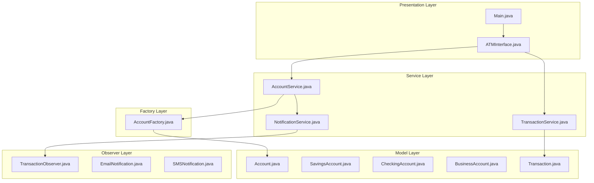
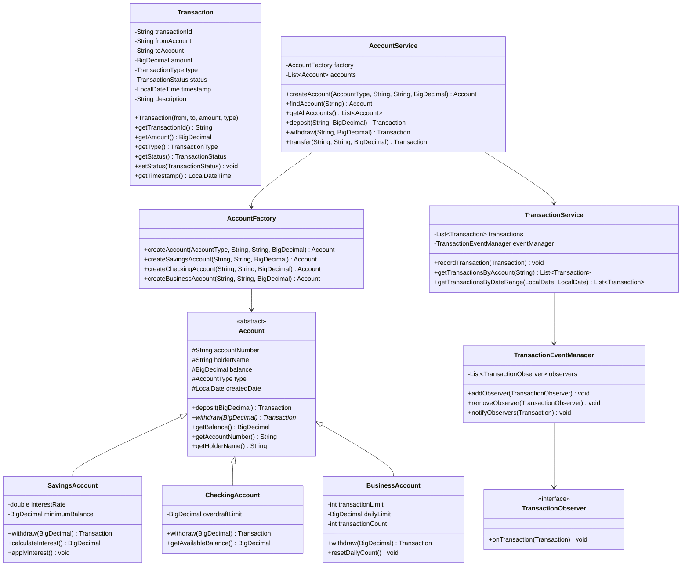

# Bank Management System

## Project Overview

A Bank Management System that simulates core banking operations including account management, transactions, transfers, and statement generation. This project introduces advanced OOP concepts including the Observer pattern for transaction notifications, the Factory pattern for account creation, and proper handling of financial calculations with precision.

## Learning Outcomes

- Implement the Factory pattern for creating different account types
- Use the Observer pattern for transaction notifications
- Handle financial calculations with BigDecimal for precision
- Implement transaction logging and audit trails
- Design for data integrity and consistency
- Practice interface-based programming
- Implement comprehensive validation

## Requirements

### Functional Requirements

| ID | Requirement | Priority |
|----|-------------|----------|
| FR01 | Create different account types (Savings, Checking, Business) | Must |
| FR02 | Deposit money with validation | Must |
| FR03 | Withdraw money with balance check | Must |
| FR04 | Transfer between accounts | Must |
| FR05 | Generate account statements | Must |
| FR06 | View transaction history | Must |
| FR07 | Calculate interest for savings accounts | Must |
| FR08 | Account balance inquiries | Should |
| FR09 | Transaction notifications | Should |
| FR10 | Monthly account statements | Could |

### Non-Functional Requirements

| ID | Requirement |
|----|-------------|
| NFR01 | Financial precision (no floating point errors) |
| NFR02 | Transaction atomicity (transfers are all-or-nothing) |
| NFR03 | Thread-safe balance operations |
| NFR04 | Immutable transaction records |

## Architecture



## Package Structure

```
bank-management/
├── README.md
├── src/
│   └── main/
│       └── java/
│           └── com/
│               └── academy/
│                   └── bank/
│                       ├── Main.java
│                       ├── model/
│                       │   ├── Account.java
│                       │   ├── SavingsAccount.java
│                       │   ├── CheckingAccount.java
│                       │   ├── BusinessAccount.java
│                       │   ├── Transaction.java
│                       │   └── enums/
│                       │       ├── AccountType.java
│                       │       ├── TransactionType.java
│                       │       └── TransactionStatus.java
│                       ├── factory/
│                       │   └── AccountFactory.java
│                       ├── service/
│                       │   ├── AccountService.java
│                       │   ├── TransactionService.java
│                       │   └── InterestCalculator.java
│                       ├── observer/
│                       │   ├── TransactionObserver.java
│                       │   ├── TransactionEventManager.java
│                       │   ├── EmailNotification.java
│                       │   └── SMSNotification.java
│                       ├── exception/
│                       │   ├── InsufficientFundsException.java
│                       │   ├── AccountNotFoundException.java
│                       │   └── InvalidTransactionException.java
│                       └── util/
│                           └── BigDecimalUtils.java
└── src/
    └── test/
        └── java/
            └── com/
                └── academy/
                    └── bank/
                        ├── AccountServiceTest.java
                        ├── TransactionServiceTest.java
                        └── AccountFactoryTest.java
```

## Class Diagram



## Implementation Guide

### Step 1: Create Transaction Model with BigDecimal

```java
package com.academy.bank.model;

import java.math.BigDecimal;
import java.time.LocalDateTime;
import java.util.UUID;

public class Transaction {
    private final String transactionId;
    private final String fromAccount;
    private final String toAccount;
    private final BigDecimal amount;
    private final TransactionType type;
    private TransactionStatus status;
    private final LocalDateTime timestamp;
    private final String description;

    public Transaction(String from, String to, BigDecimal amount, TransactionType type) {
        this.transactionId = UUID.randomUUID().toString();
        this.fromAccount = from;
        this.toAccount = to;
        this.amount = amount;
        this.type = type;
        this.status = TransactionStatus.PENDING;
        this.timestamp = LocalDateTime.now();
    }

    public void complete() {
        this.status = TransactionStatus.COMPLETED;
    }

    public void fail() {
        this.status = TransactionStatus.FAILED;
    }
}
```

### Step 2: Implement Account Factory

```java
package com.academy.bank.factory;

import com.academy.bank.model.*;
import com.academy.bank.model.enums.AccountType;
import java.math.BigDecimal;

public class AccountFactory {
    
    public Account createAccount(AccountType type, String accountNumber, 
                                 String holderName, BigDecimal initialDeposit) {
        switch (type) {
            case SAVINGS:
                return createSavingsAccount(accountNumber, holderName, initialDeposit);
            case CHECKING:
                return createCheckingAccount(accountNumber, holderName, initialDeposit);
            case BUSINESS:
                return createBusinessAccount(accountNumber, holderName, initialDeposit);
            default:
                throw new IllegalArgumentException("Unknown account type: " + type);
        }
    }

    private Account createSavingsAccount(String number, String name, BigDecimal deposit) {
        SavingsAccount account = new SavingsAccount(number, name, deposit);
        account.setInterestRate(2.5);
        account.setMinimumBalance(new BigDecimal("100.00"));
        return account;
    }

    private Account createCheckingAccount(String number, String name, BigDecimal deposit) {
        CheckingAccount account = new CheckingAccount(number, name, deposit);
        account.setOverdraftLimit(new BigDecimal("500.00"));
        return account;
    }

    private Account createBusinessAccount(String number, String name, BigDecimal deposit) {
        BusinessAccount account = new BusinessAccount(number, name, deposit);
        account.setDailyLimit(new BigDecimal("10000.00"));
        account.setTransactionLimit(50);
        return account;
    }
}
```

### Step 3: Implement Observer Pattern

```java
package com.academy.bank.observer;

import com.academy.bank.model.Transaction;

public interface TransactionObserver {
    void onTransaction(Transaction transaction);
}

package com.academy.bank.observer;

import java.util.ArrayList;
import java.util.List;

public class TransactionEventManager {
    private final List<TransactionObserver> observers = new ArrayList<>();

    public void addObserver(TransactionObserver observer) {
        observers.add(observer);
    }

    public void removeObserver(TransactionObserver observer) {
        observers.remove(observer);
    }

    public void notifyObservers(Transaction transaction) {
        for (TransactionObserver observer : observers) {
            observer.onTransaction(transaction);
        }
    }
}

package com.academy.bank.observer;

public class EmailNotification implements TransactionObserver {
    @Override
    public void onTransaction(Transaction transaction) {
        System.out.println("Email: Transaction " + transaction.getTransactionId() + 
                          " - Amount: $" + transaction.getAmount());
    }
}
```

### Step 4: Implement AccountService with Transfer Logic

```java
package com.academy.bank.service;

import com.academy.bank.model.*;
import com.academy.bank.exception.*;
import java.math.BigDecimal;
import java.util.List;

public class AccountService {
    private final AccountFactory factory;
    private final List<Account> accounts;
    private final TransactionService transactionService;

    public AccountService() {
        this.factory = new AccountFactory();
        this.accounts = new ArrayList<>();
        this.transactionService = new TransactionService();
    }

    public synchronized Transaction transfer(String fromNumber, String toNumber, BigDecimal amount) 
            throws InsufficientFundsException, AccountNotFoundException {
        
        Account fromAccount = findAccount(fromNumber);
        Account toAccount = findAccount(toNumber);

        Transaction withdrawTx = fromAccount.withdraw(amount);
        Transaction depositTx = toAccount.deposit(amount);

        transactionService.recordTransaction(withdrawTx);
        transactionService.recordTransaction(depositTx);

        return withdrawTx;
    }
}
```

## Unit Tests

```java
package com.academy.bank;

import com.academy.bank.model.*;
import com.academy.bank.model.enums.*;
import com.academy.bank.service.AccountService;
import com.academy.bank.exception.*;
import org.junit.jupiter.api.BeforeEach;
import org.junit.jupiter.api.Test;
import java.math.BigDecimal;
import static org.junit.jupiter.api.Assertions.*;

public class AccountServiceTest {
    private AccountService service;

    @BeforeEach
    void setUp() {
        service = new AccountService();
    }

    @Test
    void testCreateSavingsAccount() {
        Account account = service.createAccount(AccountType.SAVINGS, "ACC001", 
                                                "John Doe", new BigDecimal("1000.00"));
        assertNotNull(account);
        assertEquals(new BigDecimal("1000.00"), account.getBalance());
    }

    @Test
    void testDeposit() throws Exception {
        service.createAccount(AccountType.SAVINGS, "ACC001", "John Doe", new BigDecimal("1000.00"));
        Transaction tx = service.deposit("ACC001", new BigDecimal("500.00"));
        assertEquals(new BigDecimal("1500.00"), service.findAccount("ACC001").getBalance());
    }

    @Test
    void testWithdrawInsufficientFunds() {
        service.createAccount(AccountType.SAVINGS, "ACC001", "John Doe", new BigDecimal("100.00"));
        assertThrows(InsufficientFundsException.class, () -> {
            service.withdraw("ACC001", new BigDecimal("500.00"));
        });
    }

    @Test
    void testTransfer() throws Exception {
        service.createAccount(AccountType.SAVINGS, "ACC001", "John", new BigDecimal("1000.00"));
        service.createAccount(AccountType.SAVINGS, "ACC002", "Jane", new BigDecimal("500.00"));
        
        service.transfer("ACC001", "ACC002", new BigDecimal("200.00"));
        
        assertEquals(new BigDecimal("800.00"), service.findAccount("ACC001").getBalance());
        assertEquals(new BigDecimal("700.00"), service.findAccount("ACC002").getBalance());
    }

    @Test
    void testSavingsInterestCalculation() throws Exception {
        Account account = service.createAccount(AccountType.SAVINGS, "ACC001", 
                                                "John", new BigDecimal("10000.00"));
        SavingsAccount savings = (SavingsAccount) account;
        BigDecimal interest = savings.calculateInterest();
        assertEquals(new BigDecimal("250.00"), interest);
    }
}
```

## Extension Challenges

1. **Overdraft Protection**: Implement overdraft protection with configurable limits
2. **Recurring Transactions**: Support scheduled/recurring transfers
3. **Multi-Currency**: Support multiple currencies with exchange rates
4. **Account Statements**: Generate PDF-formatted monthly statements
5. **Fraud Detection**: Implement basic fraud detection rules

## Interview Questions

1. **Why use BigDecimal instead of double for financial calculations?**
   - Discuss floating point precision issues and financial accuracy requirements

2. **How would you ensure transaction atomicity in a distributed system?**
   - Discuss two-phase commit, saga pattern, eventual consistency

3. **What are the benefits of the Factory pattern here?**
   - Discuss encapsulation of creation logic, easy addition of new account types

4. **How would you handle concurrent transfers between the same accounts?**
   - Discuss locking strategies, optimistic vs pessimistic locking

5. **How would you redesign for a real banking system?**
   - Discuss ACID properties, audit trails, regulatory compliance

## References

- [BigDecimal Tutorial](https://www.baeldung.com/java-bigdecimal-biginteger)
- [Observer Pattern in Java](https://www.baeldung.com/java-observer-pattern)
- [Factory Design Pattern](https://www.baeldung.com/java-factory-pattern)
