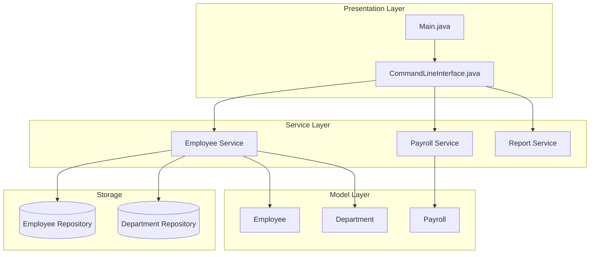
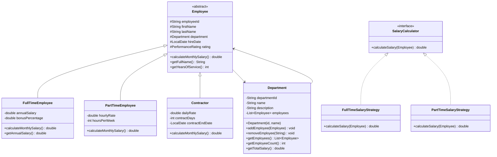

# Employee Management System

## Project Overview

A comprehensive Employee Management System that handles employee records, department organization, payroll calculations, and generating various reports. This intermediate project introduces more complex OOP concepts including inheritance, polymorphism, abstract classes, and interfaces. Students will design a system that supports different employee types with varying salary structures and benefits.

## Learning Outcomes

- Design inheritance hierarchies for different employee types
- Implement abstract classes and interfaces
- Use polymorphism for flexible salary calculations
- Apply the Template Method pattern
- Implement the Strategy pattern for different payroll calculations
- Practice dependency injection concepts
- Generate formatted reports with different output strategies

## Requirements

### Functional Requirements

| ID | Requirement | Priority |
|----|-------------|----------|
| FR01 | Add employees with different types (FullTime, PartTime, Contractor) | Must |
| FR02 | Create and manage departments | Must |
| FR03 | Assign employees to departments | Must |
| FR04 | Calculate monthly payroll with different rules per type | Must |
| FR05 | Generate department-wise salary reports | Must |
| FR06 | Generate employee hierarchy reports | Must |
| FR07 | Search employees by name, department, or type | Must |
| FR08 | Calculate annual salary with bonuses | Should |
| FR09 | Export reports to CSV format | Should |
| FR10 | Track employee performance ratings | Could |

### Non-Functional Requirements

| ID | Requirement |
|----|-------------|
| NFR01 | Support 1000+ employees efficiently |
| NFR02 | Separate business logic from presentation |
| NFR03 | Use interfaces for extensibility |
| NFR04 | Follow SOLID principles |

## Architecture



## Package Structure

```
employee-management/
├── README.md
├── src/
│   └── main/
│       └── java/
│           └── com/
│               └── academy/
│                   └── employee/
│                       ├── Main.java
│                       ├── model/
│                       │   ├── Employee.java
│                       │   ├── FullTimeEmployee.java
│                       │   ├── PartTimeEmployee.java
│                       │   ├── Contractor.java
│                       │   ├── Department.java
│                       │   └── enums/
│                       │       ├── EmployeeType.java
│                       │       ├── DepartmentType.java
│                       │       └── PerformanceRating.java
│                       ├── strategy/
│                       │   ├── SalaryCalculator.java
│                       │   ├── FullTimeSalaryStrategy.java
│                       │   ├── PartTimeSalaryStrategy.java
│                       │   └── ContractorSalaryStrategy.java
│                       ├── service/
│                       │   ├── EmployeeService.java
│                       │   ├── PayrollService.java
│                       │   └── ReportService.java
│                       ├── repository/
│                       │   ├── EmployeeRepository.java
│                       │   └── DepartmentRepository.java
│                       └── exception/
│                           ├── EmployeeNotFoundException.java
│                           ├── DepartmentNotFoundException.java
│                           └── InvalidSalaryException.java
└── src/
    └── test/
        └── java/
            └── com/
                └── academy/
                    └── employee/
                        ├── EmployeeServiceTest.java
                        ├── PayrollServiceTest.java
                        ├── DepartmentTest.java
                        └── SalaryCalculatorTest.java
```

## Class Diagram



---

**[Continue to Part 2: Implementation Guide →](README-part2.md)**