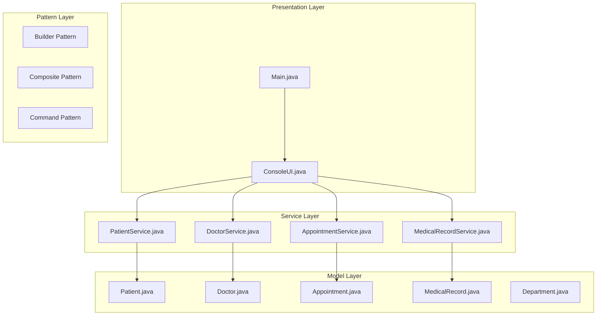
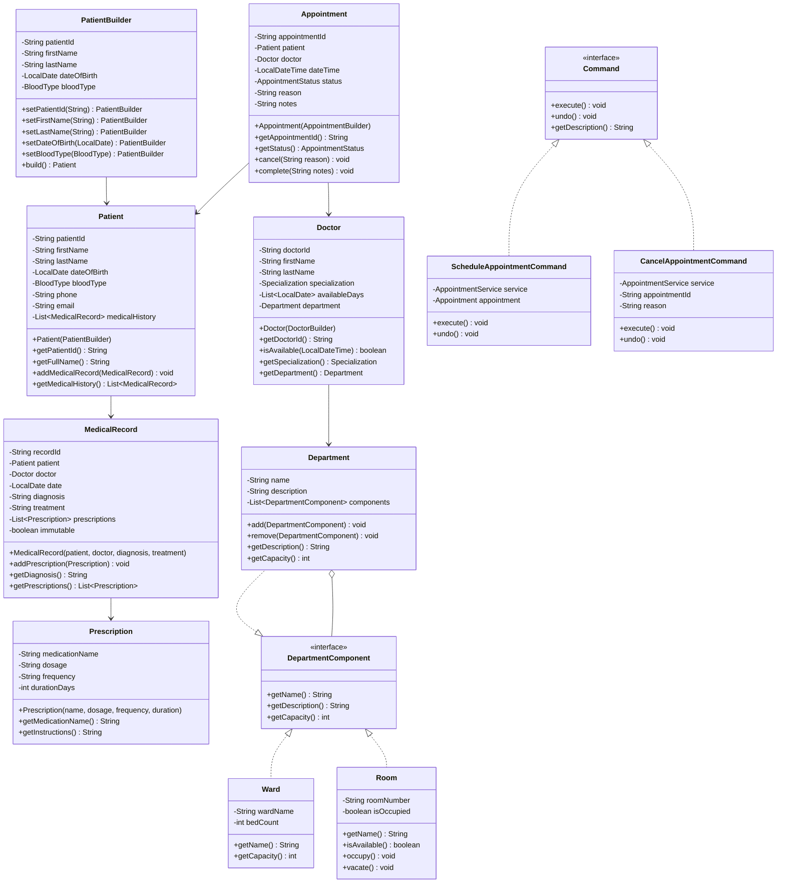

# Hospital Management System

## Project Overview

A Hospital Management System that manages patients, doctors, appointments, and medical records. This project introduces the Composite pattern for department hierarchies, the Builder pattern for complex object construction, and the Command pattern for undoable operations. Students will design a system that handles complex relationships between healthcare entities.

## Learning Outcomes

- Implement the Builder pattern for complex object creation
- Use the Composite pattern for organizational hierarchies
- Apply the Command pattern for undoable operations
- Design complex many-to-many relationships
- Implement validation for sensitive data
- Use enums extensively for status management
- Practice proper encapsulation of medical data

## Requirements

### Functional Requirements

| ID | Requirement | Priority |
|----|-------------|----------|
| FR01 | Register patients with personal and medical information | Must |
| FR02 | Add doctors with specialties and schedules | Must |
| FR03 | Schedule appointments with conflict detection | Must |
| FR04 | Create and manage medical records | Must |
| FR05 | Manage hospital departments | Must |
| FR06 | View doctor availability | Must |
| FR07 | Cancel appointments with reason | Must |
| FR08 | View patient medical history | Should |
| FR09 | Department hierarchy (Ward, Unit, Room) | Should |
| FR10 | Prescription management | Could |

### Non-Functional Requirements

| ID | Requirement |
|----|-------------|
| NFR01 | HIPAA-like data privacy considerations |
| NFR02 | No double-booking of doctors |
| NFR03 | Appointment conflict detection |
| NFR04 | Immutable medical records |

## Architecture



## Package Structure

```
hospital-management/
├── README.md
├── src/
│   └── main/
│       └── java/
│           └── com/
│               └── academy/
│                   └── hospital/
│                       ├── Main.java
│                       ├── model/
│                       │   ├── Patient.java
│                       │   ├── Doctor.java
│                       │   ├── Appointment.java
│                       │   ├── MedicalRecord.java
│                       │   ├── Prescription.java
│                       │   └── enums/
│                       │       ├── AppointmentStatus.java
│                       │       ├── Specialization.java
│                       │       └── BloodType.java
│                       ├── builder/
│                       │   ├── PatientBuilder.java
│                       │   ├── DoctorBuilder.java
│                       │   └── AppointmentBuilder.java
│                       ├── composite/
│                       │   ├── DepartmentComponent.java
│                       │   ├── Department.java
│                       │   ├── Ward.java
│                       │   └── Room.java
│                       ├── command/
│                       │   ├── Command.java
│                       │   ├── ScheduleAppointmentCommand.java
│                       │   ├── CancelAppointmentCommand.java
│                       │   └── CommandManager.java
│                       ├── service/
│                       │   ├── PatientService.java
│                       │   ├── DoctorService.java
│                       │   ├── AppointmentService.java
│                       │   └── MedicalRecordService.java
│                       └── exception/
│                           ├── AppointmentConflictException.java
│                           ├── PatientNotFoundException.java
│                           └── DoctorNotAvailableException.java
└── src/
    └── test/
        └── java/
            └── com/
                └── academy/
                    └── hospital/
                        ├── AppointmentServiceTest.java
                        ├── PatientBuilderTest.java
                        └── DepartmentCompositeTest.java
```

## Class Diagram



## Implementation Guide

### Step 1: Implement Builder Pattern

```java
package com.academy.hospital.builder;

import com.academy.hospital.model.*;
import com.academy.hospital.model.enums.*;

public class PatientBuilder {
    private String patientId;
    private String firstName;
    private String lastName;
    private LocalDate dateOfBirth;
    private BloodType bloodType;
    private String phone;
    private String email;

    public PatientBuilder setPatientId(String patientId) {
        this.patientId = patientId;
        return this;
    }

    public PatientBuilder setFirstName(String firstName) {
        this.firstName = firstName;
        return this;
    }

    public PatientBuilder setLastName(String lastName) {
        this.lastName = lastName;
        return this;
    }

    public PatientBuilder setDateOfBirth(LocalDate dateOfBirth) {
        this.dateOfBirth = dateOfBirth;
        return this;
    }

    public PatientBuilder setBloodType(BloodType bloodType) {
        this.bloodType = bloodType;
        return this;
    }

    public Patient build() {
        validate();
        return new Patient(this);
    }

    private void validate() {
        if (patientId == null || patientId.isEmpty()) {
            throw new IllegalArgumentException("Patient ID is required");
        }
        if (firstName == null || lastName == null) {
            throw new IllegalArgumentException("Name is required");
        }
    }
}
```

### Step 2: Implement Composite Pattern

```java
package com.academy.hospital.composite;

public interface DepartmentComponent {
    String getName();
    String getDescription();
    int getCapacity();
}

package com.academy.hospital.composite;

import java.util.ArrayList;
import java.util.List;

public class Department implements DepartmentComponent {
    private String name;
    private String description;
    private List<DepartmentComponent> components;

    public Department(String name, String description) {
        this.name = name;
        this.description = description;
        this.components = new ArrayList<>();
    }

    public void add(DepartmentComponent component) {
        components.add(component);
    }

    public void remove(DepartmentComponent component) {
        components.remove(component);
    }

    @Override
    public int getCapacity() {
        return components.stream()
            .mapToInt(DepartmentComponent::getCapacity)
            .sum();
    }

    @Override
    public String getDescription() {
        StringBuilder sb = new StringBuilder(name + ": " + description + "\n");
        for (DepartmentComponent component : components) {
            sb.append("  - ").append(component.getName()).append("\n");
        }
        return sb.toString();
    }
}
```

### Step 3: Implement Command Pattern

```java
package com.academy.hospital.command;

public interface Command {
    void execute();
    void undo();
    String getDescription();
}

package com.academy.hospital.command;

public class ScheduleAppointmentCommand implements Command {
    private final AppointmentService service;
    private Appointment appointment;
    private final AppointmentBuilder builder;

    public ScheduleAppointmentCommand(AppointmentService service, AppointmentBuilder builder) {
        this.service = service;
        this.builder = builder;
    }

    @Override
    public void execute() throws AppointmentConflictException {
        this.appointment = service.scheduleAppointment(builder);
    }

    @Override
    public void undo() {
        if (appointment != null) {
            service.cancelAppointment(appointment.getAppointmentId(), "Undo operation");
        }
    }
}

package com.academy.hospital.command;

import java.util.Stack;

public class CommandManager {
    private final Stack<Command> commandHistory = new Stack<>();
    private final Stack<Command> undoHistory = new Stack<>();

    public void executeCommand(Command command) throws Exception {
        command.execute();
        commandHistory.push(command);
        undoHistory.clear();
    }

    public void undo() {
        if (!commandHistory.isEmpty()) {
            Command command = commandHistory.pop();
            command.undo();
            undoHistory.push(command);
        }
    }

    public void redo() {
        if (!undoHistory.isEmpty()) {
            Command command = undoHistory.pop();
            command.execute();
            commandHistory.push(command);
        }
    }
}
```

### Step 4: Implement Appointment Service with Conflict Detection

```java
package com.academy.hospital.service;

import com.academy.hospital.model.*;
import com.academy.hospital.exception.*;
import java.time.LocalDateTime;
import java.util.List;
import java.util.stream.Collectors;

public class AppointmentService {
    private final List<Appointment> appointments;

    public Appointment scheduleAppointment(AppointmentBuilder builder) 
            throws AppointmentConflictException {
        
        Appointment appointment = builder.build();
        
        if (hasConflict(appointment)) {
            throw new AppointmentConflictException(
                "Doctor is not available at the requested time");
        }
        
        appointments.add(appointment);
        return appointment;
    }

    private boolean hasConflict(Appointment newAppointment) {
        return appointments.stream()
            .filter(a -> a.getStatus() != AppointmentStatus.CANCELLED)
            .filter(a -> a.getDoctor().equals(newAppointment.getDoctor()))
            .anyMatch(a -> a.getDateTime().equals(newAppointment.getDateTime()));
    }

    public List<Appointment> getDoctorSchedule(String doctorId, LocalDate date) {
        return appointments.stream()
            .filter(a -> a.getDoctor().getDoctorId().equals(doctorId))
            .filter(a -> a.getDateTime().toLocalDate().equals(date))
            .filter(a -> a.getStatus() != AppointmentStatus.CANCELLED)
            .collect(Collectors.toList());
    }
}
```

## Unit Tests

```java
package com.academy.hospital;

import com.academy.hospital.model.*;
import com.academy.hospital.model.enums.*;
import com.academy.hospital.service.AppointmentService;
import com.academy.hospital.builder.*;
import com.academy.hospital.exception.*;
import org.junit.jupiter.api.BeforeEach;
import org.junit.jupiter.api.Test;
import java.time.LocalDateTime;
import static org.junit.jupiter.api.Assertions.*;

public class AppointmentServiceTest {
    private AppointmentService service;
    private Patient patient;
    private Doctor doctor;

    @BeforeEach
    void setUp() {
        service = new AppointmentService();
        patient = new PatientBuilder()
            .setPatientId("P001")
            .setFirstName("John")
            .setLastName("Doe")
            .setBloodType(BloodType.O_POSITIVE)
            .build();
        doctor = new DoctorBuilder()
            .setDoctorId("D001")
            .setFirstName("Dr. Smith")
            .setSpecialization(Specialization.CARDIOLOGY)
            .build();
    }

    @Test
    void testScheduleAppointment() throws Exception {
        Appointment appointment = service.scheduleAppointment(
            new AppointmentBuilder()
                .setPatient(patient)
                .setDoctor(doctor)
                .setDateTime(LocalDateTime.now().plusDays(1))
                .setReason("Checkup")
        );
        assertNotNull(appointment);
        assertEquals(AppointmentStatus.SCHEDULED, appointment.getStatus());
    }

    @Test
    void testAppointmentConflict() {
        LocalDateTime time = LocalDateTime.now().plusDays(1);
        
        service.scheduleAppointment(new AppointmentBuilder()
            .setPatient(patient)
            .setDoctor(doctor)
            .setDateTime(time)
            .setReason("Checkup")
        );

        assertThrows(AppointmentConflictException.class, () -> {
            service.scheduleAppointment(new AppointmentBuilder()
                .setPatient(patient)
                .setDoctor(doctor)
                .setDateTime(time)
                .setReason("Follow-up")
            );
        });
    }

    @Test
    void testCancelAppointment() throws Exception {
        Appointment appointment = service.scheduleAppointment(
            new AppointmentBuilder()
                .setPatient(patient)
                .setDoctor(doctor)
                .setDateTime(LocalDateTime.now().plusDays(1))
                .setReason("Checkup")
        );
        
        service.cancelAppointment(appointment.getAppointmentId(), "Patient request");
        assertEquals(AppointmentStatus.CANCELLED, appointment.getStatus());
    }

    @Test
    void testDepartmentComposite() {
        Department hospital = new Department("City Hospital", "Main hospital");
        Department cardiology = new Department("Cardiology", "Heart department");
        Ward wardA = new Ward("Ward A", 20);
        Room room1 = new Room("101", false);
        
        cardiology.add(wardA);
        cardiology.add(room1);
        hospital.add(cardiology);
        
        assertEquals(20, hospital.getCapacity());
    }
}
```

## Extension Challenges

1. **Undo/Redo**: Fully implement undo/redo for all appointment operations
2. **Waitlist**: Implement waitlist for fully booked time slots
3. **Recurring Appointments**: Support weekly/monthly recurring appointments
4. **Medical History Timeline**: Visualize patient history as timeline
5. **Insurance Integration**: Add insurance provider and coverage tracking

## Interview Questions

1. **Why use the Builder pattern for Patient/Doctor creation?**
   - Discuss complex construction, optional parameters, readability

2. **How would you ensure HIPAA compliance in this system?**
   - Discuss access control, encryption, audit trails

3. **What are the trade-offs of the Composite pattern for departments?**
   - Discuss flexibility vs complexity, uniform interface benefits

4. **How would you implement appointment reminders?**
   - Discuss Observer pattern, scheduled notifications, message queues

5. **How would you scale this for a hospital chain?**
   - Discuss multi-tenancy, distributed systems, data isolation

## References

- [Builder Pattern in Java](https://www.baeldung.com/creational-design-patterns)
- [Composite Pattern](https://www.baeldung.com/java-composite-pattern)
- [Command Pattern](https://www.baeldung.com/java-command-pattern)
