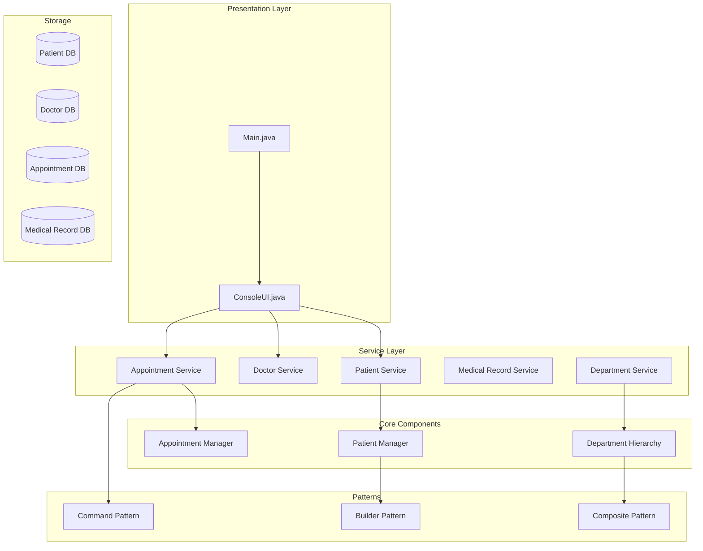
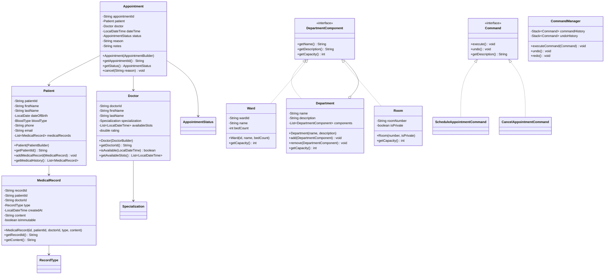

# Hospital Management System

## Project Overview

A Hospital Management System that manages patients, doctors, appointments, and medical records. This project introduces the Composite pattern for department hierarchies, the Builder pattern for complex object construction, and the Command pattern for undoable operations. Students will design a system that handles complex relationships between healthcare entities.

## Learning Outcomes

- Implement the Builder pattern for complex object creation
- Use the Composite pattern for organizational hierarchies
- Apply the Command pattern for undoable operations
- Design complex many-to-many relationships
- Implement validation for sensitive data
- Use enums extensively for status management
- Practice proper encapsulation of medical data

## Requirements

### Functional Requirements

| ID | Requirement | Priority |
|----|-------------|----------|
| FR01 | Register patients with personal and medical information | Must |
| FR02 | Add doctors with specialties and schedules | Must |
| FR03 | Schedule appointments with conflict detection | Must |
| FR04 | Create and manage medical records | Must |
| FR05 | Manage hospital departments | Must |
| FR06 | View doctor availability | Must |
| FR07 | Cancel appointments with reason | Must |
| FR08 | View patient medical history | Should |
| FR09 | Department hierarchy (Ward, Unit, Room) | Should |
| FR10 | Prescription management | Could |

### Non-Functional Requirements

| ID | Requirement |
|----|-------------|
| NFR01 | HIPAA-like data privacy considerations |
| NFR02 | No double-booking of doctors |
| NFR03 | Appointment conflict detection |
| NFR04 | Immutable medical records |

## Architecture



## Package Structure

```
hospital-management/
├── README.md
├── src/
│   └── main/
│       └── java/
│           └── com/
│               └── academy/
│                   └── hospital/
│                       ├── Main.java
│                       ├── model/
│                       │   ├── Patient.java
│                       │   ├── Doctor.java
│                       │   ├── Appointment.java
│                       │   ├── MedicalRecord.java
│                       │   ├── Department.java
│                       │   ├── Ward.java
│                       │   ├── Room.java
│                       │   └── enums/
│                       │       ├── BloodType.java
│                       │       ├── Specialization.java
│                       │       ├── AppointmentStatus.java
│                       │       └── RecordType.java
│                       ├── builder/
│                       │   ├── PatientBuilder.java
│                       │   ├── DoctorBuilder.java
│                       │   └── AppointmentBuilder.java
│                       ├── composite/
│                       │   ├── DepartmentComponent.java
│                       │   ├── Department.java
│                       │   ├── Ward.java
│                       │   └── Room.java
│                       ├── command/
│                       │   ├── Command.java
│                       │   ├── ScheduleAppointmentCommand.java
│                       │   ├── CancelAppointmentCommand.java
│                       │   └── CommandManager.java
│                       ├── service/
│                       │   ├── PatientService.java
│                       │   ├── DoctorService.java
│                       │   ├── AppointmentService.java
│                       │   ├── MedicalRecordService.java
│                       │   └── DepartmentService.java
│                       └── exception/
│                           ├── AppointmentConflictException.java
│                           ├── PatientNotFoundException.java
│                           ├── DoctorNotFoundException.java
│                           └── ValidationException.java
└── src/
    └── test/
        └── java/
            └── com/
                └── academy/
                    └── hospital/
                        ├── AppointmentServiceTest.java
                        ├── PatientServiceTest.java
                        ├── DepartmentCompositeTest.java
                        └── BuilderTest.java
```

## Class Diagram



---

**[Continue to Part 2: Implementation Guide →](README-part2.md)**