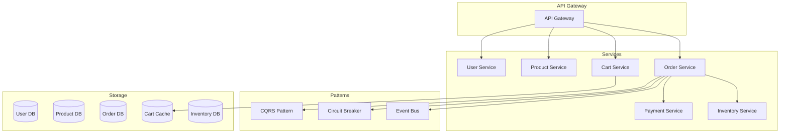
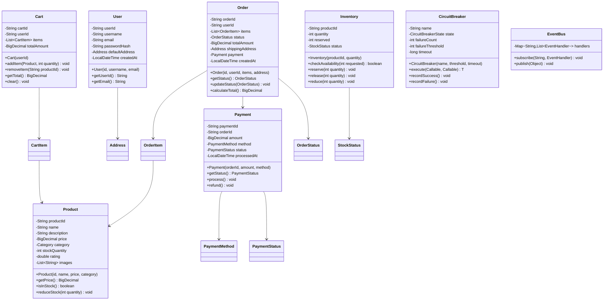

# E-Commerce Platform

## Project Overview

A detailed E-Commerce Platform that handles product catalog, shopping cart, order processing, payment, user management, and inventory tracking. This enterprise project introduces microservice architecture concepts, the Circuit Breaker pattern for fault tolerance, and CQRS for read/write optimization. Students will design a scalable system that demonstrates enterprise-level architecture patterns.

## Learning Outcomes

- Design microservice-style architecture within a monolith
- Implement Circuit Breaker pattern for fault tolerance
- Use CQRS pattern for read/write optimization
- Design event-driven architecture with domain events
- Implement detailed validation and security
- Use DTOs for API layer separation
- Design for horizontal scalability

## Requirements

### Functional Requirements

| ID | Requirement | Priority |
|----|-------------|----------|
| FR01 | User registration and authentication | Must |
| FR02 | Product catalog with categories and search | Must |
| FR03 | Shopping cart management | Must |
| FR04 | Order placement and tracking | Must |
| FR05 | Payment processing (multiple methods) | Must |
| FR06 | Inventory management with stock tracking | Must |
| FR07 | Order history and user profiles | Should |
| FR08 | Product reviews and ratings | Should |
| FR09 | Discount and coupon system | Could |
| FR10 | Recommendation engine | Could |

### Non-Functional Requirements

| ID | Requirement |
|----|-------------|
| NFR01 | Support 10,000 concurrent users |
| NFR02 | Page load time < 2 seconds |
| NFR03 | Order processing < 5 seconds |
| NFR04 | 99.9% availability |
| NFR05 | Horizontal scalability |

## Architecture



## Package Structure

```
e-commerce-platform/
├── README.md
├── src/
│   └── main/
│       └── java/
│           └── com/
│               └── academy/
│                   └── ecommerce/
│                       ├── Main.java
│                       ├── model/
│                       │   ├── User.java
│                       │   ├── Product.java
│                       │   ├── Category.java
│                       │   ├── Cart.java
│                       │   ├── CartItem.java
│                       │   ├── Order.java
│                       │   ├── OrderItem.java
│                       │   ├── Payment.java
│                       │   ├── Inventory.java
│                       │   └── enums/
│                       │       ├── OrderStatus.java
│                       │       ├── PaymentStatus.java
│                       │       ├── PaymentMethod.java
│                       │       └── StockStatus.java
│                       ├── cqrs/
│                       │   ├── Command.java
│                       │   ├── CommandHandler.java
│                       │   ├── Query.java
│                       │   ├── QueryHandler.java
│                       │   ├── CreateOrderCommand.java
│                       │   └── CreateOrderCommandHandler.java
│                       ├── resilience/
│                       │   ├── CircuitBreaker.java
│                       │   ├── CircuitBreakerState.java
│                       │   └── RetryPolicy.java
│                       ├── event/
│                       │   ├── EventBus.java
│                       │   ├── EventHandler.java
│                       │   ├── OrderCreatedEvent.java
│                       │   ├── PaymentProcessedEvent.java
│                       │   └── InventoryReservedEvent.java
│                       ├── dto/
│                       │   ├── UserDTO.java
│                       │   ├── ProductDTO.java
│                       │   ├── OrderDTO.java
│                       │   ├── CartDTO.java
│                       │   └── AddressDTO.java
│                       ├── service/
│                       │   ├── UserService.java
│                       │   ├── ProductService.java
│                       │   ├── CartService.java
│                       │   ├── OrderService.java
│                       │   ├── PaymentService.java
│                       │   └── InventoryService.java
│                       ├── repository/
│                       │   ├── UserRepository.java
│                       │   ├── ProductRepository.java
│                       │   ├── OrderRepository.java
│                       │   ├── CartRepository.java
│                       │   └── InventoryRepository.java
│                       └── exception/
│                           ├── ValidationException.java
│                           ├── InsufficientStockException.java
│                           ├── PaymentFailedException.java
│                           └── OrderNotFoundException.java
└── src/
    └── test/
        └── java/
            └── com/
                └── academy/
                    └── ecommerce/
                        ├── OrderServiceTest.java
                        ├── CartServiceTest.java
                        ├── CircuitBreakerTest.java
                        └── ProductServiceTest.java
```

## Class Diagram



---

**[Continue to Part 2: Implementation Guide →](README-part2.md)**