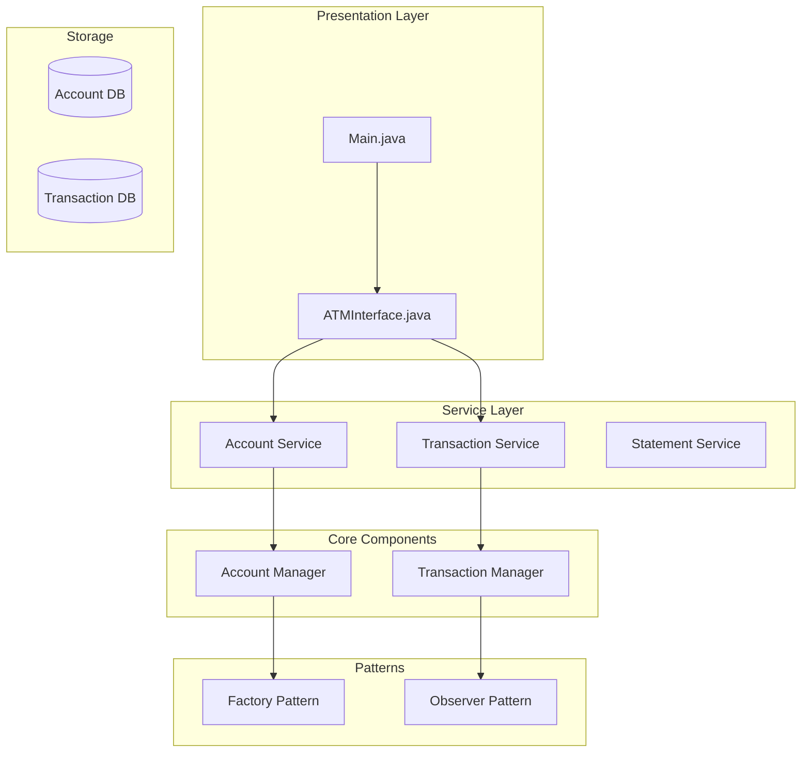
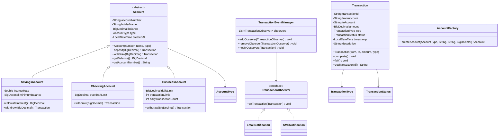

# Bank Management System

## Project Overview

A Bank Management System that simulates core banking operations including account management, transactions, transfers, and statement generation. This project introduces advanced OOP concepts including the Observer pattern for transaction notifications, the Factory pattern for account creation, and proper handling of financial calculations with precision.

## Learning Outcomes

- Implement the Factory pattern for creating different account types
- Use the Observer pattern for transaction notifications
- Handle financial calculations with BigDecimal for precision
- Implement transaction logging and audit trails
- Design for data integrity and consistency
- Practice interface-based programming
- Implement detailed validation

## Requirements

### Functional Requirements

| ID | Requirement | Priority |
|----|-------------|----------|
| FR01 | Create different account types (Savings, Checking, Business) | Must |
| FR02 | Deposit money with validation | Must |
| FR03 | Withdraw money with balance check | Must |
| FR04 | Transfer between accounts | Must |
| FR05 | Generate account statements | Must |
| FR06 | View transaction history | Must |
| FR07 | Calculate interest for savings accounts | Must |
| FR08 | Account balance inquiries | Should |
| FR09 | Transaction notifications | Should |
| FR10 | Monthly account statements | Could |

### Non-Functional Requirements

| ID | Requirement |
|----|-------------|
| NFR01 | Financial precision (no floating point errors) |
| NFR02 | Transaction atomicity (transfers are all-or-nothing) |
| NFR03 | Thread-safe balance operations |
| NFR04 | Immutable transaction records |

## Architecture



## Package Structure

```
bank-management/
├── README.md
├── src/
│   └── main/
│       └── java/
│           └── com/
│               └── academy/
│                   └── bank/
│                       ├── Main.java
│                       ├── model/
│                       │   ├── Account.java
│                       │   ├── SavingsAccount.java
│                       │   ├── CheckingAccount.java
│                       │   ├── BusinessAccount.java
│                       │   ├── Transaction.java
│                       │   └── enums/
│                       │       ├── AccountType.java
│                       │       ├── TransactionType.java
│                       │       └── TransactionStatus.java
│                       ├── factory/
│                       │   └── AccountFactory.java
│                       ├── observer/
│                       │   ├── TransactionObserver.java
│                       │   ├── TransactionEventManager.java
│                       │   ├── EmailNotification.java
│                       │   └── SMSNotification.java
│                       ├── service/
│                       │   ├── AccountService.java
│                       │   ├── TransactionService.java
│                       │   └── StatementService.java
│                       └── exception/
│                           ├── InsufficientFundsException.java
│                           ├── AccountNotFoundException.java
│                           ├── DuplicateAccountException.java
│                           └── TransactionFailedException.java
└── src/
    └── test/
        └── java/
            └── com/
                └── academy/
                    └── bank/
                        ├── AccountServiceTest.java
                        ├── TransactionServiceTest.java
                        ├── AccountFactoryTest.java
                        └── ObserverTest.java
```

## Class Diagram



---

**[Continue to Part 2: Implementation Guide →](README-part2.md)**