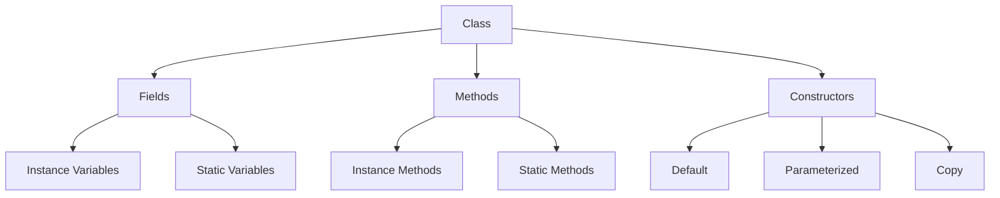
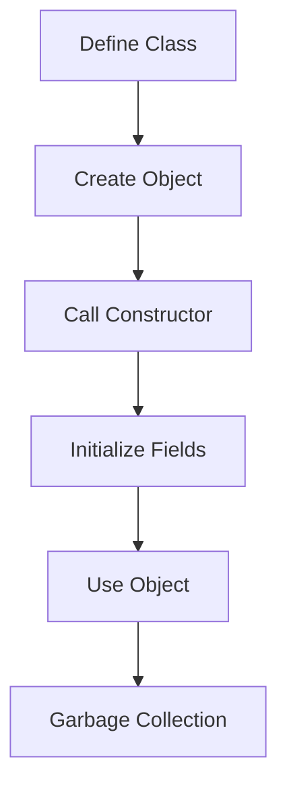

# Module 02: Object-Oriented Programming

> **Difficulty:** ⭐⭐ Easy  
> **Reading:** 40 min | **Practice:** 90 min | **Total:** 130 min

## Overview
Object-Oriented Programming (OOP) is a programming approach based on objects that contain data and code. Java is a pure OOP language supporting encapsulation, inheritance, polymorphism, and abstraction.

## Learning Objectives
- Master OOP principles
- Understand classes and objects
- Apply inheritance and polymorphism
- Use interfaces and abstract classes
- Implement design principles

## Prerequisites
- Basic Java syntax
- Variables and data types
- Control flow statements

## History
- **1967** — Simula introduced classes and objects
- **1979** — C++ added OOP features to C
- **1995** — Java launched as a pure OOP language with classes, inheritance, and polymorphism
- **1996** — Java 1.0 class library established core OOP patterns
- **2004** — Java 5 added generics for type-safe OOP
- **2014** — Java 8 introduced default methods in interfaces
- **2017** — Java 9 modules enabled better encapsulation at package level
- **2021** — Java 17 added sealed classes for controlled inheritance

## Why This Concept Exists
OOP provides:
- Code reusability
- Modular design
- Easier maintenance
- Better organization
- Real-world modeling

## Problem Statement
How do you organize code to be modular, reusable, and maintainable?

## Core Concepts

### Four Pillars of OOP

| Pillar | Description |
|--------|-------------|
| Encapsulation | Hiding internal state |
| Inheritance | Creating new classes from existing |
| Polymorphism | Multiple forms of behavior |
| Abstraction | Hiding complexity |

### Class Components

| Component | Description |
|-----------|-------------|
| Fields | State (variables) |
| Methods | Behavior (functions) |
| Constructors | Object initialization |
| Access Modifiers | Visibility control |

### Access Modifiers

| Modifier | Class | Package | Subclass | World |
|----------|-------|---------|----------|-------|
| public | ✅ | ✅ | ✅ | ✅ |
| protected | ✅ | ✅ | ✅ | ❌ |
| default | ✅ | ✅ | ❌ | ❌ |
| private | ✅ | ❌ | ❌ | ❌ |

> See `36-access-modifiers/` for detailed examples, patterns, and interview questions.

## Internal Working

### Object Creation
1. Class loading
2. Memory allocation
3. Constructor execution
4. Reference assignment

### Memory Model
```
Stack:                          Heap:
┌──────────────────┐          ┌──────────────────┐
│ main() frame     │          │ Object: Person    │
│  - person ref ───│──────────│  - name: "John"   │
│                  │          │  - age: 25        │
└──────────────────┘          └──────────────────┘
```

## JVM Perspective

### Class Loading
- Bootstrap classloader
- Extension classloader
- Application classloader
- Custom classloaders

### Object Header
- Mark word (hashcode, age, lock)
- Klass pointer
- Instance data

## Architecture Diagram



## Flow Diagram



## Syntax

### Class Definition
```java
public class Person {
    // Fields
    private String name;
    private int age;
    
    // Default constructor
    public Person() {
        this.name = "Unknown";
        this.age = 0;
    }
    
    // Parameterized constructor
    public Person(String name, int age) {
        this.name = name;
        this.age = age;
    }
    
    // Methods
    public String getName() {
        return name;
    }
    
    public void setName(String name) {
        this.name = name;
    }
    
    public void greet() {
        System.out.println("Hello, I'm " + name);
    }
}
```

### Inheritance
```java
public class Employee extends Person {
    private double salary;
    
    public Employee(String name, int age, double salary) {
        super(name, age);
        this.salary = salary;
    }
    
    public double getSalary() {
        return salary;
    }
    
    @Override
    public void greet() {
        System.out.println("Hello, I'm " + getName() + " and I work here");
    }
}
```

### Polymorphism
```java
public class Animal {
    public void speak() {
        System.out.println("Animal speaks");
    }
}

public class Dog extends Animal {
    @Override
    public void speak() {
        System.out.println("Dog barks");
    }
}

public class Cat extends Animal {
    @Override
    public void speak() {
        System.out.println("Cat meows");
    }
}

// Polymorphic code
Animal animal = new Dog();
animal.speak(); // Dog barks
```

### Abstract Classes
```java
public abstract class Shape {
    protected String color;
    
    public Shape(String color) {
        this.color = color;
    }
    
    public abstract double area();
    public abstract double perimeter();
    
    public void display() {
        System.out.println("Color: " + color + ", Area: " + area());
    }
}

public class Circle extends Shape {
    private double radius;
    
    public Circle(String color, double radius) {
        super(color);
        this.radius = radius;
    }
    
    @Override
    public double area() {
        return Math.PI * radius * radius;
    }
    
    @Override
    public double perimeter() {
        return 2 * Math.PI * radius;
    }
}
```

### Interfaces
```java
public interface Drawable {
    void draw();
    
    default void fill() {
        System.out.println("Filling shape");
    }
}

public interface Resizable {
    void resize(double factor);
}

public class Rectangle implements Drawable, Resizable {
    private double width, height;
    
    @Override
    public void draw() {
        System.out.println("Drawing rectangle");
    }
    
    @Override
    public void resize(double factor) {
        width *= factor;
        height *= factor;
    }
}
```

## Easy Example
```java
public class Car {
    private String brand;
    private String model;
    private int year;
    
    public Car(String brand, String model, int year) {
        this.brand = brand;
        this.model = model;
        this.year = year;
    }
    
    public void start() {
        System.out.println(brand + " " + model + " started");
    }
    
    public void stop() {
        System.out.println(brand + " " + model + " stopped");
    }
    
    public static void main(String[] args) {
        Car car = new Car("Toyota", "Camry", 2024);
        car.start();
        car.stop();
    }
}
```

## Medium Example
```java
public class BankAccount {
    private String accountId;
    private double balance;
    private String owner;
    
    public BankAccount(String accountId, String owner, double initialBalance) {
        this.accountId = accountId;
        this.owner = owner;
        this.balance = initialBalance;
    }
    
    public void deposit(double amount) {
        if (amount > 0) {
            balance += amount;
            System.out.println("Deposited: $" + amount);
        }
    }
    
    public boolean withdraw(double amount) {
        if (amount > 0 && amount <= balance) {
            balance -= amount;
            System.out.println("Withdrew: $" + amount);
            return true;
        }
        System.out.println("Insufficient funds");
        return false;
    }
    
    public double getBalance() {
        return balance;
    }
    
    public static void main(String[] args) {
        BankAccount account = new BankAccount("001", "John", 1000);
        account.deposit(500);
        account.withdraw(200);
        System.out.println("Balance: $" + account.getBalance());
    }
}
```

## Hard Example
```java
// Composition over inheritance
public class Engine {
    private String type;
    private int horsepower;
    
    public Engine(String type, int horsepower) {
        this.type = type;
        this.horsepower = horsepower;
    }
    
    public void start() {
        System.out.println(type + " engine started");
    }
}

public class Car {
    private String make;
    private Engine engine;  // Composition
    
    public Car(String make, Engine engine) {
        this.make = make;
        this.engine = engine;
    }
    
    public void start() {
        System.out.println("Starting " + make);
        engine.start();
    }
}

// Usage
Engine v6 = new Engine("V6", 300);
Car car = new Car("Toyota", v6);
car.start();
```

## Enterprise Example
```java
// SOLID principles example
public interface PaymentProcessor {
    PaymentResult process(PaymentRequest request);
}

public class CreditCardProcessor implements PaymentProcessor {
    @Override
    public PaymentResult process(PaymentRequest request) {
        // Process credit card
        return new PaymentResult(true, "Success");
    }
}

public class PayPalProcessor implements PaymentProcessor {
    @Override
    public PaymentResult process(PaymentRequest request) {
        // Process PayPal
        return new PaymentResult(true, "Success");
    }
}

// Dependency injection
public class OrderService {
    private final PaymentProcessor processor;
    
    public OrderService(PaymentProcessor processor) {
        this.processor = processor;
    }
    
    public void processOrder(Order order) {
        PaymentResult result = processor.process(order.getPayment());
        if (result.isSuccess()) {
            completeOrder(order);
        }
    }
}
```

## Performance Considerations
- Object creation has overhead
- Inheritance adds method lookup cost
- Polymorphism uses vtable
- Composition is generally preferred

## Time & Space Complexity

| Operation | Time | Space |
|-----------|------|-------|
| Object creation | O(1) | O(fields) |
| Method call | O(1) | O(1) |
| Inheritance lookup | O(depth) | O(1) |
| Interface call | O(1) | O(1) |

## Thread Safety
- Objects are not thread-safe by default
- Use synchronization for shared state
- Immutable objects are thread-safe
- Thread-local storage for isolation

## Best Practices
1. Favor composition over inheritance
2. Program to interfaces
3. Keep classes small and focused
4. Use appropriate access modifiers
5. Make classes immutable when possible

## Common Mistakes
1. Deep inheritance hierarchies
2. Exposing internal state
3. Circular dependencies
4. God classes

## Comparison Table

| Feature | Inheritance | Composition |
|---------|-------------|-------------|
| Coupling | Tight | Loose |
| Flexibility | Limited | High |
| Reuse | IS-A relationship | HAS-A relationship |
| Testing | Harder | Easier |

## Interview Questions

### Q1: What are the four pillars of OOP?
**Answer:** Encapsulation, Inheritance, Polymorphism, Abstraction.

### Q2: What is the difference between abstract class and interface?
**Answer:** Abstract class can have state and constructors, interface cannot (until Java 8).

### Q3: What is polymorphism?
**Answer:** Ability of objects to take multiple forms through inheritance.

### Q4: What is encapsulation?
**Answer:** Hiding internal state and providing public methods for access.

### Q5: What is the difference between == and .equals()?
**Answer:** == checks reference equality, .equals() checks value equality.

### Q6: What is method overriding?
**Answer:** Redefining parent class method in child class.

### Q7: What is method overloading?
**Answer:** Multiple methods with same name but different parameters.

### Q8: What is the difference between composition and inheritance?
**Answer:** Composition uses HAS-A relationship, inheritance uses IS-A.

### Q9: What is a design pattern?
**Answer:** Reusable solution to common software design problems.

### Q10: What is SOLID?
**Answer:** Five OOP design principles for maintainable code.

### Q11: What is the Liskov Substitution Principle?
**Answer:** Objects of superclass should be replaceable with subclass objects.

### Q12: What is dependency injection?
**Answer:** Providing dependencies from outside rather than creating internally.

### Q13: What is an immutable class?
**Answer:** Class whose objects cannot be modified after creation.

### Q14: What is the difference between shallow and deep copy?
**Answer:** Shallow copies references, deep copies the objects.

### Q15: What is a value object?
**Answer:** Immutable object representing a value without identity.

## Exercises

### Easy
1. Create a Person class with constructors
2. Implement inheritance with Animal hierarchy
3. Use polymorphism with different shapes

### Medium
1. Design a library management system
2. Implement a payment processing system
3. Create a vehicle rental system

### Hard
1. Design a complete e-commerce system
2. Implement a banking system with accounts
3. Create a game character hierarchy

## Summary
OOP is fundamental to Java development. Master the four pillars and apply design principles for maintainable code.

## Cross-References

- **Previous Module:** [01 - Java Fundamentals](../01-fundamentals/)
- **Next Module:** [03 - Exception Handling](../03-exception-handling/)
- **Related:** [06 - Generics](../06-generics/) — type-safe parameterized classes and interfaces
- **Related:** [07 - Functional Programming](../07-functional-programming/) — lambdas and functional interfaces
- **Related:** [09 - Multithreading](../09-multithreading/) — synchronized objects and thread safety
- **External:** [Oracle Java Documentation: OOP](https://docs.oracle.com/javase/tutorial/java/concepts/)
- **External:** [Effective Java by Joshua Bloch](https://www.oreilly.com/library/view/effective-java/9780134686097/)
- **External:** [Head First Design Patterns](https://www.oreilly.com/library/view/head-first-design/9781492077992/)

## Prerequisites

- [Fundamentals](../01-fundamentals/README.md)
- [Pass by Value](../00-knowledge-atoms/pass-by-value/README.md)

## Related Topics

- [Equals & HashCode](../00-knowledge-atoms/equals-hashcode/README.md)
- [Immutability](../00-knowledge-atoms/immutability/README.md)

## Next

- [Exception Handling](../03-exception-handling/README.md)
- [Collections](../04-collections/README.md)

## One-Minute Revision

| Aspect | Value |
|--------|-------|
| Purpose | Object-oriented programming |
| Complexity | N/A |
| Thread Safe | No (by default) |
| Ordered | N/A |
| Allows Null | Yes |
| Best Alternative | Records (for data carriers) |
| When to Use | Modeling real-world entities |
| When to Avoid | Simple data structures |
