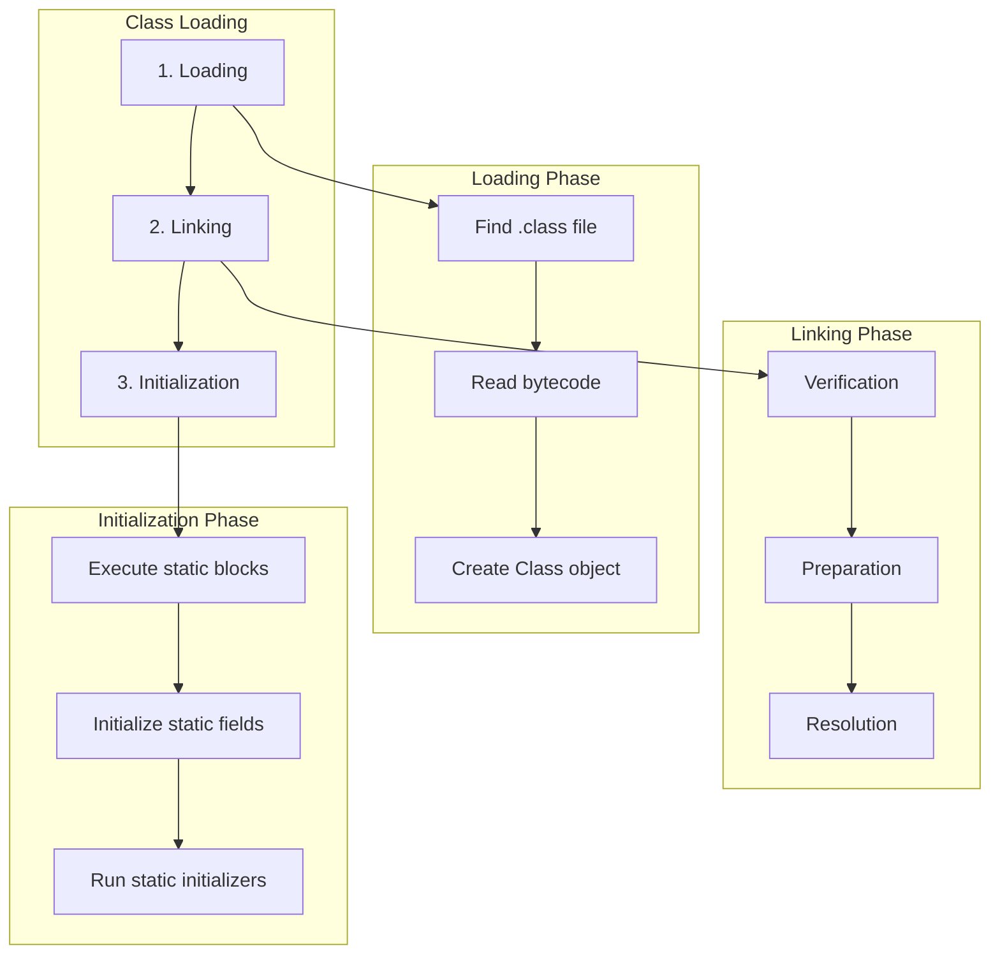
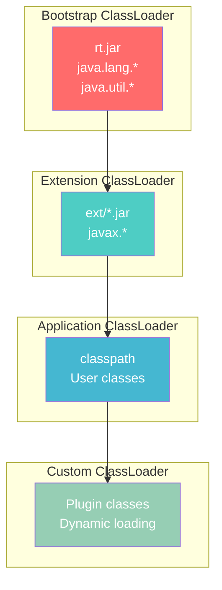
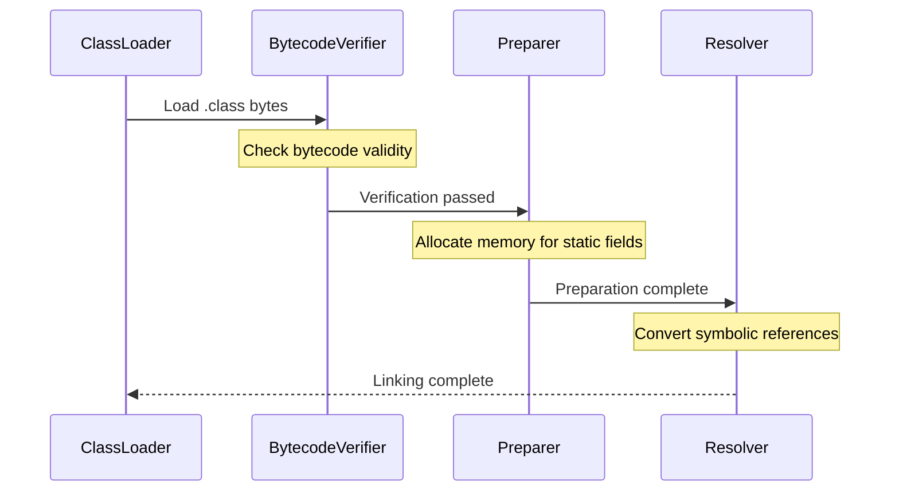
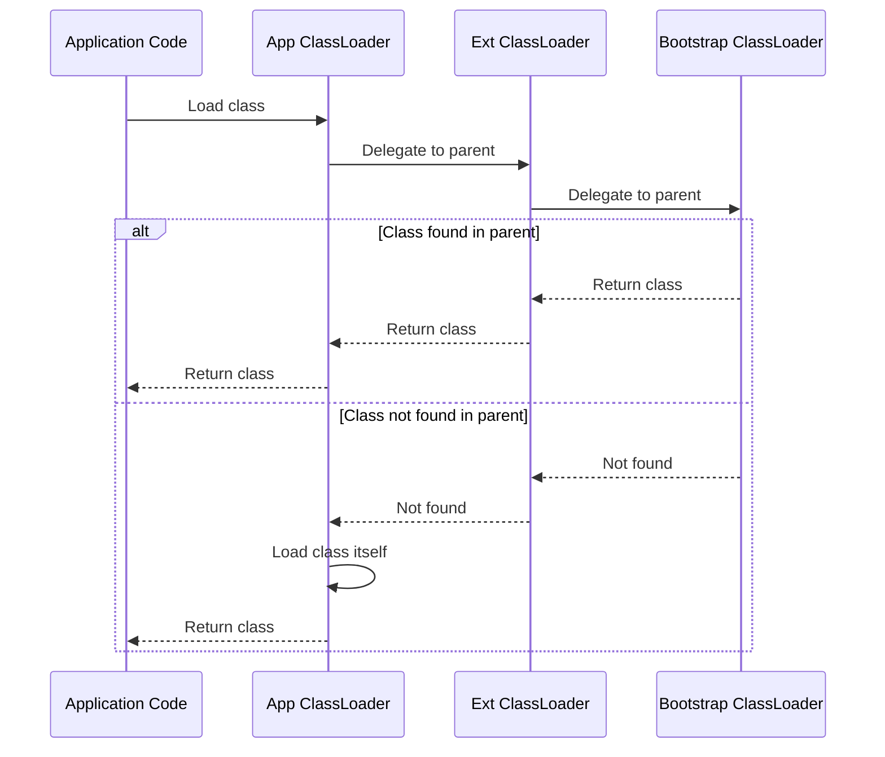
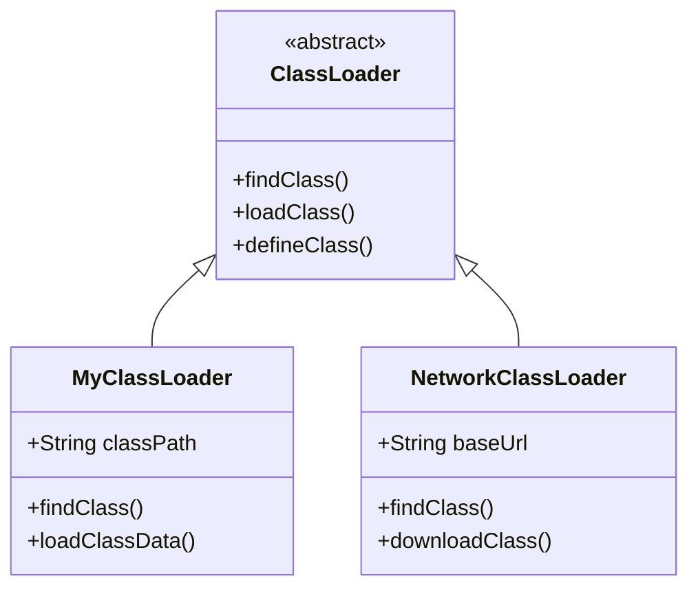

# Class Loading Process

The JVM loads, links, and initializes classes on demand, which is fundamental to Java's runtime behavior.

## Class Loading Overview

## Class Loaders Hierarchy

## Linking Process Details

## Delegation Model

## Custom ClassLoader Example

## Key Takeaways

- **Bootstrap ClassLoader**: Loads core Java classes (rt.jar)
- **Extension ClassLoader**: Loads extension classes (ext/)
- **Application ClassLoader**: Loads user classes from classpath
- **Delegation Model**: Parents try loading first, then children
- **Lazy Loading**: Classes loaded only when first referenced