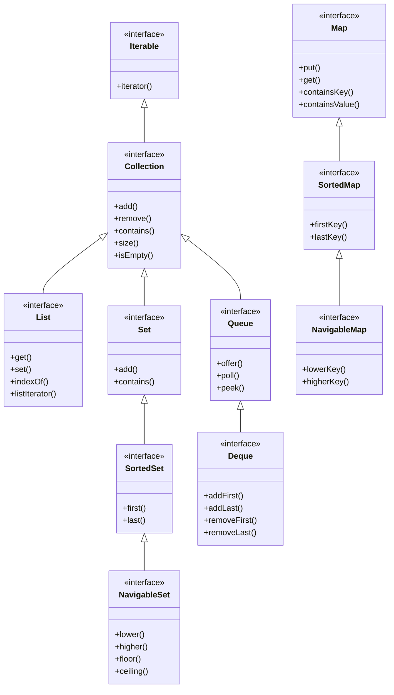
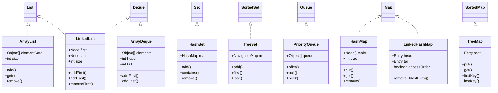
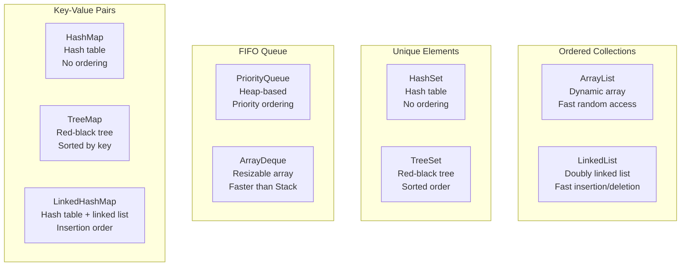
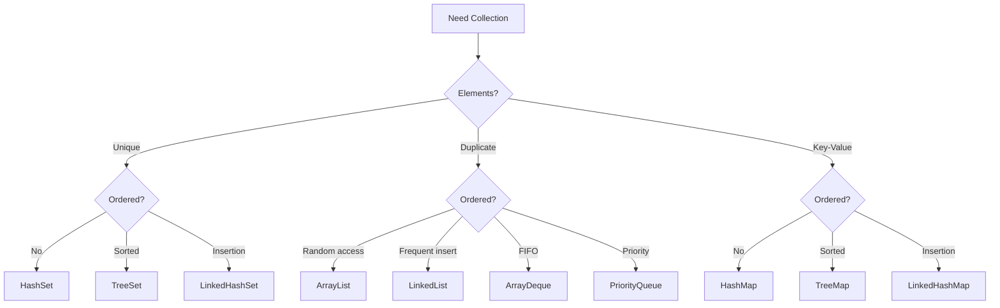

# Java Collections Framework Hierarchy

The Collections Framework provides a unified architecture for representing and manipulating collections of objects.

## Complete Collections Hierarchy

## Implementation Classes

## Collection Types Comparison

## Selection Guide

## Key Takeaways

- **List**: Ordered, allows duplicates, indexed access
- **Set**: No duplicates, unordered (HashSet) or sorted (TreeSet)
- **Queue**: FIFO ordering, elements added/removed from ends
- **Map**: Key-value pairs, keys must be unique
- **Deque**: Double-ended queue, add/remove from both ends