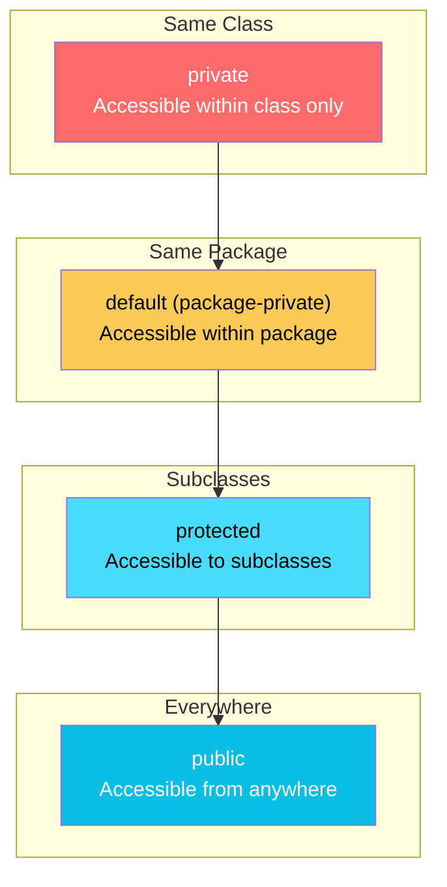
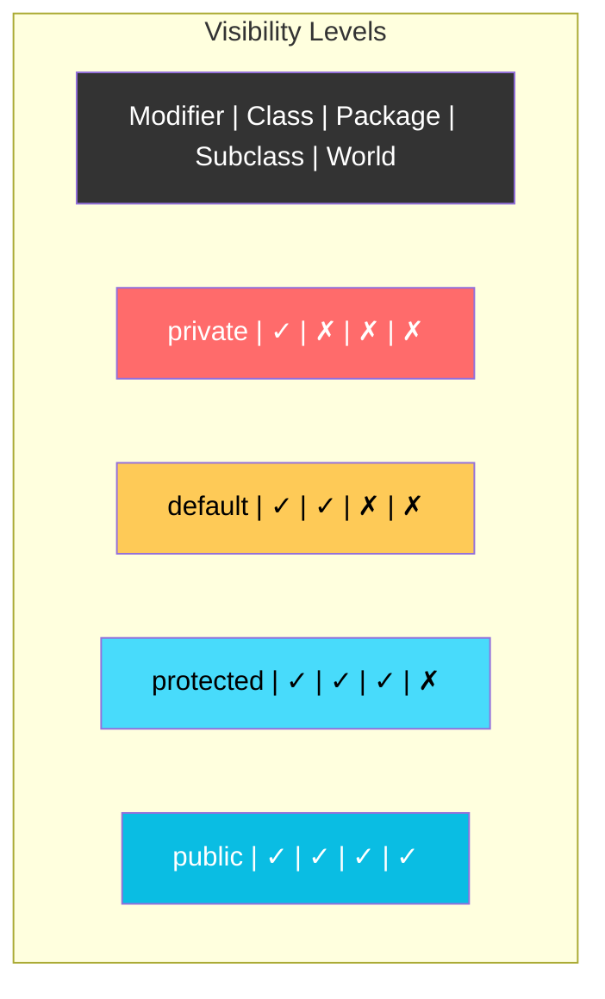
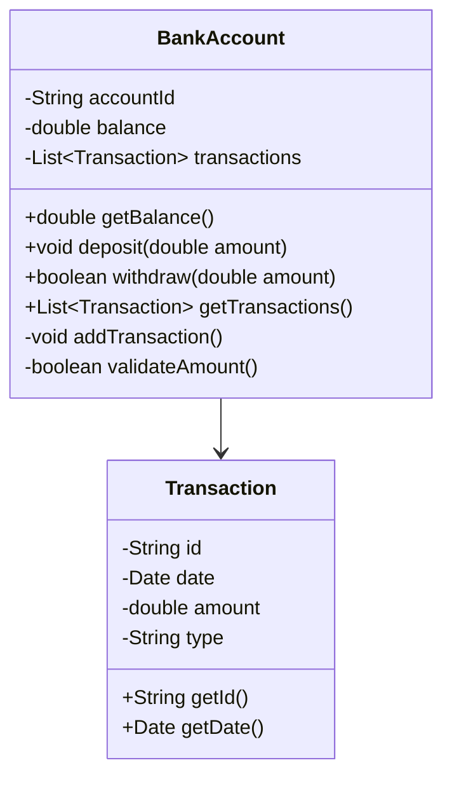
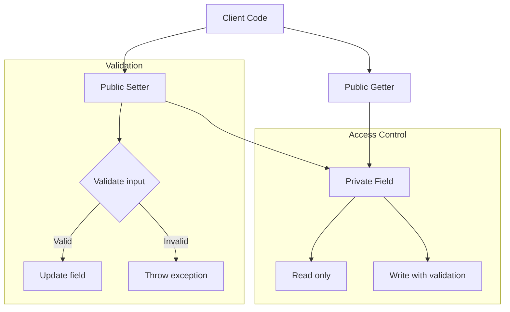
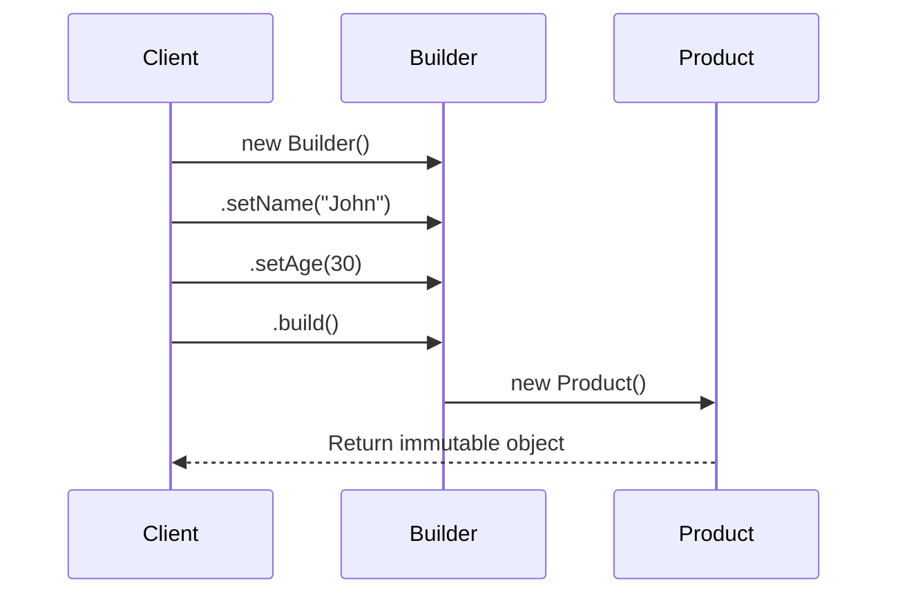
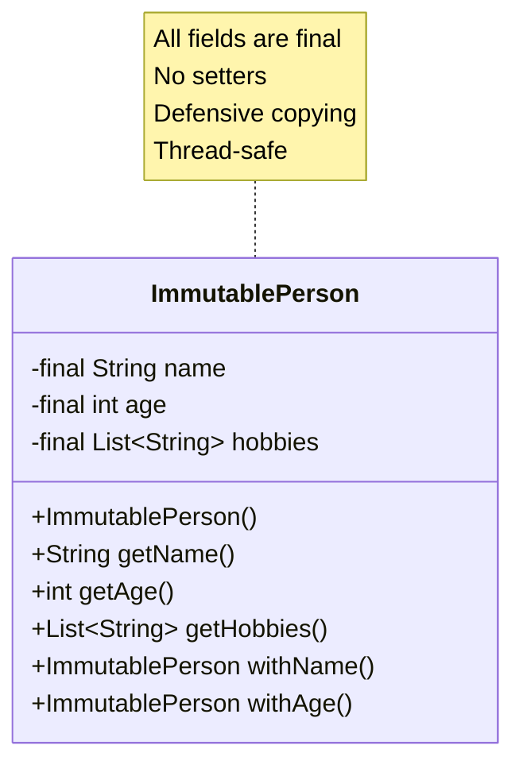

# Encapsulation and Access Modifiers

Encapsulation hides internal implementation details and exposes only necessary functionality through access control.

## Access Modifier Visibility

## Access Modifier Comparison Table

## Encapsulation Example

## Getter/Setter Pattern

## Builder Pattern for Encapsulation

## Immutable Object Pattern

## Key Takeaways

- **private**: Most restrictive, class-only access
- **default**: Package-level access, no modifier needed
- **protected**: Available to subclasses and same package
- **public**: Least restrictive, global access
- **Encapsulation Benefits**: Data hiding, validation, flexibility, maintainability