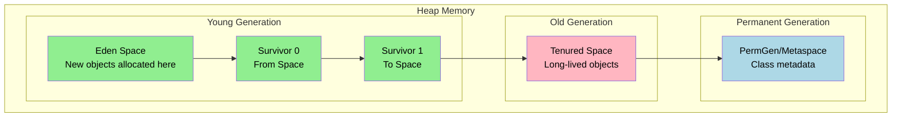
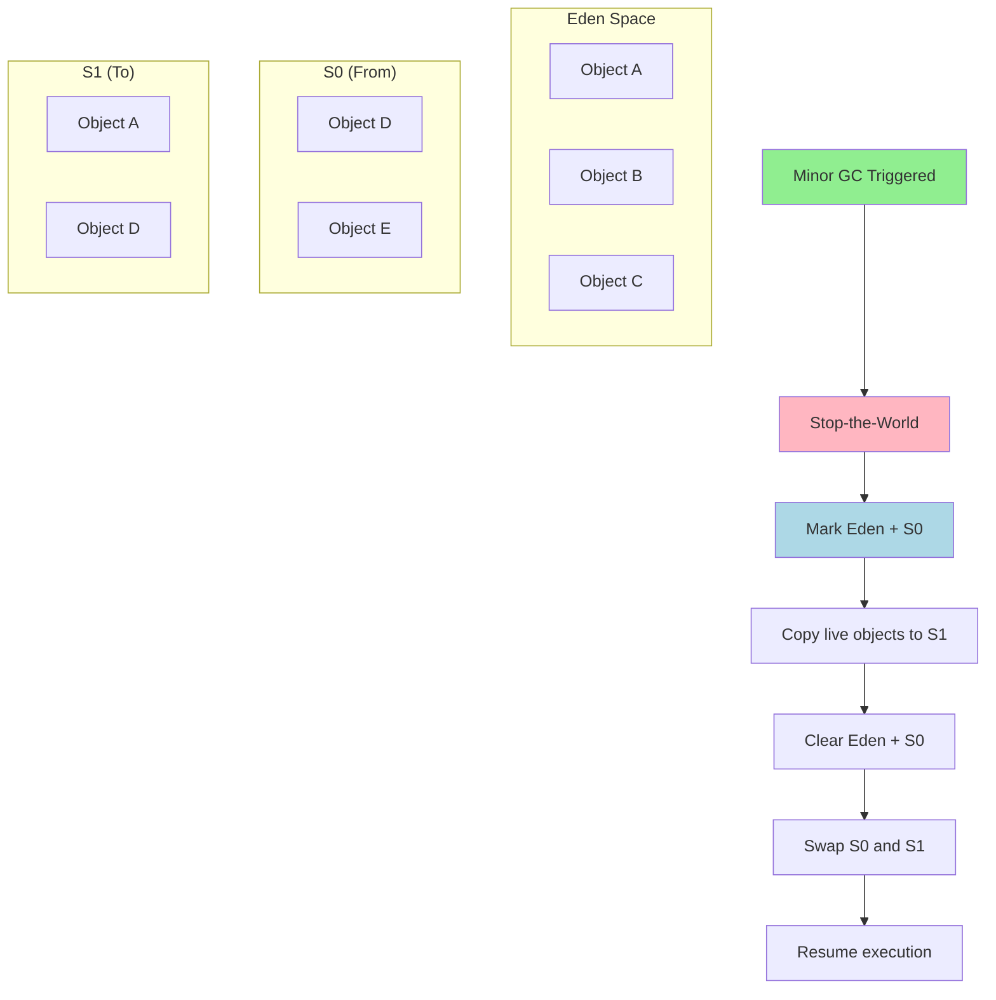
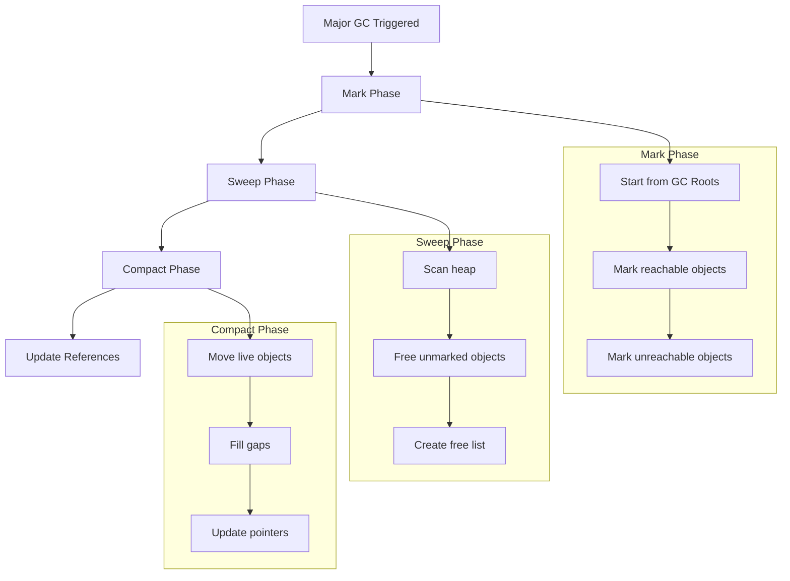
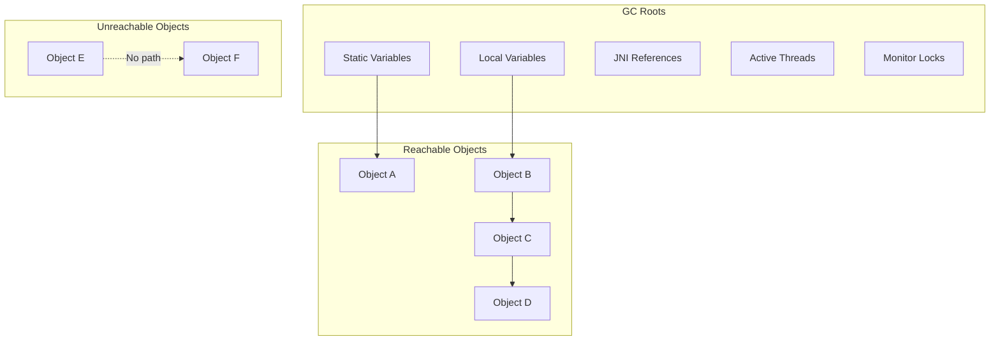
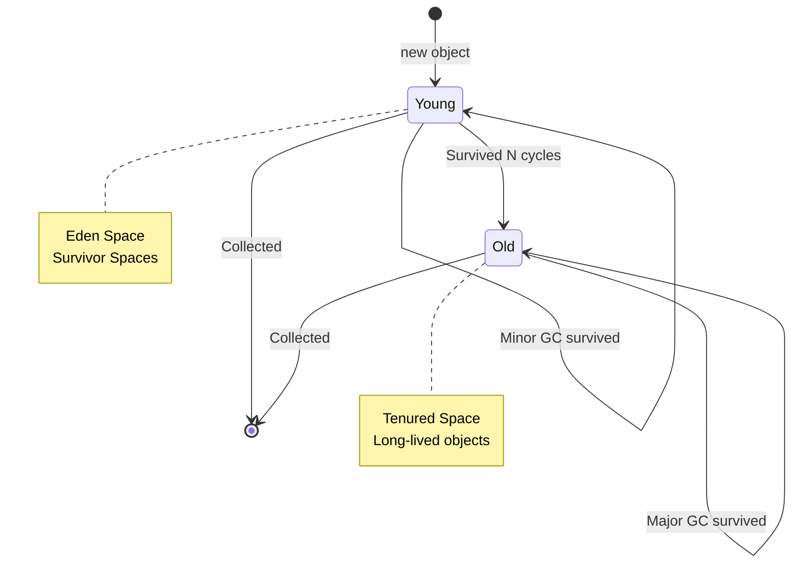

# Garbage Collection Process

Java's garbage collector automatically manages memory by identifying and reclaiming objects that are no longer referenced.

## GC Memory Generations



## Minor GC Process



## Major GC Process



## GC Roots Identification



## GC Algorithms Comparison

```mermaid
graph TB
    subgraph "Serial GC"
        Serial[Single-threaded<br/>Stop-the-world<br/>Good for small apps]
    end
    
    subgraph "Parallel GC"
        Parallel[Multiple threads<br/>Throughput-oriented<br/>Default on server]
    end
    
    subgraph "G1 GC"
        G1[Region-based<br/>Low-latency<br/>Balanced approach]
    end
    
    subgraph "ZGC"
        ZGC[Ultra-low latency<br/>Concurrent processing<br/>Large heaps]
    end
    
    Serial --> Parallel --> G1 --> ZGC
```

## Object Promotion Flow



## Key Takeaways

- **Minor GC**: Collects young generation, short pause times
- **Major GC**: Collects entire heap, longer pause times
- **GC Roots**: Starting points for reachability analysis
- **Generational Hypothesis**: Most objects die young
- **Tuning Options**: `-Xmx`, `-Xms`, `-XX:+UseG1GC`