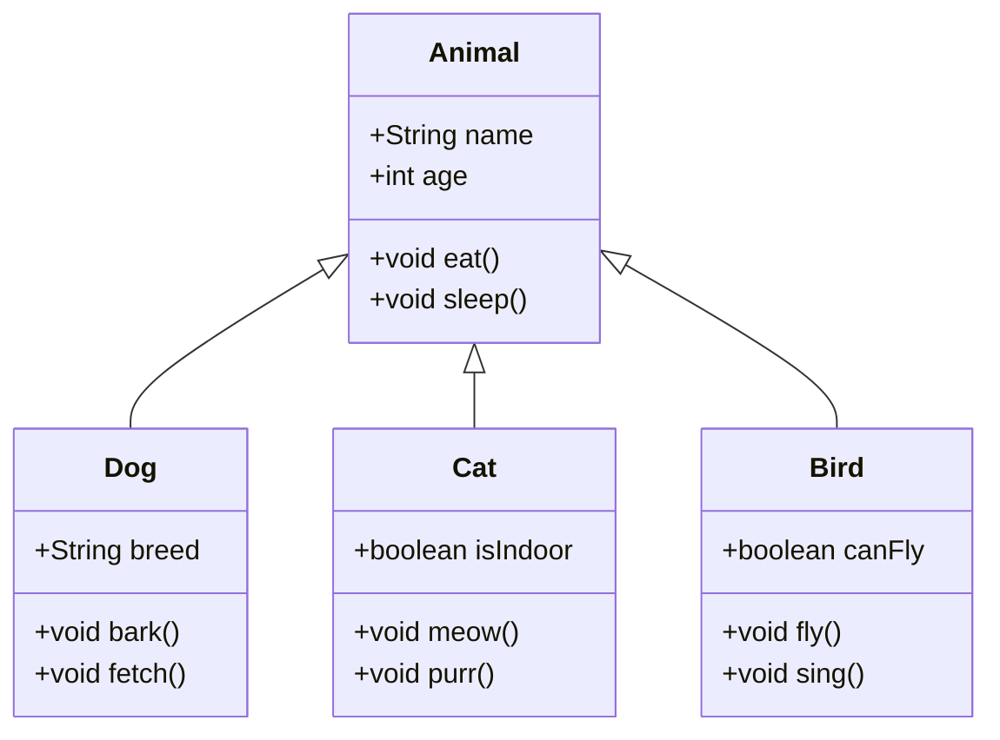
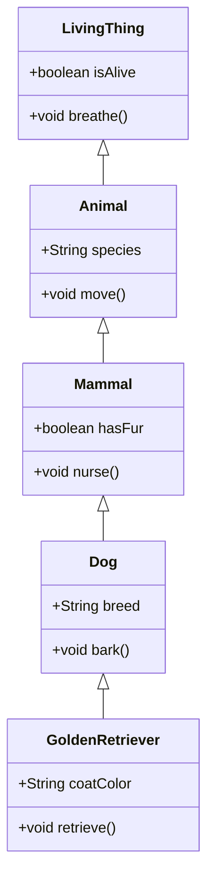
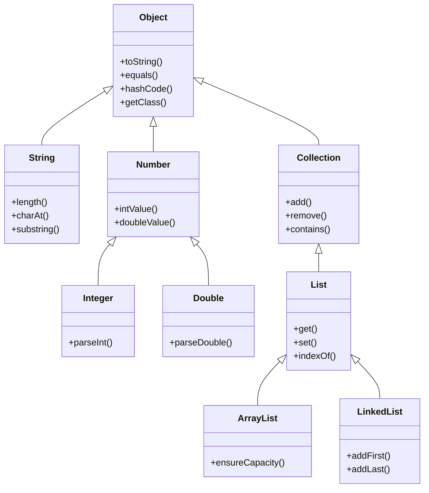
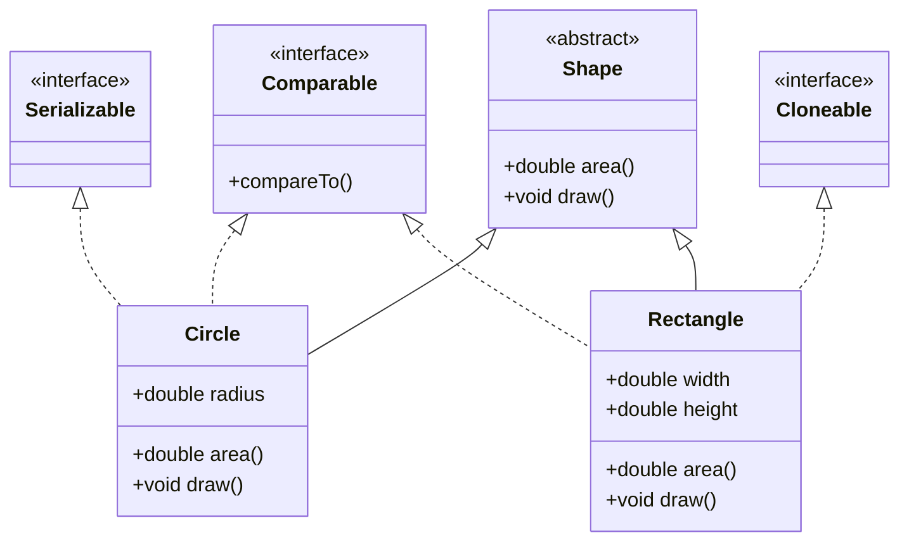

# Class Hierarchy and Inheritance Tree

Inheritance allows classes to inherit properties and methods from parent classes, forming hierarchical relationships.

## Basic Inheritance Structure

## Multi-level Inheritance

## Java Class Hierarchy (Core)

## Interface Implementation

## Key Takeaways

- **Single Inheritance**: Java supports single class inheritance only
- **Interfaces**: Multiple interface implementation is allowed
- **Polymorphism**: Subclasses can override parent methods
- **`extends`**: Keyword for class inheritance
- **`implements`**: Keyword for interface implementation