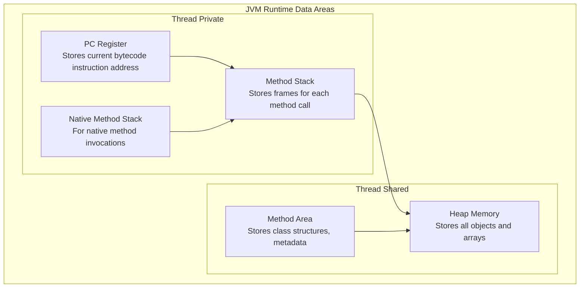
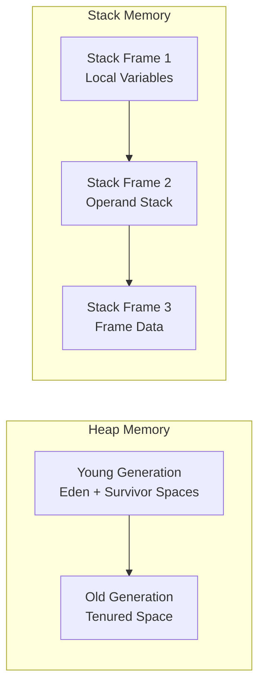
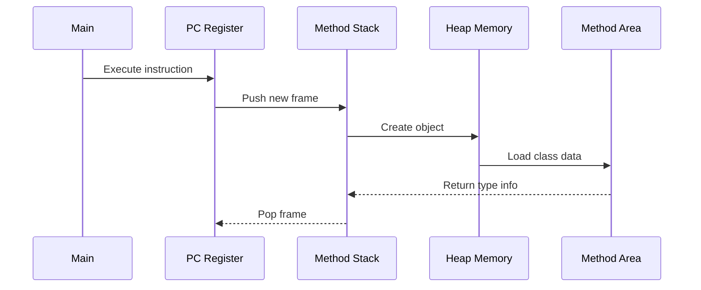

# JVM Architecture: Runtime Data Areas

The Java Virtual Machine (JVM) divides memory into several distinct runtime data areas, each serving a specific purpose during program execution.

## JVM Runtime Data Areas

## Memory Allocation Details

## How Components Interact

## Key Takeaways

- **Heap** is shared across all threads and stores objects
- **Stack** is thread-private and stores method execution state
- **PC Register** tracks the current executing instruction
- **Method Area** stores class metadata and constants
- **Native Method Stack** handles JNI method invocations