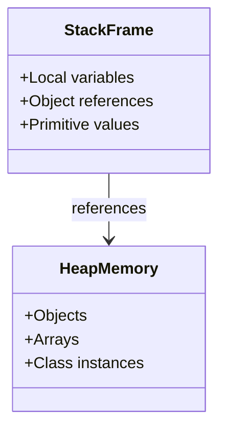
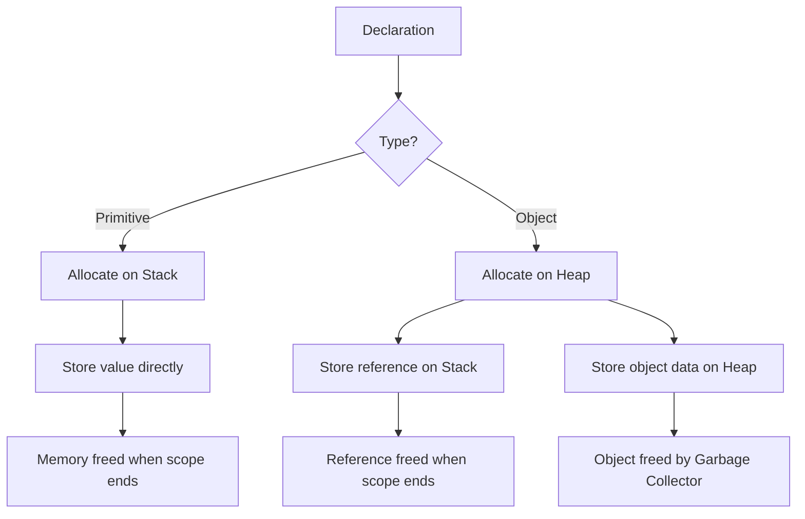
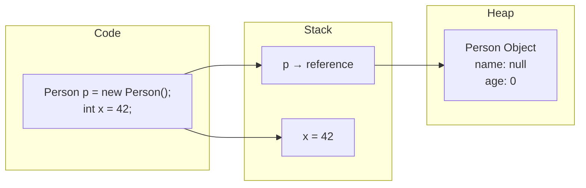

# Java Memory Model: Heap vs Stack

Understanding how Java allocates memory for primitives and objects is fundamental to writing efficient applications.

## Memory Allocation Overview

```mermaid
graph TB
    subgraph "Stack Memory - Thread Private"
        subgraph "Primitive Variables"
            int[int x = 10]
            double[double y = 3.14]
            boolean[boolean flag = true]
        end
        
        subgraph "Object References"
            ref1[Person p]
            ref2[String s]
        end
    end
    
    subgraph "Heap Memory - Shared"
        subgraph "Objects"
            obj1[Person Object<br/>name: "John"<br/>age: 30]
            obj2[String Object<br/>value: "Hello"]
        end
        
        subgraph "Arrays"
            arr1[int[] arr<br/>[1, 2, 3, 4, 5]]
        end
    end
    
    ref1 --> obj1
    ref2 --> obj2
```

## Reference vs Object Storage



## Memory Allocation Flow



## Example Code Visualization



## Key Takeaways

- **Primitives** are stored directly on the stack (faster access)
- **Object references** are stored on the stack, but objects live on the heap
- **Stack memory** is automatically freed when method exits
- **Heap memory** is managed by the Garbage Collector
- **Local variables** have the fastest access time