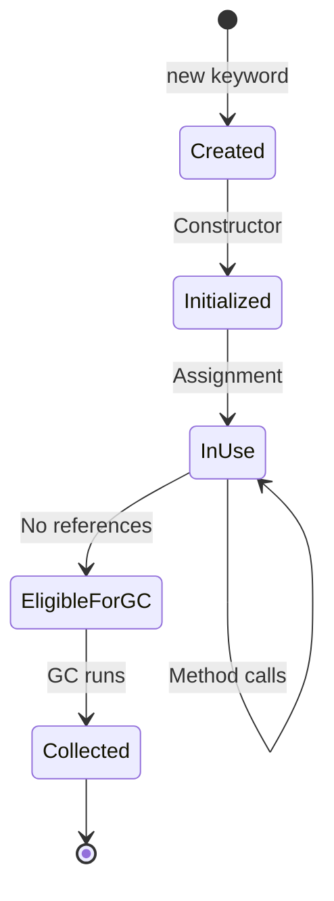
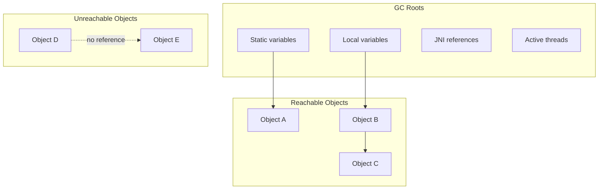
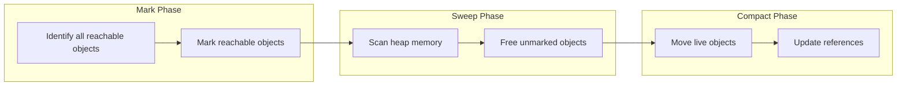
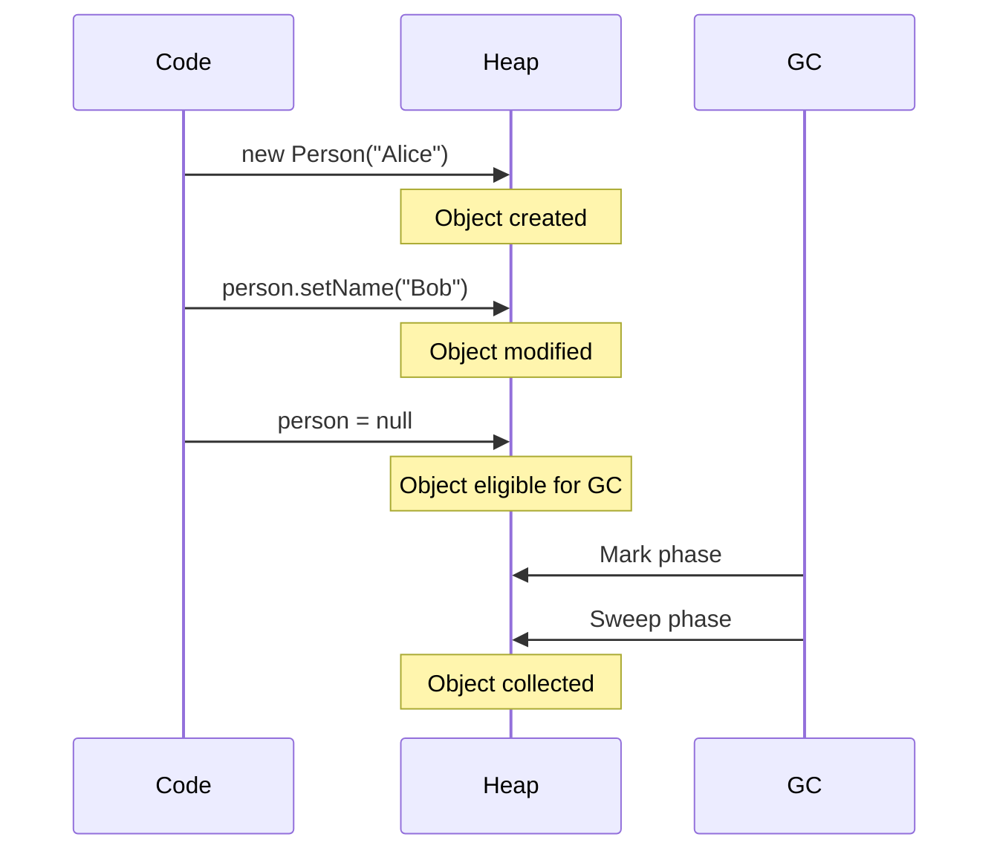

# Object Lifecycle: Creation to Garbage Collection

Objects in Java go through a complete lifecycle from creation to eventual garbage collection.

## Object Lifecycle Overview



## Detailed Object Creation Process

```mermermaid
flowchart TD
    A[1. Class Loading] --> B[2. Memory Allocation]
    B --> C[3. Default Initialization]
    C --> D[4. Constructor Execution]
    D --> E[5. Object Ready]
    
    subgraph "Class Loading"
        A1[Load .class file]
        A2[Verify bytecode]
        A3[Prepare static fields]
    end
    
    subgraph "Memory Allocation"
        B1[Check heap space]
        B2[Allocate memory]
        B3[Set header bits]
    end
    
    subgraph "Initialization"
        D1[Call super constructor]
        D2[Initialize instance variables]
        D3[Execute constructor body]
    end
    
    A --> A1 --> A2 --> A3
    B --> B1 --> B2 --> B3
    D --> D1 --> D2 --> D3
```

## Reference Counting and Reachability



## Garbage Collection Phases



## Example Object Lifecycle



## Key Takeaways

- Objects are created with the `new` keyword
- Constructor initializes the object state
- Objects become eligible for GC when no references exist
- GC runs automatically (you can suggest with `System.gc()`)
- Objects may have `finalize()` method called before collection