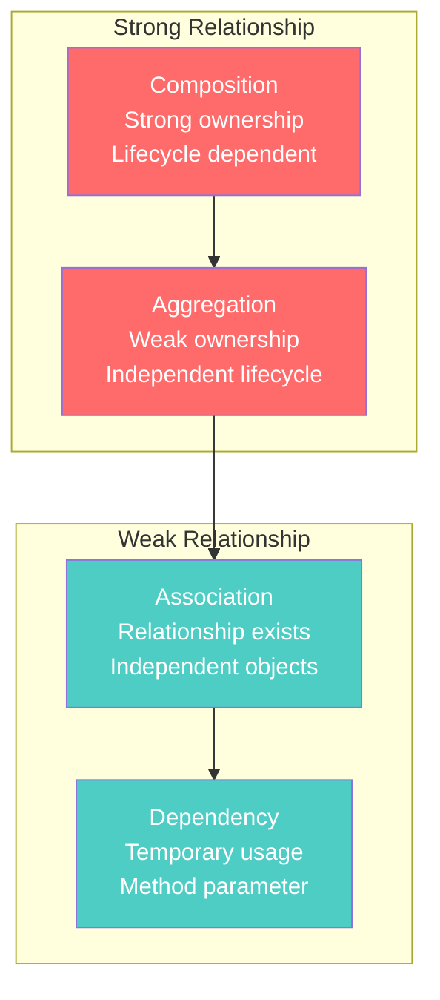
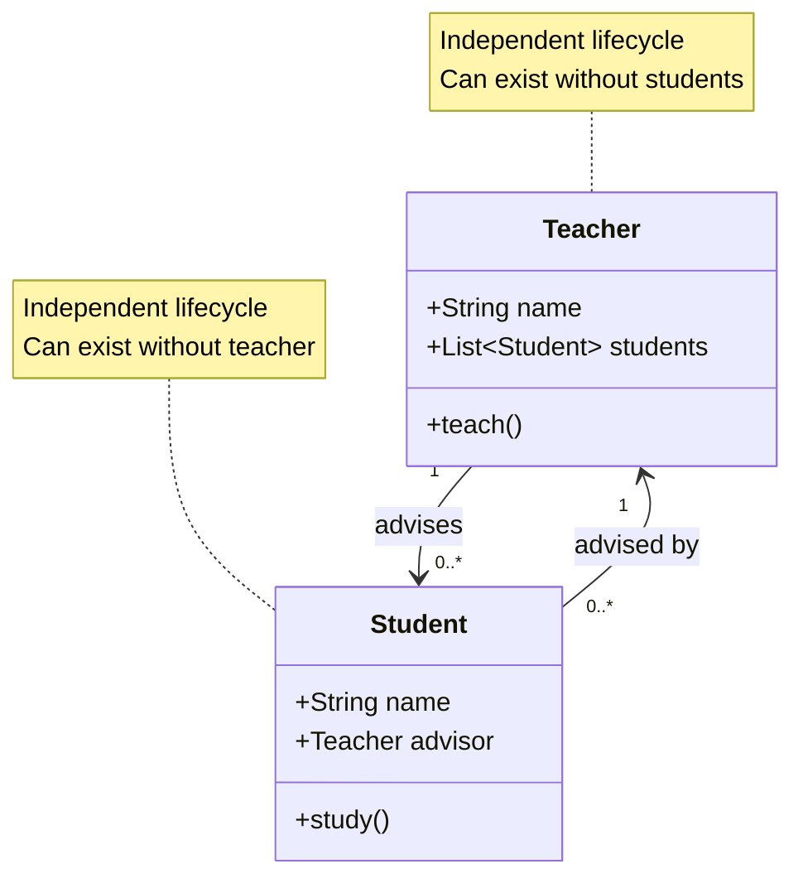
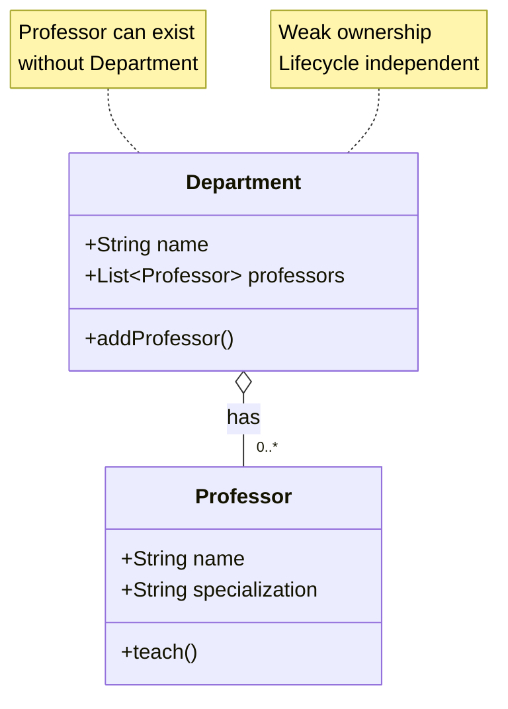
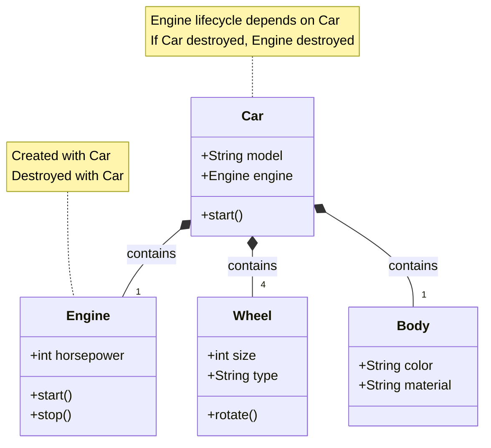
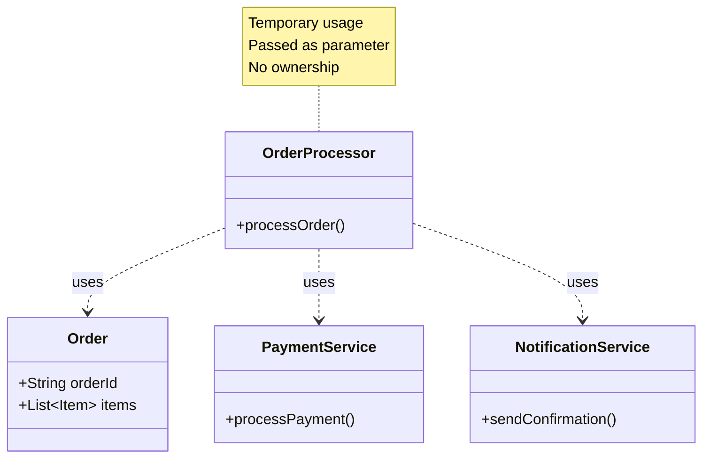
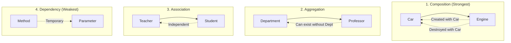
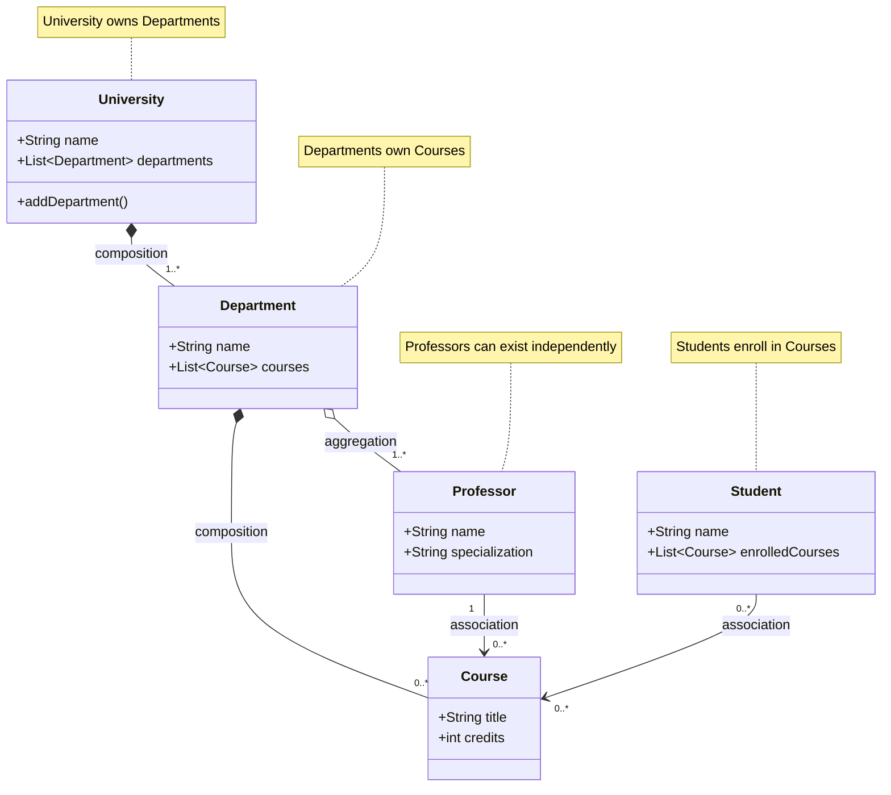

# OOP Relationships: Association, Aggregation, Composition, Dependency

Understanding object relationships is crucial for designing well-structured Java applications.

## Relationship Types Overview

## Association

## Aggregation (Has-A Relationship)

## Composition (Contains-A Relationship)

## Dependency

## Relationship Strength Comparison

## Real-World Example: University System

## Key Takeaways

- **Composition**: Strong ownership, lifecycle dependent (Car-Engine)
- **Aggregation**: Weak ownership, independent lifecycle (Department-Professor)
- **Association**: Relationship exists, independent objects (Teacher-Student)
- **Dependency**: Temporary usage, method parameters (OrderProcessor-Payment)
- **Design Principle**: Prefer composition over inheritance