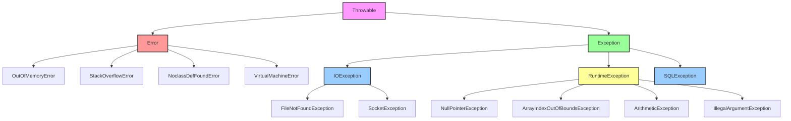

# Exception Handling - Introduction

## 1. Introduction

Exception handling is a fundamental programming construct that allows developers to manage runtime errors and exceptional conditions in a controlled and structured manner. In Java, exception handling provides a reliable mechanism to deal with errors that occur during program execution without crashing the application unexpectedly.

This module introduces the concept of exception handling in Java, covering the basic principles, the exception hierarchy, and the rationale behind having a dedicated error-handling mechanism. Understanding exception handling is crucial for writing reliable, production-ready applications.

## 2. Learning Objectives

By the end of this lesson, you will be able to:

- Understand what exceptions are and why they exist
- Distinguish between errors and exceptions
- Navigate the Java exception hierarchy
- Identify the different types of exceptions (checked vs unchecked)
- Understand the basic flow of exception handling
- Recognize the importance of proper error handling
- Understand the lifecycle of an exception in Java

## 3. Prerequisites

Before diving into exception handling, you should be familiar with:

- Basic Java syntax and programming fundamentals
- Object-oriented programming concepts (inheritance, polymorphism)
- Method declarations and return types
- Basic understanding of the JVM and class loading
- How to compile and run Java programs

## 4. Why This Concept Exists

### The Problem Without Exception Handling

Consider a scenario where you are building a banking application. Without exception handling, a single unexpected input could crash your entire application:

```java
public class BankingSystem {
    public static void main(String[] args) {
        int balance = 1000;
        int withdrawal = 5000; // User tries to withdraw more than balance
        int result = balance - withdrawal; // Negative balance - program error!
        System.out.println("Remaining balance: " + result);
    }
}
```

Without proper error handling mechanisms, the application would either produce incorrect results or terminate unexpectedly.

### The Need for Structured Error Handling

Exception handling exists to:

1. **Separate Error Handling Code**: Keep error handling logic separate from regular business logic
2. **Propagate Errors**: Allow errors to bubble up the call stack until they can be handled appropriately
3. **Provide Context**: Attach meaningful information about what went wrong
4. **Maintain Program Flow**: Allow programs to recover gracefully from unexpected conditions
5. **Standardize Error Reporting**: Provide a consistent way to handle errors across applications

### Historical Context

Before exception handling mechanisms were introduced in programming languages, developers relied on:

- Error codes (returning -1 or null)
- Global error variables (errno in C)
- Conditional checks after every operation

These approaches were error-prone, verbose, and often ignored by developers. Java introduced try-catch-finally to replace error codes with a structured mechanism that separates error handling from business logic and forces developers to deal with failures.

### History

| Version | Change |
|---------|--------|
| JDK 1.0 | Checked exceptions and try-catch-finally introduced — Java enforced error handling at compile time to prevent ignored error codes |
| JDK 1.2 | Chained exceptions added — preserving the cause chain for debugging |
| JDK 7 | Try-with-resources and multi-catch added — reducing boilerplate for resource cleanup |

## 5. Problem Statement

### Challenge 1: Unexpected Program Termination

When an unhandled exception occurs, the JVM terminates the program abruptly, potentially leaving resources in an inconsistent state.

### Challenge 2: Error Code Checking Overhead

```java
// Without exceptions - error codes approach
int result = divide(a, b);
if (result == ERROR_DIVISION_BY_ZERO) {
    // Handle error
} else if (result == ERROR_OVERFLOW) {
    // Handle another error
}
// What if the developer forgets to check?
```

### Challenge 3: Resource Cleanup

Without structured exception handling, ensuring that resources (files, connections, memory) are properly released becomes challenging.

### Challenge 4: Error Information Loss

Simple error codes don't carry enough context about what went wrong, where it happened, or why.

## 6. Theory

### What is an Exception?

An exception is an event that occurs during the execution of a program that disrupts the normal flow of instructions. In Java, an exception is an object that wraps error information and is thrown when an error occurs.

### Exception vs Error

| Aspect | Exception | Error |
|--------|-----------|-------|
| Cause | Application-level issues | System-level issues |
| Recoverability | Often recoverable | Usually unrecoverable |
| Examples | FileNotFoundException, IOException | OutOfMemoryError, StackOverflowError |
| Handling | Should be handled by application | Should not be caught typically |

### The Exception Hierarchy

```
```
Throwable
├── Error (serious problems - should not be caught)
│   ├── OutOfMemoryError
│   ├── StackOverflowError
│   ├── NoClassDefFoundError
│   └── VirtualMachineError
└── Exception (conditions that application can catch and handle)
    ├── IOException (checked)
    │   ├── FileNotFoundException
    │   └── SocketException
    ├── RuntimeException (unchecked)
    │   ├── NullPointerException
    │   ├── ArrayIndexOutOfBoundsException
    │   ├── ArithmeticException
    │   └── IllegalArgumentException
    └── SQLException (checked)
```

### Checked vs Unchecked Exceptions

**Checked Exceptions:**
- Must be either caught or declared in the method signature
- Compiler enforces handling at compile time
- Represent recoverable conditions
- Extend `Exception` but not `RuntimeException`

**Unchecked Exceptions:**
- Don't need to be explicitly caught or declared
- Extend `RuntimeException` or `Error`
- Represent programming errors
- Examples: NullPointerException, ArrayIndexOutOfBoundsException

### Exception Hierarchy Diagram



### Exception Propagation

When an exception is thrown, it propagates up the call stack until:
1. A matching catch block is found
2. The exception reaches the main method and is not handled (program terminates)
3. The exception is caught by the default uncaught exception handler

## 7. Internal Working

### What Happens When an Exception is Thrown?

1. **Exception Object Creation**: The JVM creates an exception object with details (message, stack trace, cause)
2. **Stack Unwinding**: The JVM searches backward through the call stack
3. **Catch Block Search**: Looks for appropriate catch blocks in each method
4. **Resource Cleanup**: Executes finally blocks (if present) during stack unwinding
5. **Exception Handling**: If a matching catch block is found, execution continues there
6. **Program Termination**: If no handler is found, the default uncaught exception handler is invoked

### The Role of the JVM

The Java Virtual Machine is responsible for:
- Creating exception objects
- Managing the call stack during exception propagation
- Executing finally blocks
- Invoking the uncaught exception handler
- Managing stack trace information

## 8. JVM Perspective

### Exception Handling in Bytecode

At the bytecode level, exception handling is managed through:

1. **Exception Table**: Each method has an exception table that maps code ranges to exception handlers
2. **Stack Map Frames**: Used for verification and to determine the state of the operand stack and local variables
3. **JSR/RET Instructions**: Used for finally block implementation (though modern JVMs use exception table entries)

### Exception Table Structure

```
Exception Table:
from    to  target  type
  0    12    15   Class java/io/IOException
  0    12    28   Class java/lang/Exception
 15    22    28   Class java/lang/Exception
```

### JVM Internal Flow

1. When an exception is thrown, the JVM looks up the exception table
2. If a matching entry is found, control transfers to the handler
3. If no entry is found, the exception propagates to the calling method
4. This continues until a handler is found or the program terminates

## 9. Memory Representation

### Exception Object Memory Layout

An exception object in memory contains:

```
Exception Object
├── Object Header (mark word + class pointer)
├── Message String (detail message)
├── Stack Trace Element Array
│   ├── Method name
│   ├── File name
│   ├── Line number
│   └── Native method flag
├── Cause (chained exceptions)
├── Suppressed Exceptions
└── Exception-specific fields
```

### Stack Frame During Exception

When an exception is thrown, the current stack frame contains:
- Local variables
- Operand stack (including the exception object)
- Return address
- Reference to the exception handler

## 10. Syntax

### Basic Try-Catch Syntax

```java
try {
    // Code that might throw an exception
    riskyOperation();
} catch (ExceptionType e) {
    // Code to handle the exception
    handleException(e);
}
```

### Multi-Catch Block

```java
try {
    // Code that might throw multiple types of exceptions
    riskyOperation();
} catch (IOException | SQLException e) {
    // Handle both exception types
    handleException(e);
}
```

### Try-With-Resources

```java
try (Resource resource = new Resource()) {
    // Use the resource
    resource.operate();
} catch (Exception e) {
    // Handle exception
    handleException(e);
}
```

## 11. Easy Example

### Basic Exception Example

```java
public class BasicExceptionExample {
    public static void main(String[] args) {
        try {
            int result = 10 / 0;
            System.out.println("Result: " + result);
        } catch (ArithmeticException e) {
            System.out.println("Error: Cannot divide by zero!");
            System.out.println("Exception message: " + e.getMessage());
        }
        
        System.out.println("Program continues after exception handling");
    }
}
```

**Output:**
```
Error: Cannot divide by zero!
Exception message: / by zero
Program continues after exception handling
```

### Multiple Catch Blocks

```java
public class MultipleCatchExample {
    public static void main(String[] args) {
        try {
            String text = null;
            int length = text.length(); // NullPointerException
            
            int[] numbers = new int[5];
            numbers[10] = 100; // ArrayIndexOutOfBoundsException
            
        } catch (NullPointerException e) {
            System.out.println("Null pointer error: " + e.getMessage());
        } catch (ArrayIndexOutOfBoundsException e) {
            System.out.println("Array index error: " + e.getMessage());
        } catch (Exception e) {
            System.out.println("General error: " + e.getMessage());
        }
    }
}
```

## 12. Medium Example

### File Reading with Exception Handling

```java
import java.io.BufferedReader;
import java.io.FileReader;
import java.io.IOException;

public class FileReadingExample {
    public static void main(String[] args) {
        BufferedReader reader = null;
        
        try {
            reader = new BufferedReader(new FileReader("data.txt"));
            String line;
            while ((line = reader.readLine()) != null) {
                System.out.println(line);
            }
        } catch (IOException e) {
            System.out.println("Error reading file: " + e.getMessage());
            e.printStackTrace();
        } finally {
            try {
                if (reader != null) {
                    reader.close();
                }
            } catch (IOException e) {
                System.out.println("Error closing file: " + e.getMessage());
            }
        }
    }
}
```

### Exception Chaining

```java
public class ExceptionChainingExample {
    public static void main(String[] args) {
        try {
            processData();
        } catch (Exception e) {
            System.out.println("Caught exception: " + e.getMessage());
            System.out.println("Caused by: " + e.getCause().getMessage());
        }
    }
    
    static void processData() throws Exception {
        try {
            int result = Integer.parseInt("invalid");
        } catch (NumberFormatException e) {
            throw new Exception("Failed to process data", e);
        }
    }
}
```

## Engineering Decision Framework

### ✅ Use Exception Handling when:
- Recoverable errors occur (file not found, network timeout)
- Resource cleanup is required (try-with-resources)
- Validating input and signaling business rule violations
- Propagating errors up the call stack
- Maintaining application stability under error conditions

### ❌ Avoid Exception Handling when:
- Flow control (use if-else or Optional instead)
- Frequent, expected conditions (use return codes or Optional)
- Performance-critical paths (exception creation is expensive)
- Simple null checking (use Optional or @NonNull annotations)

### Better Alternatives

| Alternative | When to use |
|-------------|-------------|
| Optional<T> | Method returns that may be absent |
| Result types | Functional error handling without exceptions |
| Validation annotations | Declarative input validation |
| Assert statements | Precondition checking in development |

### Production Examples
- Database connection failure recovery
- File I/O error handling in data pipelines
- REST API error response formatting
- Transaction rollback on business rule violations
- Graceful degradation in microservice calls

### Common Production Mistakes
- Catching generic Exception instead of specific types
- Using exceptions for normal flow control
- Swallowing exceptions silently (empty catch blocks)
- Not preserving the cause chain in wrapped exceptions
- Overly broad try blocks that mask the actual failure point

## Production Incidents

### Incident 1: Exception in Finally Block Masking Original Error

**Problem:** A file processing service reported misleading error messages. The actual failure was hidden, causing engineers to spend 4 hours debugging the wrong issue.
**Cause:** A `finally` block contained `reader.close()` which threw an `IOException`. In Java, if both `try` and `finally` throw exceptions, the `finally` exception overwrites the `try` exception. The original `FileNotFoundException` was lost.
**Impact:** 4 hours of wasted debugging time. Delayed hotfix deployment by 4 hours.
**Detection:** Production logs showed only `IOException` in finally, not the original cause.
**Solution:** Use try-with-resources (`try (Reader r = ...)`) which automatically closes resources and properly chains exceptions. Avoid cleanup code in finally blocks.
**Prevention:** Mandate try-with-resources for all AutoCloseable resources. Add code review checklist item: "No I/O operations in finally blocks."

### Incident 2: Empty Catch Block Hiding Critical Failure

**Problem:** A payment processing service silently failed to record transactions. Financial reconciliation showed missing records for 3 days.
**Cause:** An empty `catch (Exception e) { }` block in the transaction persistence code swallowed a `DataIntegrityViolationException`. The code was originally added to handle a transient error but became a silent failure for all database errors.
**Impact:** 3 days of lost transaction records. Manual reconciliation required. $50K in unaccounted transactions.
**Detection:** Financial audit detected discrepancies between payment gateway logs and database records.
**Solution:** Replace empty catch block with proper exception handling: log the exception, alert on critical failures, and implement retry logic for transient errors.
**Prevention:** Enable static analysis rule for empty catch blocks (SonarQube rule S108). Add lint check that fails CI on empty catch blocks. Document exception handling policy.

## Production Checklist

### ✅ Before using Exception Handling in production:

☐ I know the time/space complexity
☐ I know thread safety guarantees
☐ I know memory impact
☐ I know common mistakes
☐ I know alternatives
☐ I know limitations
☐ I know how to debug it
☐ I've tested with realistic data volume

## Common Myths

### ❌ Myth 1: Exceptions are expensive
**Reality:** Only creation is expensive, not catching. The cost is in stack trace generation, not handling.

### ❌ Myth 2: catch(Exception) is safe
**Reality:** Catches too much including RuntimeExceptions. Prefer specific exception types.

### ❌ Myth 3: finally always runs
**Reality:** Not if JVM exits via System.exit() or fatal error. finally blocks are skipped in those cases.

## 📑 Continue Reading

**Part 1** of 3 | Part 2 | Part 3

## Alternatives

| Approach | Compile-time Safety | Performance | Composability | Use When |
|----------|-------------------|-------------|---------------|----------|
| Try-catch | Yes | Slow (stack trace) | Limited | Recoverable errors |
| Optional<T> | No | Fast | High | Method returns that may be absent |
| Result types | Yes | Fast | High | Functional error handling |
| Error codes | No | Fast | Low | Legacy systems |
| Validation annotations | Yes | Fast | High | Declarative input validation |

## Trade-offs

Exception handling provides structured error management because it:
- Is expensive to create (stack trace generation cost, avoid in hot paths)
- Should not be used for flow control (use if-else or Optional instead)
- Can mask root causes if catch blocks are too broad (catch specific types)
- Finally blocks may not run on System.exit() or JVM crash
- Checked exceptions add verbosity but enforce handling at compile time

## Engineering Maturity Levels

### Level 1: Can Use
- Knows basic syntax
- Can write working code

### Level 2: Understands
- Knows time/space complexity
- Understands thread safety

### Level 3: Deep Knowledge
- Knows internal implementation
- Understands edge cases

### Level 4: Expert
- Knows resize/rehash algorithms
- Can optimize for specific use cases

### Level 5: Master
- Can debug in production
- Can explain trade-offs to team
- Can design custom implementations

