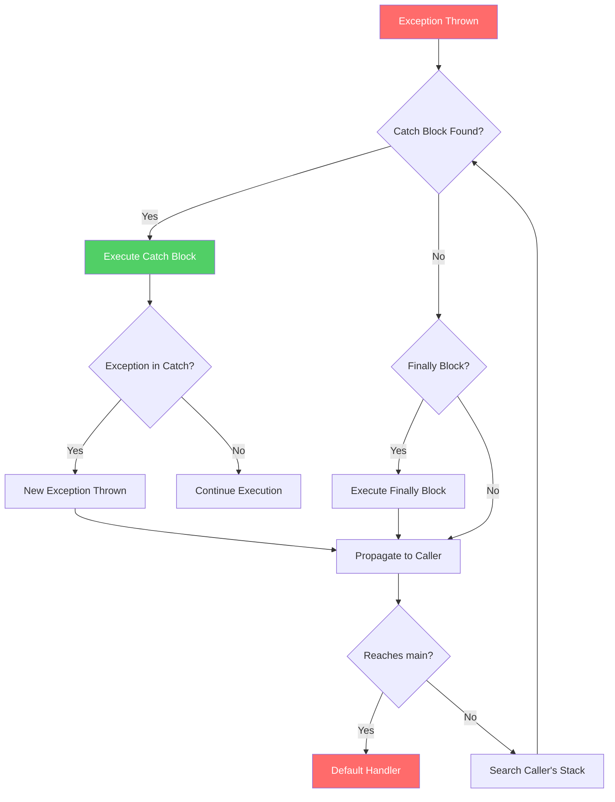

# Try-Catch Blocks

## 1. Introduction

The try-catch block is the fundamental construct for handling exceptions in Java. It allows you to enclose code that might throw an exception and define how to handle it when it occurs. This lesson covers all aspects of try-catch blocks, from basic usage to advanced patterns.

## 2. Learning Objectives

By the end of this lesson, you will be able to:

- Implement try-catch blocks correctly
- Use multiple catch blocks effectively
- Understand catch block ordering and specificity
- Implement multi-catch blocks (Java 7+)
- Handle nested try-catch scenarios
- Understand the flow of control in try-catch
- Apply best practices for exception handling

## 3. Prerequisites

- Basic Java syntax
- Understanding of exception hierarchy
- Knowledge of checked vs unchecked exceptions
- Familiarity with basic OOP concepts

## 4. Why This Concept Exists

### The Problem

Without try-catch, a single exception can crash your entire application:

```java
public class fragileApplication {
    public static void main(String[] args) {
        // If this line throws an exception, everything below never executes
        processData();
        saveResults();
        sendNotification();
    }
}
```

### The Solution

Try-catch provides a structured way to handle exceptional conditions:

```java
public class robustApplication {
    public static void main(String[] args) {
        try {
            processData();
            saveResults();
            sendNotification();
        } catch (DataException e) {
            logger.error("Data processing failed", e);
            notifyAdmin(e);
        }
    }
}
```

## 5. Problem Statement

### Challenge 1: Specific Exception Handling

Different exceptions require different handling strategies. How do you handle multiple exception types appropriately?

### Challenge 2: Resource Cleanup

When exceptions occur, resources need to be cleaned up properly. How do you ensure cleanup happens regardless of success or failure?

### Challenge 3: Exception Information

How do you access detailed information about what went wrong and use it for recovery or logging?

### Challenge 4: Code Organization

How do you structure exception handling code to maintain readability and avoid code duplication?

## 6. Theory

### Try Block

The try block encloses code that might throw an exception. If an exception occurs within the try block, the normal flow of execution is interrupted.

### Catch Block

The catch block follows a try block and contains code to handle a specific type of exception. You can have multiple catch blocks for a single try block.

### Multi-Catch Block (Java 7+)

A multi-catch block allows you to catch multiple exception types in a single catch block using the pipe (|) operator.

### Exception Propagation Flow Diagram



### Exception Propagation

When an exception is thrown in a try block, Java searches for the appropriate catch block in the following order:
1. Exact match in current method
2. Parent class match in current method
3. Propagate to calling method
4. Continue up the call stack

## 7. Internal Working

### Bytecode Implementation

At the bytecode level, try-catch is implemented using:

1. **Exception Table**: Maps ranges of bytecode to exception handlers
2. **Handler Entry Points**: Points to the first instruction of each catch block
3. **Exception Type Filters**: Specifies which exception types each handler catches

### Exception Table Example

```
Exception Table:
from    to  target  type
  0    12    15   Class java/io/IOException
  0    12    28   Class java/lang/Exception
 15    22    28   Class java/lang/Exception
```

## 8. JVM Perspective

### Stack Frame Management

When an exception occurs:

1. The JVM creates an exception object
2. The current stack frame is examined
3. The exception table is consulted
4. If a handler is found, the operand stack is cleared and the exception is pushed
5. Execution jumps to the handler
6. If no handler, the stack frame is popped and the process repeats

### JVM Instructions

- `athrow`: Throws an exception
- `jsr`/`ret`: Used for finally block implementation (legacy)

## 9. Memory Representation

### Exception Object in Memory

```
Exception Object
├── Object Header (mark word + klass pointer)
├── message (String reference)
├── cause (Throwable reference)
├── stackTrace (StackTraceElement[])
├── suppressedExceptions (Throwable[])
└── backtrace (Object - JVM internal)
```

### Stack Frame During Exception

```
Stack Frame
├── Local Variables
├── Operand Stack
│   └── [Exception Object] ← Top of stack
├── Dynamic Linking
├── Return Address
└── Reference to Exception Handler
```

## 10. Syntax

### Basic Try-Catch

```java
try {
    // Code that might throw an exception
    riskyOperation();
} catch (ExceptionType e) {
    // Handle the exception
    handleException(e);
}
```

### Multiple Catch Blocks

```java
try {
    riskyOperation();
} catch (SpecificException1 e) {
    handleSpecific1(e);
} catch (SpecificException2 e) {
    handleSpecific2(e);
} catch (Exception e) {
    handleGeneral(e);
}
```

### Multi-Catch Block

```java
try {
    riskyOperation();
} catch (SpecificException1 | SpecificException2 e) {
    handleBoth(e);
}
```

### Nested Try-Catch

```java
try {
    outerOperation();
    try {
        innerOperation();
    } catch (InnerException e) {
        handleInner(e);
    }
} catch (OuterException e) {
    handleOuter(e);
}
```

## 11. Easy Example

### Basic Try-Catch

```java
public class BasicTryCatch {
    public static void main(String[] args) {
        try {
            int[] numbers = {1, 2, 3};
            System.out.println(numbers[5]); // ArrayIndexOutOfBoundsException
        } catch (ArrayIndexOutOfBoundsException e) {
            System.out.println("Error: Array index out of bounds");
            System.out.println("Index tried: " + e.getMessage());
        }
        System.out.println("Program continues normally");
    }
}
```

### String to Integer Conversion

```java
public class StringConversion {
    public static void main(String[] args) {
        String input = "not_a_number";
        
        try {
            int number = Integer.parseInt(input);
            System.out.println("Number: " + number);
        } catch (NumberFormatException e) {
            System.out.println("Invalid number format: " + input);
        }
    }
}
```

## 12. Medium Example

### Multiple Catch Blocks

```java
import java.io.*;
import java.util.*;

public class MultipleCatchExample {
    public static void main(String[] args) {
        try {
            // Attempt various operations
            String data = readFile("config.txt");
            int value = Integer.parseInt(data.trim());
            int result = 100 / value;
            System.out.println("Result: " + result);
            
        } catch (FileNotFoundException e) {
            System.out.println("Config file not found: " + e.getMessage());
            useDefaultConfig();
            
        } catch (NumberFormatException e) {
            System.out.println("Invalid number in config: " + e.getMessage());
            useDefaultValue();
            
        } catch (ArithmeticException e) {
            System.out.println("Math error: " + e.getMessage());
            useDefaultValue();
            
        } catch (IOException e) {
            System.out.println("IO error: " + e.getMessage());
            handleIOError(e);
        }
    }
    
    static String readFile(String filename) throws IOException {
        // Implementation
        return "10";
    }
    
    static void useDefaultConfig() {}
    static void useDefaultValue() {}
    static void handleIOError(IOException e) {}
}
```

### Multi-Catch Block

```java
import java.util.*;

public class MultiCatchExample {
    public static void processInput(String input) {
        try {
            // Validate input
            if (input == null || input.isEmpty()) {
                throw new IllegalArgumentException("Input cannot be null or empty");
            }
            
            // Parse and process
            int number = Integer.parseInt(input);
            int[] array = new int[10];
            array[number] = 100; // Might throw ArrayIndexOutOfBoundsException
            
            System.out.println("Processed successfully");
            
        } catch (IllegalArgumentException | NumberFormatException 
                 | ArrayIndexOutOfBoundsException e) {
            System.out.println("Input validation failed: " + e.getMessage());
            logError(e);
        }
    }
    
    static void logError(Exception e) {
        // Log the error
    }
    
    public static void main(String[] args) {
        processInput(null);
        processInput("abc");
        processInput("100");
    }
}
```

## 13. Hard Example

### Exception Handler with Recovery

```java
import java.util.*;
import java.io.*;

public class ResilientDataProcessor {
    private static final int MAX_RETRIES = 3;
    private static final long RETRY_DELAY_MS = 1000;
    
    public ProcessingResult processWithRetry(String dataId) {
        int attempt = 0;
        Exception lastException = null;
        
        while (attempt < MAX_RETRIES) {
            try {
                return processData(dataId);
                
            } catch (TransientException e) {
                attempt++;
                lastException = e;
                System.out.printf("Attempt %d failed (transient): %s%n", 
                    attempt, e.getMessage());
                
                if (attempt < MAX_RETRIES) {
                    try {
                        Thread.sleep(RETRY_DELAY_MS * attempt); // Exponential backoff
                    } catch (InterruptedException ie) {
                        Thread.currentThread().interrupt();
                        throw new ProcessingException("Retry interrupted", ie);
                    }
                }
                
            } catch (PermanentException e) {
                System.out.println("Permanent failure: " + e.getMessage());

## 📑 Continue Reading

**Part 1** of 3 | [Part 2](README-part2.md) | [Part 3](README-part3.md)

