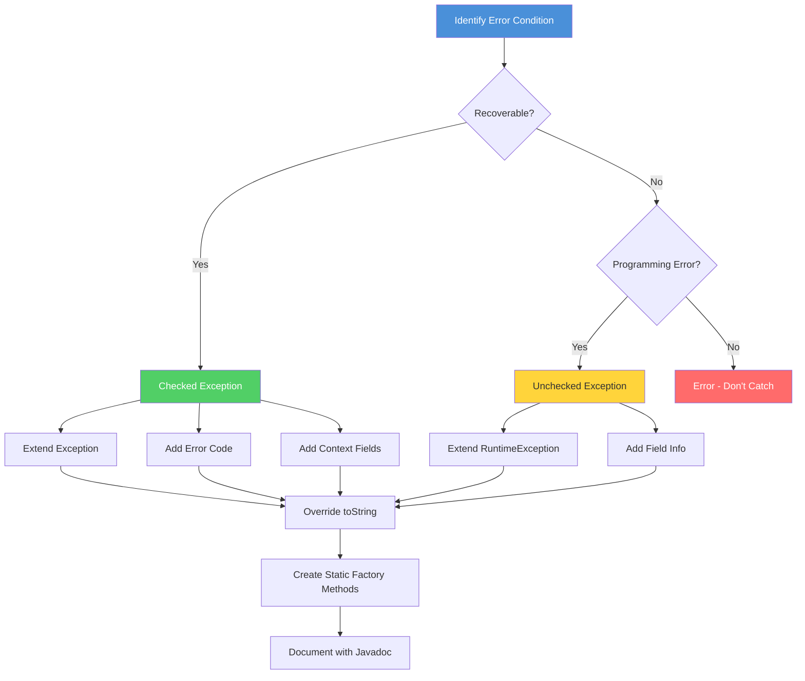

# Custom Exceptions

## 1. Introduction

Custom exceptions allow you to create exception classes tailored to your application's specific error conditions. They provide meaningful error types, carry domain-specific information, and enable better error handling and recovery. This lesson covers the design, implementation, and best practices for custom exceptions.

## 2. Learning Objectives

By the end of this lesson, you will be able to:

- Design custom exception hierarchies
- Create checked and unchecked custom exceptions
- Add domain-specific information to exceptions
- Implement exception factories and builders
- Use custom exceptions effectively in applications
- Follow custom exception best practices
- Debug custom exception issues

## 3. Prerequisites

- Understanding of exception hierarchy
- Knowledge of checked vs unchecked exceptions
- Familiarity with OOP concepts
- Understanding of throw and throws keywords

## 4. Why This Concept Exists

### The Problem

Generic exceptions don't provide domain-specific context:

```java
public void processOrder(Order order) throws Exception {
    if (order == null) throw new Exception("Invalid order");
    if (order.getTotal() <= 0) throw new Exception("Invalid total");
    if (!order.hasItems()) throw new Exception("Empty order");
    // Which exception was it? Hard to handle differently
}
```

### The Solution

Custom exceptions provide meaningful context:

```java
public void processOrder(Order order) throws OrderException {
    if (order == null) throw new NullPointerException("Order cannot be null");
    if (order.getTotal() <= 0) 
        throw new InvalidOrderException("Order total must be positive: " + order.getTotal());
    if (!order.hasItems()) 
        throw new EmptyOrderException("Order must contain at least one item");
    // Each exception type can be handled differently
}
```

## 5. Problem Statement

### Challenge 1: Meaningful Error Types

How do you create exceptions that clearly communicate what went wrong?

### Challenge 2: Error Context

How do you include relevant information for error diagnosis and recovery?

### Challenge 3: Exception Hierarchy

How do you design an exception hierarchy that supports different handling strategies?

### Challenge 4: Exception Factory

How do you create exceptions consistently with proper context?

## 6. Theory

### Custom Exception Types

**Checked Custom Exceptions:**
- Extend `Exception`
- Must be declared or caught
- Use for recoverable conditions

**Unchecked Custom Exceptions:**
- Extend `RuntimeException`
- Don't need declaration
- Use for programming errors

### Custom Exception Creation Flow



### Exception Hierarchy Design

```
```
BaseApplicationException (abstract)
├── ValidationException
│   ├── InvalidFieldException
│   └── MissingFieldException
├── ResourceException
│   ├── NotFoundException
│   ├── AlreadyExistsException
│   └── AccessDeniedException
└── SystemException
    ├── ConfigurationException
    └── IntegrationException
```

### Information to Include

- Error code (for programmatic handling)
- Timestamp
- Request/context information
- Recovery suggestions
- Nested cause chain

## 7. Internal Working

### Exception Object Creation

When creating custom exceptions:
1. Constructor is called
2. Message and cause are set
3. Stack trace is filled (lazy)
4. Custom fields are initialized

### JVM Behavior

The JVM treats custom exceptions the same as standard exceptions:
- Same propagation rules
- Same catch mechanisms
- Same finally block behavior

## 8. JVM Perspective

### Class Loading

Custom exception classes are loaded by the classloader just like any other class. The JVM checks:
- Class hierarchy (must extend Throwable)
- Constructor signature
- Serialization compatibility (if applicable)

### Exception Table

Custom exceptions are stored in the exception table just like standard exceptions:
```
Exception Table:
from    to  target  type
  0    12    15   Class com/example/MyCustomException
```

## 9. Memory Representation

### Custom Exception Object

```
Custom Exception Object
├── Object Header
├── Standard Exception Fields
│   ├── message
│   ├── cause
│   ├── stackTrace
│   └── suppressedExceptions
├. Custom Fields
│   ├── errorCode
│   ├── timestamp
│   ├── context
│   └. recoverySuggestion
```

### Inheritance Chain

```
Object
└── Throwable
    └── Exception
        └── BaseApplicationException
            └── CustomException
```

## 10. Syntax

### Basic Custom Exception

```java
public class CustomException extends Exception {
    public CustomException(String message) {
        super(message);
    }
    
    public CustomException(String message, Throwable cause) {
        super(message, cause);
    }
}
```

### Custom Exception with Error Code

```java
public class BusinessException extends Exception {
    private final String errorCode;
    
    public BusinessException(String message, String errorCode) {
        super(message);
        this.errorCode = errorCode;
    }
    
    public BusinessException(String message, String errorCode, Throwable cause) {
        super(message, cause);
        this.errorCode = errorCode;
    }
    
    public String getErrorCode() {
        return errorCode;
    }
}
```

### Unchecked Custom Exception

```java
public class ValidationException extends RuntimeException {
    private final String field;
    
    public ValidationException(String message, String field) {
        super(message);
        this.field = field;
    }
    
    public String getField() {
        return field;
    }
}
```

## 11. Easy Example

### Simple Custom Exception

```java
public class InsufficientFundsException extends Exception {
    private final double balance;
    private final double amount;
    
    public InsufficientFundsException(double balance, double amount) {
        super(String.format("Insufficient funds: balance=%.2f, amount=%.2f", 
            balance, amount));
        this.balance = balance;
        this.amount = amount;
    }
    
    public double getBalance() { return balance; }
    public double getAmount() { return amount; }
    public double getDeficit() { return amount - balance; }
}

// Usage
public class BankAccount {
    private double balance;
    
    public void withdraw(double amount) throws InsufficientFundsException {
        if (amount > balance) {
            throw new InsufficientFundsException(balance, amount);
        }
        balance -= amount;
    }
    
    public static void main(String[] args) {
        BankAccount account = new BankAccount();
        account.balance = 100;
        
        try {
            account.withdraw(150);
        } catch (InsufficientFundsException e) {
            System.out.println(e.getMessage());
            System.out.printf("You need %.2f more%n", e.getDeficit());
        }
    }
}
```

### Simple Validation Exception

```java
public class ValidationException extends RuntimeException {
    private final String fieldName;
    private final Object invalidValue;
    
    public ValidationException(String fieldName, Object invalidValue, String message) {
        super(String.format("Validation failed for field '%s': %s (value: %s)", 
            fieldName, message, invalidValue));
        this.fieldName = fieldName;
        this.invalidValue = invalidValue;
    }
    
    public String getFieldName() { return fieldName; }
    public Object getInvalidValue() { return invalidValue; }
}

// Usage
public class UserValidator {
    public void validate(User user) {
        if (user.getName() == null || user.getName().isEmpty()) {
            throw new ValidationException("name", user.getName(), "cannot be empty");
        }
        if (user.getAge() < 0 || user.getAge() > 150) {
            throw new ValidationException("age", user.getAge(), "must be between 0 and 150");
        }
    }
}
```

## 12. Medium Example

### Exception Hierarchy

```java
public abstract class ApplicationException extends Exception {
    private final String errorCode;
    private final Instant timestamp;
    
    protected ApplicationException(String message, String errorCode, Throwable cause) {
        super(message, cause);
        this.errorCode = errorCode;
        this.timestamp = Instant.now();
    }
    
    public String getErrorCode() { return errorCode; }
    public Instant getTimestamp() { return timestamp; }
    
    public abstract String getRecoverySuggestion();
    
    @Override
    public String toString() {
        return String.format("%s{errorCode='%s', message='%s', timestamp=%s}", 
            getClass().getSimpleName(), errorCode, getMessage(), timestamp);
    }
}

public class ValidationException extends ApplicationException {
    private final String fieldName;
    
    public ValidationException(String fieldName, String message, Throwable cause) {
        super(message, "VALIDATION_ERROR", cause);
        this.fieldName = fieldName;
    }
    
    public String getFieldName() { return fieldName; }
    
    @Override
    public String getRecoverySuggestion() {
        return String.format("Please check the value for field '%s'", fieldName);
    }
}

public class ResourceNotFoundException extends ApplicationException {
    private final String resourceType;
    private final Object resourceId;
    
    public ResourceNotFoundException(String resourceType, Object resourceId) {
        super(String.format("%s not found with id: %s", resourceType, resourceId), 
            "RESOURCE_NOT_FOUND", null);
        this.resourceType = resourceType;
        this.resourceId = resourceId;
    }
    
    public String getResourceType() { return resourceType; }
    public Object getResourceId() { return resourceId; }
    
    @Override
    public String getRecoverySuggestion() {
        return String.format("Verify the %s with id '%s' exists", resourceType, resourceId);
    }

## 📑 Continue Reading

**Part 1** of 3 | Part 2 | Part 3

