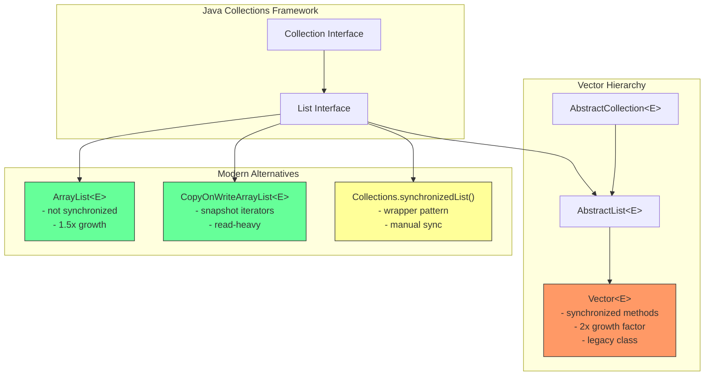
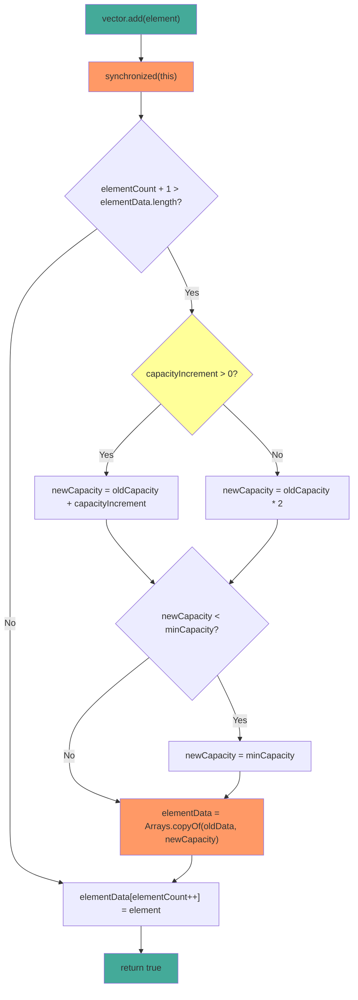

# Vector

## 1. Introduction

Vector is a legacy synchronized (thread-safe) implementation of the `List` interface in Java. It uses a dynamic array internally, similar to ArrayList, but all its methods are synchronized to ensure thread safety. Vector was part of the original Java 1.0 Collections Framework (before the modern Collections Framework was introduced in Java 1.2).

Vector grows its internal array by doubling its size (2x) when capacity is exceeded, compared to ArrayList's 1.5x growth. While Vector is technically thread-safe, its coarse-grained synchronization model makes it inefficient for high-concurrency scenarios. Modern Java provides better alternatives like `CopyOnWriteArrayList`, `Collections.synchronizedList()`, and `ConcurrentLinkedQueue`.

Vector is found extensively in legacy codebases, Swing UI components, and older Java libraries. Understanding Vector helps maintain legacy systems and provides context for why modern concurrent collections were designed the way they were.

## 2. Learning Objectives

- Create and use Vector with generics
- Understand Vector's synchronized method model
- Learn Vector's growth factor (2x) vs ArrayList's (1.5x)
- Compare Vector vs ArrayList performance characteristics
- Understand Vector's legacy methods (addElement, elementAt, firstElement)
- Know when to use Vector vs modern alternatives
- Recognize Vector's fail-fast iterator behavior
- Understand Vector's thread-safety limitations

## 3. Prerequisites

- ArrayList (understanding of dynamic arrays)
- Basic threading concepts (synchronized keyword)
- List interface methods
- Understanding of thread safety basics

## 4. Why This Concept Exists

Before Java 1.2, Vector was the only resizable array implementation available. It was designed in the era of single-threaded applets and early multi-threaded applications. The Java team made all Vector methods synchronized to prevent data corruption in multi-threaded environments.

However, this blanket synchronization approach has significant drawbacks:
- **Performance overhead**: Every method call acquires and releases a monitor lock, even when only one thread is accessing the Vector
- **Coarse-grained locking**: The entire Vector is locked, not individual operations
- **Compound operation issues**: `check-then-act` patterns (like `if (!contains(x)) add(x)`) are still not atomic despite synchronization

Modern alternatives provide better performance by using finer-grained locking or lock-free algorithms.

## 5. Problem Statement

Consider a legacy application that uses Vector for shared data between threads:

```java
// Legacy code using Vector
Vector<String> sharedData = new Vector<>();

// Thread 1: Add data
sharedData.add("data1");
sharedData.add("data2");

// Thread 2: Read data
for (String s : sharedData) {
    process(s);
}
```

While this works correctly due to synchronization, the performance cost is unnecessary if:
- Only one thread writes while others read (use `CopyOnWriteArrayList`)
- Multiple threads read but rarely write (use `Collections.synchronizedList()` with manual synchronization)
- High-concurrency writes are needed (use `ConcurrentLinkedQueue` or `ConcurrentSkipListMap`)

## 6. Theory

### Internal Structure

Vector maintains:
- `protected Object[] elementData`: The backing array (protected, unlike ArrayList's private)
- `protected int elementCount`: Number of elements (named differently than ArrayList's `size`)
- `protected int capacityIncrement`: How much to grow (0 = double the size)

### Growth Mechanism

When `add()` is called and the array is full:
1. If `capacityIncrement > 0`: newCapacity = oldCapacity + capacityIncrement
2. If `capacityIncrement == 0`: newCapacity = oldCapacity * 2 (doubling)
3. A new array of the new capacity is created
4. `System.arraycopy()` copies all elements to the new array
5. The old array becomes eligible for garbage collection

### Synchronization Model

Every public method in Vector is synchronized:
```java
public synchronized boolean add(E e) {
    modCount++;
    ensureCapacityHelper(elementCount + 1);
    elementData[elementCount++] = e;
    return true;
}

public synchronized E get(int index) {
    if (index >= elementCount)
        throw new ArrayIndexOutOfBoundsException(index);
    return elementData(index);
}
```

### Fail-Fast Iterators

Vector uses `modCount` to detect concurrent modification:
```java
final void checkForComodification() {
    if (modCount != expectedModCount)
        throw new ConcurrentModificationException();
}
```

## 7. Internal Working

### The add() Operation

```java
public synchronized boolean add(E e) {
    modCount++;
    ensureCapacityHelper(elementCount + 1);
    elementData[elementCount++] = e;
    return true;
}

private void ensureCapacityHelper(int minCapacity) {
    if (minCapacity - elementData.length > 0)
        grow(minCapacity);
}

private void grow(int minCapacity) {
    int oldCapacity = elementData.length;
    int newCapacity = (capacityIncrement <= 0) ?
        oldCapacity * 2 :  // Doubling
        oldCapacity + capacityIncrement;  // Custom increment
    if (newCapacity - minCapacity < 0)
        newCapacity = minCapacity;
    if (newCapacity - MAX_ARRAY_SIZE > 0)
        newCapacity = hugeCapacity(minCapacity);
    elementData = Arrays.copyOf(elementData, newCapacity);
}
```

### The remove() Operation

```java
public synchronized E remove(int index) {
    modCount++;
    if (index >= elementCount)
        throw new ArrayIndexOutOfBoundsException(index);
    E oldValue = elementData(index);
    int numMoved = elementCount - index - 1;
    if (numMoved > 0)
        System.arraycopy(elementData, index+1, elementData, index, numMoved);
    elementData[--elementCount] = null; // Help GC
    return oldValue;
}
```

### The contains() Operation

```java
public synchronized boolean contains(Object o) {
    return indexOf(o, 0) >= 0;
}

public synchronized int indexOf(Object o, int index) {
    for (int i = index; i < elementCount; i++)
        if (o.equals(elementData[i]))
            return i;
    return -1;
}
```

## 8. JVM Perspective

### Memory Allocation

```java
Vector<String> vector = new Vector<>();
// JVM allocates:
// - Vector object header: 12 bytes (mark word + klass pointer)
// - elementData reference: 8 bytes (pointer to backing array)
// - elementCount field: 4 bytes
// - capacityIncrement field: 4 bytes
// - Padding to 8-byte boundary: 0 bytes
// Total Vector object: ~32 bytes

// When adding elements:
// - Backing array: 10 references x 8 bytes = 80 bytes (default capacity)
// - Each String reference in array: 8 bytes
```

### JIT Optimization

The JIT compiler applies optimizations to Vector:
- **Monomorphic inlining**: If only one thread accesses the Vector, JIT can eliminate synchronization
- **Lock coarsening**: Adjacent synchronized blocks on the same lock may be merged
- **Lock elision**: If escape analysis proves single-threaded access, locks may be removed entirely

### Garbage Collection Impact

- Removed elements set to `null` to help GC
- Resizing creates garbage (old array)
- Synchronization overhead prevents some GC optimizations

## 9. Memory Representation

```
Vector<String> vector = new Vector<>(4);
vector.add("Hello");
vector.add("World");
vector.add("Java");

Memory layout:
┌───────────────────────────────┐
│ Vector object                 │
├───────────────────────────────┤
│ Object header (12 bytes)      │
│ elementData ──────────────────────┐
│ elementCount = 3 (4 bytes)    │      │
│ capacityIncrement = 0 (4 bytes)    │
│ (padding 0 bytes)             │      │
└───────────────────────────────┘      │
                                       ▼
                               Object[] elementData
                               ┌──────────────────┐
                               │ [0] → "Hello"    │ (8 bytes ref)
                               │ [1] → "World"    │ (8 bytes ref)
                               │ [2] → "Java"     │ (8 bytes ref)
                               │ [3] → null       │ (8 bytes, unused)
                               └──────────────────┘
                               Capacity: 4, Size: 3

After adding 4th element (resize):
New capacity = 4 * 2 = 8 (doubling)
Arrays.copyOf() creates new array of size 8
```

## 10. Architecture Diagram



## 11. Flow Diagram



## 12. Syntax

```java
import java.util.Vector;
import java.util.Enumeration;
import java.util.Collections;

// ============================================
// CREATION
// ============================================
Vector<String> empty = new Vector<>();
Vector<String> withCapacity = new Vector<>(100);
Vector<String> withIncrement = new Vector<>(100, 50);  // capacity, increment
Vector<String> fromCollection = new Vector<>(List.of("A", "B", "C"));

// ============================================
// ADDING ELEMENTS (all synchronized)
// ============================================
vector.add("element");              // Append to end
vector.add(0, "element");          // Insert at index
vector.addElement("element");      // Legacy method (same as add)
vector.addAll(List.of("a", "b"));  // Add all from collection

// ============================================
// ACCESSING ELEMENTS (all synchronized)
// ============================================
String element = vector.get(0);           // O(1) random access
String legacy = vector.elementAt(0);      // Legacy method (same as get)
String first = vector.firstElement();     // First element
String last = vector.lastElement();       // Last element
int index = vector.indexOf("element");    // O(n) search
int lastIndex = vector.lastIndexOf("element"); // O(n) search from end
boolean has = vector.contains("element"); // O(n) search

// ============================================
// REMOVING ELEMENTS (all synchronized)
// ============================================
String removed = vector.remove(0);        // Remove by index
boolean success = vector.remove("element"); // Remove by value
vector.removeElement("element");          // Legacy method
vector.removeAllElements();               // Clear all (legacy)
vector.clear();                           // Clear all

// ============================================
// ENUMERATION (legacy, not using Iterator)
// ============================================
Enumeration<String> enumeration = vector.elements();
while (enumeration.hasMoreElements()) {
    System.out.println(enumeration.nextElement());
}

// ============================================
// CAPACITY OPERATIONS
// ============================================
int cap = vector.capacity();         // Current capacity
int size = vector.size();            // Current size
vector.trimToSize();                 // Reduce capacity to size
vector.ensureCapacity(100);          // Ensure minimum capacity

// ============================================
// SORTING (all synchronized)
// ============================================
Collections.sort(vector);                    // Natural order
vector.sort(Comparator.naturalOrder());     // Natural order
vector.sort(Comparator.reverseOrder());     // Reverse order

// ============================================
// ITERATION
// ============================================
// Enhanced for loop
for (String s : vector) {
    System.out.println(s);
}

// Iterator
Iterator<String> it = vector.iterator();
while (it.hasNext()) {
    System.out.println(it.next());
}

// Enumeration (legacy)
Enumeration<String> e = vector.elements();
while (e.hasMoreElements()) {
    System.out.println(e.nextElement());
}
```

## 13. Easy Example

```java
import java.util.Vector;

public class VectorBasics {
    public static void main(String[] args) {
        // Create and populate
        Vector<String> names = new Vector<>();
        names.add("Alice");
        names.add("Bob");
        names.add("Charlie");
        names.add("Diana");

        System.out.println("Names: " + names);
        System.out.println("Size: " + names.size());
        System.out.println("Capacity: " + names.capacity());

        // Access by index
        System.out.println("First: " + names.firstElement());
        System.out.println("Last: " + names.lastElement());
        System.out.println("Element at 1: " + names.elementAt(1));

        // Check if contains
        System.out.println("Contains Bob: " + names.contains("Bob"));
        System.out.println("Index of Charlie: " + names.indexOf("Charlie"));

        // Remove
        names.remove("Diana");
        names.remove(0);
        System.out.println("After removal: " + names);

        // Add at specific position
        names.add(0, "Eve");
        System.out.println("After insert: " + names);

        // Sort
        names.sort(String::compareToIgnoreCase);
        System.out.println("Sorted: " + names);

        // Iterate using Enumeration (legacy)
        System.out.println("Using Enumeration:");
        var enumeration = names.elements();
        while (enumeration.hasMoreElements()) {
            System.out.println("  - " + enumeration.nextElement());
        }
    }
}
```

## 14. Medium Example

```java
import java.util.Vector;
import java.util.Collections;
import java.util.Comparator;

public class VectorOperations {
    public static void main(String[] args) {
        Vector<Integer> numbers = new Vector<>();
        numbers.add(5);
        numbers.add(2);
        numbers.add(8);
        numbers.add(1);
        numbers.add(9);
        numbers.add(3);

        System.out.println("Original: " + numbers);

        // Find max and min (synchronized)
        int max = Collections.max(numbers);
        int min = Collections.min(numbers);
        System.out.println("Max: " + max + ", Min: " + min);

        // Frequency count
        numbers.add(5);
        numbers.add(5);
        int freq = Collections.frequency(numbers, 5);
        System.out.println("Frequency of 5: " + freq);

        // Shuffle
        Collections.shuffle(numbers);
        System.out.println("Shuffled: " + numbers);

        // Reverse
        Collections.reverse(numbers);
        System.out.println("Reversed: " + numbers);

        // Rotate
        Collections.rotate(numbers, 2);
        System.out.println("Rotated by 2: " + numbers);

        // Synchronized iteration
        Vector<String> syncVector = Collections.synchronizedCollection(new Vector<>());
        // Note: Vector is already synchronized, but this pattern is useful for other collections

        // Thread-safe iteration pattern
        synchronized (numbers) {
            for (Integer num : numbers) {
                System.out.print(num + " ");
            }
            System.out.println();
        }
    }
}
```

## 15. Hard Example

```java
import java.util.*;
import java.util.concurrent.*;

public class AdvancedVector {
    public static void main(String[] args) throws InterruptedException {
        // Pattern 1: Thread-safe producer-consumer with Vector
        System.out.println("=== Thread-Safe Producer-Consumer ===");
        Vector<Integer> sharedQueue = new Vector<>();
        int maxSize = 10;

        Thread producer = new Thread(() -> {
            for (int i = 0; i < 20; i++) {
                synchronized (sharedQueue) {
                    while (sharedQueue.size() == maxSize) {
                        try {
                            sharedQueue.wait();
                        } catch (InterruptedException e) {
                            Thread.currentThread().interrupt();
                        }
                    }
                    sharedQueue.add(i);
                    System.out.println("Produced: " + i);
                    sharedQueue.notifyAll();
                }
            }
        });

        Thread consumer = new Thread(() -> {
            int count = 0;
            while (count < 20) {
                synchronized (sharedQueue) {
                    while (sharedQueue.isEmpty()) {
                        try {
                            sharedQueue.wait();
                        } catch (InterruptedException e) {
                            Thread.currentThread().interrupt();
                        }
                    }
                    int value = sharedQueue.remove(0);
                    System.out.println("Consumed: " + value);
                    count++;
                    sharedQueue.notifyAll();
                }
            }
        });

        producer.start();
        consumer.start();
        producer.join();
        consumer.join();

        // Pattern 2: Vector with custom growth tracking
        System.out.println("\n=== Growth Tracking ===");
        TrackedVector<String> tracked = new TrackedVector<>(4);
        for (int i = 0; i < 15; i++) {
            tracked.add("Item" + i);
            System.out.printf("Added Item%d: size=%d, capacity=%d%n",
                i, tracked.size(), tracked.capacity());
        }

        // Pattern 3: Vector as a thread-safe stack
        System.out.println("\n=== Vector as Stack ===");
        Vector<String> stack = new Vector<>();
        stack.push("First");
        stack.push("Second");
        stack.push("Third");
        System.out.println("Pop: " + stack.pop());
        System.out.println("Peek: " + stack.peek());

        // Pattern 4: Enumeration-based iteration (legacy)
        System.out.println("\n=== Enumeration Iteration ===");
        Vector<String> items = new Vector<>(List.of("A", "B", "C", "D", "E"));
        Enumeration<String> e = items.elements();
        while (e.hasMoreElements()) {
            System.out.println("  " + e.nextElement());
        }
    }

    static class TrackedVector<E> extends Vector<E> {
        private final List<Integer> capacityHistory = new ArrayList<>();

        public TrackedVector(int initialCapacity) {
            super(initialCapacity);
            capacityHistory.add(initialCapacity);
        }

        @Override
        public synchronized boolean add(E e) {
            boolean result = super.add(e);
            if (size() > capacityHistory.get(capacityHistory.size() - 1)) {
                capacityHistory.add(capacity());
            }
            return result;
        }

        public List<Integer> getCapacityHistory() {
            return Collections.unmodifiableList(capacityHistory);
        }
    }
}
```

## 16. Enterprise Example

```java
import java.util.*;
import java.util.concurrent.*;

public class LegacyReportingSystem {
    private final Vector<Report> reports;
    private final Vector<AuditLog> auditLogs;

    public LegacyReportingSystem() {
        this.reports = new Vector<>();
        this.auditLogs = new Vector<>();
    }

    // Thread-safe report submission
    public synchronized void submitReport(Report report) {
        reports.add(report);
        auditLogs.add(new AuditLog("REPORT_SUBMITTED", report.id(), new Date()));
    }

    // Thread-safe report retrieval
    public synchronized List<Report> getReportsByStatus(String status) {
        List<Report> result = new ArrayList<>();
        for (Report report : reports) {
            if (report.status().equals(status)) {
                result.add(report);
            }
        }
        return Collections.unmodifiableList(result);
    }

    // Thread-safe report search
    public synchronized Optional<Report> findReportById(String id) {
        for (Report report : reports) {
            if (report.id().equals(id)) {
                return Optional.of(report);
            }
        }
        return Optional.empty();
    }

    // Thread-safe statistics
    public synchronized Map<String, Integer> getReportCountByStatus() {
        Map<String, Integer> counts = new HashMap<>();
        for (Report report : reports) {
            counts.merge(report.status(), 1, Integer::sum);
        }
        return counts;
    }

    // Thread-safe recent reports
    public synchronized List<Report> getRecentReports(int count) {
        int size = reports.size();
        int start = Math.max(0, size - count);
        return new ArrayList<>(reports.subList(start, size));
    }

    // Batch update with synchronization
    public synchronized void updateReportStatus(String oldStatus, String newStatus) {
        for (Report report : reports) {
            if (report.status().equals(oldStatus)) {
                Report updated = new Report(report.id(), report.title(),
                    report.author(), newStatus, report.createdAt());
                reports.set(reports.indexOf(report), updated);
                auditLogs.add(new AuditLog("STATUS_UPDATED",
                    report.id() + " → " + newStatus, new Date()));
            }
        }
    }

    // Audit trail
    public synchronized List<AuditLog> getAuditTrail(String reportId) {
        List<AuditLog> trail = new ArrayList<>();
        for (AuditLog log : auditLogs) {
            if (log.details().contains(reportId)) {
                trail.add(log);
            }
        }
        return trail;
    }

    public static void main(String[] args) {
        LegacyReportingSystem system = new LegacyReportingSystem();

        // Submit reports
        system.submitReport(new Report("R001", "Q1 Sales", "Alice", "PENDING", new Date()));
        system.submitReport(new Report("R002", "Q1 Marketing", "Bob", "APPROVED", new Date()));
        system.submitReport(new Report("R003", "Q1 Engineering", "Charlie", "PENDING", new Date()));

        // Get statistics
        System.out.println("Report counts: " + system.getReportCountByStatus());

        // Get recent reports
        System.out.println("Recent reports:");
        system.getRecentReports(2).forEach(r ->
            System.out.println("  " + r.id() + ": " + r.title())
        );

        // Update statuses
        system.updateReportStatus("PENDING", "IN_REVIEW");
        System.out.println("After update: " + system.getReportCountByStatus());
    }

    record Report(String id, String title, String author, String status, Date createdAt) {}
    record AuditLog(String action, String details, Date timestamp) {}
}
```

## 17. Performance Considerations

### Time Complexity

| Operation | Time | Notes |
|-----------|------|-------|
| add(E) | O(1)* | Amortized, O(n) when resizing (2x) |
| add(int, E) | O(n) | Shifts elements right |
| get(int) | O(1) | Direct array access |
| set(int, E) | O(1) | Direct array access |
| remove(int) | O(n) | Shifts elements left |
| remove(Object) | O(n) | Search + shift |
| contains(Object) | O(n) | Linear search |
| indexOf(Object) | O(n) | Linear search |
| size() | O(1) | Field access |
| capacity() | O(1) | Field access |
| trimToSize() | O(n) | Array copy |
| elements() | O(1) | Creates Enumeration |

*Amortized O(1) due to occasional O(n) resize

### Vector vs ArrayList

| Operation | Vector | ArrayList | Winner |
|-----------|--------|-----------|--------|
| get(index) | O(1) | O(1) | Tie |
| add(end) | O(1)* | O(1)* | Tie |
| add(beginning) | O(n) | O(n) | Tie |
| remove(end) | O(1) | O(1) | Tie |
| remove(beginning) | O(n) | O(n) | Tie |
| contains() | O(n) | O(n) | Tie |
| iteration | O(n) | O(n) | ArrayList |
| memory | More | Less | ArrayList |
| thread-safe | Yes | No | Vector |
| growth factor | 2x | 1.5x | Depends |

### Growth Factor Analysis

| Initial | After 10 adds | After 100 adds | After 1000 adds |
|---------|---------------|----------------|-----------------|
| 10 (Vector) | 20 | 256 | 2048 |
| 10 (ArrayList) | 15 | 169 | 1706 |

The 2x growth factor wastes more memory (up to 50% unused) but reduces resize frequency.

## 18. Time & Space Complexity

### Time Complexity Summary

| Operation | Best | Average | Worst | Notes |
|-----------|------|---------|-------|-------|
| add(E) | O(1) | O(1) | O(n) | Amortized O(1) |
| add(0, E) | O(n) | O(n) | O(n) | Shifts all elements |
| get(int) | O(1) | O(1) | O(1) | Direct access |
| set(int, E) | O(1) | O(1) | O(1) | Direct access |
| remove(int) | O(1) | O(n) | O(n) | Shifts elements |
| remove(Object) | O(n) | O(n) | O(n) | Search + shift |
| contains(Object) | O(1) | O(n) | O(n) | Linear search |
| indexOf(Object) | O(1) | O(n) | O(n) | Linear search |

### Space Complexity

- **Internal array**: O(capacity) where capacity >= size
- **Per element**: 8 bytes (reference)
- **Vector object overhead**: ~32 bytes
- **Growth waste**: Up to 50% with 2x growth (vs 33% with 1.5x)

## 19. Thread Safety

### Synchronized Methods

Every public method in Vector is synchronized:
```java
public synchronized boolean add(E e) { ... }
public synchronized E get(int index) { ... }
public synchronized E remove(int index) { ... }
public synchronized boolean contains(Object o) { ... }
```

### Limitations of Vector's Thread Safety

1. **Compound operations are not atomic**:
   ```java
   // NOT thread-safe even with Vector
   if (!vector.contains(element)) {
       vector.add(element);  // Another thread could add between check and add
   }
   ```

2. **Iteration requires external synchronization**:
   ```java
   synchronized (vector) {
       for (String s : vector) {
           // Safe iteration
       }
   }
   ```

3. **Enumeration is inherently thread-safe** (creates a snapshot):
   ```java
   Enumeration<String> e = vector.elements();
   // Safe to iterate even if vector is modified
   ```

### Modern Alternatives

| Scenario | Recommended Alternative |
|----------|------------------------|
| Read-heavy, write-light | `CopyOnWriteArrayList` |
| General thread-safe list | `Collections.synchronizedList()` |
| High-concurrency writes | `ConcurrentLinkedQueue` |
| Sorted concurrent access | `ConcurrentSkipListSet` |

## 20. Best Practices

1. **Avoid Vector in new code**: Use `ArrayList`, `CopyOnWriteArrayList`, or `Collections.synchronizedList()` instead

2. **Use Enumeration for thread-safe iteration** when you need to iterate without external synchronization:
   ```java
   Enumeration<String> e = vector.elements();
   while (e.hasMoreElements()) {
       process(e.nextElement());
   }
   ```

3. **Set initial capacity** for known sizes to avoid resizing:
   ```java
   Vector<String> vector = new Vector<>(expectedSize);
   ```

4. **Use trimToSize()** after bulk operations to reduce memory:
   ```java
   vector.trimToSize();
   ```

5. **Document thread-safety requirements** when using Vector in APIs

6. **Consider Collections.unmodifiableList()** for read-only views

7. **Use Vector's capacity() method** to understand memory usage

## 21. Common Mistakes

```java
// Mistake 1: Using Vector for single-threaded code (unnecessary overhead)
Vector<String> list = new Vector<>();  // Bad - use ArrayList
List<String> list = new ArrayList<>(); // Good

// Mistake 2: Not synchronizing compound operations
// NOT thread-safe
if (!vector.contains(element)) {
    vector.add(element);  // Race condition
}

// Correct approach
synchronized (vector) {
    if (!vector.contains(element)) {
        vector.add(element);
    }
}

// Mistake 3: Using Vector's legacy methods unnecessarily
vector.addElement("x");  // Legacy - use add() instead
vector.elementAt(0);     // Legacy - use get() instead

// Mistake 4: Not trimming capacity after bulk removal
vector.removeAll(removedElements);
vector.trimToSize();  // Should add this

// Mistake 5: Using enhanced for loop without synchronization
for (String s : vector) {  // ConcurrentModificationException possible
    System.out.println(s);
}
```

## 22. Pitfalls & Warnings

### Performance Overhead
- Every method call acquires a monitor lock
- In single-threaded code, this is pure overhead
- Measurable performance degradation compared to ArrayList

### ConcurrentModificationException
- Vector's iterators are fail-fast
- Modifying vector during iteration (except via Iterator.remove()) throws exception
- Must synchronize externally for safe iteration

### Enumeration vs Iterator
- `elements()` returns Enumeration (legacy, creates snapshot)
- `iterator()` returns Iterator (fail-fast, requires external sync)
- Enumeration is safer in multi-threaded code

### Null Elements
- Vector allows null elements
- This can cause NullPointerException in some operations
- Be cautious when using contains() or indexOf() with null

## 23. Debugging Tips

1. **Check capacity vs size**: Use `capacity()` to understand memory usage
2. **Monitor growth**: Track when resizes occur by logging capacity changes
3. **Use synchronized blocks**: For debugging thread-safety issues
4. **Check modCount**: If getting ConcurrentModificationException, track modification count
5. **Use thread dumps**: If threads are blocked, check for lock contention
6. **Profile synchronization overhead**: Use JProfiler or VisualVM
7. **Compare with ArrayList**: Benchmark to show Vector's overhead

## 24. Comparison Table

| Feature | Vector | ArrayList | CopyOnWriteArrayList |
|---------|--------|-----------|---------------------|
| Thread-safe | Yes | No | Yes |
| Synchronized | Yes | No | Yes (copy-on-write) |
| Growth factor | 2x | 1.5x | 1.5x |
| Iteration | Fail-fast | Fail-fast | Snapshot |
| Memory overhead | Higher | Lower | Higher |
| Write performance | Poor | Good | Poor |
| Read performance | Good | Best | Good |
| Legacy | Yes | No | No |
| Use case | Legacy code | General purpose | Read-heavy |

## 25. Decision Tree

```
Need a thread-safe List?
├── Yes → Read-heavy, write-light?
│   ├── Yes → CopyOnWriteArrayList
│   └── No → Need sorted order?
│       ├── Yes → ConcurrentSkipListSet
│       └── No → Collections.synchronizedList() or Vector (legacy)
├── No → Need dynamic array?
│   ├── Yes → ArrayList (default choice)
│   └── No → Need queue/deque?
│       └── Use ArrayDeque
└── Maintaining legacy code?
    └── Keep Vector, but document as legacy
```

## 26. Interview Questions

### Q1: What makes Vector thread-safe?
**A**: Every public method in Vector is synchronized, meaning only one thread can execute any Vector method at a time. This prevents data corruption but adds significant performance overhead.

### Q2: Why is Vector considered legacy?
**A**: Vector was designed in Java 1.0 with blanket synchronization, which is inefficient for most use cases. Modern alternatives like CopyOnWriteArrayList and Collections.synchronizedList() provide better performance and flexibility.

### Q3: What is the difference between Vector and ArrayList?
**A**: Vector is synchronized (thread-safe) with 2x growth factor. ArrayList is not synchronized (faster) with 1.5x growth factor. Vector is legacy; ArrayList is the modern default.

### Q4: How does Vector grow when capacity is exceeded?
**A**: If capacityIncrement > 0, newCapacity = oldCapacity + capacityIncrement. If capacityIncrement == 0 (default), newCapacity = oldCapacity * 2 (doubling).

### Q5: What is the difference between Vector's elements() and iterator()?
**A**: `elements()` returns an Enumeration (legacy) that creates a snapshot. `iterator()` returns an Iterator that is fail-fast and requires external synchronization for safety.

### Q6: Can Vector have null elements?
**A**: Yes, Vector allows null elements. However, be cautious as this can cause NullPointerException in operations like contains(null) or indexOf(null).

### Q7: Why is Vector's growth factor 2x instead of ArrayList's 1.5x?
**A**: Vector uses 2x growth to reduce resize frequency, but this wastes more memory (up to 50% unused). ArrayList's 1.5x is a better balance between resize frequency and memory usage.

### Q8: How do you safely iterate over a Vector?
**A**: Either synchronize externally: `synchronized(vector) { for(E e : vector) {...} }`, or use `elements()` which creates a snapshot.

### Q9: What is the time complexity of Vector operations?
**A**: get/set: O(1), add(end): O(1) amortized, add(index): O(n), remove: O(n), contains: O(n). All are synchronized.

### Q10: When would you use Vector over ArrayList?
**A**: Only when maintaining legacy code. For new code, use ArrayList with appropriate synchronization strategy (CopyOnWriteArrayList, synchronizedList, etc.).

### Q11: How does Vector's fail-fast iterator work?
**A**: Vector maintains a `modCount` field that increments on structural modification. Iterators check this value and throw ConcurrentModificationException if it changes unexpectedly.

### Q12: What is the memory overhead of Vector vs ArrayList?
**A**: Vector has ~32 bytes object overhead plus elementData array. ArrayList has similar overhead. The main difference is Vector's synchronized methods add call stack overhead.

### Q13: Can Vector be used in a producer-consumer pattern?
**A**: Yes, but you need explicit synchronization for compound operations. The pattern requires synchronized blocks with wait()/notifyAll() for proper coordination.

### Q14: What is the difference between remove() and removeElement()?
**A**: They are functionally identical. `removeElement()` is the legacy method from Java 1.0; `remove()` is the modern List interface method.

### Q15: How do you convert Vector to other collections?
**A**: Use `new ArrayList<>(vector)` for ArrayList, `new HashSet<>(vector)` for Set, or `vector.stream()` for stream operations.

## 27. Exercises

### Exercise 1: Vector Performance Benchmark (Easy)
```java
public class VectorBenchmark {
    public static void main(String[] args) {
        int size = 100000;
        
        // Compare Vector vs ArrayList add performance
        long vectorTime = benchmarkAdd(new Vector<>(), size);
        long arraylistTime = benchmarkAdd(new ArrayList<>(), size);
        
        System.out.println("Vector add: " + vectorTime + " ms");
        System.out.println("ArrayList add: " + arraylistTime + " ms");
        System.out.println("Overhead: " + (vectorTime - arraylistTime) + " ms");
    }
    
    static long benchmarkAdd(List<Integer> list, int size) {
        long start = System.currentTimeMillis();
        for (int i = 0; i < size; i++) {
            list.add(i);
        }
        return System.currentTimeMillis() - start;
    }
}
```

### Exercise 2: Thread-Safe Counter (Medium)
```java
public class ThreadSafeCounter {
    private final Vector<Integer> counts = new Vector<>();
    
    public void increment() {
        synchronized (counts) {
            counts.add(counts.size() + 1);
        }
    }
    
    public int getCount() {
        synchronized (counts) {
            return counts.size();
        }
    }
    
    public static void main(String[] args) throws InterruptedException {
        ThreadSafeCounter counter = new ThreadSafeCounter();
        
        // Multiple threads incrementing
        Thread[] threads = new Thread[10];
        for (int i = 0; i < threads.length; i++) {
            threads[i] = new Thread(() -> {
                for (int j = 0; j < 1000; j++) {
                    counter.increment();
                }
            });
            threads[i].start();
        }
        
        for (Thread t : threads) t.join();
        System.out.println("Final count: " + counter.getCount()); // Should be 10000
    }
}
```

### Exercise 3: Legacy Vector Refactoring (Hard)
```java
// Refactor this legacy Vector code to use modern collections
public class LegacyCode {
    // Old code using Vector
    Vector<User> users = new Vector<>();
    
    public void addUser(User user) {
        if (!users.contains(user)) {
            users.add(user);
        }
    }
    
    public List<User> findByName(String name) {
        List<User> result = new Vector<>();
        for (User u : users) {
            if (u.name().contains(name)) {
                result.add(u);
            }
        }
        return result;
    }
}

// New code using modern collections
public class ModernCode {
    // Use appropriate collection for each use case
    private final List<User> users = new CopyOnWriteArrayList<>();
    private final Map<String, List<User>> nameIndex = new ConcurrentHashMap<>();
    
    public void addUser(User user) {
        if (users.addIfAbsent(user)) {
            nameIndex.computeIfAbsent(user.name(), k -> new CopyOnWriteArrayList<>())
                     .add(user);
        }
    }
    
    public List<User> findByName(String name) {
        return nameIndex.getOrDefault(name, Collections.emptyList());
    }
}
```

## 28. Summary

Vector is a legacy synchronized List implementation that provides thread safety through method-level synchronization:

- **Internal structure**: Dynamic array with 2x growth factor
- **Thread safety**: All methods are synchronized (coarse-grained locking)
- **Performance**: Slower than ArrayList due to synchronization overhead
- **Growth**: Doubles capacity when exceeded (vs ArrayList's 1.5x)
- **Legacy methods**: addElement, elementAt, firstElement, lastElement, elements
- **Modern alternatives**: CopyOnWriteArrayList, Collections.synchronizedList(), ArrayList with manual synchronization
- **Best for**: Legacy code maintenance, not new development
- **Key insight**: Vector's blanket synchronization is inefficient; modern concurrent collections provide better performance

## 29. References

### Official Documentation
- [Vector JavaDoc](https://docs.oracle.com/en/java/javase/21/docs/api/java/util/Vector.html)
- [List Interface](https://docs.oracle.com/en/java/javase/21/docs/api/java/util/List.html)
- [Thread Safety in Java](https://docs.oracle.com/en/java/javase/21/essential/concurrency/)

### Books
- *Effective Java* by Joshua Bloch (Item 81: Prefer concurrency utilities to wait/notify)
- *Java Concurrency in Practice* by Brian Goetz

### Online Resources
- [Baeldung Vector Guide](https://www.baeldung.com/java-vector)
- [GeeksforGeeks Vector](https://www.geeksforgeeks.org/vector-java-class/)
- [OpenJDK Vector Source](https://hg.openjdk.java.net/jdk8/jdk8/jdk/file/tip/src/share/classes/java/util/Vector.java)

### Related Topics
- [ArrayList](../03-arraylist/README.md)
- [Stack](../06-stack/README.md)
- [CopyOnWriteArrayList](../26-fail-fast-vs-fail-safe/README.md)
