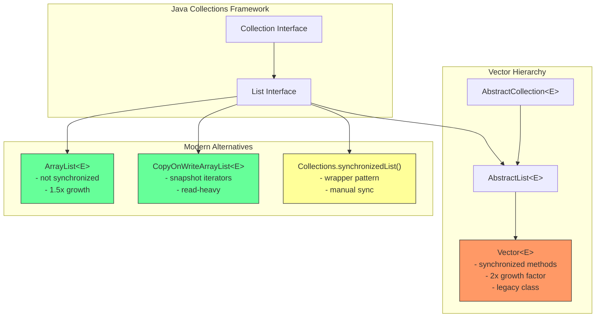
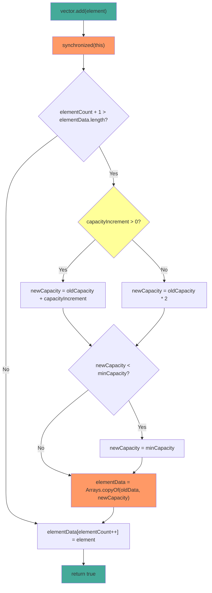

# Vector

## 1. Introduction

Vector is a legacy synchronized (thread-safe) implementation of the `List` interface in Java. It uses a dynamic array internally, similar to ArrayList, but all its methods are synchronized to ensure thread safety. Vector was part of the original Java 1.0 Collections Framework (before the modern Collections Framework was introduced in Java 1.2).

Vector grows its internal array by doubling its size (2x) when capacity is exceeded, compared to ArrayList's 1.5x growth. While Vector is technically thread-safe, its coarse-grained synchronization model makes it inefficient for high-concurrency scenarios. Modern Java provides better alternatives like `CopyOnWriteArrayList`, `Collections.synchronizedList()`, and `ConcurrentLinkedQueue`.

Vector is found extensively in legacy codebases, Swing UI components, and older Java libraries. Understanding Vector helps maintain legacy systems and provides context for why modern concurrent collections were designed the way they were.

## 2. Learning Objectives

- Create and use Vector with generics
- Understand Vector's synchronized method model
- Learn Vector's growth factor (2x) vs ArrayList's (1.5x)
- Compare Vector vs ArrayList performance characteristics
- Understand Vector's legacy methods (addElement, elementAt, firstElement)
- Know when to use Vector vs modern alternatives
- Recognize Vector's fail-fast iterator behavior
- Understand Vector's thread-safety limitations

## 3. Prerequisites

- ArrayList (understanding of dynamic arrays)
- Basic threading concepts (synchronized keyword)
- List interface methods
- Understanding of thread safety basics

## 4. Why This Concept Exists

Before Java 1.2, Vector was the only resizable array implementation available. It was designed in the era of single-threaded applets and early multi-threaded applications. The Java team made all Vector methods synchronized to prevent data corruption in multi-threaded environments.

However, this blanket synchronization approach has significant drawbacks:
- **Performance overhead**: Every method call acquires and releases a monitor lock, even when only one thread is accessing the Vector
- **Coarse-grained locking**: The entire Vector is locked, not individual operations
- **Compound operation issues**: `check-then-act` patterns (like `if (!contains(x)) add(x)`) are still not atomic despite synchronization

Modern alternatives provide better performance by using finer-grained locking or lock-free algorithms.

## 5. Problem Statement

Consider a legacy application that uses Vector for shared data between threads:

```java
// Legacy code using Vector
Vector<String> sharedData = new Vector<>();

// Thread 1: Add data
sharedData.add("data1");
sharedData.add("data2");

// Thread 2: Read data
for (String s : sharedData) {
    process(s);
}
```

While this works correctly due to synchronization, the performance cost is unnecessary if:
- Only one thread writes while others read (use `CopyOnWriteArrayList`)
- Multiple threads read but rarely write (use `Collections.synchronizedList()` with manual synchronization)
- High-concurrency writes are needed (use `ConcurrentLinkedQueue` or `ConcurrentSkipListMap`)

## 6. Theory

### Internal Structure

Vector maintains:
- `protected Object[] elementData`: The backing array (protected, unlike ArrayList's private)
- `protected int elementCount`: Number of elements (named differently than ArrayList's `size`)
- `protected int capacityIncrement`: How much to grow (0 = double the size)

### Growth Mechanism

When `add()` is called and the array is full:
1. If `capacityIncrement > 0`: newCapacity = oldCapacity + capacityIncrement
2. If `capacityIncrement == 0`: newCapacity = oldCapacity * 2 (doubling)
3. A new array of the new capacity is created
4. `System.arraycopy()` copies all elements to the new array
5. The old array becomes eligible for garbage collection

### Synchronization Model

Every public method in Vector is synchronized:
```java
public synchronized boolean add(E e) {
    modCount++;
    ensureCapacityHelper(elementCount + 1);
    elementData[elementCount++] = e;
    return true;
}

public synchronized E get(int index) {
    if (index >= elementCount)
        throw new ArrayIndexOutOfBoundsException(index);
    return elementData(index);
}
```

### Fail-Fast Iterators

Vector uses `modCount` to detect concurrent modification:
```java
final void checkForComodification() {
    if (modCount != expectedModCount)
        throw new ConcurrentModificationException();
}
```

## 7. Internal Working

### The add() Operation

```java
public synchronized boolean add(E e) {
    modCount++;
    ensureCapacityHelper(elementCount + 1);
    elementData[elementCount++] = e;
    return true;
}

private void ensureCapacityHelper(int minCapacity) {
    if (minCapacity - elementData.length > 0)
        grow(minCapacity);
}

private void grow(int minCapacity) {
    int oldCapacity = elementData.length;
    int newCapacity = (capacityIncrement <= 0) ?
        oldCapacity * 2 :  // Doubling
        oldCapacity + capacityIncrement;  // Custom increment
    if (newCapacity - minCapacity < 0)
        newCapacity = minCapacity;
    if (newCapacity - MAX_ARRAY_SIZE > 0)
        newCapacity = hugeCapacity(minCapacity);
    elementData = Arrays.copyOf(elementData, newCapacity);
}
```

### The remove() Operation

```java
public synchronized E remove(int index) {
    modCount++;
    if (index >= elementCount)
        throw new ArrayIndexOutOfBoundsException(index);
    E oldValue = elementData(index);
    int numMoved = elementCount - index - 1;
    if (numMoved > 0)
        System.arraycopy(elementData, index+1, elementData, index, numMoved);
    elementData[--elementCount] = null; // Help GC
    return oldValue;
}
```

### The contains() Operation

```java
public synchronized boolean contains(Object o) {
    return indexOf(o, 0) >= 0;
}

public synchronized int indexOf(Object o, int index) {
    for (int i = index; i < elementCount; i++)
        if (o.equals(elementData[i]))
            return i;
    return -1;
}
```

## 8. JVM Perspective

### Memory Allocation

```java
Vector<String> vector = new Vector<>();
// JVM allocates:
// - Vector object header: 12 bytes (mark word + klass pointer)
// - elementData reference: 8 bytes (pointer to backing array)
// - elementCount field: 4 bytes
// - capacityIncrement field: 4 bytes
// - Padding to 8-byte boundary: 0 bytes
// Total Vector object: ~32 bytes

// When adding elements:
// - Backing array: 10 references x 8 bytes = 80 bytes (default capacity)
// - Each String reference in array: 8 bytes
```

### JIT Optimization

The JIT compiler applies optimizations to Vector:
- **Monomorphic inlining**: If only one thread accesses the Vector, JIT can eliminate synchronization
- **Lock coarsening**: Adjacent synchronized blocks on the same lock may be merged
- **Lock elision**: If escape analysis proves single-threaded access, locks may be removed entirely

### Garbage Collection Impact

- Removed elements set to `null` to help GC
- Resizing creates garbage (old array)
- Synchronization overhead prevents some GC optimizations

## 9. Memory Representation

```
```
Vector<String> vector = new Vector<>(4);
vector.add("Hello");
vector.add("World");
vector.add("Java");

Memory layout:
┌───────────────────────────────┐
│ Vector object                 │
├───────────────────────────────┤
│ Object header (12 bytes)      │
│ elementData ──────────────────────┐
│ elementCount = 3 (4 bytes)    │      │
│ capacityIncrement = 0 (4 bytes)    │
│ (padding 0 bytes)             │      │
└───────────────────────────────┘      │
                                       ▼
                               Object[] elementData
                               ┌──────────────────┐
                               │ [0] → "Hello"    │ (8 bytes ref)
                               │ [1] → "World"    │ (8 bytes ref)
                               │ [2] → "Java"     │ (8 bytes ref)
                               │ [3] → null       │ (8 bytes, unused)
                               └──────────────────┘
                               Capacity: 4, Size: 3

After adding 4th element (resize):
New capacity = 4 * 2 = 8 (doubling)
Arrays.copyOf() creates new array of size 8
```

## 10. Architecture Diagram



## 11. Flow Diagram



## 12. Syntax

```java
import java.util.Vector;
import java.util.Enumeration;
import java.util.Collections;

// ============================================
// CREATION
// ============================================
Vector<String> empty = new Vector<>();
Vector<String> withCapacity = new Vector<>(100);
Vector<String> withIncrement = new Vector<>(100, 50);  // capacity, increment
Vector<String> fromCollection = new Vector<>(List.of("A", "B", "C"));

// ============================================
// ADDING ELEMENTS (all synchronized)
// ============================================
vector.add("element");              // Append to end
vector.add(0, "element");          // Insert at index
vector.addElement("element");      // Legacy method (same as add)
vector.addAll(List.of("a", "b"));  // Add all from collection

// ============================================
// ACCESSING ELEMENTS (all synchronized)
// ============================================
String element = vector.get(0);           // O(1) random access
String legacy = vector.elementAt(0);      // Legacy method (same as get)
String first = vector.firstElement();     // First element
String last = vector.lastElement();       // Last element
int index = vector.indexOf("element");    // O(n) search
int lastIndex = vector.lastIndexOf("element"); // O(n) search from end
boolean has = vector.contains("element"); // O(n) search

// ============================================
// REMOVING ELEMENTS (all synchronized)
// ============================================
String removed = vector.remove(0);        // Remove by index
boolean success = vector.remove("element"); // Remove by value
vector.removeElement("element");          // Legacy method
vector.removeAllElements();               // Clear all (legacy)
vector.clear();                           // Clear all

// ============================================
// ENUMERATION (legacy, not using Iterator)
// ============================================
Enumeration<String> enumeration = vector.elements();
while (enumeration.hasMoreElements()) {
    System.out.println(enumeration.nextElement());
}

// ============================================
// CAPACITY OPERATIONS
// ============================================
int cap = vector.capacity();         // Current capacity
int size = vector.size();            // Current size
vector.trimToSize();                 // Reduce capacity to size
vector.ensureCapacity(100);          // Ensure minimum capacity

// ============================================
// SORTING (all synchronized)
// ============================================
Collections.sort(vector);                    // Natural order
vector.sort(Comparator.naturalOrder());     // Natural order
vector.sort(Comparator.reverseOrder());     // Reverse order

// ============================================
// ITERATION
// ============================================
// Enhanced for loop
for (String s : vector) {
    System.out.println(s);
}

// Iterator
Iterator<String> it = vector.iterator();
while (it.hasNext()) {
    System.out.println(it.next());
}

// Enumeration (legacy)
Enumeration<String> e = vector.elements();
while (e.hasMoreElements()) {
    System.out.println(e.nextElement());
}
```

## 13. Easy Example

```java
import java.util.Vector;

public class VectorBasics {
    public static void main(String[] args) {
        // Create and populate
        Vector<String> names = new Vector<>();
        names.add("Alice");
        names.add("Bob");
        names.add("Charlie");
        names.add("Diana");

        System.out.println("Names: " + names);
        System.out.println("Size: " + names.size());
        System.out.println("Capacity: " + names.capacity());

        // Access by index

## 📑 Continue Reading

**Part 1** of 3 | [Part 2](README-part2.md) | [Part 3](README-part3.md)

