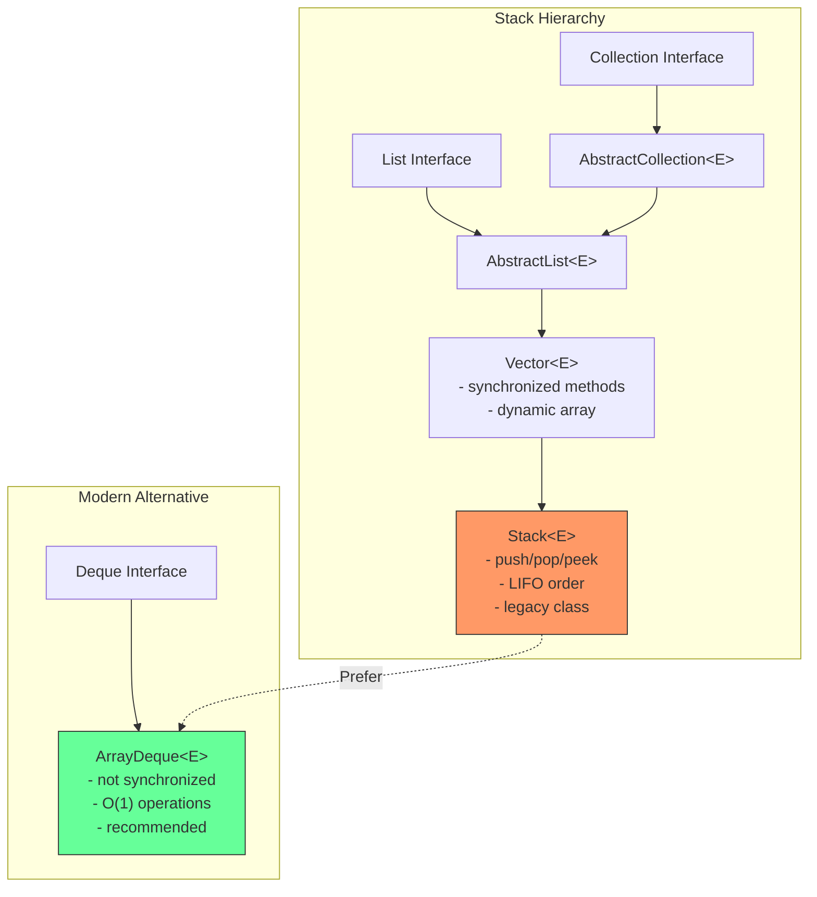
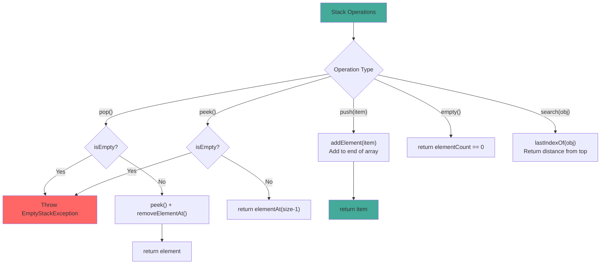

# Stack

## 1. Introduction

Stack is a legacy class that extends `Vector` to implement a stack (LIFO - Last In, First Out) data structure. It was part of the original Java 1.0 Collections Framework and is now considered legacy. For new code, `ArrayDeque` is the recommended alternative for stack operations.

Stack provides five core operations: `push()` (add to top), `pop()` (remove from top), `peek()` (view top), `empty()` (check if empty), and `search()` (find element position from top). While simple to use, Stack inherits Vector's synchronized methods, adding unnecessary overhead for single-threaded stack usage.

Understanding stacks is fundamental to computer science - they're used in function call management, expression parsing, undo/redo systems, backtracking algorithms, and compiler design. While Stack the class is legacy, the stack data structure remains essential.

## 2. Learning Objectives

- Create and use Stack with generics
- Understand LIFO (Last In, First Out) operations
- Learn Stack's push, pop, peek, empty, and search methods
- Know when to use Stack vs ArrayDeque
- Understand Stack's legacy methods and their modern equivalents
- Recognize Stack's thread-safety model (inherited from Vector)
- Implement common stack-based algorithms
- Understand stack overflow and underflow scenarios

## 3. Prerequisites

- Vector (Stack extends Vector)
- Basic data structure concepts (LIFO)
- ArrayDeque (modern alternative)
- Basic algorithm concepts

## 4. Why This Concept Exists

Stacks are one of the fundamental data structures in computer science. They model real-world scenarios where the last item placed is the first one removed:
- Stack of plates: you add to the top and remove from the top
- Undo/redo: the last action is undone first
- Function calls: the most recent call returns first
- Expression evaluation: operators are applied in LIFO order

Java's Stack class was the original implementation, but it has significant design flaws:
1. Extends Vector (inheritance-based design, should be composition)
2. All methods are synchronized (unnecessary for single-threaded use)
3. Contains legacy methods that overlap with modern APIs

## 5. Problem Statement

Consider implementing an undo/redo system for a text editor:

```java
// Without stack (manual management)
String[] undoHistory = new String[100];
int undoIndex = -1;

// Problems:
// - Fixed size
// - Manual index management
// - No easy way to limit history
```

A stack provides natural LIFO semantics:
```java
Stack<String> undoHistory = new Stack<>();
Stack<String> redoHistory = new Stack<>();

// Undo: pop from undo, push to redo
// Redo: pop from redo, push to undo
```

However, for new code, ArrayDeque provides better performance without synchronization overhead.

## 6. Theory

### Internal Structure

Stack extends Vector, so it has:
- `Object[] elementData`: The backing array (from Vector)
- `int elementCount`: Number of elements (from Vector)
- `int capacityIncrement`: Growth increment (from Vector)

### Stack Operations

- **push(E item)**: Calls `addElement(item)`, adds to end of array (top of stack)
- **pop()**: Calls `removeElementAt(elementCount-1)`, removes from end
- **peek()**: Calls `elementAt(elementCount-1)`, views end without removing
- **empty()**: Returns `elementCount == 0`
- **search(Object o)**: Returns 1-based distance from top, or -1 if not found

### Growth Factor

Stack inherits Vector's 2x growth factor:
- When capacity is exceeded, new capacity = oldCapacity * 2
- Elements are copied to new array using Arrays.copyOf()

### Synchronization

All Stack methods are synchronized (inherited from Vector):
```java
public synchronized E push(E item) {
    addElement(item);
    return item;
}

public synchronized E pop() {
    E obj;
    int len = size();
    obj = peek();
    removeElementAt(len - 1);
    return obj;
}
```

## 7. Internal Working

### The push() Operation

```java
public synchronized E push(E item) {
    addElement(item);  // Vector method, synchronized
    return item;
}

// addElement() in Vector:
public synchronized void addElement(E obj) {
    modCount++;
    ensureCapacityHelper(elementCount + 1);
    elementData[elementCount++] = obj;
}
```

### The pop() Operation

```java
public synchronized E pop() {
    E obj;
    int len = size();
    obj = peek();      // Get top element
    removeElementAt(len - 1);  // Remove top element
    return obj;
}

public synchronized E peek() {
    int len = size();
    if (len == 0)
        throw new EmptyStackException();
    return elementAt(len - 1);
}
```

### The search() Operation

```java
public synchronized int search(Object o) {
    int i = lastIndexOf(o);  // Search from end (top of stack)
    if (i >= 0) {
        return size() - i;  // Convert to 1-based distance from top
    }
    return -1;
}
```

## 8. JVM Perspective

### Memory Allocation

```java
Stack<String> stack = new Stack<>();
// JVM allocates:
// - Stack object header: 12 bytes (mark word + klass pointer)
// - elementData reference: 8 bytes (pointer to backing array)
// - elementCount field: 4 bytes (from Vector)
// - capacityIncrement field: 4 bytes (from Vector)
// - modCount field: 4 bytes (from AbstractList)
// - Padding to 8-byte boundary: 0 bytes
// Total Stack object: ~36 bytes

// When adding elements:
// - Backing array: 10 references × 8 bytes = 80 bytes (default capacity)
// - Each String reference in array: 8 bytes
```

### JIT Optimization

The JIT compiler optimizes Stack operations:
- **Inlining**: push/pop/peek methods are inlined
- **Lock elision**: If escape analysis proves single-threaded access, synchronization may be removed
- **Monomorphic inlining**: If only one thread accesses the stack, JIT can optimize

### Stack vs Heap Storage

- Stack objects are stored on the heap (confusing naming)
- The stack data structure concept is different from the JVM call stack
- Stack operations are O(1) for push/pop/peek

## 9. Memory Representation

```
Stack<String> stack = new Stack<>();
stack.push("Bottom");
stack.push("Middle");
stack.push("Top");

Memory layout:
┌───────────────────────────────┐
│ Stack object (extends Vector) │
├───────────────────────────────┤
│ Object header (12 bytes)      │
│ elementData ──────────────────────┐
│ elementCount = 3 (4 bytes)    │      │
│ capacityIncrement = 0 (4 bytes)    │
│ (padding 0 bytes)             │      │
└───────────────────────────────┘      │
                                       ▼
                               Object[] elementData
                               ┌──────────────────┐
                               │ [0] → "Bottom"   │ (8 bytes ref)
                               │ [1] → "Middle"   │ (8 bytes ref)
                               │ [2] → "Top"      │ (8 bytes ref) ← TOP
                               │ [3] → null       │ (unused)
                               └──────────────────┘
                               Capacity: 10, Size: 3

Stack operations:
push("New") → adds to end: ["Bottom", "Middle", "Top", "New"]
pop() → removes from end: ["Bottom", "Middle", "Top"]
peek() → returns "Top" without removing
```

## 10. Architecture Diagram



## 11. Flow Diagram



## 12. Syntax

```java
import java.util.Stack;
import java.util.EmptyStackException;

// ============================================
// CREATION
// ============================================
Stack<String> stack = new Stack<>();

// ============================================
// STACK OPERATIONS (all synchronized)
// ============================================
// Push - add to top
stack.push("element");      // Returns the element
stack.push("another");
stack.addElement("legacy"); // Same as push (inherited from Vector)

// Pop - remove from top
String top = stack.pop();   // Throws EmptyStackException if empty

// Peek - view top without removing
String peeked = stack.peek(); // Throws EmptyStackException if empty

// Check if empty
boolean isEmpty = stack.empty(); // Returns true if size == 0

// Search - find distance from top (1-based)
int position = stack.search("element"); // Returns 1 if top, 2 if next, etc.
// Returns -1 if not found

// ============================================
// INHERITED VECTOR METHODS
// ============================================
int size = stack.size();
boolean has = stack.contains("element");
String element = stack.get(0);  // Access bottom element

// ============================================
// ITERATION
// ============================================
// Enhanced for loop
for (String s : stack) {
    System.out.println(s);
}

// Iterator
Iterator<String> it = stack.iterator();
while (it.hasNext()) {
    System.out.println(it.next());
}

// Pop all elements
while (!stack.empty()) {
    System.out.println(stack.pop());
}
```

## 13. Easy Example

```java
import java.util.Stack;

public class StackBasics {
    public static void main(String[] args) {
        // Create stack
        Stack<String> stack = new Stack<>();

        // Push elements
        stack.push("First");
        stack.push("Second");
        stack.push("Third");

        System.out.println("Stack: " + stack);
        System.out.println("Size: " + stack.size());

        // Peek at top
        System.out.println("Top: " + stack.peek());

        // Pop elements
        System.out.println("Popped: " + stack.pop());
        System.out.println("Popped: " + stack.pop());
        System.out.println("Stack after pops: " + stack);

        // Search for element
        System.out.println("Position of 'First': " + stack.search("First"));

        // Check if empty
        System.out.println("Is empty: " + stack.empty());

        // Pop last element
        System.out.println("Last pop: " + stack.pop());
        System.out.println("Is empty now: " + stack.empty());

        // Try to pop from empty stack
        try {
            stack.pop();
        } catch (java.util.EmptyStackException e) {
            System.out.println("Cannot pop from empty stack!");
        }
    }
}
```

## 14. Medium Example

```java
import java.util.Stack;

public class StackOperations {
    public static void main(String[] args) {
        // Example 1: Balanced parentheses
        System.out.println("=== Balanced Parentheses ===");
        System.out.println(isBalanced("((()))"));  // true
        System.out.println(isBalanced("({[]})"));  // true
        System.out.println(isBalanced("(()"));      // false
        System.out.println(isBalanced("([)]"));     // false

        // Example 2: Reverse a string

## 📑 Continue Reading

**Part 1** of 3 | [Part 2](README-part2.md) | [Part 3](README-part3.md)

