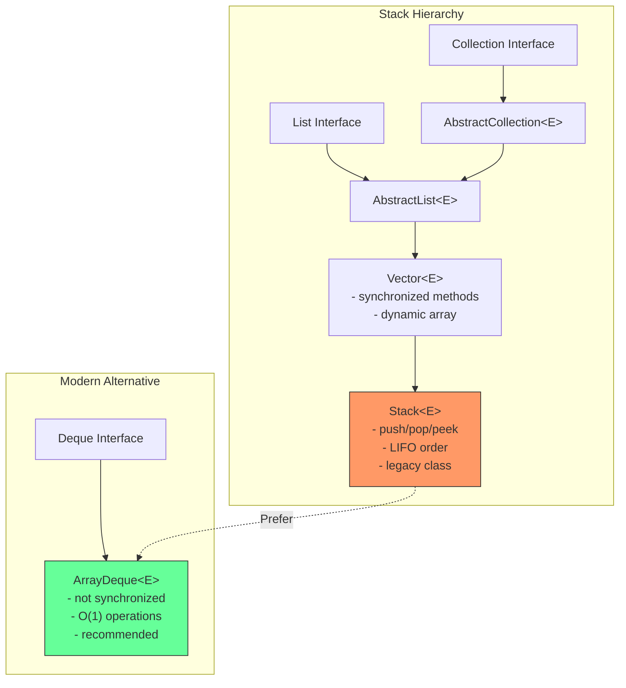
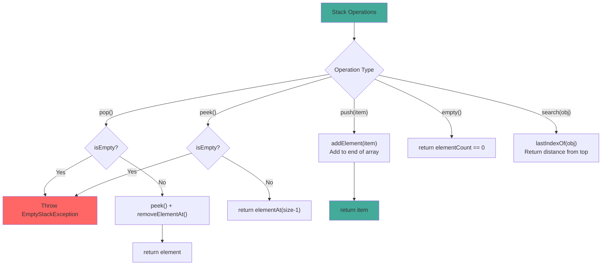

# Stack

## 1. Introduction

Stack is a legacy class that extends `Vector` to implement a stack (LIFO - Last In, First Out) data structure. It was part of the original Java 1.0 Collections Framework and is now considered legacy. For new code, `ArrayDeque` is the recommended alternative for stack operations.

Stack provides five core operations: `push()` (add to top), `pop()` (remove from top), `peek()` (view top), `empty()` (check if empty), and `search()` (find element position from top). While simple to use, Stack inherits Vector's synchronized methods, adding unnecessary overhead for single-threaded stack usage.

Understanding stacks is fundamental to computer science - they're used in function call management, expression parsing, undo/redo systems, backtracking algorithms, and compiler design. While Stack the class is legacy, the stack data structure remains essential.

## 2. Learning Objectives

- Create and use Stack with generics
- Understand LIFO (Last In, First Out) operations
- Learn Stack's push, pop, peek, empty, and search methods
- Know when to use Stack vs ArrayDeque
- Understand Stack's legacy methods and their modern equivalents
- Recognize Stack's thread-safety model (inherited from Vector)
- Implement common stack-based algorithms
- Understand stack overflow and underflow scenarios

## 3. Prerequisites

- Vector (Stack extends Vector)
- Basic data structure concepts (LIFO)
- ArrayDeque (modern alternative)
- Basic algorithm concepts

## 4. Why This Concept Exists

Stacks are one of the fundamental data structures in computer science. They model real-world scenarios where the last item placed is the first one removed:
- Stack of plates: you add to the top and remove from the top
- Undo/redo: the last action is undone first
- Function calls: the most recent call returns first
- Expression evaluation: operators are applied in LIFO order

Java's Stack class was the original implementation, but it has significant design flaws:
1. Extends Vector (inheritance-based design, should be composition)
2. All methods are synchronized (unnecessary for single-threaded use)
3. Contains legacy methods that overlap with modern APIs

## 5. Problem Statement

Consider implementing an undo/redo system for a text editor:

```java
// Without stack (manual management)
String[] undoHistory = new String[100];
int undoIndex = -1;

// Problems:
// - Fixed size
// - Manual index management
// - No easy way to limit history
```

A stack provides natural LIFO semantics:
```java
Stack<String> undoHistory = new Stack<>();
Stack<String> redoHistory = new Stack<>();

// Undo: pop from undo, push to redo
// Redo: pop from redo, push to undo
```

However, for new code, ArrayDeque provides better performance without synchronization overhead.

## 6. Theory

### Internal Structure

Stack extends Vector, so it has:
- `Object[] elementData`: The backing array (from Vector)
- `int elementCount`: Number of elements (from Vector)
- `int capacityIncrement`: Growth increment (from Vector)

### Stack Operations

- **push(E item)**: Calls `addElement(item)`, adds to end of array (top of stack)
- **pop()**: Calls `removeElementAt(elementCount-1)`, removes from end
- **peek()**: Calls `elementAt(elementCount-1)`, views end without removing
- **empty()**: Returns `elementCount == 0`
- **search(Object o)**: Returns 1-based distance from top, or -1 if not found

### Growth Factor

Stack inherits Vector's 2x growth factor:
- When capacity is exceeded, new capacity = oldCapacity * 2
- Elements are copied to new array using Arrays.copyOf()

### Synchronization

All Stack methods are synchronized (inherited from Vector):
```java
public synchronized E push(E item) {
    addElement(item);
    return item;
}

public synchronized E pop() {
    E obj;
    int len = size();
    obj = peek();
    removeElementAt(len - 1);
    return obj;
}
```

## 7. Internal Working

### The push() Operation

```java
public synchronized E push(E item) {
    addElement(item);  // Vector method, synchronized
    return item;
}

// addElement() in Vector:
public synchronized void addElement(E obj) {
    modCount++;
    ensureCapacityHelper(elementCount + 1);
    elementData[elementCount++] = obj;
}
```

### The pop() Operation

```java
public synchronized E pop() {
    E obj;
    int len = size();
    obj = peek();      // Get top element
    removeElementAt(len - 1);  // Remove top element
    return obj;
}

public synchronized E peek() {
    int len = size();
    if (len == 0)
        throw new EmptyStackException();
    return elementAt(len - 1);
}
```

### The search() Operation

```java
public synchronized int search(Object o) {
    int i = lastIndexOf(o);  // Search from end (top of stack)
    if (i >= 0) {
        return size() - i;  // Convert to 1-based distance from top
    }
    return -1;
}
```

## 8. JVM Perspective

### Memory Allocation

```java
Stack<String> stack = new Stack<>();
// JVM allocates:
// - Stack object header: 12 bytes (mark word + klass pointer)
// - elementData reference: 8 bytes (pointer to backing array)
// - elementCount field: 4 bytes (from Vector)
// - capacityIncrement field: 4 bytes (from Vector)
// - modCount field: 4 bytes (from AbstractList)
// - Padding to 8-byte boundary: 0 bytes
// Total Stack object: ~36 bytes

// When adding elements:
// - Backing array: 10 references × 8 bytes = 80 bytes (default capacity)
// - Each String reference in array: 8 bytes
```

### JIT Optimization

The JIT compiler optimizes Stack operations:
- **Inlining**: push/pop/peek methods are inlined
- **Lock elision**: If escape analysis proves single-threaded access, synchronization may be removed
- **Monomorphic inlining**: If only one thread accesses the stack, JIT can optimize

### Stack vs Heap Storage

- Stack objects are stored on the heap (confusing naming)
- The stack data structure concept is different from the JVM call stack
- Stack operations are O(1) for push/pop/peek

## 9. Memory Representation

```
Stack<String> stack = new Stack<>();
stack.push("Bottom");
stack.push("Middle");
stack.push("Top");

Memory layout:
┌───────────────────────────────┐
│ Stack object (extends Vector) │
├───────────────────────────────┤
│ Object header (12 bytes)      │
│ elementData ──────────────────────┐
│ elementCount = 3 (4 bytes)    │      │
│ capacityIncrement = 0 (4 bytes)    │
│ (padding 0 bytes)             │      │
└───────────────────────────────┘      │
                                       ▼
                               Object[] elementData
                               ┌──────────────────┐
                               │ [0] → "Bottom"   │ (8 bytes ref)
                               │ [1] → "Middle"   │ (8 bytes ref)
                               │ [2] → "Top"      │ (8 bytes ref) ← TOP
                               │ [3] → null       │ (unused)
                               └──────────────────┘
                               Capacity: 10, Size: 3

Stack operations:
push("New") → adds to end: ["Bottom", "Middle", "Top", "New"]
pop() → removes from end: ["Bottom", "Middle", "Top"]
peek() → returns "Top" without removing
```

## 10. Architecture Diagram



## 11. Flow Diagram



## 12. Syntax

```java
import java.util.Stack;
import java.util.EmptyStackException;

// ============================================
// CREATION
// ============================================
Stack<String> stack = new Stack<>();

// ============================================
// STACK OPERATIONS (all synchronized)
// ============================================
// Push - add to top
stack.push("element");      // Returns the element
stack.push("another");
stack.addElement("legacy"); // Same as push (inherited from Vector)

// Pop - remove from top
String top = stack.pop();   // Throws EmptyStackException if empty

// Peek - view top without removing
String peeked = stack.peek(); // Throws EmptyStackException if empty

// Check if empty
boolean isEmpty = stack.empty(); // Returns true if size == 0

// Search - find distance from top (1-based)
int position = stack.search("element"); // Returns 1 if top, 2 if next, etc.
// Returns -1 if not found

// ============================================
// INHERITED VECTOR METHODS
// ============================================
int size = stack.size();
boolean has = stack.contains("element");
String element = stack.get(0);  // Access bottom element

// ============================================
// ITERATION
// ============================================
// Enhanced for loop
for (String s : stack) {
    System.out.println(s);
}

// Iterator
Iterator<String> it = stack.iterator();
while (it.hasNext()) {
    System.out.println(it.next());
}

// Pop all elements
while (!stack.empty()) {
    System.out.println(stack.pop());
}
```

## 13. Easy Example

```java
import java.util.Stack;

public class StackBasics {
    public static void main(String[] args) {
        // Create stack
        Stack<String> stack = new Stack<>();

        // Push elements
        stack.push("First");
        stack.push("Second");
        stack.push("Third");

        System.out.println("Stack: " + stack);
        System.out.println("Size: " + stack.size());

        // Peek at top
        System.out.println("Top: " + stack.peek());

        // Pop elements
        System.out.println("Popped: " + stack.pop());
        System.out.println("Popped: " + stack.pop());
        System.out.println("Stack after pops: " + stack);

        // Search for element
        System.out.println("Position of 'First': " + stack.search("First"));

        // Check if empty
        System.out.println("Is empty: " + stack.empty());

        // Pop last element
        System.out.println("Last pop: " + stack.pop());
        System.out.println("Is empty now: " + stack.empty());

        // Try to pop from empty stack
        try {
            stack.pop();
        } catch (java.util.EmptyStackException e) {
            System.out.println("Cannot pop from empty stack!");
        }
    }
}
```

## 14. Medium Example

```java
import java.util.Stack;

public class StackOperations {
    public static void main(String[] args) {
        // Example 1: Balanced parentheses
        System.out.println("=== Balanced Parentheses ===");
        System.out.println(isBalanced("((()))"));  // true
        System.out.println(isBalanced("({[]})"));  // true
        System.out.println(isBalanced("(()"));      // false
        System.out.println(isBalanced("([)]"));     // false

        // Example 2: Reverse a string
        System.out.println("\n=== Reverse String ===");
        String reversed = reverseString("Hello World");
        System.out.println("Reversed: " + reversed);

        // Example 3: Calculator
        System.out.println("\n=== Postfix Calculator ===");
        int result = evaluatePostfix("5 3 + 8 *");
        System.out.println("5 3 + 8 * = " + result);  // 64

        // Example 4: Stack sorting
        System.out.println("\n=== Stack Sorting ===");
        Stack<Integer> unsorted = new Stack<>();
        unsorted.push(3);
        unsorted.push(1);
        unsorted.push(4);
        unsorted.push(1);
        unsorted.push(5);
        System.out.println("Unsorted: " + unsorted);
        Stack<Integer> sorted = sortStack(unsorted);
        System.out.println("Sorted: " + sorted);
    }

    // Balanced parentheses checker
    public static boolean isBalanced(String expression) {
        Stack<Character> stack = new Stack<>();
        for (char c : expression.toCharArray()) {
            if (c == '(' || c == '[' || c == '{') {
                stack.push(c);
            } else if (c == ')' || c == ']' || c == '}') {
                if (stack.isEmpty()) return false;
                char top = stack.pop();
                if (!isMatchingPair(top, c)) return false;
            }
        }
        return stack.isEmpty();
    }

    private static boolean isMatchingPair(char open, char close) {
        return (open == '(' && close == ')') ||
               (open == '[' && close == ']') ||
               (open == '{' && close == '}');
    }

    // String reversal using stack
    public static String reverseString(String str) {
        Stack<Character> stack = new Stack<>();
        for (char c : str.toCharArray()) {
            stack.push(c);
        }
        StringBuilder reversed = new StringBuilder();
        while (!stack.isEmpty()) {
            reversed.append(stack.pop());
        }
        return reversed.toString();
    }

    // Postfix expression evaluator
    public static int evaluatePostfix(String expression) {
        Stack<Integer> stack = new Stack<>();
        String[] tokens = expression.split(" ");

        for (String token : tokens) {
            if (isOperator(token)) {
                int b = stack.pop();
                int a = stack.pop();
                stack.push(applyOperator(a, b, token));
            } else {
                stack.push(Integer.parseInt(token));
            }
        }
        return stack.pop();
    }

    private static boolean isOperator(String token) {
        return token.equals("+") || token.equals("-") ||
               token.equals("*") || token.equals("/");
    }

    private static int applyOperator(int a, int b, String op) {
        switch (op) {
            case "+": return a + b;
            case "-": return a - b;
            case "*": return a * b;
            case "/": return a / b;
            default: throw new IllegalArgumentException("Unknown operator: " + op);
        }
    }

    // Stack sorting
    public static Stack<Integer> sortStack(Stack<Integer> stack) {
        Stack<Integer> tempStack = new Stack<>();
        while (!stack.isEmpty()) {
            int current = stack.pop();
            while (!tempStack.isEmpty() && tempStack.peek() > current) {
                stack.push(tempStack.pop());
            }
            tempStack.push(current);
        }
        return tempStack;
    }
}
```

## 15. Hard Example

```java
import java.util.Stack;
import java.util.EmptyStackException;

public class AdvancedStack {
    public static void main(String[] args) {
        // Pattern 1: Min Stack (O(1) min retrieval)
        System.out.println("=== Min Stack ===");
        MinStack minStack = new MinStack();
        minStack.push(5);
        minStack.push(3);
        minStack.push(7);
        minStack.push(1);
        System.out.println("Min: " + minStack.getMin());  // 1
        minStack.pop();
        System.out.println("Min after pop: " + minStack.getMin());  // 3

        // Pattern 2: Stack with undo/redo
        System.out.println("\n=== Undo/Redo System ===");
        UndoRedoSystem<String> system = new UndoRedoSystem<>();
        system.execute("Type 'Hello'");
        system.execute("Type 'World'");
        system.execute("Delete line");
        System.out.println("Current: " + system.current());
        System.out.println("Undo: " + system.undo());
        System.out.println("Undo: " + system.undo());
        System.out.println("Redo: " + system.redo());
        System.out.println("Current: " + system.current());

        // Pattern 3: Stack-based iterator for nested structures
        System.out.println("\n=== Flattened Iterator ===");
        NestedList<Integer> nested = new NestedList<>();
        nested.add(1);
        nested.add(new NestedList<Integer>() {{ add(2); add(3); }});
        nested.add(4);
        nested.add(new NestedList<Integer>() {{ add(5); add(6); }});
        
        FlattenedIterator<Integer> flat = new FlattenedIterator<>(nested);
        while (flat.hasNext()) {
            System.out.print(flat.next() + " ");
        }
        System.out.println();  // 1 2 3 4 5 6

        // Pattern 4: Infix to Postfix conversion
        System.out.println("\n=== Infix to Postfix ===");
        String infix = "A + B * C - D";
        String postfix = infixToPostfix(infix);
        System.out.println(infix + " → " + postfix);
    }

    // Min Stack implementation
    static class MinStack {
        private Stack<Integer> stack;
        private Stack<Integer> minStack;

        public MinStack() {
            stack = new Stack<>();
            minStack = new Stack<>();
        }

        public void push(int value) {
            stack.push(value);
            if (minStack.isEmpty() || value <= minStack.peek()) {
                minStack.push(value);
            }
        }

        public int pop() {
            int value = stack.pop();
            if (value == minStack.peek()) {
                minStack.pop();
            }
            return value;
        }

        public int peek() {
            return stack.peek();
        }

        public int getMin() {
            if (minStack.isEmpty()) {
                throw new EmptyStackException();
            }
            return minStack.peek();
        }

        public boolean isEmpty() {
            return stack.isEmpty();
        }
    }

    // Undo/Redo system
    static class UndoRedoSystem<T> {
        private Stack<T> undoStack;
        private Stack<T> redoStack;
        private T current;

        public UndoRedoSystem() {
            undoStack = new Stack<>();
            redoStack = new Stack<>();
        }

        public void execute(T action) {
            if (current != null) {
                undoStack.push(current);
            }
            current = action;
            redoStack.clear();
        }

        public T undo() {
            if (undoStack.isEmpty()) {
                return null;
            }
            redoStack.push(current);
            current = undoStack.pop();
            return current;
        }

        public T redo() {
            if (redoStack.isEmpty()) {
                return null;
            }
            undoStack.push(current);
            current = redoStack.pop();
            return current;
        }

        public T current() {
            return current;
        }
    }

    // Infix to Postfix converter
    public static String infixToPostfix(String infix) {
        StringBuilder output = new StringBuilder();
        Stack<Character> operatorStack = new Stack<>();

        for (char c : infix.toCharArray()) {
            if (Character.isLetterOrDigit(c)) {
                output.append(c);
            } else if (c == '(') {
                operatorStack.push(c);
            } else if (c == ')') {
                while (!operatorStack.isEmpty() && operatorStack.peek() != '(') {
                    output.append(' ').append(operatorStack.pop());
                }
                if (!operatorStack.isEmpty()) operatorStack.pop();
            } else {  // Operator
                output.append(' ');
                while (!operatorStack.isEmpty() && precedence(c) <= precedence(operatorStack.peek())) {
                    output.append(operatorStack.pop()).append(' ');
                }
                operatorStack.push(c);
            }
        }

        while (!operatorStack.isEmpty()) {
            output.append(' ').append(operatorStack.pop());
        }

        return output.toString().trim();
    }

    private static int precedence(char op) {
        switch (op) {
            case '+': case '-': return 1;
            case '*': case '/': return 2;
            default: return 0;
        }
    }
}
```

## 16. Enterprise Example

```java
import java.util.Stack;
import java.util.EmptyStackException;

public class CompilerParser {
    private final Stack<ParseNode> nodeStack;
    private final Stack<SymbolTable> scopeStack;
    private final Stack<ErrorContext> errorStack;

    public CompilerParser() {
        this.nodeStack = new Stack<>();
        this.scopeStack = new Stack<>();
        this.errorStack = new Stack<>();
    }

    // Parse expression using stack-based AST construction
    public ParseNode parseExpression(String expression) {
        Stack<ParseNode> operands = new Stack<>();
        Stack<Character> operators = new Stack<>();

        for (char c : expression.toCharArray()) {
            if (Character.isDigit(c)) {
                operands.push(new NumberNode(c - '0'));
            } else if (isOperator(c)) {
                while (!operators.isEmpty() && precedence(c) <= precedence(operators.peek())) {
                    char op = operators.pop();
                    ParseNode right = operands.pop();
                    ParseNode left = operands.pop();
                    operands.push(new OperatorNode(op, left, right));
                }
                operators.push(c);
            }
        }

        while (!operators.isEmpty()) {
            char op = operators.pop();
            ParseNode right = operands.pop();
            ParseNode left = operands.pop();
            operands.push(new OperatorNode(op, left, right));
        }

        return operands.pop();
    }

    // Scope management for symbol table
    public void enterScope() {
        scopeStack.push(new SymbolTable());
    }

    public void exitScope() {
        if (scopeStack.isEmpty()) {
            throw new IllegalStateException("No scope to exit");
        }
        scopeStack.pop();
    }

    public void defineVariable(String name, String type) {
        if (scopeStack.isEmpty()) {
            throw new IllegalStateException("No active scope");
        }
        scopeStack.peek().define(name, type);
    }

    public String lookupVariable(String name) {
        for (int i = scopeStack.size() - 1; i >= 0; i--) {
            String type = scopeStack.get(i).lookup(name);
            if (type != null) {
                return type;
            }
        }
        return null;
    }

    // Error recovery with stack
    public void pushError(String message) {
        errorStack.push(new ErrorContext(message, new Exception().getStackTrace()));
    }

    public ErrorContext popError() {
        if (errorStack.isEmpty()) {
            return null;
        }
        return errorStack.pop();
    }

    public boolean hasErrors() {
        return !errorStack.isEmpty();
    }

    // AST node hierarchy
    static abstract class ParseNode {}
    static class NumberNode extends ParseNode {
        int value;
        NumberNode(int value) { this.value = value; }
    }
    static class OperatorNode extends ParseNode {
        char operator;
        ParseNode left, right;
        OperatorNode(char op, ParseNode left, ParseNode right) {
            this.operator = op;
            this.left = left;
            this.right = right;
        }
    }

    // Symbol table
    static class SymbolTable {
        private final java.util.Map<String, String> symbols = new java.util.HashMap<>();
        void define(String name, String type) { symbols.put(name, type); }
        String lookup(String name) { return symbols.get(name); }
    }

    // Error context
    static class ErrorContext {
        String message;
        StackTraceElement[] stackTrace;
        ErrorContext(String message, StackTraceElement[] stackTrace) {
            this.message = message;
            this.stackTrace = stackTrace;
        }
    }

    private static boolean isOperator(char c) {
        return c == '+' || c == '-' || c == '*' || c == '/';
    }

    private static int precedence(char c) {
        switch (c) {
            case '+': case '-': return 1;
            case '*': case '/': return 2;
            default: return 0;
        }
    }

    public static void main(String[] args) {
        CompilerParser parser = new CompilerParser();
        
        // Parse expression
        ParseNode ast = parser.parseExpression("3+4*2");
        System.out.println("AST parsed successfully");
        
        // Scope management
        parser.enterScope();
        parser.defineVariable("x", "int");
        parser.defineVariable("y", "int");
        System.out.println("x type: " + parser.lookupVariable("x"));
        
        parser.enterScope();
        parser.defineVariable("z", "float");
        System.out.println("z type: " + parser.lookupVariable("z"));
        System.out.println("x type: " + parser.lookupVariable("x"));  // Finds in outer scope
        
        parser.exitScope();
        System.out.println("z type after exit: " + parser.lookupVariable("z"));  // null
    }
}
```

## 17. Performance Considerations

### Time Complexity

| Operation | Time | Notes |
|-----------|------|-------|
| push(E) | O(1)* | Amortized, O(n) when resizing |
| pop() | O(1) | Remove from end |
| peek() | O(1) | View end element |
| empty() | O(1) | Check size |
| search(Object) | O(n) | Linear search from top |
| size() | O(1) | Field access |
| contains(Object) | O(n) | Linear search |
| get(int) | O(1) | Direct array access (not typical) |

*Amortized O(1) due to occasional O(n) resize

### Stack vs ArrayDeque

| Operation | Stack | ArrayDeque | Winner |
|-----------|-------|------------|--------|
| push | O(1)* | O(1)* | Tie |
| pop | O(1) | O(1) | Tie |
| peek | O(1) | O(1) | Tie |
| search | O(n) | O(n) | Tie |
| thread-safe | Yes | No | Stack |
| memory | More | Less | ArrayDeque |
| synchronization | Yes | No | Depends |

### Growth Factor Analysis

| Initial | After 10 pushes | After 100 pushes | After 1000 pushes |
|---------|-----------------|------------------|-------------------|
| 10 (Stack/Vector) | 20 | 256 | 2048 |
| 10 (ArrayDeque) | 16 | 128 | 1024 |

## 18. Time & Space Complexity

### Time Complexity Summary

| Operation | Best | Average | Worst | Notes |
|-----------|------|---------|-------|-------|
| push | O(1) | O(1) | O(n) | Amortized O(1) |
| pop | O(1) | O(1) | O(1) | Always O(1) |
| peek | O(1) | O(1) | O(1) | Always O(1) |
| empty | O(1) | O(1) | O(1) | Always O(1) |
| search | O(1) | O(n) | O(n) | Best case: at top |

### Space Complexity

- **Internal array**: O(capacity) where capacity >= size
- **Per element**: 8 bytes (reference)
- **Stack object overhead**: ~36 bytes
- **Growth waste**: Up to 50% with 2x growth

## 19. Thread Safety

### Synchronized Methods

Every public method in Stack is synchronized (inherited from Vector):
```java
public synchronized E push(E item) { ... }
public synchronized E pop() { ... }
public synchronized E peek() { ... }
public synchronized boolean empty() { ... }
public synchronized int search(Object o) { ... }
```

### Limitations

1. **Compound operations are not atomic**:
   ```java
   // NOT thread-safe even with Stack
   if (!stack.isEmpty()) {
       E item = stack.pop();  // Another thread could pop between check and pop
   }
   ```

2. **Iteration requires external synchronization**:
   ```java
   synchronized (stack) {
       for (E item : stack) {
           // Safe iteration
       }
   }
   ```

### Modern Alternatives

| Scenario | Recommended Alternative |
|----------|------------------------|
| Single-threaded stack | `ArrayDeque` |
| Thread-safe stack | `ConcurrentLinkedDeque` |
| Bounded stack | `ArrayDeque` with capacity check |

## 20. Best Practices

1. **Use ArrayDeque for new code**:
   ```java
   Deque<String> stack = new ArrayDeque<>();
   stack.push("element");
   ```

2. **Check empty() before pop/peek**:
   ```java
   if (!stack.empty()) {
       E item = stack.pop();
   }
   ```

3. **Use search() carefully** - it's O(n) and returns 1-based position

4. **Consider thread-safety requirements** - Stack is synchronized but may not be sufficient for compound operations

5. **Use Deque interface for flexibility** - allows switching between implementations

6. **Document LIFO semantics** - make it clear when using stack-based algorithms

7. **Consider stack overflow** - for deep recursion or large datasets

## 21. Common Mistakes

```java
// Mistake 1: Using Stack in new code (legacy)
Stack<String> stack = new Stack<>();  // Bad - use ArrayDeque
Deque<String> stack = new ArrayDeque<>(); // Good

// Mistake 2: Not checking empty before pop
String item = stack.pop();  // Throws EmptyStackException

// Mistake 3: Using search() which is O(n)
int pos = stack.search(element);  // Slow for large stacks

// Mistake 4: Iterating with enhanced for loop (ConcurrentModificationException)
for (String s : stack) {  // May throw exception
    System.out.println(s);
}

// Mistake 5: Using Stack when you need random access
String item = stack.get(0);  // O(1) but breaks LIFO semantics

// Mistake 6: Not understanding search() return value
int pos = stack.search(element);  // 1-based from top, not 0-based index
```

## 22. Pitfalls & Warnings

### EmptyStackException
- Pop() and peek() throw EmptyStackException if stack is empty
- Always check empty() before calling pop/peek

### Search() Returns Distance, Not Index
- `search()` returns 1-based distance from top
- Returns -1 if not found
- This is different from List's indexOf()

### Inheritance from Vector
- Stack inherits all Vector methods
- This means you can call get(0) which breaks LIFO semantics
- Consider using composition instead

### Thread Safety Limitations
- Stack is synchronized but compound operations still need external sync
- Not suitable for producer-consumer patterns

## 23. Debugging Tips

1. **Print stack state**: Use `System.out.println(stack)` to see all elements
2. **Check size**: Use `stack.size()` to understand current state
3. **Use try-catch**: Catch EmptyStackException for debugging
4. **Trace operations**: Log push/pop operations for debugging algorithms
5. **Compare with expected**: Print stack after each operation to verify
6. **Use assertions**: Verify invariants like `assert !stack.isEmpty()`
7. **Profile synchronization**: Monitor lock contention in multi-threaded code

## 24. Comparison Table

| Feature | Stack | ArrayDeque | LinkedList |
|---------|-------|------------|------------|
| Thread-safe | Yes | No | No |
| Growth factor | 2x | Dynamic | N/A |
| Memory per element | 8 bytes | 8 bytes | 24 bytes |
| Push/Pop | O(1)* | O(1)* | O(1) |
| Peek | O(1) | O(1) | O(1) |
| Search | O(n) | O(n) | O(n) |
| Legacy | Yes | No | No |
| Use case | Legacy code | General stack | Queue/Deque |

## 25. Decision Tree

```
Need a Stack?
├── Yes → Single-threaded?
│   ├── Yes → Use ArrayDeque (recommended)
│   └── No → Need thread-safety?
│       ├── Yes → Use ConcurrentLinkedDeque
│       └── No → Use ArrayDeque with manual sync
├── No → Need Queue?
│   └── Use ArrayDeque or LinkedList
└── Maintaining legacy code?
    └── Keep Stack, but document as legacy
```

## 26. Interview Questions

### Q1: What is the difference between Stack and Deque?
**A**: Stack is a legacy synchronized class extending Vector. Deque is a modern interface with ArrayDeque implementation that's faster, non-synchronized, and more flexible.

### Q2: Why is Stack considered legacy?
**A**: Stack extends Vector (inheritance-based design), all methods are synchronized (unnecessary overhead), and ArrayDeque provides better performance without synchronization.

### Q3: How would you implement a stack using an ArrayList?
**A**: Use ArrayList with push as add() and pop as remove(size()-1). Or use Deque interface with ArrayDeque for better semantics.

### Q4: What is the time complexity of Stack operations?
**A**: push/pop/peek: O(1) amortized, search: O(n). All methods are synchronized.

### Q5: How does search() work in Stack?
**A**: search() calls lastIndexOf() to find the element from the top, then returns 1-based distance from top. Returns -1 if not found.

### Q6: Can Stack have null elements?
**A**: Yes, Stack allows null elements. However, this can cause NullPointerException in some operations.

### Q7: What happens when you pop from an empty Stack?
**A**: Throws EmptyStackException. Always check empty() before popping.

### Q8: How do you safely iterate over a Stack?
**A**: Synchronize externally: `synchronized(stack) { for(E e : stack) {...} }`. Or use a copy: `new ArrayList<>(stack)`.

### Q9: What is the growth factor of Stack?
**A**: Stack inherits Vector's 2x growth factor. When capacity is exceeded, new capacity = oldCapacity * 2.

### Q10: When would you use Stack over ArrayDeque?
**A**: Only when maintaining legacy code. For new code, always use ArrayDeque.

### Q11: Can Stack be used for BFS/DFS?
**A**: Stack is used for DFS (depth-first search). Queue is used for BFS (breadth-first search).

### Q12: How do you convert Stack to other collections?
**A**: Use `new ArrayList<>(stack)` for ArrayList, or `stack.stream()` for stream operations.

### Q13: What is the difference between pop() and remove()?
**A**: pop() throws EmptyStackException if empty, returns the element. remove() from Vector takes an index parameter.

### Q14: How do you reverse a Stack?
**A**: Use recursion or create a temporary stack and push/pop elements.

### Q15: What are common uses of Stack in algorithms?
**A**: Expression parsing, undo/redo, function call simulation, backtracking, DFS traversal, bracket matching.

## 27. Exercises

### Exercise 1: Stack Basics (Easy)
```java
// Implement a method that checks if a string is a palindrome using Stack
public static boolean isPalindrome(String str) {
    Stack<Character> stack = new Stack<>();
    for (char c : str.toCharArray()) {
        stack.push(c);
    }
    for (char c : str.toCharArray()) {
        if (c != stack.pop()) {
            return false;
        }
    }
    return true;
}
```

### Exercise 2: Balanced Brackets (Medium)
```java
// Implement a method that checks if all types of brackets are balanced
// Support (), [], {}, and <>
public static boolean isBalanced(String str) {
    Stack<Character> stack = new Stack<>();
    for (char c : str.toCharArray()) {
        if (c == '(' || c == '[' || c == '{' || c == '<') {
            stack.push(c);
        } else if (c == ')' || c == ']' || c == '}' || c == '>') {
            if (stack.isEmpty()) return false;
            char top = stack.pop();
            if (!isMatching(top, c)) return false;
        }
    }
    return stack.isEmpty();
}
```

### Exercise 3: Stack-Based Calculator (Hard)
```java
// Implement a calculator that evaluates infix expressions using two stacks
// Support +, -, *, /, and parentheses
public class InfixCalculator {
    public static double evaluate(String expression) {
        Stack<Double> values = new Stack<>();
        Stack<Character> operators = new Stack<>();
        
        // Your implementation here
        // Tokenize expression
        // Handle numbers: push to values stack
        // Handle operators: compare precedence, evaluate if needed
        // Handle parentheses: push/pop as appropriate
        
        return values.pop();
    }
}
```

## 28. Summary

Stack is a legacy LIFO data structure that extends Vector:

- **Internal structure**: Dynamic array with 2x growth factor
- **Thread safety**: All methods synchronized (inherited from Vector)
- **Operations**: push, pop, peek, empty, search - all O(1) except search O(n)
- **Legacy**: Should be replaced by ArrayDeque for new code
- **Use cases**: Expression parsing, undo/redo, DFS, backtracking
- **Key insight**: While Stack the class is legacy, the stack data structure is fundamental to computer science
- **Modern alternative**: `Deque<E> stack = new ArrayDeque<>()` provides same functionality without synchronization overhead

## 29. References

### Official Documentation
- [Stack JavaDoc](https://docs.oracle.com/en/java/javase/21/docs/api/java/util/Stack.html)
- [Deque Interface](https://docs.oracle.com/en/java/javase/21/docs/api/java/util/Deque.html)
- [ArrayDeque Documentation](https://docs.oracle.com/en/java/javase/21/docs/api/java/util/ArrayDeque.html)

### Books
- *Introduction to Algorithms* by Cormen et al. (Stack chapter)
- *Effective Java* by Joshua Bloch (Item 60: Favor static factory methods)

### Online Resources
- [Baeldung Stack Guide](https://www.baeldung.com/java-stack)
- [GeeksforGeeks Stack](https://www.geeksforgeeks.org/stack-class-in-java/)
- [OpenJDK Stack Source](https://hg.openjdk.java.net/jdk8/jdk8/jdk/file/tip/src/share/classes/java/util/Stack.java)

### Related Topics
- [Vector](../05-vector/README.md)
- [Deque Interface](../09-deque/README.md)
- [ArrayDeque](../09-deque/README.md)
