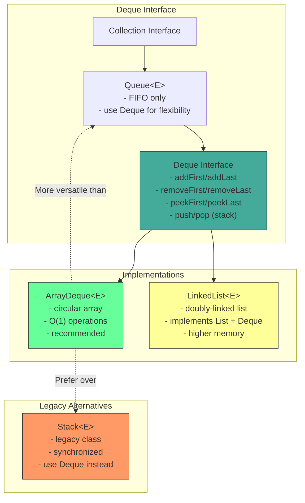
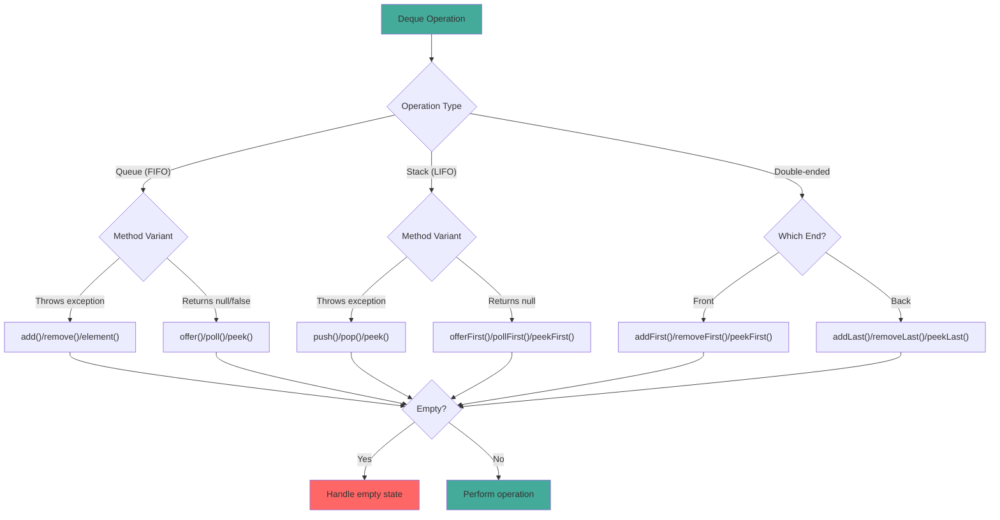

# Deque Interface

## 1. Introduction

Deque (Double-Ended Queue, pronounced "deck") is a collection that supports insertion and removal at both ends. It can function as both a queue (FIFO - First In, First Out) and a stack (LIFO - Last In, First Out). Deque is a more versatile alternative to both Stack and Queue.

Deque is an interface in the Java Collections Framework with two main implementations: `ArrayDeque` (array-based, recommended) and `LinkedList` (linked-node based). ArrayDeque is generally preferred due to better cache locality and lower memory overhead.

Deque provides 15 methods for element operations, divided into three categories: throws-exception methods, special-value methods (return null/false), and element-inclusive methods. Understanding these method variants is crucial for choosing the right method for your use case.

## 2. Learning Objectives

- Understand the Deque interface and its methods
- Use Deque as both a queue (FIFO) and stack (LIFO)
- Learn ArrayDeque vs LinkedList implementations
- Understand the three method variants (throws, returns null, returns special)
- Know when to use Deque over Stack or Queue
- Implement sliding window algorithms using Deque
- Understand Deque's performance characteristics
- Recognize Deque's thread-safety considerations

## 3. Prerequisites

- Queue interface
- Stack concepts
- LinkedList (understanding of linked data structures)
- Basic algorithm concepts

## 4. Why This Concept Exists

Before Deque, Java had separate classes for stacks and queues:
- `Stack` (legacy, synchronized)
- `LinkedList` (implements both Queue and Deque)
- `PriorityQueue` (priority-based queue)

Deque provides a unified interface that can serve both purposes:
- As a stack: use `push()`, `pop()`, `peek()`
- As a queue: use `offer()`, `poll()`, `peek()`
- As a double-ended queue: use `addFirst()`, `addLast()`, `removeFirst()`, `removeLast()`

This flexibility eliminates the need for multiple classes and allows switching between stack and queue behavior without changing code.

## 5. Problem Statement

Consider implementing a browser history system:
- User navigates to new pages (add to end)
- User clicks back (remove from end, add to beginning)
- User clicks forward (remove from beginning, add to end)
- Need to efficiently add/remove from both ends

A Queue only supports add/remove from one end. A Stack only supports add/remove from one end. Deque provides both operations efficiently.

## 6. Theory

### Internal Structure (ArrayDeque)

ArrayDeque maintains:
- `Object[] elements`: The backing circular array
- `int head`: Index of first element
- `int tail`: Index of next empty slot
- `int size`: Number of elements

### Circular Array

ArrayDeque uses a circular array to efficiently use space:
- Elements wrap around from end to beginning
- Head moves backward when adding/removing from front
- Tail moves forward when adding/removing from back
- Capacity is always a power of 2 for efficient modulo operations

### Growth Mechanism

When capacity is exceeded:
1. New capacity = oldCapacity * 2
2. A new array of the new capacity is created
3. Elements are copied in order (head to tail, wrapping around)
4. Head is reset to 0, tail is set to size

### Method Variants

Deque provides three method variants for each operation:

| Operation | Throws Exception | Returns Special Value |
|-----------|------------------|-----------------------|
| Insert | addFirst/addLast | offerFirst/offerLast |
| Remove | removeFirst/removeLast | pollFirst/pollLast |
| Examine | getFirst/getLast | peekFirst/peekLast |

## 7. Internal Working

### The addFirst() Operation

```java
public void addFirst(E e) {
    if (e == null)
        throw new NullPointerException();
    elements[head = (head - 1) & (elements.length - 1)] = e;
    if (head == tail)
        doubleCapacity();
}
```

### The addLast() Operation

```java
public void addLast(E e) {
    if (e == null)
        throw new NullPointerException();
    elements[tail] = e;
    if ((tail = (tail + 1) & (elements.length - 1)) == head)
        doubleCapacity();
}
```

### The pollFirst() Operation

```java
public E pollFirst() {
    int h = head;
    E result = (E) elements[h];
    if (result == null)
        return null;
    elements[h] = null;
    head = (h + 1) & (elements.length - 1);
    return result;
}
```

### The doubleCapacity() Operation

```java
private void doubleCapacity() {
    assert head == tail;
    int p = head;
    int n = elements.length;
    int r = n - p;
    int newCapacity = n << 1;
    if (newCapacity < 0)
        throw new IllegalStateException("Sorry, deque too big");
    Object[] a = new Object[newCapacity];
    System.arraycopy(elements, p, a, 0, r);
    System.arraycopy(elements, 0, a, r, p);
    elements = a;
    head = 0;
    tail = n;
}
```

## 8. JVM Perspective

### Memory Allocation

```java
Deque<String> deque = new ArrayDeque<>();
// JVM allocates:
// - ArrayDeque object header: 12 bytes (mark word + klass pointer)
// - elements reference: 8 bytes (pointer to backing array)
// - head index: 4 bytes
// - tail index: 4 bytes
// - size field: 4 bytes
// - Padding to 8-byte boundary: 0 bytes
// Total ArrayDeque object: ~36 bytes

// When adding elements:
// - Backing array: 16 references × 8 bytes = 128 bytes (default capacity)
// - Each String reference in array: 8 bytes
```

### JIT Optimization

The JIT compiler optimizes ArrayDeque operations:
- **Inlining**: addFirst/addLast/pollFirst/pollLast are inlined
- **Bounds check elimination**: JIT can eliminate modulo operations
- **Escape analysis**: Small ArrayDeque instances may be scalar-replaced

### Cache Locality

ArrayDeque provides better cache locality than LinkedList because elements are stored in a contiguous array, not scattered across the heap.

## 9. Memory Representation

```
Deque<String> deque = new ArrayDeque<>();
deque.addLast("First");
deque.addLast("Second");
deque.addFirst("Zero");
deque.addLast("Third");

Memory layout (circular array):
┌───────────────────────────────┐
│ ArrayDeque object             │
├───────────────────────────────┤
│ Object header (12 bytes)      │
│ elements ──────────────────────────┐
│ head = 7 (4 bytes)            │      │
│ tail = 3 (4 bytes)            │      │
│ size = 4 (4 bytes)            │      │
│ (padding 0 bytes)             │      │
└───────────────────────────────┘      │
                                       ▼
                               Object[] elements (capacity=16)
                               ┌──────────────────┐
                               │ [0] → null       │
                               │ [1] → null       │
                               │ [2] → null       │
                               │ [3] → "Third"    │ ← tail
                               │ [4] → null       │
                               │ [5] → null       │
                               │ [6] → null       │
                               │ [7] → "Zero"     │ ← head
                               │ [8] → "First"    │
                               │ [9] → "Second"   │
                               │ [10-15] → null   │
                               └──────────────────┘
                               Circular: head=7, tail=3

Operations:
addLast("End") → adds at tail, tail becomes 4
addFirst("Start") → adds at head-1, head becomes 6
pollFirst() → removes "Zero", head becomes 8
pollLast() → removes "Third", tail becomes 2
```

## 10. Architecture Diagram



## 11. Flow Diagram



## 12. Syntax

```java
import java.util.Deque;
import java.util.ArrayDeque;

// ============================================
// CREATION
// ============================================
Deque<String> deque = new ArrayDeque<>();
Deque<String> deque = new ArrayDeque<>(100);  // Initial capacity
Deque<String> deque = new ArrayDeque<>(collection);

// ============================================
// QUEUE OPERATIONS (FIFO)
// ============================================
// Add to tail
deque.offer("element");        // Returns false if full
deque.offerLast("element");    // Same as offer()
deque.add("element");          // Throws exception if full

// Remove from head
String first = deque.poll();        // Returns null if empty
String first = deque.pollFirst();   // Same as poll()
String first = deque.remove();      // Throws exception if empty

// View head
String head = deque.peek();         // Returns null if empty
String head = deque.peekFirst();    // Same as peek()
String head = deque.element();      // Throws exception if empty

// ============================================
// STACK OPERATIONS (LIFO)
// ============================================
// Add to head
deque.push("element");         // Same as addFirst()
deque.addFirst("element");     // Throws exception if full

// Remove from head
String top = deque.pop();          // Same as removeFirst()
String top = deque.removeFirst();  // Throws exception if empty

// View head
String top = deque.peek();         // Same as peekFirst()

// ============================================
// DOUBLE-ENDED OPERATIONS
// ============================================
// Add to ends
deque.addFirst("element");     // Throws exception
deque.addLast("element");      // Throws exception
deque.offerFirst("element");   // Returns false if full
deque.offerLast("element");    // Returns false if full

// Remove from ends
String first = deque.removeFirst();  // Throws exception
String last = deque.removeLast();    // Throws exception
String first = deque.pollFirst();    // Returns null if empty
String last = deque.pollLast();      // Returns null if empty

// View ends
String first = deque.getFirst();     // Throws exception
String last = deque.getLast();       // Throws exception
String first = deque.peekFirst();    // Returns null if empty
String last = deque.peekLast();      // Returns null if empty

// ============================================
// COMMON OPERATIONS
// ============================================
int size = deque.size();
boolean isEmpty = deque.isEmpty();
boolean has = deque.contains("element");
deque.clear();

// ============================================
// ITERATION
// ============================================
// Forward iteration (head to tail)
for (String s : deque) {
    System.out.println(s);
}

// Backward iteration (tail to head)
Iterator<String> desc = deque.descendingIterator();
while (desc.hasNext()) {
    System.out.println(desc.next());
}

// Stream
deque.stream().filter(s -> s.length() > 3).forEach(System.out::println);
```

## 13. Easy Example

```java
import java.util.Deque;
import java.util.ArrayDeque;

public class DequeBasics {
    public static void main(String[] args) {
        // Create deque
        Deque<String> deque = new ArrayDeque<>();

        // Add elements to both ends
        deque.addFirst("First");
        deque.addLast("Last");
        deque.addFirst("New First");
        deque.addLast("New Last");

        System.out.println("Deque: " + deque);
        System.out.println("Size: " + deque.size());

        // Peek at ends
        System.out.println("First: " + deque.getFirst());
        System.out.println("Last: " + deque.getLast());

        // Remove from both ends
        System.out.println("Removed first: " + deque.removeFirst());
        System.out.println("Removed last: " + deque.removeLast());
        System.out.println("After removals: " + deque);

        // Use as stack
        deque.push("Stack1");
        deque.push("Stack2");
        System.out.println("Stack top: " + deque.peek());
        System.out.println("Popped: " + deque.pop());

        // Use as queue
        deque.offer("Queue1");
        deque.offer("Queue2");
        System.out.println("Queue head: " + deque.peek());
        System.out.println("Polled: " + deque.poll());

        // Check if contains
        System.out.println("Contains 'First': " + deque.contains("First"));

        // Iterate
        System.out.println("Iterating:");
        for (String s : deque) {
            System.out.println("  " + s);
        }
    }
}
```

## 14. Medium Example

```java
import java.util.Deque;
import java.util.ArrayDeque;

public class DequeOperations {
    public static void main(String[] args) {
        // Example 1: Palindrome checker
        System.out.println("=== Palindrome Checker ===");
        System.out.println(isPalindrome("racecar"));  // true
        System.out.println(isPalindrome("hello"));     // false

        // Example 2: Browser history
        System.out.println("\n=== Browser History ===");
        BrowserHistory browser = new BrowserHistory();
        browser.visit("google.com");
        browser.visit("github.com");
        browser.visit("stackoverflow.com");
        System.out.println("Current: " + browser.current());
        System.out.println("Back: " + browser.back());
        System.out.println("Back: " + browser.back());
        System.out.println("Forward: " + browser.forward());

        // Example 3: Sliding window maximum
        System.out.println("\n=== Sliding Window Maximum ===");
        int[] nums = {1, 3, -1, -3, 5, 3, 6, 7};
        int k = 3;
        int[] max = maxSlidingWindow(nums, k);
        System.out.print("Max sliding window: ");
        for (int m : max) System.out.print(m + " ");
        System.out.println();

        // Example 4: Queue using two stacks (simulation)
        System.out.println("\n=== Queue Simulation ===");
        QueueWithDeque<String> queue = new QueueWithDeque<>();
        queue.enqueue("A");
        queue.enqueue("B");
        queue.enqueue("C");
        System.out.println("Dequeued: " + queue.dequeue());
        System.out.println("Dequeued: " + queue.dequeue());
        queue.enqueue("D");
        System.out.println("Dequeued: " + queue.dequeue());
    }

    // Palindrome checker using Deque
    public static boolean isPalindrome(String str) {
        Deque<Character> deque = new ArrayDeque<>();
        for (char c : str.toCharArray()) {
            deque.addLast(c);
        }
        while (deque.size() > 1) {
            if (!deque.pollFirst().equals(deque.pollLast())) {
                return false;
            }
        }
        return true;
    }

    // Browser history using Deque
    static class BrowserHistory {
        private Deque<String> history = new ArrayDeque<>();
        private Deque<String> forward = new ArrayDeque<>();

        public void visit(String url) {
            history.push(url);
            forward.clear();
        }

        public String back() {
            if (history.isEmpty()) return null;
            String url = history.pop();
            forward.push(url);
            return history.isEmpty() ? null : history.peek();
        }

        public String forward() {
            if (forward.isEmpty()) return null;
            String url = forward.pop();
            history.push(url);
            return url;
        }

        public String current() {
            return history.peek();
        }
    }

    // Sliding window maximum using Deque
    public static int[] maxSlidingWindow(int[] nums, int k) {
        Deque<Integer> deque = new ArrayDeque<>();
        int[] result = new int[nums.length - k + 1];

        for (int i = 0; i < nums.length; i++) {
            // Remove indices outside window
            while (!deque.isEmpty() && deque.peekFirst() < i - k + 1) {
                deque.pollFirst();
            }

            // Remove smaller elements
            while (!deque.isEmpty() && nums[deque.peekLast()] < nums[i]) {
                deque.pollLast();
            }

            deque.offerLast(i);

            if (i >= k - 1) {
                result[i - k + 1] = nums[deque.peekFirst()];
            }
        }

        return result;
    }

    // Queue simulation using Deque
    static class QueueWithDeque<T> {
        private Deque<T> deque = new ArrayDeque<>();

        public void enqueue(T item) {
            deque.addLast(item);
        }

        public T dequeue() {
            return deque.pollFirst();
        }
    }
}
```

## 15. Hard Example

```java
import java.util.Deque;
import java.util.ArrayDeque;
import java.util.Iterator;

public class AdvancedDeque {
    public static void main(String[] args) {
        // Pattern 1: Double-ended queue with capacity
        System.out.println("=== Bounded Deque ===");
        BoundedDeque<String> bounded = new BoundedDeque<>(3);
        bounded.addLast("A");
        bounded.addLast("B");
        bounded.addLast("C");
        System.out.println("Bounded: " + bounded);
        bounded.addLast("D");  // Should evict "A"
        System.out.println("After adding D: " + bounded);

        // Pattern 2: Deque as a priority deque
        System.out.println("\n=== Priority Deque ===");
        PriorityDeque<String> priority = new PriorityDeque<>();
        priority.add("Low");
        priority.add("High");
        priority.add("Medium");
        System.out.println("Priority deque: " + priority);
        System.out.println("Poll: " + priority.poll());

        // Pattern 3: Round-robin scheduler
        System.out.println("\n=== Round-Robin Scheduler ===");
        RoundRobinScheduler scheduler = new RoundRobinScheduler<>();
        scheduler.addTask("Task1");
        scheduler.addTask("Task2");
        scheduler.addTask("Task3");
        for (int i = 0; i < 6; i++) {
            System.out.println("Scheduled: " + scheduler.next());
        }

        // Pattern 4: Deque-based iterator with lookahead
        System.out.println("\n=== Lookahead Iterator ===");
        Deque<String> deque = new ArrayDeque<>();
        deque.add("A");
        deque.add("B");
        deque.add("C");
        deque.add("D");
        LookaheadIterator<String> lookahead = new LookaheadIterator<>(deque.iterator());
        while (lookahead.hasNext()) {
            System.out.println("Current: " + lookahead.next() + 
                ", Next: " + lookahead.peek());
        }
    }

    // Bounded deque with eviction
    static class BoundedDeque<E> {
        private final Deque<E> deque;
        private final int capacity;

        public BoundedDeque(int capacity) {
            this.capacity = capacity;
            this.deque = new ArrayDeque<>();
        }

        public void addFirst(E e) {
            if (deque.size() >= capacity) {
                deque.removeLast();
            }
            deque.addFirst(e);
        }

        public void addLast(E e) {
            if (deque.size() >= capacity) {
                deque.removeFirst();
            }
            deque.addLast(e);
        }

        public E pollFirst() {
            return deque.pollFirst();
        }

        public E pollLast() {
            return deque.pollLast();
        }

        public int size() {
            return deque.size();
        }

        @Override
        public String toString() {
            return deque.toString();
        }
    }

    // Priority deque (sorted on removal)
    static class PriorityDeque<E extends Comparable<E>> {
        private final Deque<E> deque = new ArrayDeque<>();

        public void add(E e) {
            Deque<E> temp = new ArrayDeque<>();
            while (!deque.isEmpty() && deque.peek().compareTo(e) < 0) {
                temp.addLast(deque.pollFirst());
            }
            deque.addFirst(e);
            while (!temp.isEmpty()) {
                deque.addFirst(temp.pollLast());
            }
        }

        public E poll() {
            return deque.pollFirst();
        }

        public E peek() {
            return deque.peek();
        }

        @Override
        public String toString() {
            return deque.toString();
        }
    }

    // Round-robin scheduler
    static class RoundRobinScheduler {
        private final Deque<String> tasks = new ArrayDeque<>();

        public void addTask(String task) {
            tasks.addLast(task);
        }

        public String next() {
            String task = tasks.pollFirst();
            tasks.addLast(task);
            return task;
        }
    }

    // Lookahead iterator
    static class LookaheadIterator<E> implements Iterator<E> {
        private final Iterator<E> iterator;
        private E next;

        public LookaheadIterator(Iterator<E> iterator) {
            this.iterator = iterator;
            if (iterator.hasNext()) {
                next = iterator.next();
            }
        }

        @Override
        public boolean hasNext() {
            return next != null;
        }

        @Override
        public E next() {
            E current = next;
            next = iterator.hasNext() ? iterator.next() : null;
            return current;
        }

        public E peek() {
            return next;
        }
    }
}
```

## 16. Enterprise Example

```java
import java.util.Deque;
import java.util.ArrayDeque;
import java.util.concurrent.ConcurrentLinkedDeque;

public class MessageBroker {
    private final Deque<Message> incoming;
    private final Deque<Message> processing;
    private final Deque<Message> deadLetter;
    private final int maxRetries;

    public MessageBroker(int maxRetries) {
        this.incoming = new ConcurrentLinkedDeque<>();
        this.processing = new ArrayDeque<>();
        this.deadLetter = new ArrayDeque<>();
        this.maxRetries = maxRetries;
    }

    // Add message to incoming queue
    public void publish(Message message) {
        incoming.addLast(message);
    }

    // Process next message
    public boolean processNext() {
        Message message = incoming.pollFirst();
        if (message == null) {
            return false;
        }

        processing.addLast(message);
        
        try {
            // Simulate processing
            if (processMessage(message)) {
                processing.remove(message);
                return true;
            } else {
                // Retry logic
                message.incrementRetryCount();
                if (message.getRetryCount() >= maxRetries) {
                    processing.remove(message);
                    deadLetter.addLast(message);
                } else {
                    processing.remove(message);
                    incoming.addFirst(message);  // Retry immediately
                }
                return false;
            }
        } catch (Exception e) {
            processing.remove(message);
            deadLetter.addLast(message);
            return false;
        }
    }

    // Get queue sizes
    public int getIncomingCount() {
        return incoming.size();
    }

    public int getProcessingCount() {
        return processing.size();
    }

    public int getDeadLetterCount() {
        return deadLetter.size();
    }

    // Get dead letter messages for inspection
    public Deque<Message> getDeadLetterQueue() {
        return new ArrayDeque<>(deadLetter);
    }

    // Replay dead letter messages
    public void replayDeadLetters() {
        while (!deadLetter.isEmpty()) {
            Message message = deadLetter.pollFirst();
            message.resetRetryCount();
            incoming.addLast(message);
        }
    }

    private boolean processMessage(Message message) {
        // Simulate processing with 80% success rate
        return Math.random() > 0.2;
    }

    public static void main(String[] args) {
        MessageBroker broker = new MessageBroker(3);

        // Publish messages
        for (int i = 1; i <= 10; i++) {
            broker.publish(new Message("MSG-" + i, "Payload " + i));
        }

        // Process messages
        int processed = 0;
        int failed = 0;
        while (broker.getIncomingCount() > 0) {
            if (broker.processNext()) {
                processed++;
            } else {
                failed++;
            }
        }

        System.out.println("Processed: " + processed);
        System.out.println("Failed: " + failed);
        System.out.println("Dead letters: " + broker.getDeadLetterCount());

        // Replay dead letters
        broker.replayDeadLetters();
        System.out.println("After replay - Incoming: " + broker.getIncomingCount());
    }

    static class Message {
        private final String id;
        private final String payload;
        private int retryCount;

        public Message(String id, String payload) {
            this.id = id;
            this.payload = payload;
            this.retryCount = 0;
        }

        public String getId() { return id; }
        public String getPayload() { return payload; }
        public int getRetryCount() { return retryCount; }
        public void incrementRetryCount() { retryCount++; }
        public void resetRetryCount() { retryCount = 0; }
    }
}
```

## 17. Performance Considerations

### Time Complexity

| Operation | ArrayDeque | LinkedList | Notes |
|-----------|------------|------------|-------|
| addFirst | O(1)* | O(1) | Amortized for ArrayDeque |
| addLast | O(1)* | O(1) | Amortized for ArrayDeque |
| removeFirst | O(1) | O(1) | |
| removeLast | O(1) | O(1) | |
| peekFirst | O(1) | O(1) | |
| peekLast | O(1) | O(1) | |
| contains | O(n) | O(n) | |
| size | O(1) | O(1) | |

*Amortized O(1) due to occasional O(n) resize

### ArrayDeque vs LinkedList

| Feature | ArrayDeque | LinkedList |
|---------|------------|------------|
| Memory per element | 8 bytes | 24 bytes |
| Cache locality | Good | Poor |
| Random access | O(n) | O(n) |
| Iteration speed | Faster | Slower |
| Memory overhead | Lower | Higher |
| Best for | Queue/Stack | List + Deque |

### Memory Efficiency

For 1 million elements:
- ArrayDeque: ~8 MB (8 bytes per reference)
- LinkedList: ~24 MB (24 bytes per node: item + next + prev + header)

## 18. Time & Space Complexity

### Time Complexity Summary

| Operation | Best | Average | Worst | Notes |
|-----------|------|---------|-------|-------|
| addFirst | O(1) | O(1) | O(n) | Amortized O(1) |
| addLast | O(1) | O(1) | O(n) | Amortized O(1) |
| removeFirst | O(1) | O(1) | O(1) | |
| removeLast | O(1) | O(1) | O(1) | |
| peekFirst | O(1) | O(1) | O(1) | |
| peekLast | O(1) | O(1) | O(1) | |
| contains | O(1) | O(n) | O(n) | |
| size | O(1) | O(1) | O(1) | |

### Space Complexity

- **Internal array**: O(capacity) where capacity is power of 2
- **Per element**: 8 bytes (reference)
- **ArrayDeque object overhead**: ~36 bytes
- **Growth**: Doubles capacity when full

## 19. Thread Safety

### Not Thread-Safe

ArrayDeque is not thread-safe:
```java
Deque<String> deque = new ArrayDeque<>();
// NOT thread-safe
deque.addFirst("element");  // Race condition in multi-threaded code
```

### Synchronization Options

```java
// Option 1: Collections.synchronizedDeque()
Deque<String> deque = Collections.synchronizedDeque(new ArrayDeque<>());

// Option 2: Manual synchronization
synchronized (deque) {
    deque.addFirst("element");
    String value = deque.pollFirst();
}

// Option 3: ConcurrentLinkedDeque (lock-free)
Deque<String> deque = new ConcurrentLinkedDeque<>();
```

### When to Use Each

| Scenario | Recommended |
|----------|-------------|
| Single-threaded | ArrayDeque |
| Read-heavy, write-light | Collections.synchronizedDeque |
| High-concurrency | ConcurrentLinkedDeque |
| Bounded queue | ArrayDeque with manual sync |

## 20. Best Practices

1. **Use ArrayDeque for queue/stack implementations** - better performance than LinkedList

2. **Choose method variant based on needs**:
   - Throws exception: `addFirst()`, `removeFirst()`, `getFirst()`
   - Returns null/false: `offerFirst()`, `pollFirst()`, `peekFirst()`

3. **Prefer offer/poll/peek for queue operations** - handles empty/full gracefully

4. **Prefer push/pop for stack operations** - clearer semantics

5. **Check size() or isEmpty() before operations** - avoid exceptions

6. **Use descendingIterator() for reverse iteration** - efficient and clean

7. **Consider capacity** - initial capacity affects resize frequency

## 21. Common Mistakes

```java
// Mistake 1: Using LinkedList when ArrayDeque would be more efficient
Deque<String> deque = new LinkedList<>();  // Bad - higher memory
Deque<String> deque = new ArrayDeque<>();  // Good - better performance

// Mistake 2: Not checking for empty deque before pop/poll
String item = deque.pop();  // Throws NoSuchElementException

// Mistake 3: Confusing push/pop with addFirst/removeFirst
deque.push("element");  // Same as addFirst()
deque.pop();            // Same as removeFirst()

// Mistake 4: Using getFirst() when peekFirst() would be safer
String first = deque.getFirst();  // Throws exception if empty
String first = deque.peekFirst(); // Returns null if empty

// Mistake 5: Iterating while modifying
for (String s : deque) {
    if (s.isEmpty()) {
        deque.remove(s);  // ConcurrentModificationException
    }
}

// Mistake 6: Using Deque when you need random access
String item = deque.get(0);  // O(n) operation
```

## 22. Pitfalls & Warnings

### Null Elements

ArrayDeque does not allow null elements:
```java
Deque<String> deque = new ArrayDeque<>();
deque.addFirst(null);  // Throws NullPointerException
```

### Capacity is Power of 2

ArrayDeque capacity is always a power of 2:
- Initial capacity: 16 (default)
- Growth: doubles (16 → 32 → 64 → ...)
- Wasted space: up to 50%

### Head and Tail Indices

ArrayDeque uses head and tail indices:
- head points to first element
- tail points to next empty slot
- Indices wrap around using bitwise AND

### ConcurrentModificationException

Iterators are fail-fast:
```java
Iterator<String> it = deque.iterator();
while (it.hasNext()) {
    String s = it.next();
    deque.addFirst("X");  // ConcurrentModificationException
}
```

## 23. Debugging Tips

1. **Print deque state**: Use `System.out.println(deque)` to see all elements
2. **Check size**: Use `deque.size()` to understand current state
3. **Use try-catch**: Catch NoSuchElementException for debugging
4. **Trace operations**: Log add/remove operations for debugging algorithms
5. **Compare with expected**: Print deque after each operation to verify
6. **Use assertions**: Verify invariants like `assert !deque.isEmpty()`
7. **Profile memory**: Use JProfiler or VisualVM to check ArrayDeque memory usage

## 24. Comparison Table

| Feature | ArrayDeque | LinkedList | Stack | ArrayList |
|---------|------------|------------|-------|-----------|
| Queue operations | O(1) | O(1) | O(n) | O(n) |
| Stack operations | O(1) | O(1) | O(1)* | O(1) |
| Memory per element | 8 bytes | 24 bytes | 8 bytes | 4 bytes |
| Thread-safe | No | No | Yes | No |
| Null elements | No | Yes | Yes | Yes |
| Random access | O(n) | O(n) | O(1) | O(1) |
| Best for | Queue/Stack | List + Deque | Legacy | Random access |

## 25. Decision Tree

```
Need a Queue or Stack?
├── Queue (FIFO) → Need thread-safety?
│   ├── Yes → ConcurrentLinkedQueue
│   └── No → ArrayDeque (recommended)
├── Stack (LIFO) → Need thread-safety?
│   ├── Yes → ConcurrentLinkedDeque
│   └── No → ArrayDeque (recommended)
├── Double-ended → Need thread-safety?
│   ├── Yes → ConcurrentLinkedDeque
│   └── No → ArrayDeque (recommended)
└── Need random access?
    └── Use ArrayList (not Deque)
```

## 26. Interview Questions

### Q1: Why is ArrayDeque preferred over Stack?
**A**: ArrayDeque is not synchronized (better performance), has better memory efficiency, and provides a unified interface for both queue and stack operations.

### Q2: What is the time complexity of addFirst() and addLast()?
**A**: O(1) amortized for ArrayDeque due to occasional O(n) resize when capacity is exceeded.

### Q3: How would you implement a queue using two stacks?
**A**: Use two ArrayDeque instances. Push to one stack, pop from the other. When the pop stack is empty, transfer all elements from the push stack.

### Q4: What is the difference between ArrayDeque and LinkedList?
**A**: ArrayDeque uses a circular array (better cache locality, less memory). LinkedList uses nodes (more memory, but O(1) insert/remove at any position with iterator).

### Q5: Can ArrayDeque contain null elements?
**A**: No, ArrayDeque does not allow null elements. Attempting to add null throws NullPointerException.

### Q6: What is the capacity growth of ArrayDeque?
**A**: ArrayDeque doubles its capacity when full (16 → 32 → 64 → ...). Capacity is always a power of 2.

### Q7: How do you iterate an ArrayDeque in reverse order?
**A**: Use `deque.descendingIterator()` which returns an iterator from tail to head.

### Q8: What is the difference between offer/poll/peek and add/remove/get?
**A**: offer/poll/peek return false/null when empty/full. add/remove/get throw exceptions. Use offer/poll/peek for queue operations.

### Q9: Is ArrayDeque thread-safe?
**A**: No. Use `Collections.synchronizedDeque()` or `ConcurrentLinkedDeque` for thread safety.

### Q10: When would you use LinkedList over ArrayDeque?
**A**: When you need both List and Deque functionality, or when you need O(1) insert/remove at any position with an iterator. Otherwise, ArrayDeque is preferred.

### Q11: What is the memory overhead of ArrayDeque vs LinkedList?
**A**: ArrayDeque: 8 bytes per element + array overhead. LinkedList: 24 bytes per node (item + next + prev + object header).

### Q12: How do you implement a stack using Deque?
**A**: Use `Deque<E> stack = new ArrayDeque<>()`. Push with `push()` or `addFirst()`, pop with `pop()` or `removeFirst()`, peek with `peek()` or `peekFirst()`.

### Q13: What happens when you call getFirst() on an empty ArrayDeque?
**A**: Throws NoSuchElementException. Use peekFirst() which returns null instead.

### Q14: How do you convert Deque to other collections?
**A**: Use `new ArrayList<>(deque)` for ArrayList, `new HashSet<>(deque)` for Set, or `deque.stream()` for stream operations.

### Q15: What are common uses of Deque in algorithms?
**A**: Sliding window algorithms, palindrome checking, BFS/DFS traversal, browser history, undo/redo systems, round-robin scheduling.

## 27. Exercises

### Exercise 1: Palindrome Checker (Easy)
```java
// Implement a method that checks if a string is a palindrome using Deque
public static boolean isPalindrome(String str) {
    Deque<Character> deque = new ArrayDeque<>();
    for (char c : str.toCharArray()) {
        deque.addLast(c);
    }
    while (deque.size() > 1) {
        if (!deque.pollFirst().equals(deque.pollLast())) {
            return false;
        }
    }
    return true;
}
```

### Exercise 2: Sliding Window Maximum (Medium)
```java
// Implement sliding window maximum using Deque
public static int[] maxSlidingWindow(int[] nums, int k) {
    Deque<Integer> deque = new ArrayDeque<>();
    int[] result = new int[nums.length - k + 1];
    
    for (int i = 0; i < nums.length; i++) {
        // Remove indices outside window
        while (!deque.isEmpty() && deque.peekFirst() < i - k + 1) {
            deque.pollFirst();
        }
        
        // Remove smaller elements
        while (!deque.isEmpty() && nums[deque.peekLast()] < nums[i]) {
            deque.pollLast();
        }
        
        deque.offerLast(i);
        
        if (i >= k - 1) {
            result[i - k + 1] = nums[deque.peekFirst()];
        }
    }
    
    return result;
}
```

### Exercise 3: Bounded Evicting Deque (Hard)
```java
// Implement a deque with maximum capacity that evicts oldest elements
public class EvictingDeque<E> {
    private final Deque<E> deque;
    private final int capacity;
    
    public EvictingDeque(int capacity) {
        this.capacity = capacity;
        this.deque = new ArrayDeque<>();
    }
    
    public void addFirst(E e) {
        if (deque.size() >= capacity) {
            deque.removeLast();
        }
        deque.addFirst(e);
    }
    
    public void addLast(E e) {
        if (deque.size() >= capacity) {
            deque.removeFirst();
        }
        deque.addLast(e);
    }
    
    // Implement remaining methods...
}
```

## 28. Summary

Deque is a versatile double-ended queue interface that can serve as both a queue and stack:

- **Implementations**: ArrayDeque (recommended), LinkedList
- **Operations**: addFirst/addLast, removeFirst/removeLast, peekFirst/peekLast
- **Method variants**: Throws exception vs returns null/false
- **Performance**: O(1) for all add/remove operations (amortized)
- **Memory**: ArrayDeque uses 8 bytes per element, LinkedList uses 24 bytes
- **Thread safety**: Not thread-safe; use ConcurrentLinkedDeque for concurrency
- **Best for**: Queue implementations, stack implementations, sliding window algorithms
- **Key insight**: ArrayDeque is more efficient than both Stack and LinkedList for queue/stack operations

## 29. References

### Official Documentation
- [Deque Interface](https://docs.oracle.com/en/java/javase/21/docs/api/java/util/Deque.html)
- [ArrayDeque Documentation](https://docs.oracle.com/en/java/javase/21/docs/api/java/util/ArrayDeque.html)
- [LinkedList Documentation](https://docs.oracle.com/en/java/javase/21/docs/api/java/util/LinkedList.html)

### Books
- *Introduction to Algorithms* by Cormen et al. (Queue and Stack chapters)
- *Effective Java* by Joshua Bloch (Item 60: Favor static factory methods)

### Online Resources
- [Baeldung Deque Guide](https://www.baeldung.com/java-deque)
- [GeeksforGeeks Deque](https://www.geeksforgeeks.org/deque-in-java/)
- [OpenJDK ArrayDeque Source](https://hg.openjdk.java.net/jdk8/jdk8/jdk/file/tip/src/share/classes/java/util/ArrayDeque.java)

### Related Topics
- [Stack](../06-stack/README.md)
- [Queue Interface](../07-queue/README.md)
- [LinkedList](../04-linkedlist/README.md)
