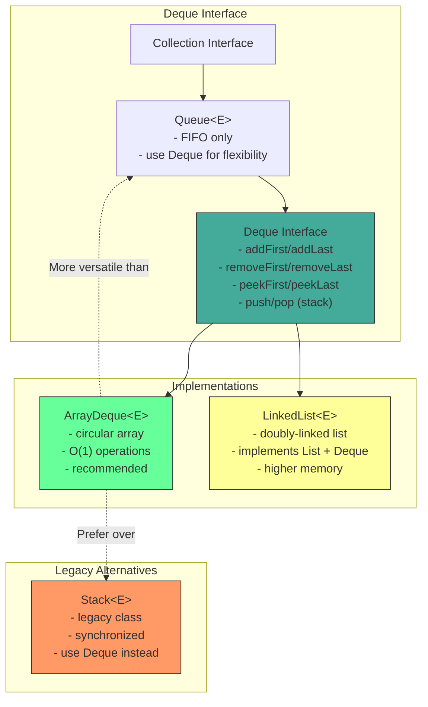
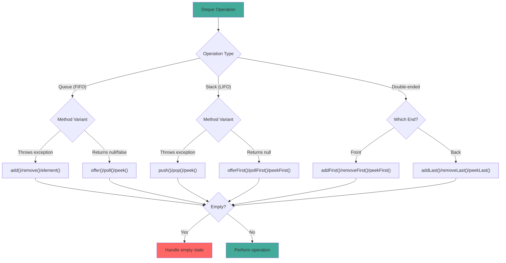

# Deque Interface

## 1. Introduction

Deque (Double-Ended Queue, pronounced "deck") is a collection that supports insertion and removal at both ends. It can function as both a queue (FIFO - First In, First Out) and a stack (LIFO - Last In, First Out). Deque is a more versatile alternative to both Stack and Queue.

Deque is an interface in the Java Collections Framework with two main implementations: `ArrayDeque` (array-based, recommended) and `LinkedList` (linked-node based). ArrayDeque is generally preferred due to better cache locality and lower memory overhead.

Deque provides 15 methods for element operations, divided into three categories: throws-exception methods, special-value methods (return null/false), and element-inclusive methods. Understanding these method variants is crucial for choosing the right method for your use case.

## 2. Learning Objectives

- Understand the Deque interface and its methods
- Use Deque as both a queue (FIFO) and stack (LIFO)
- Learn ArrayDeque vs LinkedList implementations
- Understand the three method variants (throws, returns null, returns special)
- Know when to use Deque over Stack or Queue
- Implement sliding window algorithms using Deque
- Understand Deque's performance characteristics
- Recognize Deque's thread-safety considerations

## 3. Prerequisites

- Queue interface
- Stack concepts
- LinkedList (understanding of linked data structures)
- Basic algorithm concepts

## 4. Why This Concept Exists

Before Deque, Java had separate classes for stacks and queues:
- `Stack` (legacy, synchronized)
- `LinkedList` (implements both Queue and Deque)
- `PriorityQueue` (priority-based queue)

Deque provides a unified interface that can serve both purposes:
- As a stack: use `push()`, `pop()`, `peek()`
- As a queue: use `offer()`, `poll()`, `peek()`
- As a double-ended queue: use `addFirst()`, `addLast()`, `removeFirst()`, `removeLast()`

This flexibility eliminates the need for multiple classes and allows switching between stack and queue behavior without changing code.

## 5. Problem Statement

Consider implementing a browser history system:
- User navigates to new pages (add to end)
- User clicks back (remove from end, add to beginning)
- User clicks forward (remove from beginning, add to end)
- Need to efficiently add/remove from both ends

A Queue only supports add/remove from one end. A Stack only supports add/remove from one end. Deque provides both operations efficiently.

## 6. Theory

### Internal Structure (ArrayDeque)

ArrayDeque maintains:
- `Object[] elements`: The backing circular array
- `int head`: Index of first element
- `int tail`: Index of next empty slot
- `int size`: Number of elements

### Circular Array

ArrayDeque uses a circular array to efficiently use space:
- Elements wrap around from end to beginning
- Head moves backward when adding/removing from front
- Tail moves forward when adding/removing from back
- Capacity is always a power of 2 for efficient modulo operations

### Growth Mechanism

When capacity is exceeded:
1. New capacity = oldCapacity * 2
2. A new array of the new capacity is created
3. Elements are copied in order (head to tail, wrapping around)
4. Head is reset to 0, tail is set to size

### Method Variants

Deque provides three method variants for each operation:

| Operation | Throws Exception | Returns Special Value |
|-----------|------------------|-----------------------|
| Insert | addFirst/addLast | offerFirst/offerLast |
| Remove | removeFirst/removeLast | pollFirst/pollLast |
| Examine | getFirst/getLast | peekFirst/peekLast |

## 7. Internal Working

### The addFirst() Operation

```java
public void addFirst(E e) {
    if (e == null)
        throw new NullPointerException();
    elements[head = (head - 1) & (elements.length - 1)] = e;
    if (head == tail)
        doubleCapacity();
}
```

### The addLast() Operation

```java
public void addLast(E e) {
    if (e == null)
        throw new NullPointerException();
    elements[tail] = e;
    if ((tail = (tail + 1) & (elements.length - 1)) == head)
        doubleCapacity();
}
```

### The pollFirst() Operation

```java
public E pollFirst() {
    int h = head;
    E result = (E) elements[h];
    if (result == null)
        return null;
    elements[h] = null;
    head = (h + 1) & (elements.length - 1);
    return result;
}
```

### The doubleCapacity() Operation

```java
private void doubleCapacity() {
    assert head == tail;
    int p = head;
    int n = elements.length;
    int r = n - p;
    int newCapacity = n << 1;
    if (newCapacity < 0)
        throw new IllegalStateException("Sorry, deque too big");
    Object[] a = new Object[newCapacity];
    System.arraycopy(elements, p, a, 0, r);
    System.arraycopy(elements, 0, a, r, p);
    elements = a;
    head = 0;
    tail = n;
}
```

## 8. JVM Perspective

### Memory Allocation

```java
Deque<String> deque = new ArrayDeque<>();
// JVM allocates:
// - ArrayDeque object header: 12 bytes (mark word + klass pointer)
// - elements reference: 8 bytes (pointer to backing array)
// - head index: 4 bytes
// - tail index: 4 bytes
// - size field: 4 bytes
// - Padding to 8-byte boundary: 0 bytes
// Total ArrayDeque object: ~36 bytes

// When adding elements:
// - Backing array: 16 references × 8 bytes = 128 bytes (default capacity)
// - Each String reference in array: 8 bytes
```

### JIT Optimization

The JIT compiler optimizes ArrayDeque operations:
- **Inlining**: addFirst/addLast/pollFirst/pollLast are inlined
- **Bounds check elimination**: JIT can eliminate modulo operations
- **Escape analysis**: Small ArrayDeque instances may be scalar-replaced

### Cache Locality

ArrayDeque provides better cache locality than LinkedList because elements are stored in a contiguous array, not scattered across the heap.

## 9. Memory Representation

```
```
Deque<String> deque = new ArrayDeque<>();
deque.addLast("First");
deque.addLast("Second");
deque.addFirst("Zero");
deque.addLast("Third");

Memory layout (circular array):
┌───────────────────────────────┐
│ ArrayDeque object             │
├───────────────────────────────┤
│ Object header (12 bytes)      │
│ elements ──────────────────────────┐
│ head = 7 (4 bytes)            │      │
│ tail = 3 (4 bytes)            │      │
│ size = 4 (4 bytes)            │      │
│ (padding 0 bytes)             │      │
└───────────────────────────────┘      │
                                       ▼
                               Object[] elements (capacity=16)
                               ┌──────────────────┐
                               │ [0] → null       │
                               │ [1] → null       │
                               │ [2] → null       │
                               │ [3] → "Third"    │ ← tail
                               │ [4] → null       │
                               │ [5] → null       │
                               │ [6] → null       │
                               │ [7] → "Zero"     │ ← head
                               │ [8] → "First"    │
                               │ [9] → "Second"   │
                               │ [10-15] → null   │
                               └──────────────────┘
                               Circular: head=7, tail=3

Operations:
addLast("End") → adds at tail, tail becomes 4
addFirst("Start") → adds at head-1, head becomes 6
pollFirst() → removes "Zero", head becomes 8
pollLast() → removes "Third", tail becomes 2
```

## 10. Architecture Diagram



## 11. Flow Diagram



## 12. Syntax

```java
import java.util.Deque;
import java.util.ArrayDeque;

// ============================================
// CREATION
// ============================================
Deque<String> deque = new ArrayDeque<>();
Deque<String> deque = new ArrayDeque<>(100);  // Initial capacity
Deque<String> deque = new ArrayDeque<>(collection);

// ============================================
// QUEUE OPERATIONS (FIFO)
// ============================================
// Add to tail
deque.offer("element");        // Returns false if full
deque.offerLast("element");    // Same as offer()
deque.add("element");          // Throws exception if full

// Remove from head
String first = deque.poll();        // Returns null if empty
String first = deque.pollFirst();   // Same as poll()
String first = deque.remove();      // Throws exception if empty

// View head
String head = deque.peek();         // Returns null if empty
String head = deque.peekFirst();    // Same as peek()
String head = deque.element();      // Throws exception if empty

// ============================================
// STACK OPERATIONS (LIFO)
// ============================================
// Add to head
deque.push("element");         // Same as addFirst()
deque.addFirst("element");     // Throws exception if full

// Remove from head
String top = deque.pop();          // Same as removeFirst()
String top = deque.removeFirst();  // Throws exception if empty

// View head
String top = deque.peek();         // Same as peekFirst()

// ============================================
// DOUBLE-ENDED OPERATIONS
// ============================================
// Add to ends
deque.addFirst("element");     // Throws exception
deque.addLast("element");      // Throws exception
deque.offerFirst("element");   // Returns false if full
deque.offerLast("element");    // Returns false if full

// Remove from ends
String first = deque.removeFirst();  // Throws exception
String last = deque.removeLast();    // Throws exception
String first = deque.pollFirst();    // Returns null if empty
String last = deque.pollLast();      // Returns null if empty

// View ends
String first = deque.getFirst();     // Throws exception
String last = deque.getLast();       // Throws exception
String first = deque.peekFirst();    // Returns null if empty
String last = deque.peekLast();      // Returns null if empty

// ============================================
// COMMON OPERATIONS
// ============================================
int size = deque.size();
boolean isEmpty = deque.isEmpty();
boolean has = deque.contains("element");
deque.clear();

// ============================================
// ITERATION
// ============================================
// Forward iteration (head to tail)
for (String s : deque) {
    System.out.println(s);
}

// Backward iteration (tail to head)
Iterator<String> desc = deque.descendingIterator();
while (desc.hasNext()) {
    System.out.println(desc.next());
}

// Stream
deque.stream().filter(s -> s.length() > 3).forEach(System.out::println);
```

## 13. Easy Example

```java
import java.util.Deque;
import java.util.ArrayDeque;

public class DequeBasics {
    public static void main(String[] args) {
        // Create deque
        Deque<String> deque = new ArrayDeque<>();

        // Add elements to both ends
        deque.addFirst("First");
        deque.addLast("Last");
        deque.addFirst("New First");
        deque.addLast("New Last");

        System.out.println("Deque: " + deque);
        System.out.println("Size: " + deque.size());

## 📑 Continue Reading

**Part 1** of 4 | [Part 2](README-part2.md) | [Part 3](README-part3.md) | [Part 4](README-part4.md)

