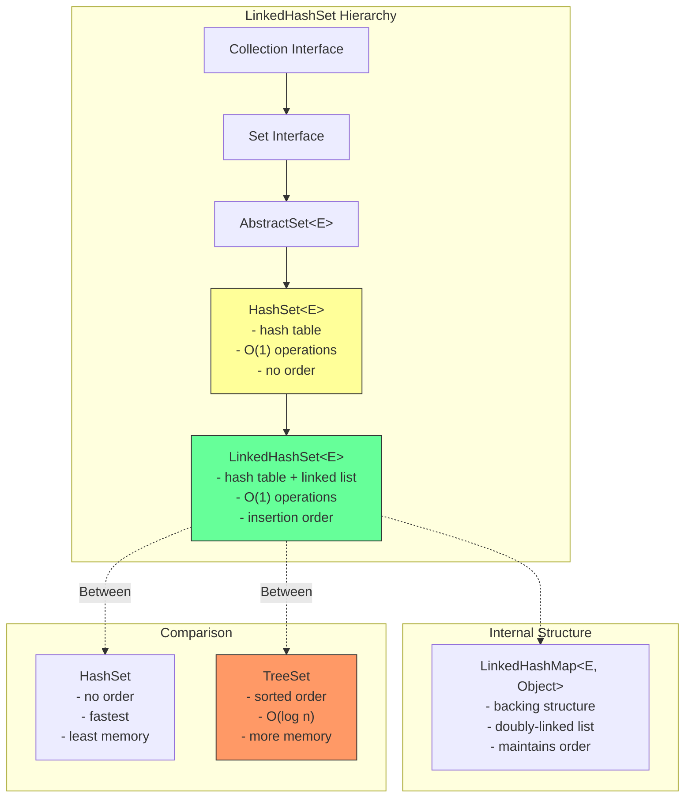
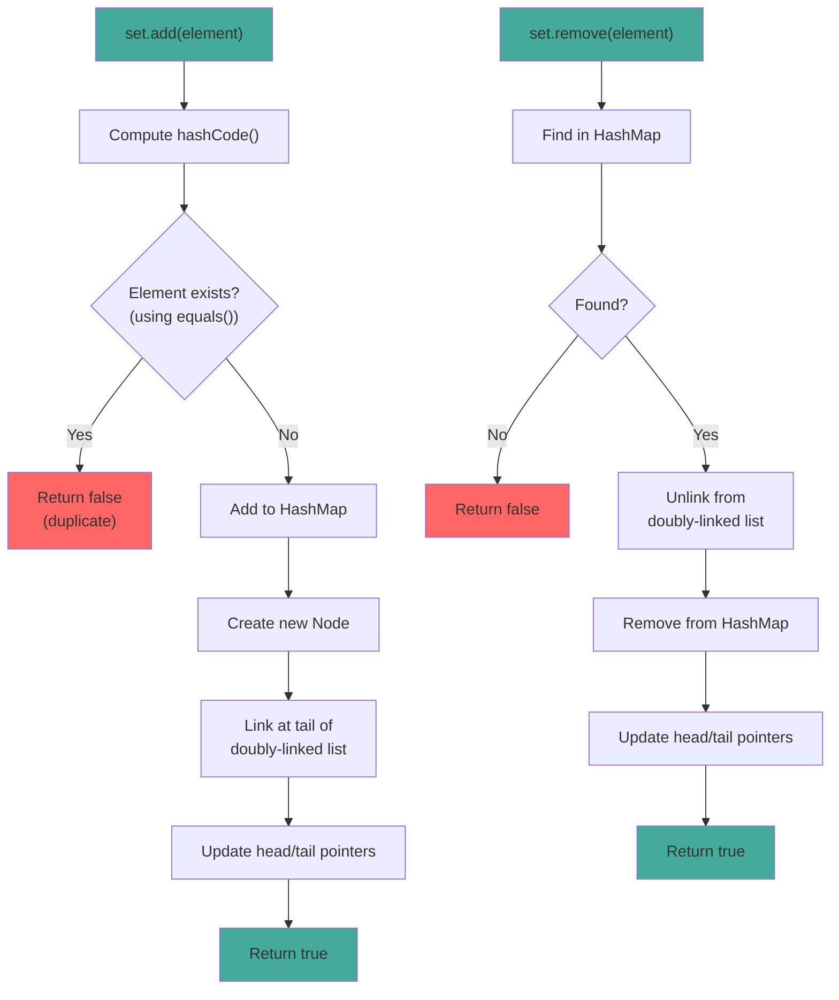

# LinkedHashSet

## 1. Introduction

LinkedHashSet is a Set implementation that maintains insertion order using a doubly-linked list running through all entries. It extends HashSet and provides the same O(1) performance for basic operations while preserving the order in which elements were inserted.

LinkedHashSet is ideal when you need both uniqueness (like HashSet) and predictable iteration order (like ArrayList). The linked list maintains the insertion order, so iterating over a LinkedHashSet always yields elements in the order they were added.

The trade-off is slightly more memory overhead due to the linked list nodes, but the performance is still O(1) for add, remove, and contains operations. This makes LinkedHashSet a popular choice for maintaining recently accessed items, LRU caches, and ordered unique collections.

## 2. Learning Objectives

- Create and use LinkedHashSet with generics
- Understand insertion order maintenance
- Learn LinkedHashSet's performance characteristics
- Know when to use LinkedHashSet vs HashSet
- Understand the linked list overhead
- Recognize LinkedHashSet's thread-safety considerations
- Implement ordered unique collections
- Build LRU caches using LinkedHashSet

## 3. Prerequisites

- HashSet (understanding of hash-based sets)
- Set Interface
- Linked data structure concepts
- equals() and hashCode() methods

## 4. Why This Concept Exists

While HashSet provides O(1) performance, it doesn't maintain any order. This is problematic when:
- Displaying elements to users (order matters)
- Implementing LRU caches (access order needed)
- Maintaining recent items history
- Reproducing insertion order for debugging

LinkedHashSet solves this by maintaining a doubly-linked list through all entries. The linked list adds minimal overhead (2 pointers per element: before and after) while preserving insertion order.

## 5. Problem Statement

Consider implementing a "recently viewed items" feature:
- Items must be unique
- Items should be displayed in the order they were viewed
- Need O(1) add/remove operations
- Need to quickly check if an item exists

Using HashSet would lose the order:
```java
Set<String> recent = new HashSet<>();
recent.add("Item1");
recent.add("Item2");
recent.add("Item3");
// Order is unpredictable
```

Using ArrayList would allow duplicates:
```java
List<String> recent = new ArrayList<>();
recent.add("Item1");
recent.add("Item1");  // Duplicate allowed
// Need manual duplicate checking
```

LinkedHashSet provides both uniqueness and order:
```java
Set<String> recent = new LinkedHashSet<>();
recent.add("Item1");
recent.add("Item2");
recent.add("Item1");  // Ignored
// Order: [Item1, Item2]
```

## 6. Theory

### Internal Structure

LinkedHashSet extends HashSet, which uses a HashMap internally. The linked list is maintained through the HashMap entries:
- Each entry has `before` and `after` pointers
- Head points to the eldest entry
- Tail points to the most recently added entry
- Iteration follows the linked list, not the hash table

### Insertion Order Maintenance

When adding an element:
1. Element is added to HashMap (like HashSet)
2. New entry is linked at the tail of the doubly-linked list
3. Head and tail pointers are updated

When removing an element:
1. Element is removed from HashMap
2. Entry is unlinked from the doubly-linked list
3. Head and tail pointers are updated

### Performance Characteristics

LinkedHashSet has the same O(1) performance as HashSet for:
- add() - O(1) amortized
- remove() - O(1)
- contains() - O(1)

The additional memory overhead is:
- 2 pointers per entry (before and after)
- ~16 extra bytes per entry

## 7. Internal Working

### Adding Elements

```java
// LinkedHashSet.add() (inherited from HashSet)
public boolean add(E e) {
    return map.put(e, PRESENT) == null;
}

// LinkedHashMap (backing structure) maintains linked list
Node<K,V> newNode(int hash, K key, V value, Node<K,V> e) {
    Node<K,V> p = new Node<K,V>(hash, key, value, e);
    linkNodeLast(p);
    return p;
}

private void linkNodeLast(Node<K,V> p) {
    Node<K,V> last = tail;
    tail = p;
    if (last == null)
        head = p;
    else {
        p.before = last;
        last.after = p;
    }
}
```

### Iterating Elements

```java
// Iteration follows linked list, not hash table
final Node<K,V> nextNode() {
    Node<K,V> e = next;
    if (e == null)
        throw new NoSuchElementException();
    if (map.modCount != modCount)
        throw new ConcurrentModificationException();
    next = e.after;
    return e;
}
```

## 8. JVM Perspective

### Memory Allocation

```java
LinkedHashSet<String> set = new LinkedHashSet<>();
// JVM allocates:
// - LinkedHashSet object header: 12 bytes (mark word + klass pointer)
// - HashMap reference: 8 bytes (pointer to backing map)
// - Padding to 8-byte boundary: 4 bytes
// Total LinkedHashSet object: ~24 bytes

// Each entry (Node):
// - Object header: 12 bytes
// - hash field: 4 bytes
// - key reference: 8 bytes
// - value reference: 8 bytes
// - next reference: 8 bytes
// - before reference: 8 bytes (linked list)
// - after reference: 8 bytes (linked list)
// Total Node object: ~56 bytes
```

### JIT Optimization

The JIT compiler optimizes LinkedHashSet operations:
- **Inlining**: add/remove/contains are inlined
- **Linked list traversal**: Iterator follows linked list efficiently
- **Escape analysis**: Small LinkedHashSet instances may be scalar-replaced

### Garbage Collection

- Removed entries are unlinked and can be GC'd
- Linked list pointers prevent partial collection
- Large LinkedHashSet may be stored in Old Gen

## 9. Memory Representation

```
LinkedHashSet<String> set = new LinkedHashSet<>();
set.add("Apple");
set.add("Banana");
set.add("Cherry");

Memory layout:
┌───────────────────────────────┐
│ LinkedHashSet object          │
├───────────────────────────────┤
│ Object header (12 bytes)      │
│ map ──────────────────────────────┐
│ (padding 4 bytes)             │      │
└───────────────────────────────┘      │
                                       ▼
                               LinkedHashMap (internal)
                               ┌──────────────────┐
                               │ Node[] table      │
                               │ [0] → null       │
                               │ [1] → null       │
                               │ [2] → null       │
                               │ [3] → null       │
                               │ [4] → null       │
                               │ [5] → "Banana"   │ ← hash("Banana") % 16
                               │ [6] → null       │
                               │ [7] → "Apple"    │ ← hash("Apple") % 16
                               │ [8] → "Cherry"   │ ← hash("Cherry") % 16
                               │ [9-15] → null    │
                               └──────────────────┘

Linked list (insertion order):
head → "Apple" → "Banana" → "Cherry" ← tail

Each Node:
┌─────────────────────────────┐
│ Object header (12 bytes)    │
│ hash (int, 4 bytes)         │
│ key → "Apple" (8 bytes)     │
│ value → PRESENT (8 bytes)   │
│ next → (8 bytes, hash chain)│
│ before → null (8 bytes)     │ ← head has null before
│ after → "Banana" (8 bytes)  │
└─────────────────────────────┘
```

## 10. Architecture Diagram



## 11. Flow Diagram



## 12. Syntax

```java
import java.util.Set;
import java.util.LinkedHashSet;
import java.util.List;

// ============================================
// CREATION
// ============================================
Set<String> linkedHashSet = new LinkedHashSet<>();
Set<String> linkedHashSet = new LinkedHashSet<>(100);  // Initial capacity
Set<String> linkedHashSet = new LinkedHashSet<>(collection);

// ============================================
// SET OPERATIONS (all O(1))
// ============================================
// Adding elements
boolean added = linkedHashSet.add("element");    // Returns false if duplicate
linkedHashSet.addAll(List.of("a", "b", "c"));  // Add all

// Removing elements
boolean removed = linkedHashSet.remove("element");
linkedHashSet.removeAll(Set.of("a", "b"));    // Remove all matching
linkedHashSet.retainAll(Set.of("a", "c"));    // Keep only matching
linkedHashSet.clear();                          // Remove all

// Searching
boolean has = linkedHashSet.contains("element");    // O(1)
boolean hasAll = linkedHashSet.containsAll(Set.of("a", "b"));

// ============================================
// SIZE AND CHECKS
// ============================================
int size = linkedHashSet.size();
boolean isEmpty = linkedHashSet.isEmpty();

// ============================================
// ORDER OPERATIONS
// ============================================
// Get first and last elements (insertion order)
String first = linkedHashSet.iterator().next();  // First added
// For last, need to iterate or use stream

// ============================================
// CONVERSIONS
// ============================================
Object[] array = linkedHashSet.toArray();
String[] stringArray = linkedHashSet.toArray(new String[0]);
List<String> list = new ArrayList<>(linkedHashSet);

// ============================================
// ITERATION (insertion order guaranteed)
// ============================================
// Enhanced for loop (insertion order)
for (String s : linkedHashSet) {
    System.out.println(s);
}

// Iterator
Iterator<String> it = linkedHashSet.iterator();
while (it.hasNext()) {
    System.out.println(it.next());
}

// Stream
linkedHashSet.stream()
    .filter(s -> s.length() > 3)
    .forEach(System.out::println);
```

## 13. Easy Example

```java
import java.util.Set;
import java.util.LinkedHashSet;

public class LinkedHashSetBasics {
    public static void main(String[] args) {
        // Create and populate
        Set<String> colors = new LinkedHashSet<>();
        colors.add("Red");
        colors.add("Green");
        colors.add("Blue");
        colors.add("Red");  // Duplicate, ignored
        colors.add("Yellow");

        System.out.println("Colors: " + colors);
        System.out.println("Size: " + colors.size());  // 4, not 5

        // Iteration order is insertion order
        System.out.println("Iteration order (insertion order):");
        for (String color : colors) {
            System.out.println("  " + color);
        }

        // Check if contains
        System.out.println("Contains Red: " + colors.contains("Red"));
        System.out.println("Contains Purple: " + colors.contains("Purple"));

        // Remove
        colors.remove("Green");
        System.out.println("After removal: " + colors);

## 📑 Continue Reading

**Part 1** of 3 | [Part 2](README-part2.md) | [Part 3](README-part3.md)

