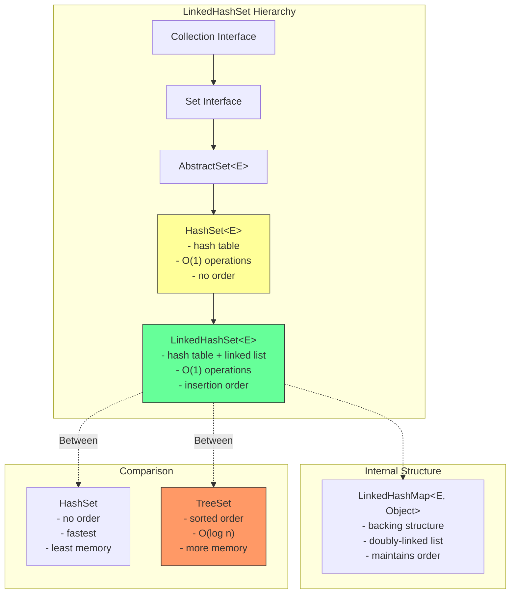
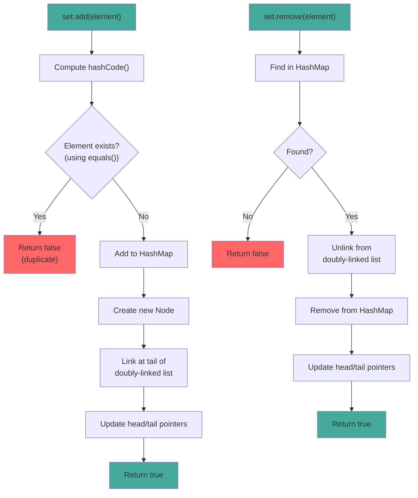

# LinkedHashSet

## 1. Introduction

LinkedHashSet is a Set implementation that maintains insertion order using a doubly-linked list running through all entries. It extends HashSet and provides the same O(1) performance for basic operations while preserving the order in which elements were inserted.

LinkedHashSet is ideal when you need both uniqueness (like HashSet) and predictable iteration order (like ArrayList). The linked list maintains the insertion order, so iterating over a LinkedHashSet always yields elements in the order they were added.

The trade-off is slightly more memory overhead due to the linked list nodes, but the performance is still O(1) for add, remove, and contains operations. This makes LinkedHashSet a popular choice for maintaining recently accessed items, LRU caches, and ordered unique collections.

## 2. Learning Objectives

- Create and use LinkedHashSet with generics
- Understand insertion order maintenance
- Learn LinkedHashSet's performance characteristics
- Know when to use LinkedHashSet vs HashSet
- Understand the linked list overhead
- Recognize LinkedHashSet's thread-safety considerations
- Implement ordered unique collections
- Build LRU caches using LinkedHashSet

## 3. Prerequisites

- HashSet (understanding of hash-based sets)
- Set Interface
- Linked data structure concepts
- equals() and hashCode() methods

## 4. Why This Concept Exists

While HashSet provides O(1) performance, it doesn't maintain any order. This is problematic when:
- Displaying elements to users (order matters)
- Implementing LRU caches (access order needed)
- Maintaining recent items history
- Reproducing insertion order for debugging

LinkedHashSet solves this by maintaining a doubly-linked list through all entries. The linked list adds minimal overhead (2 pointers per element: before and after) while preserving insertion order.

## 5. Problem Statement

Consider implementing a "recently viewed items" feature:
- Items must be unique
- Items should be displayed in the order they were viewed
- Need O(1) add/remove operations
- Need to quickly check if an item exists

Using HashSet would lose the order:
```java
Set<String> recent = new HashSet<>();
recent.add("Item1");
recent.add("Item2");
recent.add("Item3");
// Order is unpredictable
```

Using ArrayList would allow duplicates:
```java
List<String> recent = new ArrayList<>();
recent.add("Item1");
recent.add("Item1");  // Duplicate allowed
// Need manual duplicate checking
```

LinkedHashSet provides both uniqueness and order:
```java
Set<String> recent = new LinkedHashSet<>();
recent.add("Item1");
recent.add("Item2");
recent.add("Item1");  // Ignored
// Order: [Item1, Item2]
```

## 6. Theory

### Internal Structure

LinkedHashSet extends HashSet, which uses a HashMap internally. The linked list is maintained through the HashMap entries:
- Each entry has `before` and `after` pointers
- Head points to the eldest entry
- Tail points to the most recently added entry
- Iteration follows the linked list, not the hash table

### Insertion Order Maintenance

When adding an element:
1. Element is added to HashMap (like HashSet)
2. New entry is linked at the tail of the doubly-linked list
3. Head and tail pointers are updated

When removing an element:
1. Element is removed from HashMap
2. Entry is unlinked from the doubly-linked list
3. Head and tail pointers are updated

### Performance Characteristics

LinkedHashSet has the same O(1) performance as HashSet for:
- add() - O(1) amortized
- remove() - O(1)
- contains() - O(1)

The additional memory overhead is:
- 2 pointers per entry (before and after)
- ~16 extra bytes per entry

## 7. Internal Working

### Adding Elements

```java
// LinkedHashSet.add() (inherited from HashSet)
public boolean add(E e) {
    return map.put(e, PRESENT) == null;
}

// LinkedHashMap (backing structure) maintains linked list
Node<K,V> newNode(int hash, K key, V value, Node<K,V> e) {
    Node<K,V> p = new Node<K,V>(hash, key, value, e);
    linkNodeLast(p);
    return p;
}

private void linkNodeLast(Node<K,V> p) {
    Node<K,V> last = tail;
    tail = p;
    if (last == null)
        head = p;
    else {
        p.before = last;
        last.after = p;
    }
}
```

### Iterating Elements

```java
// Iteration follows linked list, not hash table
final Node<K,V> nextNode() {
    Node<K,V> e = next;
    if (e == null)
        throw new NoSuchElementException();
    if (map.modCount != modCount)
        throw new ConcurrentModificationException();
    next = e.after;
    return e;
}
```

## 8. JVM Perspective

### Memory Allocation

```java
LinkedHashSet<String> set = new LinkedHashSet<>();
// JVM allocates:
// - LinkedHashSet object header: 12 bytes (mark word + klass pointer)
// - HashMap reference: 8 bytes (pointer to backing map)
// - Padding to 8-byte boundary: 4 bytes
// Total LinkedHashSet object: ~24 bytes

// Each entry (Node):
// - Object header: 12 bytes
// - hash field: 4 bytes
// - key reference: 8 bytes
// - value reference: 8 bytes
// - next reference: 8 bytes
// - before reference: 8 bytes (linked list)
// - after reference: 8 bytes (linked list)
// Total Node object: ~56 bytes
```

### JIT Optimization

The JIT compiler optimizes LinkedHashSet operations:
- **Inlining**: add/remove/contains are inlined
- **Linked list traversal**: Iterator follows linked list efficiently
- **Escape analysis**: Small LinkedHashSet instances may be scalar-replaced

### Garbage Collection

- Removed entries are unlinked and can be GC'd
- Linked list pointers prevent partial collection
- Large LinkedHashSet may be stored in Old Gen

## 9. Memory Representation

```
LinkedHashSet<String> set = new LinkedHashSet<>();
set.add("Apple");
set.add("Banana");
set.add("Cherry");

Memory layout:
┌───────────────────────────────┐
│ LinkedHashSet object          │
├───────────────────────────────┤
│ Object header (12 bytes)      │
│ map ──────────────────────────────┐
│ (padding 4 bytes)             │      │
└───────────────────────────────┘      │
                                       ▼
                               LinkedHashMap (internal)
                               ┌──────────────────┐
                               │ Node[] table      │
                               │ [0] → null       │
                               │ [1] → null       │
                               │ [2] → null       │
                               │ [3] → null       │
                               │ [4] → null       │
                               │ [5] → "Banana"   │ ← hash("Banana") % 16
                               │ [6] → null       │
                               │ [7] → "Apple"    │ ← hash("Apple") % 16
                               │ [8] → "Cherry"   │ ← hash("Cherry") % 16
                               │ [9-15] → null    │
                               └──────────────────┘

Linked list (insertion order):
head → "Apple" → "Banana" → "Cherry" ← tail

Each Node:
┌─────────────────────────────┐
│ Object header (12 bytes)    │
│ hash (int, 4 bytes)         │
│ key → "Apple" (8 bytes)     │
│ value → PRESENT (8 bytes)   │
│ next → (8 bytes, hash chain)│
│ before → null (8 bytes)     │ ← head has null before
│ after → "Banana" (8 bytes)  │
└─────────────────────────────┘
```

## 10. Architecture Diagram



## 11. Flow Diagram



## 12. Syntax

```java
import java.util.Set;
import java.util.LinkedHashSet;
import java.util.List;

// ============================================
// CREATION
// ============================================
Set<String> linkedHashSet = new LinkedHashSet<>();
Set<String> linkedHashSet = new LinkedHashSet<>(100);  // Initial capacity
Set<String> linkedHashSet = new LinkedHashSet<>(collection);

// ============================================
// SET OPERATIONS (all O(1))
// ============================================
// Adding elements
boolean added = linkedHashSet.add("element");    // Returns false if duplicate
linkedHashSet.addAll(List.of("a", "b", "c"));  // Add all

// Removing elements
boolean removed = linkedHashSet.remove("element");
linkedHashSet.removeAll(Set.of("a", "b"));    // Remove all matching
linkedHashSet.retainAll(Set.of("a", "c"));    // Keep only matching
linkedHashSet.clear();                          // Remove all

// Searching
boolean has = linkedHashSet.contains("element");    // O(1)
boolean hasAll = linkedHashSet.containsAll(Set.of("a", "b"));

// ============================================
// SIZE AND CHECKS
// ============================================
int size = linkedHashSet.size();
boolean isEmpty = linkedHashSet.isEmpty();

// ============================================
// ORDER OPERATIONS
// ============================================
// Get first and last elements (insertion order)
String first = linkedHashSet.iterator().next();  // First added
// For last, need to iterate or use stream

// ============================================
// CONVERSIONS
// ============================================
Object[] array = linkedHashSet.toArray();
String[] stringArray = linkedHashSet.toArray(new String[0]);
List<String> list = new ArrayList<>(linkedHashSet);

// ============================================
// ITERATION (insertion order guaranteed)
// ============================================
// Enhanced for loop (insertion order)
for (String s : linkedHashSet) {
    System.out.println(s);
}

// Iterator
Iterator<String> it = linkedHashSet.iterator();
while (it.hasNext()) {
    System.out.println(it.next());
}

// Stream
linkedHashSet.stream()
    .filter(s -> s.length() > 3)
    .forEach(System.out::println);
```

## 13. Easy Example

```java
import java.util.Set;
import java.util.LinkedHashSet;

public class LinkedHashSetBasics {
    public static void main(String[] args) {
        // Create and populate
        Set<String> colors = new LinkedHashSet<>();
        colors.add("Red");
        colors.add("Green");
        colors.add("Blue");
        colors.add("Red");  // Duplicate, ignored
        colors.add("Yellow");

        System.out.println("Colors: " + colors);
        System.out.println("Size: " + colors.size());  // 4, not 5

        // Iteration order is insertion order
        System.out.println("Iteration order (insertion order):");
        for (String color : colors) {
            System.out.println("  " + color);
        }

        // Check if contains
        System.out.println("Contains Red: " + colors.contains("Red"));
        System.out.println("Contains Purple: " + colors.contains("Purple"));

        // Remove
        colors.remove("Green");
        System.out.println("After removal: " + colors);

        // Add more elements
        colors.add("Orange");
        colors.add("Purple");
        System.out.println("After adding: " + colors);

        // Iterate again (still insertion order)
        System.out.println("Final order:");
        for (String color : colors) {
            System.out.println("  " + color);
        }
    }
}
```

## 14. Medium Example

```java
import java.util.Set;
import java.util.LinkedHashSet;
import java.util.ArrayList;
import java.util.List;

public class LinkedHashSetOperations {
    public static void main(String[] args) {
        // Example 1: Recent items tracker
        System.out.println("=== Recent Items Tracker ===");
        RecentItems<String> recent = new RecentItems<>(5);
        recent.add("Item1");
        recent.add("Item2");
        recent.add("Item3");
        recent.add("Item4");
        recent.add("Item5");
        recent.add("Item6");  // Should evict Item1
        System.out.println("Recent: " + recent.getRecent());

        // Example 2: Remove duplicates preserving order
        System.out.println("\n=== Deduplication ===");
        List<Integer> numbers = List.of(5, 3, 5, 1, 3, 2, 1, 4);
        Set<Integer> unique = new LinkedHashSet<>(numbers);
        System.out.println("Original: " + numbers);
        System.out.println("Unique (ordered): " + unique);

        // Example 3: Ordered set operations
        System.out.println("\n=== Ordered Set Operations ===");
        Set<String> set1 = new LinkedHashSet<>(List.of("A", "B", "C", "D"));
        Set<String> set2 = new LinkedHashSet<>(List.of("C", "D", "E", "F"));

        // Union (maintains order from both sets)
        Set<String> union = new LinkedHashSet<>(set1);
        union.addAll(set2);
        System.out.println("Union: " + union);

        // Intersection (maintains order from first set)
        Set<String> intersection = new LinkedHashSet<>(set1);
        intersection.retainAll(set2);
        System.out.println("Intersection: " + intersection);

        // Difference (maintains order from first set)
        Set<String> difference = new LinkedHashSet<>(set1);
        difference.removeAll(set2);
        System.out.println("Difference: " + difference);

        // Example 4: LRU-like cache
        System.out.println("\n=== LRU Cache ===");
        LRUCache<String, Integer> cache = new LRUCache<>(3);
        cache.put("A", 1);
        cache.put("B", 2);
        cache.put("C", 3);
        System.out.println("Cache: " + cache);
        cache.get("A");  // Access A, moves to end
        cache.put("D", 4);  // Evicts B (least recently used)
        System.out.println("After access A and put D: " + cache);
    }

    // Recent items tracker
    static class RecentItems<T> {
        private final int maxSize;
        private final Set<T> items;

        public RecentItems(int maxSize) {
            this.maxSize = maxSize;
            this.items = new LinkedHashSet<>(maxSize, 0.75f);
        }

        public void add(T item) {
            if (items.size() >= maxSize) {
                Iterator<T> iterator = items.iterator();
                iterator.next();
                iterator.remove();
            }
            items.add(item);
        }

        public List<T> getRecent() {
            return new ArrayList<>(items);
        }
    }

    // LRU Cache using LinkedHashMap (similar concept)
    static class LRUCache<K, V> extends java.util.LinkedHashMap<K, V> {
        private final int maxSize;

        public LRUCache(int maxSize) {
            super(maxSize, 0.75f, true);  // accessOrder = true
            this.maxSize = maxSize;
        }

        @Override
        protected boolean removeEldestEntry(java.util.Map.Entry<K, V> eldest) {
            return size() > maxSize;
        }
    }
}
```

## 15. Hard Example

```java
import java.util.Set;
import java.util.LinkedHashSet;
import java.util.ArrayList;
import java.util.List;
import java.util.Iterator;

public class AdvancedLinkedHashSet {
    public static void main(String[] args) {
        // Pattern 1: Ordered set with max size
        System.out.println("=== Bounded Ordered Set ===");
        BoundedOrderedSet<String> bounded = new BoundedOrderedSet<>(3);
        bounded.add("A");
        bounded.add("B");
        bounded.add("C");
        System.out.println("Bounded: " + bounded);
        bounded.add("D");  // Should evict A
        System.out.println("After adding D: " + bounded);

        // Pattern 2: Ordered set with access tracking
        System.out.println("\n=== Access Tracked Set ===");
        AccessTrackedSet<String> tracked = new AccessTrackedSet<>();
        tracked.add("X");
        tracked.add("Y");
        tracked.add("Z");
        tracked.access("X");
        tracked.access("Z");
        System.out.println("Set: " + tracked);
        System.out.println("Access counts: " + tracked.getAccessCounts());

        // Pattern 3: Ordered set difference
        System.out.println("\n=== Ordered Set Difference ===");
        Set<String> s1 = new LinkedHashSet<>(List.of("A", "B", "C", "D"));
        Set<String> s2 = new LinkedHashSet<>(List.of("B", "D", "E", "F"));
        Set<String> diff = orderedDifference(s1, s2);
        System.out.println("s1 - s2: " + diff);

        // Pattern 4: Merge ordered sets
        System.out.println("\n=== Merge Ordered Sets ===");
        Set<String> set1 = new LinkedHashSet<>(List.of("A", "B", "C"));
        Set<String> set2 = new LinkedHashSet<>(List.of("C", "D", "E"));
        Set<String> merged = mergeOrderedSets(set1, set2);
        System.out.println("Merged: " + merged);
    }

    // Bounded ordered set
    static class BoundedOrderedSet<E> extends LinkedHashSet<E> {
        private final int maxSize;

        public BoundedOrderedSet(int maxSize) {
            super(maxSize, 0.75f);
            this.maxSize = maxSize;
        }

        @Override
        public boolean add(E e) {
            if (size() >= maxSize) {
                Iterator<E> iterator = iterator();
                iterator.next();
                iterator.remove();
            }
            return super.add(e);
        }
    }

    // Access tracked set
    static class AccessTrackedSet<E> extends LinkedHashSet<E> {
        private final java.util.Map<E, Integer> accessCounts = new java.util.HashMap<>();

        public void access(E element) {
            if (contains(element)) {
                accessCounts.merge(element, 1, Integer::sum);
            }
        }

        public java.util.Map<E, Integer> getAccessCounts() {
            return java.util.Collections.unmodifiableMap(accessCounts);
        }
    }

    // Ordered set difference (preserves order from first set)
    public static <T> Set<T> orderedDifference(Set<T> s1, Set<T> s2) {
        Set<T> result = new LinkedHashSet<>();
        for (T element : s1) {
            if (!s2.contains(element)) {
                result.add(element);
            }
        }
        return result;
    }

    // Merge ordered sets (preserves order from both, first occurrence wins)
    public static <T> Set<T> mergeOrderedSets(Set<T> s1, Set<T> s2) {
        Set<T> result = new LinkedHashSet<>(s1);
        for (T element : s2) {
            if (!result.contains(element)) {
                result.add(element);
            }
        }
        return result;
    }
}
```

## 16. Enterprise Example

```java
import java.util.Set;
import java.util.LinkedHashSet;
import java.util.Map;
import java.util.HashMap;
import java.util.ArrayList;
import java.util.List;

public class UserActivityTracker {
    private final Map<String, Set<String>> userActivities;
    private final Set<String> allActivities;
    private final int maxRecentActivities;

    public UserActivityTracker(int maxRecentActivities) {
        this.userActivities = new HashMap<>();
        this.allActivities = new LinkedHashSet<>();
        this.maxRecentActivities = maxRecentActivities;
    }

    // Track user activity
    public void trackActivity(String userId, String activity) {
        Set<String> activities = userActivities.computeIfAbsent(userId, k -> new LinkedHashSet<>());
        
        // Remove if exists (to move to end)
        activities.remove(activity);
        
        // Add to end (most recent)
        activities.add(activity);
        
        // Trim if exceeds max
        if (activities.size() > maxRecentActivities) {
            Iterator<String> iterator = activities.iterator();
            iterator.next();
            iterator.remove();
        }
        
        // Track all activities
        allActivities.add(activity);
    }

    // Get user's recent activities (in order)
    public List<String> getRecentActivities(String userId) {
        return new ArrayList<>(userActivities.getOrDefault(userId, new LinkedHashSet<>()));
    }

    // Get all unique activities (in order of first occurrence)
    public List<String> getAllActivities() {
        return new ArrayList<>(allActivities);
    }

    // Get users who performed specific activity
    public Set<String> getUsersByActivity(String activity) {
        Set<String> users = new LinkedHashSet<>();
        for (Map.Entry<String, Set<String>> entry : userActivities.entrySet()) {
            if (entry.getValue().contains(activity)) {
                users.add(entry.getKey());
            }
        }
        return users;
    }

    // Get common activities between users
    public Set<String> getCommonActivities(String user1, String user2) {
        Set<String> activities1 = userActivities.getOrDefault(user1, new LinkedHashSet<>());
        Set<String> activities2 = userActivities.getOrDefault(user2, new LinkedHashSet<>());
        Set<String> common = new LinkedHashSet<>(activities1);
        common.retainAll(activities2);
        return common;
    }

    // Get activity statistics
    public Map<String, Integer> getActivityStats() {
        Map<String, Integer> stats = new HashMap<>();
        for (Set<String> activities : userActivities.values()) {
            for (String activity : activities) {
                stats.merge(activity, 1, Integer::sum);
            }
        }
        return stats;
    }

    public static void main(String[] args) {
        UserActivityTracker tracker = new UserActivityTracker(5);

        // Track activities
        tracker.trackActivity("user1", "login");
        tracker.trackActivity("user1", "view_page");
        tracker.trackActivity("user1", "add_item");
        tracker.trackActivity("user2", "login");
        tracker.trackActivity("user2", "view_page");
        tracker.trackActivity("user1", "checkout");

        // Get recent activities
        System.out.println("User1 recent: " + tracker.getRecentActivities("user1"));
        System.out.println("User2 recent: " + tracker.getRecentActivities("user2"));

        // Get all activities
        System.out.println("All activities: " + tracker.getAllActivities());

        // Get users by activity
        System.out.println("Users who viewed page: " + tracker.getUsersByActivity("view_page"));

        // Get common activities
        System.out.println("Common activities (user1, user2): " + 
            tracker.getCommonActivities("user1", "user2"));

        // Get stats
        System.out.println("Activity stats: " + tracker.getActivityStats());
    }
}
```

## 17. Performance Considerations

### Time Complexity

| Operation | LinkedHashSet | HashSet | TreeSet | Notes |
|-----------|---------------|---------|---------|-------|
| add | O(1) | O(1) | O(log n) | Amortized |
| remove | O(1) | O(1) | O(log n) | |
| contains | O(1) | O(1) | O(log n) | |
| size | O(1) | O(1) | O(1) | |
| iteration | O(n) | O(n) | O(n) | |

### Memory Comparison

For 1 million String elements:
- HashSet: ~48 MB (8 bytes ref + node overhead)
- LinkedHashSet: ~64 MB (8 bytes ref + node overhead + 2 pointers)
- TreeSet: ~56 MB (8 bytes ref + tree node overhead)

### Performance Trade-offs

| Aspect | LinkedHashSet | HashSet |
|--------|---------------|---------|
| Add/Remove | O(1) | O(1) |
| Contains | O(1) | O(1) |
| Memory | Higher | Lower |
| Order | Insertion | None |
| Iteration | Faster (linked list) | Slower (hash table) |
| Cache locality | Better | Worse |

## 18. Time & Space Complexity

### Time Complexity Summary

| Operation | Best | Average | Worst | Notes |
|-----------|------|---------|-------|-------|
| add | O(1) | O(1) | O(n) | Worst: all collisions |
| remove | O(1) | O(1) | O(n) | |
| contains | O(1) | O(1) | O(n) | |
| iteration | O(n) | O(n) | O(n) | |
| size | O(1) | O(1) | O(1) | |

### Space Complexity

- **Internal HashMap**: O(capacity) where capacity >= size
- **Per element**: 8 bytes (reference) + ~48 bytes (node overhead)
- **Linked list pointers**: 16 bytes per element (before + after)
- **Total per element**: ~64 bytes

## 19. Thread Safety

### Not Thread-Safe

LinkedHashSet is not thread-safe:
```java
Set<String> set = new LinkedHashSet<>();
// NOT thread-safe
set.add("element");  // Race condition in multi-threaded code
```

### Synchronization Options

```java
// Option 1: Collections.synchronizedSet()
Set<String> set = Collections.synchronizedSet(new LinkedHashSet<>());

// Option 2: Manual synchronization
synchronized (set) {
    set.add("element");
    boolean has = set.contains("element");
}

// Option 3: CopyOnWriteArraySet (read-heavy)
// Note: CopyOnWriteArraySet doesn't maintain insertion order
```

### When to Use Each

| Scenario | Recommended |
|----------|-------------|
| Single-threaded | LinkedHashSet |
| Read-heavy, write-light | Collections.synchronizedSet |
| High-concurrency | Consider alternatives (ConcurrentSkipListSet for sorted) |

## 20. Best Practices

1. **Use LinkedHashSet when insertion order matters** - provides O(1) with order

2. **Set initial capacity** for known sizes:
   ```java
   Set<String> set = new LinkedHashSet<>(expectedSize);
   ```

3. **Use for LRU caches** - combine with access order for LRU behavior

4. **Consider memory overhead** - linked list adds ~16 bytes per element

5. **Use iterator for removal** - safe way to remove during iteration:
   ```java
   Iterator<String> it = set.iterator();
   while (it.hasNext()) {
       if (shouldRemove(it.next())) {
           it.remove();
       }
   }
   ```

6. **Use Stream operations** for complex filtering:
   ```java
   Set<String> filtered = set.stream()
       .filter(s -> s.length() > 3)
       .collect(Collectors.toCollection(LinkedHashSet::new));
   ```

7. **Document order semantics** - make it clear when order matters

## 21. Common Mistakes

```java
// Mistake 1: Using HashSet when order matters
Set<String> set = new HashSet<>();  // No order!
// Use LinkedHashSet for insertion order

// Mistake 2: Assuming LinkedHashSet is sorted
Set<String> set = new LinkedHashSet<>();
set.addAll(List.of("C", "A", "B"));
// Order: [C, A, B] - insertion order, not sorted!
// Use TreeSet for sorted order

// Mistake 3: Modifying element while in Set
Set<Person> set = new LinkedHashSet<>();
Person p = new Person("Alice", 30);
set.add(p);
p.setAge(31);  // hashCode() changed!
// p is now "lost" in the Set

// Mistake 4: Not trimming capacity after bulk operations
Set<String> set = new LinkedHashSet<>();
// Add many elements
set.addAll(largeCollection);
// set.trimToSize();  // Should add this (if using custom implementation)

// Mistake 5: Using LinkedHashSet when order doesn't matter
Set<String> set = new LinkedHashSet<>();  // Unnecessary overhead
// Use HashSet if order doesn't matter
```

## 22. Pitfalls & Warnings

### Memory Overhead

LinkedHashSet uses more memory than HashSet:
- 2 additional pointers per element (before and after)
- ~16 extra bytes per element
- Consider this for large datasets

### Insertion Order vs Access Order

LinkedHashSet maintains insertion order by default:
- Elements are iterated in order they were added
- Not sorted alphabetically or by any other criteria
- Use TreeSet for sorted order

### Null Elements

LinkedHashSet allows one null element:
```java
Set<String> set = new LinkedHashSet<>();
set.add(null);  // OK
set.add(null);  // Ignored
```

### ConcurrentModificationException

Iterators are fail-fast:
```java
Iterator<String> it = set.iterator();
while (it.hasNext()) {
    String s = it.next();
    set.add("X");  // ConcurrentModificationException
}
```

## 23. Debugging Tips

1. **Print set contents**: Use `System.out.println(set)` to see insertion order
2. **Check size**: Use `set.size()` to understand current state
3. **Verify order**: Add elements and iterate to confirm insertion order
4. **Test equals/hashCode**: Verify custom objects work correctly
5. **Use debugger**: Inspect linked list structure in IDE
6. **Profile memory**: Use JProfiler or VisualVM to check memory usage
7. **Test thread safety**: Verify synchronization if needed

## 24. Comparison Table

| Feature | LinkedHashSet | HashSet | TreeSet | ArrayList |
|---------|---------------|---------|---------|-----------|
| Order | Insertion | None | Sorted | Insertion |
| Duplicates | No | No | No | Yes |
| Null elements | 1 | 1 | No | Multiple |
| Add | O(1) | O(1) | O(log n) | O(1)* |
| Remove | O(1) | O(1) | O(log n) | O(n) |
| Contains | O(1) | O(1) | O(log n) | O(n) |
| Memory | Higher | Lower | Higher | Lower |
| Best for | Ordered unique | Unique | Sorted unique | Ordered duplicates |

## 25. Decision Tree

```
Need a Set?
├── Yes → Need order?
│   ├── Insertion order → LinkedHashSet
│   ├── Sorted order → TreeSet
│   └── No order → HashSet (fastest)
├── No → Need duplicates?
│   ├── Yes → List (ArrayList, LinkedList)
│   └── No → Set
└── Need thread-safety?
    └── Yes → Collections.synchronizedSet() or alternatives
```

## 26. Interview Questions

### Q1: What is the difference between HashSet and LinkedHashSet?
**A**: HashSet doesn't maintain order, LinkedHashSet maintains insertion order. Both have O(1) performance. LinkedHashSet uses more memory due to linked list pointers.

### Q2: What is the performance overhead of LinkedHashSet compared to HashSet?
**A**: Same O(1) for add/remove/contains. ~16 extra bytes per element for linked list pointers. Iteration may be faster due to linked list traversal.

### Q3: When would you use LinkedHashSet over TreeSet?
**A**: When you need insertion order (not sorted), O(1) performance (vs O(log n) for TreeSet), or when elements don't implement Comparable.

### Q4: How does LinkedHashSet maintain insertion order?
**A**: Uses a doubly-linked list through all entries. Each entry has before/after pointers. Iteration follows the linked list, not the hash table.

### Q5: Can LinkedHashSet contain null elements?
**A**: Yes, it allows one null element, just like HashSet.

### Q6: What is the time complexity of LinkedHashSet operations?
**A**: add/remove/contains: O(1). size: O(1). iteration: O(n). Same as HashSet.

### Q7: How do you remove the oldest element from LinkedHashSet?
**A**: Use iterator: `iterator().next(); iterator().remove();` removes the first (oldest) element.

### Q8: What is the memory overhead of LinkedHashSet vs HashSet?
**A**: LinkedHashSet uses ~16 extra bytes per element for linked list pointers (before and after).

### Q9: Can LinkedHashSet be used for LRU cache?
**A**: Yes, by extending LinkedHashMap with accessOrder=true and overriding removeEldestEntry(). LinkedHashSet doesn't directly support access order.

### Q10: How do you convert LinkedHashSet to List?
**A**: `List<String> list = new ArrayList<>(linkedHashSet);` preserves insertion order.

### Q11: What happens if you modify an element while it's in LinkedHashSet?
**A**: If hashCode() changes, the element becomes "lost". Use immutable objects or don't modify while in set.

### Q12: How do you iterate LinkedHashSet in reverse order?
**A**: Use stream: `set.stream().collect(Collectors.collectingAndThen(Collectors.toList(), list -> { Collections.reverse(list); return list; }))`

### Q13: What is the difference between LinkedHashSet and LinkedHashSet with accessOrder?
**A**: LinkedHashSet doesn't support accessOrder. Use LinkedHashMap with accessOrder=true for LRU behavior.

### Q14: How do you create an immutable LinkedHashSet?
**A**: Java 9+: `Set.copyOf(set)`. Earlier: `Collections.unmodifiableSet(set)`. Note: these return Set, not LinkedHashSet.

### Q15: What are common uses of LinkedHashSet?
**A**: Recently viewed items, LRU caches (with LinkedHashMap), ordered unique collections, preserving insertion order for display.

## 27. Exercises

### Exercise 1: Insertion Order (Easy)
```java
// Create a LinkedHashSet that maintains strings in insertion order
public static void main(String[] args) {
    Set<String> set = new LinkedHashSet<>();
    set.add("Charlie");
    set.add("Alice");
    set.add("Bob");
    
    // Should print in insertion order: Charlie, Alice, Bob
    for (String s : set) {
        System.out.println(s);
    }
}
```

### Exercise 2: LRU Cache (Medium)
```java
// Implement LRU cache using LinkedHashSet
public class LRUCache<K> extends LinkedHashSet<K> {
    private final int maxSize;
    
    public LRUCache(int maxSize) {
        super(maxSize, 0.75f, true);  // accessOrder = true
        this.maxSize = maxSize;
    }
    
    @Override
    protected boolean removeEldestEntry(K eldest) {
        return size() > maxSize;
    }
    
    public K get(K key) {
        if (contains(key)) {
            remove(key);
            add(key);
            return key;
        }
        return null;
    }
}
```

### Exercise 3: Ordered Set Operations (Hard)
```java
// Implement ordered set operations that preserve insertion order
public class OrderedSetOperations {
    public static <T> Set<T> union(Set<T> s1, Set<T> s2) {
        Set<T> result = new LinkedHashSet<>(s1);
        for (T element : s2) {
            if (!result.contains(element)) {
                result.add(element);
            }
        }
        return result;
    }
    
    public static <T> Set<T> intersection(Set<T> s1, Set<T> s2) {
        Set<T> result = new LinkedHashSet<>();
        for (T element : s1) {
            if (s2.contains(element)) {
                result.add(element);
            }
        }
        return result;
    }
    
    public static <T> Set<T> difference(Set<T> s1, Set<T> s2) {
        Set<T> result = new LinkedHashSet<>();
        for (T element : s1) {
            if (!s2.contains(element)) {
                result.add(element);
            }
        }
        return result;
    }
}
```

## 28. Summary

LinkedHashSet is a Set implementation that maintains insertion order:

- **Internal structure**: Hash table + doubly-linked list
- **Performance**: O(1) for add/remove/contains (same as HashSet)
- **Order**: Insertion order (not sorted)
- **Memory**: Higher than HashSet due to linked list pointers
- **Thread safety**: Not thread-safe; use Collections.synchronizedSet()
- **Null elements**: Allows one null element
- **Best for**: Insertion order matters, recently accessed items, LRU-like behavior
- **Key insight**: Provides HashSet performance with predictable iteration order

## 29. References

### Official Documentation
- [LinkedHashSet JavaDoc](https://docs.oracle.com/en/java/javase/21/docs/api/java/util/LinkedHashSet.html)
- [Set Interface](https://docs.oracle.com/en/java/javase/21/docs/api/java/util/Set.html)
- [HashSet Documentation](https://docs.oracle.com/en/java/javase/21/docs/api/java/util/HashSet.html)

### Books
- *Effective Java* by Joshua Bloch (Item 10: Always override hashCode when you override equals)
- *Introduction to Algorithms* by Cormen et al. (Hash tables chapter)

### Online Resources
- [Baeldung LinkedHashSet Guide](https://www.baeldung.com/java-linkedhashset)
- [GeeksforGeeks LinkedHashSet](https://www.geeksforgeeks.org/linkedhashset-class-in-java/)
- [Java Collections Tutorial](https://docs.oracle.com/en/java/javase/21/collections/implementations/hashset.html)

### Related Topics
- [Set Interface](../10-set/README.md)
- [HashSet](../11-hashset/README.md)
- [TreeSet](../13-treeset/README.md)
- [LinkedHashMap](../16-linkedhashmap/README.md)
