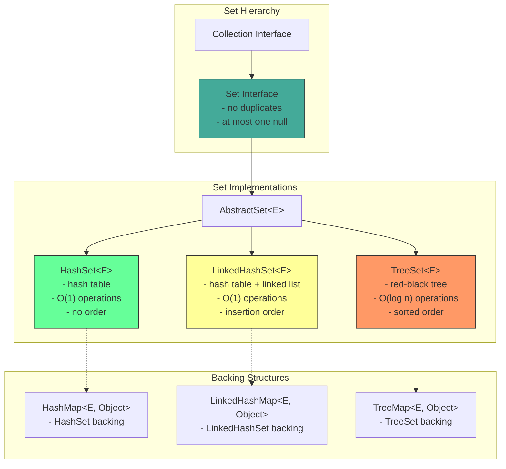
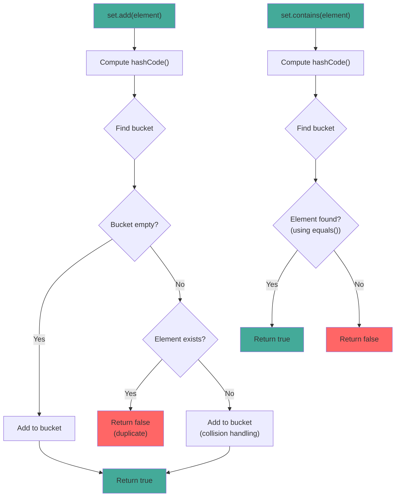

# Set Interface

## 1. Introduction

Set is a collection that contains no duplicate elements. It models the mathematical set abstraction, providing operations for membership testing, union, intersection, and difference. Set is one of the core interfaces in the Java Collections Framework.

Set extends the Collection interface and adds the constraint that all elements must be unique. This uniqueness is enforced through the `equals()` and `hashCode()` methods of the elements. When you add an element to a Set, it checks if an equal element already exists using these methods.

There are three main Set implementations: `HashSet` (hash table, fastest), `LinkedHashSet` (hash table + linked list, maintains insertion order), and `TreeMap` (red-black tree, sorted order). Each has different performance characteristics and ordering guarantees.

## 2. Learning Objectives

- Understand the Set interface and its properties
- Learn about element uniqueness and how it's enforced
- Understand Set implementations (HashSet, LinkedHashSet, TreeSet)
- Know when to use Set vs List
- Master set operations (union, intersection, difference)
- Understand equals() and hashCode() contract for Sets
- Recognize Set's thread-safety considerations
- Apply Sets in real-world scenarios

## 3. Prerequisites

- Introduction to Collections Framework
- List Interface
- equals() and hashCode() methods
- Basic object comparison concepts

## 4. Why This Concept Exists

Many real-world scenarios require unique elements:
- Tracking unique users or sessions
- Removing duplicate records from data
- Implementing membership tests (is user in group?)
- Set operations in data analysis (common customers, unique products)

Without Set, you would need to:
1. Manually check for duplicates before adding
2. Implement your own uniqueness logic
3. Write boilerplate code for set operations

Set provides all these capabilities out of the box with O(1) membership testing (HashSet).

## 5. Problem Statement

Consider building a tag system for a blog:
- Each post can have multiple tags
- Tags must be unique per post
- Need to quickly check if a tag exists
- Need to find common tags between posts
- Need to find unique tags across all posts

Using a List would require manual duplicate checking:
```java
List<String> tags = new ArrayList<>();
if (!tags.contains("java")) {
    tags.add("java");  // Manual duplicate check
}
```

A Set handles this automatically:
```java
Set<String> tags = new HashSet<>();
tags.add("java");  // No duplicate check needed
```

## 6. Theory

### Set Contract

The Set interface defines these guarantees:
1. **No duplicate elements**: At most one null element
2. **Addition**: `add()` returns false if element already exists
3. **Uniqueness**: Based on `equals()` and `hashCode()`

### hashCode() and equals() Contract

For Set to work correctly, elements must properly implement:
- `hashCode()`: Returns consistent hash value for equal objects
- `equals()`: Defines equality between objects

```java
// Correct implementation
@Override
public boolean equals(Object o) {
    if (this == o) return true;
    if (o == null || getClass() != o.getClass()) return false;
    Person person = (Person) o;
    return age == person.age && Objects.equals(name, person.name);
}

@Override
public int hashCode() {
    return Objects.hash(name, age);
}
```

### Set Implementations

| Implementation | Underlying Structure | Order | Null | Thread-Safe |
|----------------|---------------------|-------|------|-------------|
| HashSet | Hash table | None | Yes | No |
| LinkedHashSet | Hash table + linked list | Insertion | Yes | No |
| TreeSet | Red-black tree | Sorted | No | No |

## 7. Internal Working

### HashSet Internally

HashSet uses a HashMap internally:
```java
public class HashSet<E> extends AbstractSet<E> implements Set<E> {
    private transient HashMap<E, Object> map;
    private static final Object PRESENT = new Object();

    public boolean add(E e) {
        return map.put(e, PRESENT) == null;
    }

    public boolean remove(Object o) {
        return map.remove(o) == PRESENT;
    }

    public boolean contains(Object o) {
        return map.containsKey(o);
    }
}
```

### Adding Elements

When adding an element:
1. Compute hashCode() of the element
2. Find the bucket (index) using hash & (capacity - 1)
3. Check if equal element exists in bucket (using equals())
4. If not found, add to bucket
5. If found, replace (or do nothing for Sets)

### Collision Handling

When two elements have the same hashCode():
1. Both go to the same bucket
2. Stored as a linked list (or tree in Java 8+ for long chains)
3. Equality checked using equals()

## 8. JVM Perspective

### Memory Allocation

```java
Set<String> set = new HashSet<>();
// JVM allocates:
// - HashSet object header: 12 bytes (mark word + klass pointer)
// - HashMap reference: 8 bytes (pointer to backing map)
// - Padding to 8-byte boundary: 4 bytes
// Total HashSet object: ~24 bytes

// Internal HashMap:
// - HashMap object header: 12 bytes
// - Node[] table reference: 8 bytes
// - size field: 4 bytes
// - loadFactor field: 4 bytes
// - threshold field: 4 bytes
// Total HashMap object: ~36 bytes

// Each entry (Node):
// - Object header: 12 bytes
// - hash field: 4 bytes
// - key reference: 8 bytes
// - value reference: 8 bytes
// - next reference: 8 bytes
// Total Node object: ~40 bytes
```

### JIT Optimization

The JIT compiler optimizes Set operations:
- **Inlining**: contains/add/remove are inlined
- **Hash distribution**: Good hashCode() distributes elements evenly
- **Escape analysis**: Small Sets may be scalar-replaced

### Garbage Collection

- Removed elements set to `null` to help GC
- Weak references can be used for caching
- Large Sets may be stored in Old Gen

## 9. Memory Representation

```
```
Set<String> set = new HashSet<>();
set.add("Apple");
set.add("Banana");
set.add("Cherry");

Memory layout:
┌───────────────────────────────┐
│ HashSet object                │
├───────────────────────────────┤
│ Object header (12 bytes)      │
│ map ──────────────────────────────┐
│ (padding 4 bytes)             │      │
└───────────────────────────────┘      │
                                       ▼
                               HashMap (internal)
                               ┌──────────────────┐
                               │ Node[] table      │
                               │ [0] → null       │
                               │ [1] → null       │
                               │ [2] → null       │
                               │ [3] → null       │
                               │ [4] → null       │
                               │ [5] → "Banana"   │ ← hash("Banana") % 8
                               │ [6] → null       │
                               │ [7] → "Apple"    │ ← hash("Apple") % 8
                               │ [8] → "Cherry"   │ ← hash("Cherry") % 8
                               │ [9-15] → null    │
                               └──────────────────┘

Each Node:
┌─────────────────────────────┐
│ Object header (12 bytes)    │
│ hash (int, 4 bytes)         │
│ key → "Apple" (8 bytes)     │
│ value → PRESENT (8 bytes)   │
│ next → null (8 bytes)       │
└─────────────────────────────┘
```

## 10. Architecture Diagram



## 11. Flow Diagram



## 12. Syntax

```java
import java.util.Set;
import java.util.HashSet;
import java.util.LinkedHashSet;
import java.util.TreeSet;
import java.util.Collections;

// ============================================
// CREATION
// ============================================
Set<String> hashSet = new HashSet<>();
Set<String> linkedHashSet = new LinkedHashSet<>();
Set<String> treeSet = new TreeSet<>();
Set<String> fromCollection = new HashSet<>(List.of("A", "B", "C"));

// ============================================
// ADDING ELEMENTS
// ============================================
boolean added = set.add("element");    // Returns false if duplicate
set.addAll(Set.of("a", "b", "c"));    // Add all

// ============================================
// REMOVING ELEMENTS
// ============================================
boolean removed = set.remove("element");     // Remove by value
boolean removedAll = set.removeAll(Set.of("a", "b")); // Remove all matching
set.retainAll(Set.of("a", "c"));             // Keep only matching
set.clear();                                   // Remove all

// ============================================
// SEARCHING
// ============================================
boolean has = set.contains("element");    // O(1) for HashSet
boolean hasAll = set.containsAll(Set.of("a", "b")); // Check all

// ============================================
// SET OPERATIONS
// ============================================
// Union
Set<Integer> union = new HashSet<>(set1);
union.addAll(set2);

// Intersection
Set<Integer> intersection = new HashSet<>(set1);
intersection.retainAll(set2);

// Difference
Set<Integer> difference = new HashSet<>(set1);
difference.removeAll(set2);

// Symmetric difference
Set<Integer> symDiff = new HashSet<>(set1);
symDiff.addAll(set2);
Set<Integer> common = new HashSet<>(set1);
common.retainAll(set2);
symDiff.removeAll(common);

// ============================================
// SIZE AND CHECKS
// ============================================
int size = set.size();
boolean isEmpty = set.isEmpty();

// ============================================
// CONVERSIONS
// ============================================
Object[] array = set.toArray();
String[] stringArray = set.toArray(new String[0]);
List<String> list = new ArrayList<>(set);

// ============================================
// ITERATION
// ============================================
for (String s : set) {
    System.out.println(s);
}

Iterator<String> it = set.iterator();
while (it.hasNext()) {
    System.out.println(it.next());
}

set.forEach(System.out::println);
```

## 13. Easy Example

```java
import java.util.Set;
import java.util.HashSet;

public class SetBasics {
    public static void main(String[] args) {
        // Create and populate
        Set<String> fruits = new HashSet<>();
        fruits.add("Apple");
        fruits.add("Banana");
        fruits.add("Cherry");
        fruits.add("Apple");  // Duplicate, ignored

        System.out.println("Fruits: " + fruits);
        System.out.println("Size: " + fruits.size());  // 3, not 4

        // Check if contains

## 📑 Continue Reading

**Part 1** of 3 | [Part 2](README-part2.md) | [Part 3](README-part3.md)

