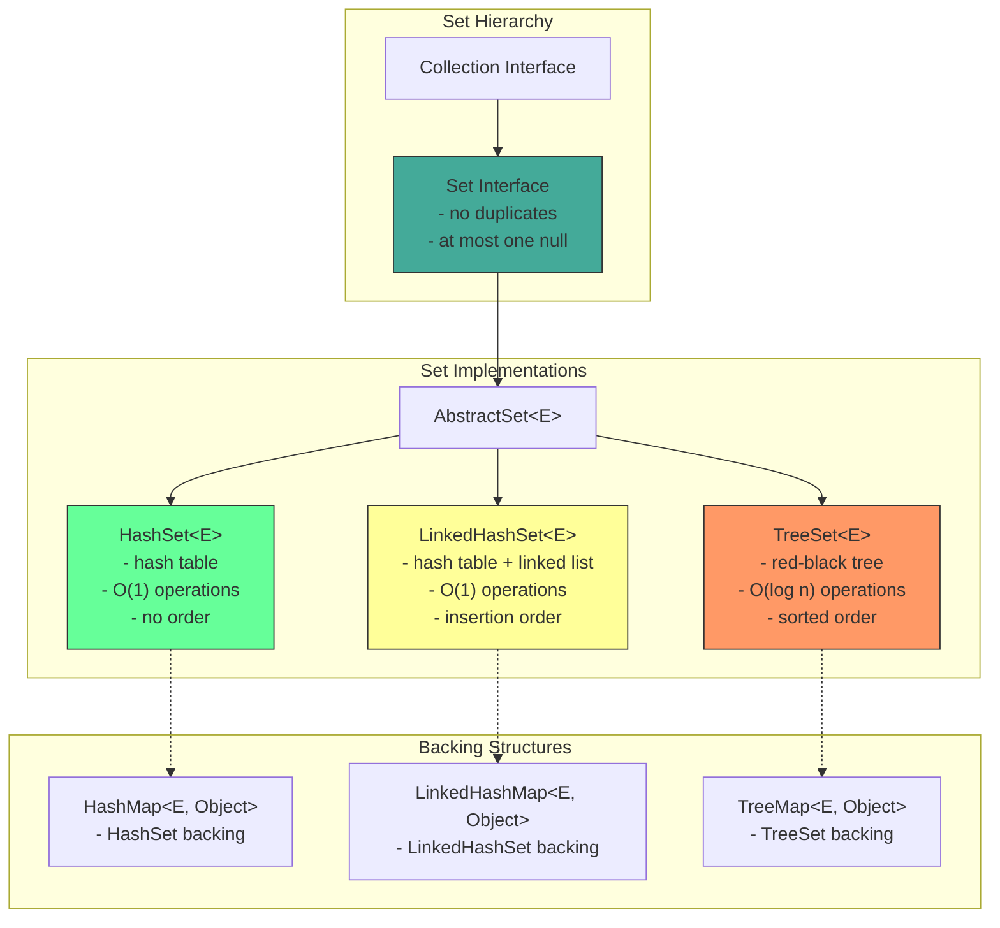
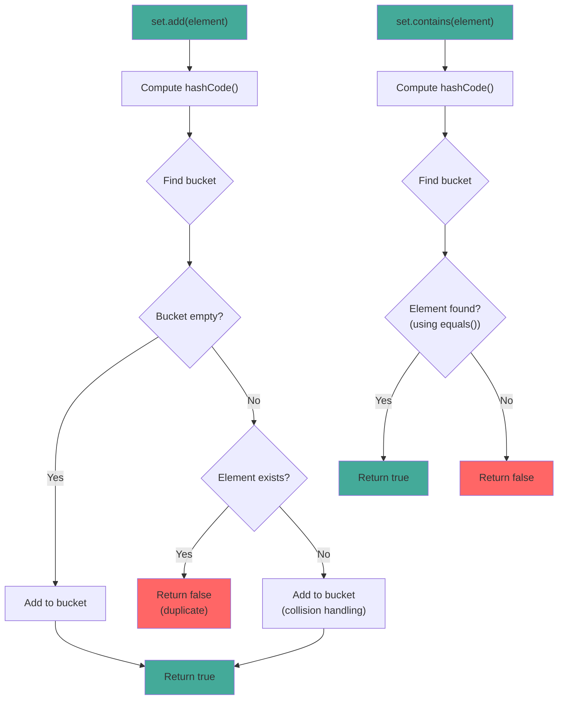

# Set Interface

## 1. Introduction

Set is a collection that contains no duplicate elements. It models the mathematical set abstraction, providing operations for membership testing, union, intersection, and difference. Set is one of the core interfaces in the Java Collections Framework.

Set extends the Collection interface and adds the constraint that all elements must be unique. This uniqueness is enforced through the `equals()` and `hashCode()` methods of the elements. When you add an element to a Set, it checks if an equal element already exists using these methods.

There are three main Set implementations: `HashSet` (hash table, fastest), `LinkedHashSet` (hash table + linked list, maintains insertion order), and `TreeMap` (red-black tree, sorted order). Each has different performance characteristics and ordering guarantees.

## 2. Learning Objectives

- Understand the Set interface and its properties
- Learn about element uniqueness and how it's enforced
- Understand Set implementations (HashSet, LinkedHashSet, TreeSet)
- Know when to use Set vs List
- Master set operations (union, intersection, difference)
- Understand equals() and hashCode() contract for Sets
- Recognize Set's thread-safety considerations
- Apply Sets in real-world scenarios

## 3. Prerequisites

- Introduction to Collections Framework
- List Interface
- equals() and hashCode() methods
- Basic object comparison concepts

## 4. Why This Concept Exists

Many real-world scenarios require unique elements:
- Tracking unique users or sessions
- Removing duplicate records from data
- Implementing membership tests (is user in group?)
- Set operations in data analysis (common customers, unique products)

Without Set, you would need to:
1. Manually check for duplicates before adding
2. Implement your own uniqueness logic
3. Write boilerplate code for set operations

Set provides all these capabilities out of the box with O(1) membership testing (HashSet).

## 5. Problem Statement

Consider building a tag system for a blog:
- Each post can have multiple tags
- Tags must be unique per post
- Need to quickly check if a tag exists
- Need to find common tags between posts
- Need to find unique tags across all posts

Using a List would require manual duplicate checking:
```java
List<String> tags = new ArrayList<>();
if (!tags.contains("java")) {
    tags.add("java");  // Manual duplicate check
}
```

A Set handles this automatically:
```java
Set<String> tags = new HashSet<>();
tags.add("java");  // No duplicate check needed
```

## 6. Theory

### Set Contract

The Set interface defines these guarantees:
1. **No duplicate elements**: At most one null element
2. **Addition**: `add()` returns false if element already exists
3. **Uniqueness**: Based on `equals()` and `hashCode()`

### hashCode() and equals() Contract

For Set to work correctly, elements must properly implement:
- `hashCode()`: Returns consistent hash value for equal objects
- `equals()`: Defines equality between objects

```java
// Correct implementation
@Override
public boolean equals(Object o) {
    if (this == o) return true;
    if (o == null || getClass() != o.getClass()) return false;
    Person person = (Person) o;
    return age == person.age && Objects.equals(name, person.name);
}

@Override
public int hashCode() {
    return Objects.hash(name, age);
}
```

### Set Implementations

| Implementation | Underlying Structure | Order | Null | Thread-Safe |
|----------------|---------------------|-------|------|-------------|
| HashSet | Hash table | None | Yes | No |
| LinkedHashSet | Hash table + linked list | Insertion | Yes | No |
| TreeSet | Red-black tree | Sorted | No | No |

## 7. Internal Working

### HashSet Internally

HashSet uses a HashMap internally:
```java
public class HashSet<E> extends AbstractSet<E> implements Set<E> {
    private transient HashMap<E, Object> map;
    private static final Object PRESENT = new Object();

    public boolean add(E e) {
        return map.put(e, PRESENT) == null;
    }

    public boolean remove(Object o) {
        return map.remove(o) == PRESENT;
    }

    public boolean contains(Object o) {
        return map.containsKey(o);
    }
}
```

### Adding Elements

When adding an element:
1. Compute hashCode() of the element
2. Find the bucket (index) using hash & (capacity - 1)
3. Check if equal element exists in bucket (using equals())
4. If not found, add to bucket
5. If found, replace (or do nothing for Sets)

### Collision Handling

When two elements have the same hashCode():
1. Both go to the same bucket
2. Stored as a linked list (or tree in Java 8+ for long chains)
3. Equality checked using equals()

## 8. JVM Perspective

### Memory Allocation

```java
Set<String> set = new HashSet<>();
// JVM allocates:
// - HashSet object header: 12 bytes (mark word + klass pointer)
// - HashMap reference: 8 bytes (pointer to backing map)
// - Padding to 8-byte boundary: 4 bytes
// Total HashSet object: ~24 bytes

// Internal HashMap:
// - HashMap object header: 12 bytes
// - Node[] table reference: 8 bytes
// - size field: 4 bytes
// - loadFactor field: 4 bytes
// - threshold field: 4 bytes
// Total HashMap object: ~36 bytes

// Each entry (Node):
// - Object header: 12 bytes
// - hash field: 4 bytes
// - key reference: 8 bytes
// - value reference: 8 bytes
// - next reference: 8 bytes
// Total Node object: ~40 bytes
```

### JIT Optimization

The JIT compiler optimizes Set operations:
- **Inlining**: contains/add/remove are inlined
- **Hash distribution**: Good hashCode() distributes elements evenly
- **Escape analysis**: Small Sets may be scalar-replaced

### Garbage Collection

- Removed elements set to `null` to help GC
- Weak references can be used for caching
- Large Sets may be stored in Old Gen

## 9. Memory Representation

```
Set<String> set = new HashSet<>();
set.add("Apple");
set.add("Banana");
set.add("Cherry");

Memory layout:
┌───────────────────────────────┐
│ HashSet object                │
├───────────────────────────────┤
│ Object header (12 bytes)      │
│ map ──────────────────────────────┐
│ (padding 4 bytes)             │      │
└───────────────────────────────┘      │
                                       ▼
                               HashMap (internal)
                               ┌──────────────────┐
                               │ Node[] table      │
                               │ [0] → null       │
                               │ [1] → null       │
                               │ [2] → null       │
                               │ [3] → null       │
                               │ [4] → null       │
                               │ [5] → "Banana"   │ ← hash("Banana") % 8
                               │ [6] → null       │
                               │ [7] → "Apple"    │ ← hash("Apple") % 8
                               │ [8] → "Cherry"   │ ← hash("Cherry") % 8
                               │ [9-15] → null    │
                               └──────────────────┘

Each Node:
┌─────────────────────────────┐
│ Object header (12 bytes)    │
│ hash (int, 4 bytes)         │
│ key → "Apple" (8 bytes)     │
│ value → PRESENT (8 bytes)   │
│ next → null (8 bytes)       │
└─────────────────────────────┘
```

## 10. Architecture Diagram



## 11. Flow Diagram



## 12. Syntax

```java
import java.util.Set;
import java.util.HashSet;
import java.util.LinkedHashSet;
import java.util.TreeSet;
import java.util.Collections;

// ============================================
// CREATION
// ============================================
Set<String> hashSet = new HashSet<>();
Set<String> linkedHashSet = new LinkedHashSet<>();
Set<String> treeSet = new TreeSet<>();
Set<String> fromCollection = new HashSet<>(List.of("A", "B", "C"));

// ============================================
// ADDING ELEMENTS
// ============================================
boolean added = set.add("element");    // Returns false if duplicate
set.addAll(Set.of("a", "b", "c"));    // Add all

// ============================================
// REMOVING ELEMENTS
// ============================================
boolean removed = set.remove("element");     // Remove by value
boolean removedAll = set.removeAll(Set.of("a", "b")); // Remove all matching
set.retainAll(Set.of("a", "c"));             // Keep only matching
set.clear();                                   // Remove all

// ============================================
// SEARCHING
// ============================================
boolean has = set.contains("element");    // O(1) for HashSet
boolean hasAll = set.containsAll(Set.of("a", "b")); // Check all

// ============================================
// SET OPERATIONS
// ============================================
// Union
Set<Integer> union = new HashSet<>(set1);
union.addAll(set2);

// Intersection
Set<Integer> intersection = new HashSet<>(set1);
intersection.retainAll(set2);

// Difference
Set<Integer> difference = new HashSet<>(set1);
difference.removeAll(set2);

// Symmetric difference
Set<Integer> symDiff = new HashSet<>(set1);
symDiff.addAll(set2);
Set<Integer> common = new HashSet<>(set1);
common.retainAll(set2);
symDiff.removeAll(common);

// ============================================
// SIZE AND CHECKS
// ============================================
int size = set.size();
boolean isEmpty = set.isEmpty();

// ============================================
// CONVERSIONS
// ============================================
Object[] array = set.toArray();
String[] stringArray = set.toArray(new String[0]);
List<String> list = new ArrayList<>(set);

// ============================================
// ITERATION
// ============================================
for (String s : set) {
    System.out.println(s);
}

Iterator<String> it = set.iterator();
while (it.hasNext()) {
    System.out.println(it.next());
}

set.forEach(System.out::println);
```

## 13. Easy Example

```java
import java.util.Set;
import java.util.HashSet;

public class SetBasics {
    public static void main(String[] args) {
        // Create and populate
        Set<String> fruits = new HashSet<>();
        fruits.add("Apple");
        fruits.add("Banana");
        fruits.add("Cherry");
        fruits.add("Apple");  // Duplicate, ignored

        System.out.println("Fruits: " + fruits);
        System.out.println("Size: " + fruits.size());  // 3, not 4

        // Check if contains
        System.out.println("Contains Apple: " + fruits.contains("Apple"));
        System.out.println("Contains Grape: " + fruits.contains("Grape"));

        // Remove
        fruits.remove("Banana");
        System.out.println("After removal: " + fruits);

        // Add multiple
        fruits.addAll(Set.of("Date", "Elderberry"));
        System.out.println("After adding: " + fruits);

        // Check size
        System.out.println("Size: " + fruits.size());

        // Iterate
        System.out.println("Iterating:");
        for (String fruit : fruits) {
            System.out.println("  " + fruit);
        }
    }
}
```

## 14. Medium Example

```java
import java.util.Set;
import java.util.HashSet;
import java.util.LinkedHashSet;
import java.util.TreeSet;
import java.util.Arrays;
import java.util.List;

public class SetOperations {
    public static void main(String[] args) {
        // Example 1: Remove duplicates from List
        System.out.println("=== Remove Duplicates ===");
        List<Integer> numbersWithDuplicates = Arrays.asList(1, 2, 2, 3, 3, 3, 4);
        Set<Integer> uniqueNumbers = new LinkedHashSet<>(numbersWithDuplicates);
        System.out.println("Original: " + numbersWithDuplicates);
        System.out.println("Unique: " + uniqueNumbers);

        // Example 2: Set operations
        System.out.println("\n=== Set Operations ===");
        Set<Integer> set1 = new HashSet<>(Set.of(1, 2, 3, 4));
        Set<Integer> set2 = new HashSet<>(Set.of(3, 4, 5, 6));

        // Union
        Set<Integer> union = new HashSet<>(set1);
        union.addAll(set2);
        System.out.println("Union: " + union);

        // Intersection
        Set<Integer> intersection = new HashSet<>(set1);
        intersection.retainAll(set2);
        System.out.println("Intersection: " + intersection);

        // Difference
        Set<Integer> difference = new HashSet<>(set1);
        difference.removeAll(set2);
        System.out.println("Difference (set1 - set2): " + difference);

        // Symmetric difference
        Set<Integer> symDiff = new HashSet<>(set1);
        symDiff.addAll(set2);
        symDiff.removeAll(intersection);
        System.out.println("Symmetric Difference: " + symDiff);

        // Example 3: Different Set implementations
        System.out.println("\n=== Set Implementations ===");
        
        // HashSet - no order
        Set<String> hashSet = new HashSet<>();
        hashSet.addAll(List.of("Charlie", "Alice", "Bob"));
        System.out.println("HashSet: " + hashSet);

        // LinkedHashSet - insertion order
        Set<String> linkedHashSet = new LinkedHashSet<>();
        linkedHashSet.addAll(List.of("Charlie", "Alice", "Bob"));
        System.out.println("LinkedHashSet: " + linkedHashSet);

        // TreeSet - sorted order
        Set<String> treeSet = new TreeSet<>();
        treeSet.addAll(List.of("Charlie", "Alice", "Bob"));
        System.out.println("TreeSet: " + treeSet);
    }
}
```

## 15. Hard Example

```java
import java.util.Set;
import java.util.HashSet;
import java.util.LinkedHashSet;
import java.util.TreeSet;
import java.util.stream.Collectors;

public class AdvancedSet {
    public static void main(String[] args) {
        // Pattern 1: Power set generation
        System.out.println("=== Power Set ===");
        Set<Integer> original = new HashSet<>(Set.of(1, 2, 3));
        Set<Set<Integer>> powerSet = powerSet(original);
        System.out.println("Power set of " + original + ":");
        powerSet.forEach(System.out::println);

        // Pattern 2: Find all subsets of given size
        System.out.println("\n=== Subsets of Size K ===");
        Set<Integer> set = new HashSet<>(Set.of(1, 2, 3, 4, 5));
        Set<Set<Integer>> subsets = subsetsOfSize(set, 3);
        System.out.println("Subsets of size 3:");
        subsets.forEach(System.out::println);

        // Pattern 3: Set-based deduplication with ordering
        System.out.println("\n=== Ordered Deduplication ===");
        String[] words = {"apple", "banana", "apple", "cherry", "banana", "date"};
        Set<String> uniqueOrdered = deduplicatePreservingOrder(words);
        System.out.println("Unique ordered: " + uniqueOrdered);

        // Pattern 4: Set intersection of multiple sets
        System.out.println("\n=== Multiple Set Intersection ===");
        Set<Integer> s1 = new HashSet<>(Set.of(1, 2, 3, 4, 5));
        Set<Integer> s2 = new HashSet<>(Set.of(2, 3, 4, 5, 6));
        Set<Integer> s3 = new HashSet<>(Set.of(3, 4, 5, 6, 7));
        Set<Integer> intersection = multipleIntersection(s1, s2, s3);
        System.out.println("Intersection of 3 sets: " + intersection);

        // Pattern 5: Custom set with statistics
        System.out.println("\n=== Statistics Set ===");
        StatisticsSet<String> statsSet = new StatisticsSet<>();
        statsSet.add("apple");
        statsSet.add("banana");
        statsSet.add("apple");
        statsSet.add("cherry");
        System.out.println("Set: " + statsSet);
        System.out.println("Add count: " + statsSet.getAddCount());
        System.out.println("Duplicate count: " + statsSet.getDuplicateCount());
    }

    // Power set generation
    public static <T> Set<Set<T>> powerSet(Set<T> set) {
        Set<Set<T>> result = new HashSet<>();
        if (set.isEmpty()) {
            result.add(new HashSet<>());
            return result;
        }
        
        T element = set.iterator().next();
        Set<T> rest = new HashSet<>(set);
        rest.remove(element);
        
        Set<Set<T>> powerSetOfRest = powerSet(rest);
        for (Set<T> subset : powerSetOfRest) {
            Set<T> newSubset = new HashSet<>(subset);
            newSubset.add(element);
            result.add(subset);
            result.add(newSubset);
        }
        
        return result;
    }

    // Subsets of specific size
    public static <T> Set<Set<T>> subsetsOfSize(Set<T> set, int size) {
        Set<Set<T>> result = new HashSet<>();
        subsetsHelper(new ArrayList<>(set), 0, new HashSet<>(), size, result);
        return result;
    }

    private static <T> void subsetsHelper(List<T> list, int start, Set<T> current, 
                                         int size, Set<Set<T>> result) {
        if (current.size() == size) {
            result.add(new HashSet<>(current));
            return;
        }
        for (int i = start; i < list.size(); i++) {
            current.add(list.get(i));
            subsetsHelper(list, i + 1, current, size, result);
            current.remove(list.get(i));
        }
    }

    // Ordered deduplication
    public static <T> Set<T> deduplicatePreservingOrder(T[] array) {
        Set<T> result = new LinkedHashSet<>();
        for (T item : array) {
            result.add(item);
        }
        return result;
    }

    // Multiple set intersection
    @SafeVarargs
    public static <T> Set<T> multipleIntersection(Set<T>... sets) {
        if (sets.length == 0) return new HashSet<>();
        
        Set<T> result = new HashSet<>(sets[0]);
        for (int i = 1; i < sets.length; i++) {
            result.retainAll(sets[i]);
        }
        return result;
    }

    // Statistics set
    static class StatisticsSet<E> extends LinkedHashSet<E> {
        private int addCount = 0;
        private int duplicateCount = 0;

        @Override
        public boolean add(E e) {
            addCount++;
            boolean added = super.add(e);
            if (!added) {
                duplicateCount++;
            }
            return added;
        }

        public int getAddCount() {
            return addCount;
        }

        public int getDuplicateCount() {
            return duplicateCount;
        }
    }
}
```

## 16. Enterprise Example

```java
import java.util.Set;
import java.util.HashSet;
import java.util.LinkedHashSet;
import java.util.TreeSet;
import java.util.Map;
import java.util.HashMap;
import java.util.stream.Collectors;

public class UserPermissionSystem {
    private final Map<String, Set<String>> userPermissions;
    private final Map<String, Set<String>> rolePermissions;
    private final Set<String> allPermissions;

    public UserPermissionSystem() {
        this.userPermissions = new HashMap<>();
        this.rolePermissions = new HashMap<>();
        this.allPermissions = new TreeSet<>();
    }

    // Define permissions
    public void definePermission(String permission) {
        allPermissions.add(permission);
    }

    // Define role permissions
    public void defineRole(String role, Set<String> permissions) {
        rolePermissions.put(role, new HashSet<>(permissions));
    }

    // Assign role to user
    public void assignRole(String userId, String role) {
        Set<String> userPerms = userPermissions.computeIfAbsent(userId, k -> new HashSet<>());
        Set<String> rolePerms = rolePermissions.get(role);
        if (rolePerms != null) {
            userPerms.addAll(rolePerms);
        }
    }

    // Check if user has permission
    public boolean hasPermission(String userId, String permission) {
        Set<String> perms = userPermissions.get(userId);
        return perms != null && perms.contains(permission);
    }

    // Get all user permissions
    public Set<String> getUserPermissions(String userId) {
        return new HashSet<>(userPermissions.getOrDefault(userId, new HashSet<>()));
    }

    // Get users with specific permission
    public Set<String> getUsersWithPermission(String permission) {
        Set<String> users = new HashSet<>();
        for (Map.Entry<String, Set<String>> entry : userPermissions.entrySet()) {
            if (entry.getValue().contains(permission)) {
                users.add(entry.getKey());
            }
        }
        return users;
    }

    // Get common permissions between two users
    public Set<String> getCommonPermissions(String user1, String user2) {
        Set<String> perms1 = getUserPermissions(user1);
        Set<String> perms2 = getUserPermissions(user2);
        Set<String> common = new HashSet<>(perms1);
        common.retainAll(perms2);
        return common;
    }

    // Get permissions unique to one user
    public Set<String> getUniquePermissions(String user1, String user2) {
        Set<String> perms1 = getUserPermissions(user1);
        Set<String> perms2 = getUserPermissions(user2);
        Set<String> unique = new HashSet<>(perms1);
        unique.removeAll(perms2);
        return unique;
    }

    // Audit: Find users with excessive permissions
    public Set<String> findUsersWithExcessivePermissions(int threshold) {
        Set<String> excessiveUsers = new HashSet<>();
        for (Map.Entry<String, Set<String>> entry : userPermissions.entrySet()) {
            if (entry.getValue().size() > threshold) {
                excessiveUsers.add(entry.getKey());
            }
        }
        return excessiveUsers;
    }

    public static void main(String[] args) {
        UserPermissionSystem system = new UserPermissionSystem();

        // Define permissions
        system.definePermission("READ");
        system.definePermission("WRITE");
        system.definePermission("DELETE");
        system.definePermission("ADMIN");

        // Define roles
        system.defineRole("ADMIN", Set.of("READ", "WRITE", "DELETE", "ADMIN"));
        system.defineRole("USER", Set.of("READ", "WRITE"));
        system.defineRole("VIEWER", Set.of("READ"));

        // Assign roles
        system.assignRole("user1", "ADMIN");
        system.assignRole("user2", "USER");
        system.assignRole("user3", "VIEWER");
        system.assignRole("user4", "USER");

        // Check permissions
        System.out.println("user1 has ADMIN: " + system.hasPermission("user1", "ADMIN"));
        System.out.println("user2 has DELETE: " + system.hasPermission("user2", "DELETE"));

        // Get common permissions
        System.out.println("Common perms (user2, user4): " + 
            system.getCommonPermissions("user2", "user4"));

        // Get users with permission
        System.out.println("Users with WRITE: " + 
            system.getUsersWithPermission("WRITE"));
    }
}
```

## 17. Performance Considerations

### Time Complexity

| Operation | HashSet | LinkedHashSet | TreeSet | Notes |
|-----------|---------|---------------|---------|-------|
| add | O(1) | O(1) | O(log n) | Amortized |
| remove | O(1) | O(1) | O(log n) | |
| contains | O(1) | O(1) | O(log n) | |
| size | O(1) | O(1) | O(1) | |
| iteration | O(n) | O(n) | O(n) | |

### HashSet vs LinkedHashSet vs TreeSet

| Feature | HashSet | LinkedHashSet | TreeSet |
|---------|---------|---------------|---------|
| Implementation | Hash table | Hash table + linked list | Red-black tree |
| Order | None | Insertion | Sorted |
| Null | Yes (one) | Yes (one) | No |
| Performance | Best | Good | Slower |
| Memory | Less | More | More |
| Best for | Membership test | Ordered unique | Sorted unique |

### hashCode() Quality

Good hashCode() distribution:
- Even distribution across hash table
- Minimal collisions
- Consistent for equal objects

Bad hashCode():
```java
// Bad: Always returns same value
public int hashCode() { return 1; }

// Bad: Based on mutable field
public int hashCode() { return name.length(); }
```

## 18. Time & Space Complexity

### Time Complexity Summary

| Operation | Best | Average | Worst | Notes |
|-----------|------|---------|-------|-------|
| add | O(1) | O(1) | O(n) | Worst: all collisions |
| remove | O(1) | O(1) | O(n) | |
| contains | O(1) | O(1) | O(n) | |
| iteration | O(n) | O(n) | O(n) | |
| size | O(1) | O(1) | O(1) | |

### Space Complexity

- **HashSet**: O(n) + overhead for hash table
- **LinkedHashSet**: O(n) + overhead for linked list
- **TreeSet**: O(n) + overhead for tree nodes
- **Per element**: 8 bytes (reference) + node overhead

## 19. Thread Safety

### Not Thread-Safe

All Set implementations are not thread-safe:
```java
Set<String> set = new HashSet<>();
// NOT thread-safe
set.add("element");  // Race condition in multi-threaded code
```

### Synchronization Options

```java
// Option 1: Collections.synchronizedSet()
Set<String> set = Collections.synchronizedSet(new HashSet<>());

// Option 2: Manual synchronization
synchronized (set) {
    set.add("element");
    boolean has = set.contains("element");
}

// Option 3: CopyOnWriteArraySet (read-heavy)
Set<String> set = new CopyOnWriteArraySet<>();

// Option 4: ConcurrentSkipListSet (sorted, concurrent)
Set<String> set = new ConcurrentSkipListSet<>();
```

### When to Use Each

| Scenario | Recommended |
|----------|-------------|
| Single-threaded | HashSet/LinkedHashSet/TreeSet |
| Read-heavy, write-light | CopyOnWriteArraySet |
| High-concurrency sorted | ConcurrentSkipListSet |
| General thread-safe | Collections.synchronizedSet |

## 20. Best Practices

1. **Use HashSet for best performance** when order doesn't matter

2. **Use LinkedHashSet when insertion order matters** - maintains order with O(1) operations

3. **Use TreeSet when sorted order matters** - O(log n) operations but sorted

4. **Always implement equals() and hashCode()** for custom objects

5. **Consider initial capacity** for HashSet/LinkedHashSet:
   ```java
   Set<String> set = new HashSet<>(expectedSize);
   ```

6. **Use Set.of() for immutable sets** (Java 9+):
   ```java
   Set<String> immutable = Set.of("A", "B", "C");
   ```

7. **Use stream operations** for complex set operations:
   ```java
   Set<Integer> intersection = set1.stream()
       .filter(set2::contains)
       .collect(Collectors.toSet());
   ```

## 21. Common Mistakes

```java
// Mistake 1: Not implementing equals() and hashCode() for custom objects
class Person {
    String name;
    int age;
    // Missing equals() and hashCode()!
}
Set<Person> people = new HashSet<>();
people.add(new Person("Alice", 30));
people.add(new Person("Alice", 30));  // Different object, both added!

// Mistake 2: Assuming Set maintains insertion order
Set<String> set = new HashSet<>();
set.addAll(List.of("Charlie", "Alice", "Bob"));
// Order is unpredictable!

// Mistake 3: Using Set when you need duplicates
Set<Integer> numbers = new HashSet<>();
numbers.add(1);
numbers.add(1);  // Ignored!
// Use List if you need duplicates

// Mistake 4: Modifying element while in Set
Set<Person> people = new HashSet<>();
Person p = new Person("Alice", 30);
people.add(p);
p.setAge(31);  // hashCode() changed!
// p is now "lost" in the Set

// Mistake 5: Not using appropriate Set implementation
Set<String> sorted = new HashSet<>();  // Not sorted!
// Use TreeSet for sorted order
```

## 22. Pitfalls & Warnings

### hashCode() Contract Violation

If equals() and hashCode() are not consistent:
- Objects that are equal may have different hash codes
- Set may contain "duplicate" objects
- Lookups may fail

### Mutable Elements

Mutable elements in Set can cause issues:
- Changing hashCode() after adding to Set
- Element becomes "lost" (can't find or remove it)
- Solution: Use immutable objects or don't modify while in Set

### Null Elements

HashSet and LinkedHashSet allow one null element:
```java
Set<String> set = new HashSet<>();
set.add(null);  // OK
set.add(null);  // Ignored
```

TreeSet does not allow null (unless using custom comparator):
```java
Set<String> set = new TreeSet<>();
set.add(null);  // Throws NullPointerException
```

## 23. Debugging Tips

1. **Print Set contents**: Use `System.out.println(set)` to see all elements
2. **Check size**: Use `set.size()` to understand current state
3. **Verify uniqueness**: Add same element twice and check size
4. **Check hashCode()**: Verify custom objects have proper hashCode()
5. **Use debugger**: Inspect internal hash table structure
6. **Profile memory**: Use JProfiler or VisualVM to check Set memory usage
7. **Test equals/hashCode**: Write unit tests for custom objects

## 24. Comparison Table

| Feature | Set | List | Map |
|---------|-----|------|-----|
| Duplicates | No | Yes | Keys: No, Values: Yes |
| Order | Depends on impl | Insertion | Depends on impl |
| Null elements | 1 (HashSet) | Multiple | 1 key (HashMap) |
| Random access | O(n) | O(1) | O(1) by key |
| Search | O(1) HashSet | O(n) | O(1) by key |
| Best for | Unique elements | Ordered duplicates | Key-value pairs |

## 25. Decision Tree

```
Need a Set?
├── Yes → Need order?
│   ├── Insertion order → LinkedHashSet
│   ├── Sorted order → TreeSet
│   └── No order → HashSet (fastest)
├── No → Need key-value pairs?
│   ├── Yes → Map (HashMap, LinkedHashMap, TreeMap)
│   └── No → Need duplicates?
│       ├── Yes → List (ArrayList, LinkedList)
│       └── No → Set
└── Need thread-safety?
    └── Yes → Collections.synchronizedSet() or CopyOnWriteArraySet
```

## 26. Interview Questions

### Q1: What is the difference between Set and List?
**A**: Set contains no duplicates, List allows duplicates. Set is unordered (HashSet) or sorted (TreeSet), List maintains insertion order. Set has O(1) contains(), List has O(n).

### Q2: Why must elements in a Set implement equals() and hashCode()?
**A**: Set uses hashCode() to find the bucket and equals() to check for duplicates. Without proper implementation, Set can't guarantee uniqueness.

### Q3: What are the different Set implementations and their characteristics?
**A**: HashSet (fastest, no order), LinkedHashSet (insertion order), TreeSet (sorted, O(log n)). All are not thread-safe.

### Q4: How do you remove duplicates from a List using Set?
**A**: `Set<Integer> unique = new LinkedHashSet<>(list);` preserves order. `new HashSet<>(list)` loses order.

### Q5: What is the time complexity of Set operations?
**A**: HashSet/LinkedHashSet: add/remove/contains O(1). TreeSet: O(log n). All: size O(1), iteration O(n).

### Q6: Can a Set contain null elements?
**A**: HashSet and LinkedHashSet allow one null. TreeSet does not allow null (unless using custom comparator).

### Q7: How do you perform set operations (union, intersection, difference)?
**A**: Union: addAll(). Intersection: retainAll(). Difference: removeAll(). All modify the calling set.

### Q8: What happens if you modify an element while it's in a Set?
**A**: If hashCode() changes, the element becomes "lost" - can't be found or removed. Use immutable objects.

### Q9: How do you sort a Set?
**A**: Use TreeSet for natural ordering, or `new TreeSet<>(comparator)` for custom ordering. HashSet doesn't maintain order.

### Q10: What is the difference between HashSet and TreeSet?
**A**: HashSet is O(1) but unordered. TreeSet is O(log n) but sorted. HashSet allows null, TreeSet doesn't.

### Q11: How do you convert Set to List?
**A**: `List<T> list = new ArrayList<>(set);` or `list = set.stream().collect(Collectors.toList());`

### Q12: What is CopyOnWriteArraySet?
**A**: Thread-safe Set where all modifications create a new copy of the underlying array. Good for read-heavy, write-light scenarios.

### Q13: How do you create an immutable Set?
**A**: Java 9+: `Set.of("A", "B", "C")`. Earlier: `Collections.unmodifiableSet(set)`.

### Q14: What is the difference between Set and Map?
**A**: Set stores only values (unique), Map stores key-value pairs. Set extends Collection, Map doesn't. HashSet uses HashMap internally.

### Q15: How do you find common elements between two Sets?
**A**: `Set<Integer> common = new HashSet<>(set1); common.retainAll(set2);` or use streams: `set1.stream().filter(set2::contains).collect(toSet())`.

## 27. Exercises

### Exercise 1: Remove Duplicates (Easy)
```java
// Remove duplicates from List while preserving order
public static <T> List<T> removeDuplicates(List<T> list) {
    return new ArrayList<>(new LinkedHashSet<>(list));
}
```

### Exercise 2: Set Operations (Medium)
```java
// Implement all set operations
public class SetOperations {
    public static <T> Set<T> union(Set<T> s1, Set<T> s2) {
        Set<T> result = new HashSet<>(s1);
        result.addAll(s2);
        return result;
    }
    
    public static <T> Set<T> intersection(Set<T> s1, Set<T> s2) {
        Set<T> result = new HashSet<>(s1);
        result.retainAll(s2);
        return result;
    }
    
    public static <T> Set<T> difference(Set<T> s1, Set<T> s2) {
        Set<T> result = new HashSet<>(s1);
        result.removeAll(s2);
        return result;
    }
}
```

### Exercise 3: Custom Set with LRU (Hard)
```java
// Implement LRU cache using LinkedHashSet
public class LRUCache<K> extends LinkedHashSet<K> {
    private final int maxSize;
    
    public LRUCache(int maxSize) {
        super(maxSize, 0.75f, true);  // accessOrder = true
        this.maxSize = maxSize;
    }
    
    @Override
    protected boolean removeEldestEntry(K eldest) {
        return size() > maxSize;
    }
}
```

## 28. Summary

Set is a collection that guarantees unique elements:

- **Implementations**: HashSet (fastest, no order), LinkedHashSet (insertion order), TreeSet (sorted)
- **Uniqueness**: Enforced through equals() and hashCode()
- **Operations**: add, remove, contains - all O(1) for HashSet
- **Set operations**: union (addAll), intersection (retainAll), difference (removeAll)
- **Thread safety**: Not thread-safe; use Collections.synchronizedSet() or CopyOnWriteArraySet
- **Null elements**: HashSet allows one null, TreeSet doesn't
- **Best for**: Membership testing, removing duplicates, set operations
- **Key insight**: Always implement equals() and hashCode() correctly for custom objects

## 29. References

### Official Documentation
- [Set Interface](https://docs.oracle.com/en/java/javase/21/docs/api/java/util/Set.html)
- [HashSet Documentation](https://docs.oracle.com/en/java/javase/21/docs/api/java/util/HashSet.html)
- [LinkedHashSet Documentation](https://docs.oracle.com/en/java/javase/21/docs/api/java/util/LinkedHashSet.html)
- [TreeSet Documentation](https://docs.oracle.com/en/java/javase/21/docs/api/java/util/TreeSet.html)

### Books
- *Effective Java* by Joshua Bloch (Item 10: Always override hashCode when you override equals)
- *Introduction to Algorithms* by Cormen et al. (Hash tables chapter)

### Online Resources
- [Baeldung Set Guide](https://www.baeldung.com/java-set)
- [GeeksforGeeks Set](https://www.geeksforgeeks.org/set-in-java/)
- [Java Collections Tutorial](https://docs.oracle.com/en/java/javase/21/collections/interfaces/set.html)

### Related Topics
- [HashSet](../11-hashset/README.md)
- [LinkedHashSet](../12-linkedhashset/README.md)
- [TreeSet](../13-treeset/README.md)
- [Map Interface](../14-map/README.md)
