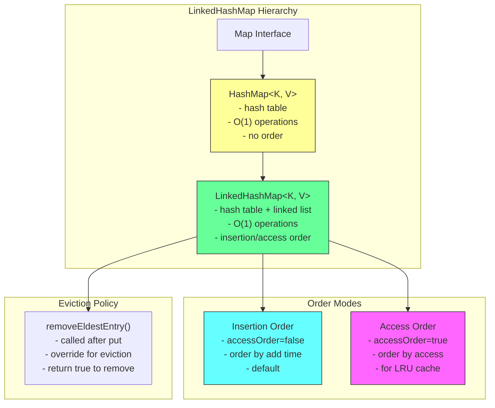
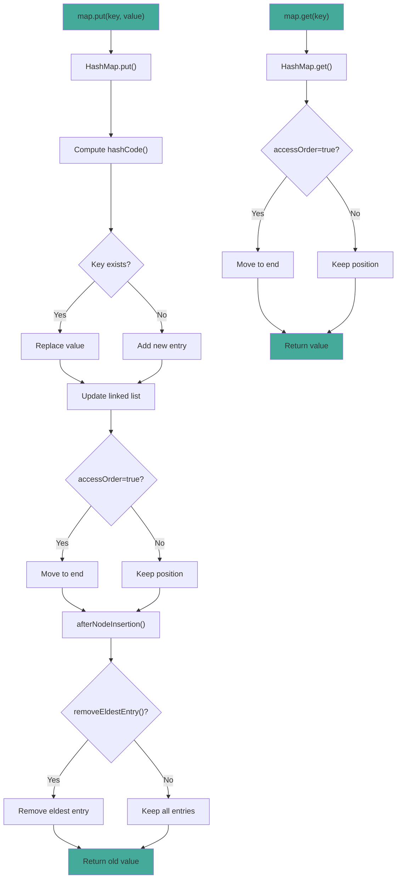

# LinkedHashMap

## 1. Introduction

LinkedHashMap is a HashMap that maintains insertion order (or access order) using a doubly-linked list. It extends HashMap and provides the same O(1) performance for basic operations while preserving the order of entries.

LinkedHashMap is ideal when you need both the performance of a hash map and predictable iteration order. It's commonly used for LRU caches, ordered configuration storage, and any scenario where the order of entries matters.

The key feature of LinkedHashMap is its ability to maintain access order by setting the `accessOrder` parameter to true. When enabled, accessing an entry moves it to the end of the linked list, making it perfect for implementing LRU (Least Recently Used) caches.

## 2. Learning Objectives

- Create and use LinkedHashMap with generics
- Understand insertion order vs access order
- Learn LRU cache implementation
- Know when to use LinkedHashMap vs HashMap
- Understand the linked list overhead
- Recognize LinkedHashMap's thread-safety considerations
- Implement ordered maps with O(1) performance
- Build eviction policies using removeEldestEntry()

## 3. Prerequisites

- HashMap (understanding of hash-based maps)
- Map Interface
- Linked data structure concepts
- equals() and hashCode() methods

## 4. Why This Concept Exists

While HashMap provides O(1) performance, it doesn't maintain any order. This is problematic when:
- Displaying configuration properties (order matters)
- Implementing LRU caches (access order needed)
- Maintaining insertion order for debugging
- Reproducing insertion order for serialization

LinkedHashMap solves this by maintaining a doubly-linked list through all entries. The linked list adds minimal overhead (2 pointers per entry) while preserving insertion or access order.

## 5. Problem Statement

Consider implementing an LRU cache:
- Cache must have maximum size
- When cache is full, evict least recently used item
- Need O(1) get/put operations
- Must maintain access order

Using HashMap would lose the order:
```java
Map<String, Integer> cache = new HashMap<>();
// Can't determine least recently used
```

Using LinkedHashMap with accessOrder=true provides this:
```java
Map<String, Integer> cache = new LinkedHashMap<>(16, 0.75f, true);
// Access order maintained automatically
// Override removeEldestEntry() for eviction
```

## 6. Theory

### Internal Structure

LinkedHashMap extends HashMap, which uses a Node array internally. The linked list is maintained through additional `before` and `after` pointers in each entry:
- `head`: Points to the eldest entry (first added or least recently used)
- `tail`: Points to the most recently added/accessed entry
- Each entry has `before` and `after` pointers

### Insertion Order vs Access Order

**Insertion Order (default, accessOrder=false)**:
- Entries are iterated in the order they were added
- Most recently added entry is at the end
- Accessing an entry doesn't change its position

**Access Order (accessOrder=true)**:
- Entries are iterated in order of access (most recent last)
- Accessing an entry moves it to the end
- Perfect for LRU cache implementation

### removeEldestEntry()

This method is called after every put operation. Override it to implement eviction policies:
```java
@Override
protected boolean removeEldestEntry(Map.Entry<K, V> eldest) {
    return size() > MAX_ENTRIES;
}
```

## 7. Internal Working

### Adding Entries

```java
// LinkedHashMap.put() (inherited from HashMap)
public V put(K key, V value) {
    return putVal(hash(key), key, value, false, true);
}

// After adding, linked list is updated
void afterNodeInsertion(boolean evict) {
    if (evict) {
        Node<K,V> eldest;
        if ((eldest = head) != null && removeEldestEntry(eldest)) {
            removeNode(eldest.hash, eldest.key, eldest.value, null, false);
        }
    }
}

// removeEldestEntry() by default returns false
protected boolean removeEldestEntry(Map.Entry<K,V> eldest) {
    return false;
}
```

### Accessing Entries

```java
// LinkedHashMap.get()
public V get(Object key) {
    Node<K,V> e;
    if ((e = getNode(hash(key), key)) == null)
        return null;
    if (accessOrder)
        afterNodeAccess(e);
    return e.value;
}

// Move to end of linked list
void afterNodeAccess(Node<K,V> e) {
    Node<K,V> last;
    if (accessOrder && (last = tail) != e) {
        Node<K,V> p = e, b = e.before, a = e.after;
        p.after = null;
        if (b == null)
            head = a;
        else
            b.after = a;
        if (a != null)
            a.before = b;
        else
            last = b;
        if (last == null)
            head = p;
        else {
            p.before = last;
            last.after = p;
        }
        tail = p;
        ++modCount;
    }
}
```

## 8. JVM Perspective

### Memory Allocation

```java
LinkedHashMap<String, Integer> map = new LinkedHashMap<>();
// JVM allocates:
// - LinkedHashMap object header: 12 bytes
// - head reference: 8 bytes
// - tail reference: 8 bytes
// - accessOrder boolean: 1 byte
// - HashMap fields: ~20 bytes
// Total LinkedHashMap object: ~52 bytes

// Each entry (Node):
// - Object header: 12 bytes
// - hash field: 4 bytes
// - key reference: 8 bytes
// - value reference: 8 bytes
// - next reference: 8 bytes
// - before reference: 8 bytes (linked list)
// - after reference: 8 bytes (linked list)
// Total Node object: ~56 bytes
```

### JIT Optimization

The JIT compiler optimizes LinkedHashMap operations:
- **Inlining**: get/put/remove are inlined
- **Linked list traversal**: Iterator follows linked list efficiently
- **Escape analysis**: Small LinkedHashMap instances may be scalar-replaced

### Garbage Collection

- Removed entries are unlinked and can be GC'd
- Linked list pointers prevent partial collection
- Large LinkedHashMap may be stored in Old Gen

## 9. Memory Representation

```
```
LinkedHashMap<String, Integer> map = new LinkedHashMap<>();
map.put("Alice", 30);
map.put("Bob", 25);
map.put("Charlie", 35);

Memory layout (insertion order):
┌───────────────────────────────┐
│ LinkedHashMap object          │
├───────────────────────────────┤
│ Object header (12 bytes)      │
│ head ──────────────────────────────┐
│ tail ──────────────────────────────┼──┐
│ accessOrder = false (1 byte)   │      │
│ (padding 3 bytes)             │      │
└───────────────────────────────┘      │
                                       ▼
                               Node[] table (HashMap)
                               ┌──────────────────┐
                               │ [0] → null       │
                               │ [1] → null       │
                               │ [2] → null       │
                               │ [3] → null       │
                               │ [4] → null       │
                               │ [5] → "Bob"      │ ← hash("Bob") % 16
                               │ [6] → null       │
                               │ [7] → "Alice"    │ ← hash("Alice") % 16
                               │ [8] → "Charlie"  │ ← hash("Charlie") % 16
                               │ [9-15] → null    │
                               └──────────────────┘

Linked list (insertion order):
head → "Alice" → "Bob" → "Charlie" ← tail

Each Node:
┌─────────────────────────────┐
│ Object header (12 bytes)    │
│ hash (int, 4 bytes)         │
│ key → "Alice" (8 bytes)     │
│ value → 30 (Integer obj)    │
│ next → (8 bytes, hash chain)│
│ before → null (8 bytes)     │ ← head has null before
│ after → "Bob" (8 bytes)     │
└─────────────────────────────┘

With accessOrder=true:
get("Alice") → moves "Alice" to end:
head → "Bob" → "Charlie" → "Alice" ← tail
```

## 10. Architecture Diagram



## 11. Flow Diagram



## 12. Syntax

```java
import java.util.Map;
import java.util.LinkedHashMap;

// ============================================
// CREATION
// ============================================
// Insertion order (default)
Map<String, Integer> map = new LinkedHashMap<>();

// With capacity and load factor
Map<String, Integer> map = new LinkedHashMap<>(100, 0.75f);

// With access order (for LRU)
Map<String, Integer> map = new LinkedHashMap<>(16, 0.75f, true);

// From another map
Map<String, Integer> map = new LinkedHashMap<>(otherMap);

// ============================================
// MAP OPERATIONS (all O(1))
// ============================================
// Adding/Updating
map.put("key", 1);                    // Add/replace
map.putIfAbsent("key", 1);           // Add only if absent
map.compute("key", (k, v) -> v + 1); // Compute new value
map.merge("key", 1, Integer::sum);   // Merge values

// Accessing
Integer value = map.get("key");
Integer value = map.getOrDefault("key", 0);
Integer removed = map.remove("key");

// Checking
boolean hasKey = map.containsKey("key");
boolean hasValue = map.containsValue(1);
int size = map.size();
boolean isEmpty = map.isEmpty();

// ============================================
// VIEW COLLECTIONS
// ============================================
Set<String> keys = map.keySet();
Collection<Integer> values = map.values();
Set<Map.Entry<String, Integer>> entries = map.entrySet();

// ============================================
// EVICTION POLICY
// ============================================
// Override removeEldestEntry() for LRU cache
Map<String, Integer> lruCache = new LinkedHashMap<>(16, 0.75f, true) {
    @Override
    protected boolean removeEldestEntry(Map.Entry<String, Integer> eldest) {
        return size() > MAX_ENTRIES;
    }
};

// ============================================
// ITERATION (order maintained)
// ============================================
for (Map.Entry<String, Integer> entry : map.entrySet()) {
    System.out.println(entry.getKey() + ": " + entry.getValue());
}

map.forEach((key, value) -> System.out.println(key + ": " + value));
```

## 13. Easy Example

```java
import java.util.Map;
import java.util.LinkedHashMap;

public class LinkedHashMapBasics {
    public static void main(String[] args) {
        // Insertion order (default)
        Map<String, Integer> scores = new LinkedHashMap<>();
        scores.put("Alice", 95);
        scores.put("Bob", 87);
        scores.put("Charlie", 92);
        scores.put("Alice", 98);  // Replaces, maintains position

        System.out.println("Insertion order:");
        scores.forEach((name, score) -> 
            System.out.println("  " + name + ": " + score));

## 📑 Continue Reading

**Part 1** of 4 | Part 2 | Part 3 | Part 4

