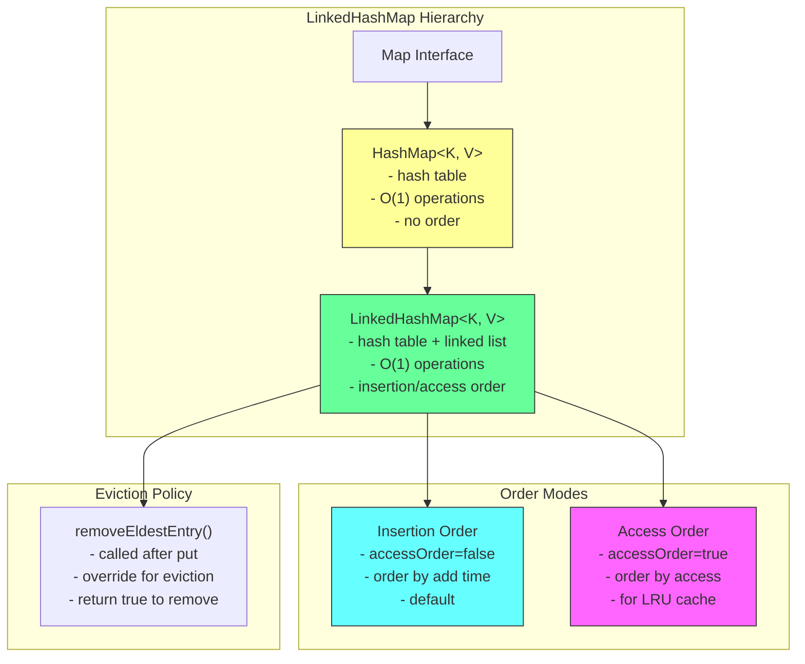
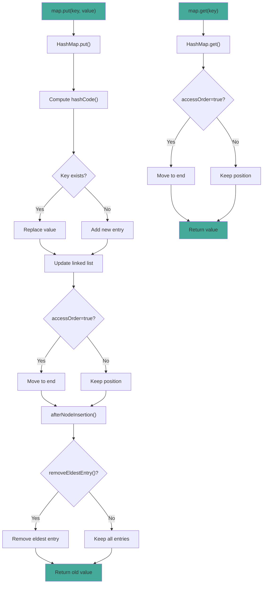

# LinkedHashMap

## 1. Introduction

LinkedHashMap is a HashMap that maintains insertion order (or access order) using a doubly-linked list. It extends HashMap and provides the same O(1) performance for basic operations while preserving the order of entries.

LinkedHashMap is ideal when you need both the performance of a hash map and predictable iteration order. It's commonly used for LRU caches, ordered configuration storage, and any scenario where the order of entries matters.

The key feature of LinkedHashMap is its ability to maintain access order by setting the `accessOrder` parameter to true. When enabled, accessing an entry moves it to the end of the linked list, making it perfect for implementing LRU (Least Recently Used) caches.

## 2. Learning Objectives

- Create and use LinkedHashMap with generics
- Understand insertion order vs access order
- Learn LRU cache implementation
- Know when to use LinkedHashMap vs HashMap
- Understand the linked list overhead
- Recognize LinkedHashMap's thread-safety considerations
- Implement ordered maps with O(1) performance
- Build eviction policies using removeEldestEntry()

## 3. Prerequisites

- HashMap (understanding of hash-based maps)
- Map Interface
- Linked data structure concepts
- equals() and hashCode() methods

## 4. Why This Concept Exists

While HashMap provides O(1) performance, it doesn't maintain any order. This is problematic when:
- Displaying configuration properties (order matters)
- Implementing LRU caches (access order needed)
- Maintaining insertion order for debugging
- Reproducing insertion order for serialization

LinkedHashMap solves this by maintaining a doubly-linked list through all entries. The linked list adds minimal overhead (2 pointers per entry) while preserving insertion or access order.

## 5. Problem Statement

Consider implementing an LRU cache:
- Cache must have maximum size
- When cache is full, evict least recently used item
- Need O(1) get/put operations
- Must maintain access order

Using HashMap would lose the order:
```java
Map<String, Integer> cache = new HashMap<>();
// Can't determine least recently used
```

Using LinkedHashMap with accessOrder=true provides this:
```java
Map<String, Integer> cache = new LinkedHashMap<>(16, 0.75f, true);
// Access order maintained automatically
// Override removeEldestEntry() for eviction
```

## 6. Theory

### Internal Structure

LinkedHashMap extends HashMap, which uses a Node array internally. The linked list is maintained through additional `before` and `after` pointers in each entry:
- `head`: Points to the eldest entry (first added or least recently used)
- `tail`: Points to the most recently added/accessed entry
- Each entry has `before` and `after` pointers

### Insertion Order vs Access Order

**Insertion Order (default, accessOrder=false)**:
- Entries are iterated in the order they were added
- Most recently added entry is at the end
- Accessing an entry doesn't change its position

**Access Order (accessOrder=true)**:
- Entries are iterated in order of access (most recent last)
- Accessing an entry moves it to the end
- Perfect for LRU cache implementation

### removeEldestEntry()

This method is called after every put operation. Override it to implement eviction policies:
```java
@Override
protected boolean removeEldestEntry(Map.Entry<K, V> eldest) {
    return size() > MAX_ENTRIES;
}
```

## 7. Internal Working

### Adding Entries

```java
// LinkedHashMap.put() (inherited from HashMap)
public V put(K key, V value) {
    return putVal(hash(key), key, value, false, true);
}

// After adding, linked list is updated
void afterNodeInsertion(boolean evict) {
    if (evict) {
        Node<K,V> eldest;
        if ((eldest = head) != null && removeEldestEntry(eldest)) {
            removeNode(eldest.hash, eldest.key, eldest.value, null, false);
        }
    }
}

// removeEldestEntry() by default returns false
protected boolean removeEldestEntry(Map.Entry<K,V> eldest) {
    return false;
}
```

### Accessing Entries

```java
// LinkedHashMap.get()
public V get(Object key) {
    Node<K,V> e;
    if ((e = getNode(hash(key), key)) == null)
        return null;
    if (accessOrder)
        afterNodeAccess(e);
    return e.value;
}

// Move to end of linked list
void afterNodeAccess(Node<K,V> e) {
    Node<K,V> last;
    if (accessOrder && (last = tail) != e) {
        Node<K,V> p = e, b = e.before, a = e.after;
        p.after = null;
        if (b == null)
            head = a;
        else
            b.after = a;
        if (a != null)
            a.before = b;
        else
            last = b;
        if (last == null)
            head = p;
        else {
            p.before = last;
            last.after = p;
        }
        tail = p;
        ++modCount;
    }
}
```

## 8. JVM Perspective

### Memory Allocation

```java
LinkedHashMap<String, Integer> map = new LinkedHashMap<>();
// JVM allocates:
// - LinkedHashMap object header: 12 bytes
// - head reference: 8 bytes
// - tail reference: 8 bytes
// - accessOrder boolean: 1 byte
// - HashMap fields: ~20 bytes
// Total LinkedHashMap object: ~52 bytes

// Each entry (Node):
// - Object header: 12 bytes
// - hash field: 4 bytes
// - key reference: 8 bytes
// - value reference: 8 bytes
// - next reference: 8 bytes
// - before reference: 8 bytes (linked list)
// - after reference: 8 bytes (linked list)
// Total Node object: ~56 bytes
```

### JIT Optimization

The JIT compiler optimizes LinkedHashMap operations:
- **Inlining**: get/put/remove are inlined
- **Linked list traversal**: Iterator follows linked list efficiently
- **Escape analysis**: Small LinkedHashMap instances may be scalar-replaced

### Garbage Collection

- Removed entries are unlinked and can be GC'd
- Linked list pointers prevent partial collection
- Large LinkedHashMap may be stored in Old Gen

## 9. Memory Representation

```
LinkedHashMap<String, Integer> map = new LinkedHashMap<>();
map.put("Alice", 30);
map.put("Bob", 25);
map.put("Charlie", 35);

Memory layout (insertion order):
┌───────────────────────────────┐
│ LinkedHashMap object          │
├───────────────────────────────┤
│ Object header (12 bytes)      │
│ head ──────────────────────────────┐
│ tail ──────────────────────────────┼──┐
│ accessOrder = false (1 byte)   │      │
│ (padding 3 bytes)             │      │
└───────────────────────────────┘      │
                                       ▼
                               Node[] table (HashMap)
                               ┌──────────────────┐
                               │ [0] → null       │
                               │ [1] → null       │
                               │ [2] → null       │
                               │ [3] → null       │
                               │ [4] → null       │
                               │ [5] → "Bob"      │ ← hash("Bob") % 16
                               │ [6] → null       │
                               │ [7] → "Alice"    │ ← hash("Alice") % 16
                               │ [8] → "Charlie"  │ ← hash("Charlie") % 16
                               │ [9-15] → null    │
                               └──────────────────┘

Linked list (insertion order):
head → "Alice" → "Bob" → "Charlie" ← tail

Each Node:
┌─────────────────────────────┐
│ Object header (12 bytes)    │
│ hash (int, 4 bytes)         │
│ key → "Alice" (8 bytes)     │
│ value → 30 (Integer obj)    │
│ next → (8 bytes, hash chain)│
│ before → null (8 bytes)     │ ← head has null before
│ after → "Bob" (8 bytes)     │
└─────────────────────────────┘

With accessOrder=true:
get("Alice") → moves "Alice" to end:
head → "Bob" → "Charlie" → "Alice" ← tail
```

## 10. Architecture Diagram



## 11. Flow Diagram



## 12. Syntax

```java
import java.util.Map;
import java.util.LinkedHashMap;

// ============================================
// CREATION
// ============================================
// Insertion order (default)
Map<String, Integer> map = new LinkedHashMap<>();

// With capacity and load factor
Map<String, Integer> map = new LinkedHashMap<>(100, 0.75f);

// With access order (for LRU)
Map<String, Integer> map = new LinkedHashMap<>(16, 0.75f, true);

// From another map
Map<String, Integer> map = new LinkedHashMap<>(otherMap);

// ============================================
// MAP OPERATIONS (all O(1))
// ============================================
// Adding/Updating
map.put("key", 1);                    // Add/replace
map.putIfAbsent("key", 1);           // Add only if absent
map.compute("key", (k, v) -> v + 1); // Compute new value
map.merge("key", 1, Integer::sum);   // Merge values

// Accessing
Integer value = map.get("key");
Integer value = map.getOrDefault("key", 0);
Integer removed = map.remove("key");

// Checking
boolean hasKey = map.containsKey("key");
boolean hasValue = map.containsValue(1);
int size = map.size();
boolean isEmpty = map.isEmpty();

// ============================================
// VIEW COLLECTIONS
// ============================================
Set<String> keys = map.keySet();
Collection<Integer> values = map.values();
Set<Map.Entry<String, Integer>> entries = map.entrySet();

// ============================================
// EVICTION POLICY
// ============================================
// Override removeEldestEntry() for LRU cache
Map<String, Integer> lruCache = new LinkedHashMap<>(16, 0.75f, true) {
    @Override
    protected boolean removeEldestEntry(Map.Entry<String, Integer> eldest) {
        return size() > MAX_ENTRIES;
    }
};

// ============================================
// ITERATION (order maintained)
// ============================================
for (Map.Entry<String, Integer> entry : map.entrySet()) {
    System.out.println(entry.getKey() + ": " + entry.getValue());
}

map.forEach((key, value) -> System.out.println(key + ": " + value));
```

## 13. Easy Example

```java
import java.util.Map;
import java.util.LinkedHashMap;

public class LinkedHashMapBasics {
    public static void main(String[] args) {
        // Insertion order (default)
        Map<String, Integer> scores = new LinkedHashMap<>();
        scores.put("Alice", 95);
        scores.put("Bob", 87);
        scores.put("Charlie", 92);
        scores.put("Alice", 98);  // Replaces, maintains position

        System.out.println("Insertion order:");
        scores.forEach((name, score) -> 
            System.out.println("  " + name + ": " + score));

        // Access order
        Map<String, Integer> accessOrder = new LinkedHashMap<>(16, 0.75f, true);
        accessOrder.put("A", 1);
        accessOrder.put("B", 2);
        accessOrder.put("C", 3);

        System.out.println("\nBefore access:");
        accessOrder.forEach((k, v) -> System.out.println("  " + k + ": " + v));

        accessOrder.get("A");  // Move A to end

        System.out.println("After accessing A:");
        accessOrder.forEach((k, v) -> System.out.println("  " + k + ": " + v));

        // LRU cache
        Map<String, Integer> lruCache = new LinkedHashMap<>(16, 0.75f, true) {
            @Override
            protected boolean removeEldestEntry(Map.Entry<String, Integer> eldest) {
                return size() > 3;
            }
        };

        lruCache.put("X", 1);
        lruCache.put("Y", 2);
        lruCache.put("Z", 3);
        System.out.println("\nLRU cache (size 3): " + lruCache);

        lruCache.put("W", 4);  // Should evict X (least recently used)
        System.out.println("After adding W: " + lruCache);
    }
}
```

## 14. Medium Example

```java
import java.util.Map;
import java.util.LinkedHashMap;
import java.util.ArrayList;
import java.util.List;

public class LinkedHashMapOperations {
    public static void main(String[] args) {
        // Example 1: LRU cache with size limit
        System.out.println("=== LRU Cache ===");
        LRUCache<String, String> cache = new LRUCache<>(3);
        cache.put("page1", "Home");
        cache.put("page2", "About");
        cache.put("page3", "Contact");
        System.out.println("Cache: " + cache);

        cache.get("page1");  // Access page1, moves to end
        cache.put("page4", "Blog");  // Evicts page2 (least recently used)
        System.out.println("After access page1 and put page4: " + cache);

        // Example 2: Ordered configuration
        System.out.println("\n=== Ordered Configuration ===");
        Map<String, String> config = new LinkedHashMap<>();
        config.put("app.name", "MyApp");
        config.put("app.version", "1.0");
        config.put("db.url", "jdbc:mysql://localhost/mydb");
        config.put("db.user", "admin");

        System.out.println("Configuration (insertion order):");
        config.forEach((key, value) -> 
            System.out.println("  " + key + " = " + value));

        // Example 3: Recently accessed items
        System.out.println("\n=== Recently Accessed ===");
        RecentlyAccessed<String> recent = new RecentlyAccessed<>(5);
        recent.access("Item1");
        recent.access("Item2");
        recent.access("Item3");
        recent.access("Item1");  // Move to end
        recent.access("Item4");
        System.out.println("Recent: " + recent.getRecent());

        // Example 4: Ordered deduplication
        System.out.println("\n=== Ordered Deduplication ===");
        List<String> words = List.of("apple", "banana", "apple", "cherry", "banana");
        Map<String, Integer> ordered = new LinkedHashMap<>();
        for (String word : words) {
            ordered.put(word, ordered.getOrDefault(word, 0) + 1);
        }
        System.out.println("Word counts (insertion order): " + ordered);

        // Example 5: LRU eviction tracking
        System.out.println("\n=== LRU Eviction Tracking ===");
        TrackingLRUCache<String, String> trackingCache = new TrackingLRUCache<>(3);
        trackingCache.put("A", "1");
        trackingCache.put("B", "2");
        trackingCache.put("C", "3");
        trackingCache.get("A");
        trackingCache.put("D", "4");  // Evicts B
        System.out.println("Evicted entries: " + trackingCache.getEvictedEntries());
    }

    // LRU Cache implementation
    static class LRUCache<K, V> extends LinkedHashMap<K, V> {
        private final int maxSize;

        public LRUCache(int maxSize) {
            super(maxSize, 0.75f, true);  // accessOrder = true
            this.maxSize = maxSize;
        }

        @Override
        protected boolean removeEldestEntry(Map.Entry<K, V> eldest) {
            return size() > maxSize;
        }
    }

    // Recently accessed tracker
    static class RecentlyAccessed<T> extends LinkedHashMap<T, Boolean> {
        private final int maxSize;

        public RecentlyAccessed(int maxSize) {
            super(maxSize, 0.75f, true);  // accessOrder = true
            this.maxSize = maxSize;
        }

        public void access(T item) {
            put(item, true);
        }

        public List<T> getRecent() {
            return new ArrayList<>(keySet());
        }

        @Override
        protected boolean removeEldestEntry(Map.Entry<T, Boolean> eldest) {
            return size() > maxSize;
        }
    }

    // LRU cache with eviction tracking
    static class TrackingLRUCache<K, V> extends LinkedHashMap<K, V> {
        private final int maxSize;
        private final List<K> evictedEntries = new ArrayList<>();

        public TrackingLRUCache(int maxSize) {
            super(maxSize, 0.75f, true);
            this.maxSize = maxSize;
        }

        @Override
        protected boolean removeEldestEntry(Map.Entry<K, V> eldest) {
            if (size() > maxSize) {
                evictedEntries.add(eldest.getKey());
                return true;
            }
            return false;
        }

        public List<K> getEvictedEntries() {
            return evictedEntries;
        }
    }
}
```

## 15. Hard Example

```java
import java.util.*;
import java.util.concurrent.*;

public class AdvancedLinkedHashMap {
    public static void main(String[] args) {
        // Pattern 1: TTL-based cache
        System.out.println("=== TTL Cache ===");
        TTLCache<String, String> ttlCache = new TTLCache<>(16, 0.75f, 1000);
        ttlCache.put("key1", "value1");
        ttlCache.put("key2", "value2");
        System.out.println("Cache size: " + ttlCache.size());
        System.out.println("Get key1: " + ttlCache.get("key1"));

        // Pattern 2: Size-based eviction with statistics
        System.out.println("\n=== Statistics Cache ===");
        StatisticsCache<String, Integer> statsCache = new StatisticsCache<>(3);
        statsCache.put("A", 1);
        statsCache.put("B", 2);
        statsCache.put("C", 3);
        statsCache.get("A");
        statsCache.put("D", 4);  // Evicts B
        System.out.println("Hits: " + statsCache.getHits());
        System.out.println("Misses: " + statsCache.getMisses());
        System.out.println("Evictions: " + statsCache.getEvictions());

        // Pattern 3: Thread-safe LRU cache
        System.out.println("\n=== Thread-Safe LRU Cache ===");
        ThreadSafeLRUCache<String, String> threadSafeCache = new ThreadSafeLRUCache<>(3);
        threadSafeCache.put("A", "1");
        threadSafeCache.put("B", "2");
        threadSafeCache.put("C", "3");
        System.out.println("Thread-safe cache: " + threadSafeCache);

        // Pattern 4: Frequency-based cache
        System.out.println("\n=== Frequency Cache ===");
        FrequencyCache<String, String> freqCache = new FrequencyCache<>(3);
        freqCache.put("A", "1");
        freqCache.put("B", "2");
        freqCache.put("C", "3");
        freqCache.get("A");
        freqCache.get("A");
        freqCache.get("B");
        freqCache.put("D", "4");  // Should evict C (least frequent)
        System.out.println("Cache: " + freqCache);
        System.out.println("Access counts: " + freqCache.getAccessCounts());
    }

    // TTL-based cache
    static class TTLCache<K, V> extends LinkedHashMap<K, V> {
        private final long ttlMillis;
        private final Map<K, Long> timestamps = new HashMap<>();

        public TTLCache(int capacity, float loadFactor, long ttlMillis) {
            super(capacity, loadFactor, true);
            this.ttlMillis = ttlMillis;
        }

        @Override
        public V get(Object key) {
            Long timestamp = timestamps.get(key);
            if (timestamp != null && System.currentTimeMillis() - timestamp > ttlMillis) {
                remove(key);
                timestamps.remove(key);
                return null;
            }
            return super.get(key);
        }

        @Override
        public V put(K key, V value) {
            timestamps.put(key, System.currentTimeMillis());
            return super.put(key, value);
        }

        @Override
        protected boolean removeEldestEntry(Map.Entry<K, V> eldest) {
            Long timestamp = timestamps.get(eldest.getKey());
            if (timestamp != null && System.currentTimeMillis() - timestamp > ttlMillis) {
                timestamps.remove(eldest.getKey());
                return true;
            }
            return false;
        }
    }

    // Statistics cache
    static class StatisticsCache<K, V> extends LinkedHashMap<K, V> {
        private final int maxSize;
        private int hits = 0;
        private int misses = 0;
        private int evictions = 0;

        public StatisticsCache(int maxSize) {
            super(maxSize, 0.75f, true);
            this.maxSize = maxSize;
        }

        @Override
        public V get(Object key) {
            V value = super.get(key);
            if (value != null) {
                hits++;
            } else {
                misses++;
            }
            return value;
        }

        @Override
        protected boolean removeEldestEntry(Map.Entry<K, V> eldest) {
            if (size() > maxSize) {
                evictions++;
                return true;
            }
            return false;
        }

        public int getHits() { return hits; }
        public int getMisses() { return misses; }
        public int getEvictions() { return evictions; }
    }

    // Thread-safe LRU cache
    static class ThreadSafeLRUCache<K, V> {
        private final Map<K, V> cache;
        private final int maxSize;

        public ThreadSafeLRUCache(int maxSize) {
            this.maxSize = maxSize;
            this.cache = Collections.synchronizedMap(new LinkedHashMap<K, V>(16, 0.75f, true) {
                @Override
                protected boolean removeEldestEntry(Map.Entry<K, V> eldest) {
                    return size() > maxSize;
                }
            });
        }

        public void put(K key, V value) {
            cache.put(key, value);
        }

        public V get(K key) {
            return cache.get(key);
        }

        @Override
        public String toString() {
            return cache.toString();
        }
    }

    // Frequency-based cache
    static class FrequencyCache<K, V> extends LinkedHashMap<K, V> {
        private final int maxSize;
        private final Map<K, Integer> accessCounts = new HashMap<>();

        public FrequencyCache(int maxSize) {
            super(maxSize, 0.75f, true);
            this.maxSize = maxSize;
        }

        @Override
        public V get(Object key) {
            accessCounts.merge((K) key, 1, Integer::sum);
            return super.get(key);
        }

        @Override
        protected boolean removeEldestEntry(Map.Entry<K, V> eldest) {
            if (size() > maxSize) {
                // Remove least frequent
                K leastFrequent = accessCounts.entrySet().stream()
                    .min(Map.Entry.comparingByValue())
                    .map(Map.Entry::getKey)
                    .orElse(null);
                if (leastFrequent != null) {
                    accessCounts.remove(leastFrequent);
                    return true;
                }
            }
            return false;
        }

        public Map<K, Integer> getAccessCounts() {
            return accessCounts;
        }
    }
}
```

## 16. Enterprise Example

```java
import java.util.*;
import java.util.concurrent.*;

public class UserSessionManager {
    private final Map<String, UserSession> activeSessions;
    private final Map<String, List<String>> userSessions;
    private final int maxSessionsPerUser;
    private final long sessionTimeoutMillis;

    public UserSessionManager(int maxSessionsPerUser, long sessionTimeoutMillis) {
        this.activeSessions = new LinkedHashMap<>(16, 0.75f, true) {
            @Override
            protected boolean removeEldestEntry(Map.Entry<String, UserSession> eldest) {
                return System.currentTimeMillis() - eldest.getValue().getLastAccessTime() > sessionTimeoutMillis;
            }
        };
        this.userSessions = new ConcurrentHashMap<>();
        this.maxSessionsPerUser = maxSessionsPerUser;
        this.sessionTimeoutMillis = sessionTimeoutMillis;
    }

    // Create new session
    public String createSession(String userId, String ip) {
        String sessionId = UUID.randomUUID().toString();
        UserSession session = new UserSession(sessionId, userId, ip);
        
        // Check max sessions per user
        List<String> sessions = userSessions.computeIfAbsent(userId, k -> new ArrayList<>());
        if (sessions.size() >= maxSessionsPerUser) {
            String oldestSessionId = sessions.remove(0);
            activeSessions.remove(oldestSessionId);
        }
        
        sessions.add(sessionId);
        activeSessions.put(sessionId, session);
        return sessionId;
    }

    // Access session (updates access time)
    public Optional<UserSession> accessSession(String sessionId) {
        UserSession session = activeSessions.get(sessionId);
        if (session != null) {
            session.updateLastAccessTime();
        }
        return Optional.ofNullable(session);
    }

    // Invalidate session
    public boolean invalidateSession(String sessionId) {
        UserSession session = activeSessions.remove(sessionId);
        if (session != null) {
            List<String> sessions = userSessions.get(session.getUserId());
            if (sessions != null) {
                sessions.remove(sessionId);
                if (sessions.isEmpty()) {
                    userSessions.remove(session.getUserId());
                }
            }
            return true;
        }
        return false;
    }

    // Get active sessions for user
    public List<UserSession> getActiveSessions(String userId) {
        List<String> sessionIds = userSessions.getOrDefault(userId, Collections.emptyList());
        List<UserSession> sessions = new ArrayList<>();
        for (String sessionId : sessionIds) {
            UserSession session = activeSessions.get(sessionId);
            if (session != null) {
                sessions.add(session);
            }
        }
        return sessions;
    }

    // Get all active sessions
    public Collection<UserSession> getAllActiveSessions() {
        return Collections.unmodifiableCollection(activeSessions.values());
    }

    // Cleanup expired sessions
    public int cleanupExpiredSessions() {
        int removed = 0;
        Iterator<Map.Entry<String, UserSession>> iterator = activeSessions.entrySet().iterator();
        while (iterator.hasNext()) {
            Map.Entry<String, UserSession> entry = iterator.next();
            if (System.currentTimeMillis() - entry.getValue().getLastAccessTime() > sessionTimeoutMillis) {
                iterator.remove();
                removed++;
            }
        }
        return removed;
    }

    public static void main(String[] args) {
        UserSessionManager manager = new UserSessionManager(3, 5000);

        // Create sessions
        String session1 = manager.createSession("user1", "192.168.1.1");
        String session2 = manager.createSession("user1", "192.168.1.2");
        String session3 = manager.createSession("user2", "192.168.1.3");

        System.out.println("Active sessions: " + manager.getAllActiveSessions().size());

        // Access sessions
        manager.accessSession(session1);
        manager.accessSession(session1);

        // Get sessions for user
        System.out.println("User1 sessions: " + manager.getActiveSessions("user1").size());

        // Invalidate session
        manager.invalidateSession(session2);
        System.out.println("After invalidation: " + manager.getAllActiveSessions().size());
    }

    static class UserSession {
        private final String sessionId;
        private final String userId;
        private final String ip;
        private long lastAccessTime;

        public UserSession(String sessionId, String userId, String ip) {
            this.sessionId = sessionId;
            this.userId = userId;
            this.ip = ip;
            this.lastAccessTime = System.currentTimeMillis();
        }

        public String getSessionId() { return sessionId; }
        public String getUserId() { return userId; }
        public String getIp() { return ip; }
        public long getLastAccessTime() { return lastAccessTime; }
        public void updateLastAccessTime() { lastAccessTime = System.currentTimeMillis(); }
    }
}
```

## 17. Performance Considerations

### Time Complexity

| Operation | LinkedHashMap | HashMap | TreeMap | Notes |
|-----------|---------------|---------|---------|-------|
| put | O(1) | O(1) | O(log n) | Amortized |
| get | O(1) | O(1) | O(log n) | |
| remove | O(1) | O(1) | O(log n) | |
| containsKey | O(1) | O(1) | O(log n) | |
| size | O(1) | O(1) | O(1) | |
| iteration | O(n) | O(n) | O(n) | |

### Memory Comparison

For 1 million String entries:
- HashMap: ~80 MB
- LinkedHashMap: ~96 MB (extra linked list pointers)
- TreeMap: ~88 MB

### Access Order Overhead

When accessOrder=true:
- get() operations modify the linked list
- Adds ~50% overhead to get() operations
- Worth it for LRU cache use case

## 18. Time & Space Complexity

### Time Complexity Summary

| Operation | Best | Average | Worst | Notes |
|-----------|------|---------|-------|-------|
| put | O(1) | O(1) | O(n) | Worst: all collisions |
| get | O(1) | O(1) | O(n) | With linked list update |
| remove | O(1) | O(1) | O(n) | |
| containsKey | O(1) | O(1) | O(n) | |
| iteration | O(n) | O(n) | O(n) | |

### Space Complexity

- **Internal HashMap**: O(capacity) where capacity is power of 2
- **Per entry**: 8 bytes (reference) + ~56 bytes (node overhead)
- **Linked list pointers**: 16 bytes per entry (before + after)
- **Total per entry**: ~72 bytes

## 19. Thread Safety

### Not Thread-Safe

LinkedHashMap is not thread-safe:
```java
Map<String, Integer> map = new LinkedHashMap<>();
// NOT thread-safe
map.put("key", 1);  // Race condition in multi-threaded code
```

### Synchronization Options

```java
// Option 1: Collections.synchronizedMap()
Map<String, Integer> map = Collections.synchronizedMap(new LinkedHashMap<>());

// Option 2: Manual synchronization
synchronized (map) {
    map.put("key", 1);
    Integer value = map.get("key");
}

// Option 3: ConcurrentHashMap (doesn't maintain order)
Map<String, Integer> map = new ConcurrentHashMap<>();
```

### When to Use Each

| Scenario | Recommended |
|----------|-------------|
| Single-threaded | LinkedHashMap |
| Read-heavy, write-light | Collections.synchronizedMap |
| High-concurrency | ConcurrentHashMap (no order) |

## 20. Best Practices

1. **Use LinkedHashMap when order matters** - provides O(1) with order

2. **Set accessOrder=true for LRU caches**:
   ```java
   Map<K, V> cache = new LinkedHashMap<>(16, 0.75f, true);
   ```

3. **Override removeEldestEntry() for eviction**:
   ```java
   @Override
   protected boolean removeEldestEntry(Map.Entry<K, V> eldest) {
       return size() > MAX_ENTRIES;
   }
   ```

4. **Set initial capacity** for known sizes:
   ```java
   Map<String, Integer> map = new LinkedHashMap<>(expectedSize);
   ```

5. **Consider memory overhead** - linked list adds ~16 bytes per entry

6. **Use for configuration storage** - maintains insertion order for properties

7. **Document order semantics** - make it clear when order matters

## 21. Common Mistakes

```java
// Mistake 1: Using HashMap when order matters
Map<String, Integer> map = new HashMap<>();  // No order!
// Use LinkedHashMap for insertion order

// Mistake 2: Assuming LinkedHashMap is sorted
Map<String, Integer> map = new LinkedHashMap<>();
map.put("C", 3);
map.put("A", 1);
map.put("B", 2);
// Order: [C, A, B] - insertion order, not sorted!
// Use TreeMap for sorted order

// Mistake 3: Forgetting accessOrder for LRU
Map<String, Integer> cache = new LinkedHashMap<>();  // accessOrder=false!
// Need: new LinkedHashMap<>(16, 0.75f, true)

// Mistake 4: Not overriding removeEldestEntry
Map<String, Integer> cache = new LinkedHashMap<>(16, 0.75f, true);
// Cache will grow indefinitely!
// Must override removeEldestEntry()

// Mistake 5: Modifying key while in Map
Map<Person, String> map = new LinkedHashMap<>();
Person p = new Person("Alice", 30);
map.put(p, "engineer");
p.setAge(31);  // hashCode() changed!
// p is now "lost" in the Map
```

## 22. Pitfalls & Warnings

### Memory Overhead

LinkedHashMap uses more memory than HashMap:
- 2 additional pointers per entry (before and after)
- ~16 extra bytes per entry
- Consider this for large datasets

### Access Order Overhead

When accessOrder=true:
- get() operations modify the linked list
- Adds overhead to every access
- Only use when access order matters (LRU cache)

### Null Keys and Values

LinkedHashMap allows one null key and multiple null values:
```java
Map<String, Integer> map = new LinkedHashMap<>();
map.put(null, 1);      // OK
map.put("key", null);  // OK
```

### ConcurrentModificationException

Iterators are fail-fast:
```java
Iterator<Map.Entry<String, Integer>> it = map.entrySet().iterator();
while (it.hasNext()) {
    Map.Entry<String, Integer> entry = it.next();
    map.put("X", 1);  // ConcurrentModificationException
}
```

## 23. Debugging Tips

1. **Print map contents**: Use `System.out.println(map)` to see insertion order
2. **Check size**: Use `map.size()` to understand current state
3. **Verify order**: Add entries and iterate to confirm order
4. **Test equals/hashCode**: Verify custom keys work correctly
5. **Use debugger**: Inspect linked list structure in IDE
6. **Profile memory**: Use JProfiler or VisualVM to check memory usage
7. **Test access order**: Verify get() moves entries to end

## 24. Comparison Table

| Feature | LinkedHashMap | HashMap | TreeMap | Hashtable |
|---------|---------------|---------|---------|-----------|
| Order | Insertion/Access | None | Sorted | None |
| Implementation | Hash table + linked list | Hash table | Red-black tree | Hash table |
| Null keys | 1 | 1 | No | No |
| Add | O(1) | O(1) | O(log n) | O(1) |
| Get | O(1) | O(1) | O(log n) | O(1) |
| Remove | O(1) | O(1) | O(log n) | O(1) |
| Memory | Higher | Lower | Higher | Higher |
| Thread-safe | No | No | No | Yes |

## 25. Decision Tree

```
Need a Map?
├── Yes → Need order?
│   ├── Insertion order → LinkedHashMap
│   ├── Access order (LRU) → LinkedHashMap (accessOrder=true)
│   ├── Sorted keys → TreeMap
│   └── No order → HashMap (fastest)
├── No → Need thread-safety?
│   ├── Yes → ConcurrentHashMap
│   └── No → Use appropriate Map
└── Need eviction policy?
    └── Yes → LinkedHashMap with removeEldestEntry()
```

## 26. Interview Questions

### Q1: What is the difference between HashMap and LinkedHashMap?
**A**: HashMap doesn't maintain order, LinkedHashMap maintains insertion or access order. Both have O(1) performance. LinkedHashMap uses more memory due to linked list pointers.

### Q2: How does access order work in LinkedHashMap?
**A**: When accessOrder=true, get() operations move the accessed entry to the end of the linked list. This maintains access order (most recently accessed last).

### Q3: How would you implement an LRU cache in Java?
**A**: Extend LinkedHashMap with accessOrder=true and override removeEldestEntry() to return true when size exceeds max size.

### Q4: What is the time complexity of LinkedHashMap operations?
**A**: put/get/remove: O(1) amortized. Same as HashMap. Linked list operations are O(1).

### Q5: Can LinkedHashMap have null keys?
**A**: Yes, it allows one null key, just like HashMap.

### Q6: What is the memory overhead of LinkedHashMap vs HashMap?
**A**: LinkedHashMap uses ~16 extra bytes per entry for linked list pointers (before and after).

### Q7: How do you iterate LinkedHashMap in insertion order?
**A**: Default iteration order is insertion order when accessOrder=false.

### Q8: What is removeEldestEntry() used for?
**A**: It's called after every put operation. Override it to implement eviction policies (like LRU cache).

### Q9: Is LinkedHashMap thread-safe?
**A**: No. Use Collections.synchronizedMap() or manual synchronization for thread safety.

### Q10: When would you use LinkedHashMap over HashMap?
**A**: When you need insertion order, access order (LRU), or ordered iteration. Use HashMap if order doesn't matter.

### Q11: How do you sort LinkedHashMap?
**A**: LinkedHashMap doesn't support sorting directly. Use TreeMap for sorted keys, or stream with sorted().

### Q12: What happens when you put() a duplicate key?
**A**: The value is replaced, but the entry maintains its position in the linked list (insertion order).

### Q13: How do you get the first/last entry?
**A**: First: `map.entrySet().iterator().next()`. Last: Iterate to end, or use stream.

### Q14: What is the difference between LinkedHashMap and TreeMap?
**A**: LinkedHashMap maintains insertion/access order with O(1) operations. TreeMap maintains sorted order with O(log n) operations.

### Q15: How do you create an immutable LinkedHashMap?
**A**: Java 9+: `Map.copyOf(map)`. Earlier: `Collections.unmodifiableMap(map)`. Note: these return Map, not LinkedHashMap.

## 27. Exercises

### Exercise 1: Insertion Order (Easy)
```java
// Create a LinkedHashMap that maintains insertion order
public static void main(String[] args) {
    Map<String, Integer> map = new LinkedHashMap<>();
    map.put("Charlie", 3);
    map.put("Alice", 1);
    map.put("Bob", 2);
    
    // Should print in insertion order: Charlie, Alice, Bob
    map.forEach((k, v) -> System.out.println(k + ": " + v));
}
```

### Exercise 2: LRU Cache (Medium)
```java
// Implement LRU cache using LinkedHashMap
public class LRUCache<K, V> extends LinkedHashMap<K, V> {
    private final int maxSize;
    
    public LRUCache(int maxSize) {
        super(maxSize, 0.75f, true);  // accessOrder = true
        this.maxSize = maxSize;
    }
    
    @Override
    protected boolean removeEldestEntry(Map.Entry<K, V> eldest) {
        return size() > maxSize;
    }
    
    public V getOrCreate(K key, java.util.function.Supplier<V> supplier) {
        return computeIfAbsent(key, k -> supplier.get());
    }
}
```

### Exercise 3: TTL Cache (Hard)
```java
// Implement cache with time-to-live expiration
public class TTLCache<K, V> extends LinkedHashMap<K, V> {
    private final long ttlMillis;
    private final Map<K, Long> timestamps = new HashMap<>();
    
    public TTLCache(int maxSize, long ttlMillis) {
        super(maxSize, 0.75f, true);
        this.ttlMillis = ttlMillis;
    }
    
    @Override
    public V get(Object key) {
        Long timestamp = timestamps.get(key);
        if (timestamp != null && System.currentTimeMillis() - timestamp > ttlMillis) {
            remove(key);
            timestamps.remove(key);
            return null;
        }
        return super.get(key);
    }
    
    @Override
    public V put(K key, V value) {
        timestamps.put(key, System.currentTimeMillis());
        return super.put(key, value);
    }
    
    @Override
    protected boolean removeEldestEntry(Map.Entry<K, V> eldest) {
        Long timestamp = timestamps.get(eldest.getKey());
        if (timestamp != null && System.currentTimeMillis() - timestamp > ttlMillis) {
            timestamps.remove(eldest.getKey());
            return true;
        }
        return false;
    }
}
```

## 28. Summary

LinkedHashMap is a HashMap that maintains insertion or access order:

- **Internal structure**: Hash table + doubly-linked list
- **Performance**: O(1) for put/get/remove (same as HashMap)
- **Order**: Insertion order (default) or access order (for LRU)
- **Memory**: Higher than HashMap due to linked list pointers
- **Thread safety**: Not thread-safe; use Collections.synchronizedMap()
- **Null keys**: Allows one null key
- **Best for**: LRU caches, ordered configuration, recently accessed items
- **Key insight**: Use accessOrder=true and removeEldestEntry() for LRU cache

## 29. References

### Official Documentation
- [LinkedHashMap JavaDoc](https://docs.oracle.com/en/java/javase/21/docs/api/java/util/LinkedHashMap.html)
- [Map Interface](https://docs.oracle.com/en/java/javase/21/docs/api/java/util/Map.html)
- [HashMap Documentation](https://docs.oracle.com/en/java/javase/21/docs/api/java/util/HashMap.html)

### Books
- *Effective Java* by Joshua Bloch (Item 10: Always override hashCode when you override equals)
- *Introduction to Algorithms* by Cormen et al. (Hash tables chapter)

### Online Resources
- [Baeldung LinkedHashMap Guide](https://www.baeldung.com/java-linkedhashmap)
- [GeeksforGeeks LinkedHashMap](https://www.geeksforgeeks.org/linkedhashmap-class-in-java/)
- [Java Collections Tutorial](https://docs.oracle.com/en/java/javase/21/collections/implementations/map.html)

### Related Topics
- [HashMap](../15-hashmap/README.md)
- [TreeMap](../17-treemap/README.md)
- [LinkedHashSet](../12-linkedhashset/README.md)
