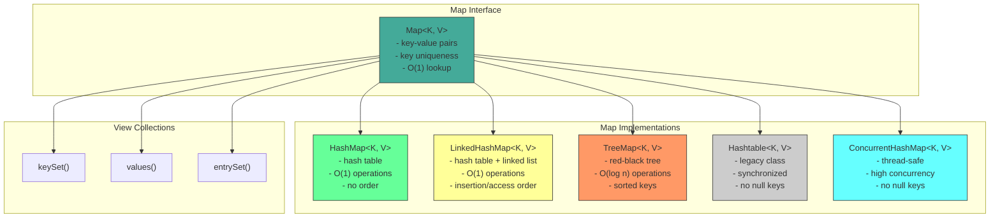
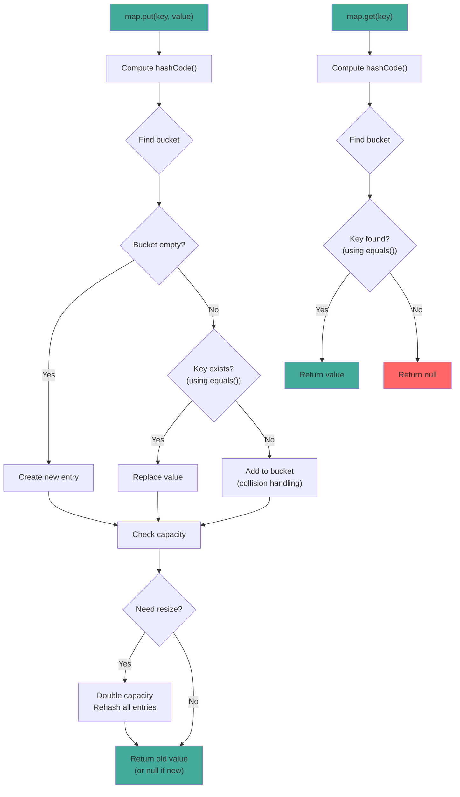

# Map Interface

## 1. Introduction

Map stores key-value pairs, providing efficient lookup by key. It's separate from the Collection interface and models the mathematical function abstraction. Each key maps to at most one value, and you can use a key to efficiently retrieve its associated value.

Map is one of the most frequently used data structures in Java. It's used for caching, counting, configuration storage, database results, and countless other scenarios where you need to associate values with keys.

There are several Map implementations: `HashMap` (fastest, no order), `LinkedHashMap` (insertion/access order), `TreeMap` (sorted keys), `Hashtable` (legacy, synchronized), and `ConcurrentHashMap` (thread-safe). Each has different performance characteristics and ordering guarantees.

## 2. Learning Objectives

- Understand the Map interface and its properties
- Learn key-value pair operations
- Understand Map implementations (HashMap, LinkedHashMap, TreeMap)
- Know when to use Map vs other collections
- Master Map operations (put, get, containsKey, etc.)
- Understand equals() and hashCode() contract for keys
- Recognize Map's thread-safety considerations
- Apply Maps in real-world scenarios

## 3. Prerequisites

- Introduction to Collections Framework
- equals() and hashCode() methods
- Set interface (for understanding key uniqueness)
- Basic object comparison concepts

## 4. Why This Concept Exists

Many real-world scenarios require key-value associations:
- Database results (row → record)
- Configuration properties (key → value)
- Caching (request → response)
- Counting (word → frequency)
- Indexing (ID → object)

Without Map, you would need to:
1. Use two parallel Lists (keys and values)
2. Manually keep them in sync
3. Write O(n) search code for every lookup

Map provides O(1) lookup by key with automatic key uniqueness.

## 5. Problem Statement

Consider building a word frequency counter:
- Count occurrences of each word
- Quickly look up count for any word
- Handle duplicate words automatically

Using Lists would be inefficient:
```java
List<String> words = new ArrayList<>();
List<Integer> counts = new ArrayList<>();
// Manual search: O(n) for each word
```

Map provides O(1) lookup:
```java
Map<String, Integer> wordCount = new HashMap<>();
wordCount.merge(word, 1, Integer::sum);  // O(1) operation
```

## 6. Theory

### Map Contract

The Map interface defines these guarantees:
1. **Key uniqueness**: Each key maps to at most one value
2. **Key equality**: Based on equals() and hashCode()
3. **Null keys**: Most implementations allow one null key
4. **Null values**: Most implementations allow multiple null values

### hashCode() and equals() Contract

For Map to work correctly, keys must properly implement:
- `hashCode()`: Returns consistent hash value for equal objects
- `equals()`: Defines equality between objects

```java
// Correct implementation for Map key
@Override
public boolean equals(Object o) {
    if (this == o) return true;
    if (o == null || getClass() != o.getClass()) return false;
    Person person = (Person) o;
    return age == person.age && Objects.equals(name, person.name);
}

@Override
public int hashCode() {
    return Objects.hash(name, age);
}
```

### Map Implementations

| Implementation | Underlying Structure | Order | Null Keys | Thread-Safe |
|----------------|---------------------|-------|-----------|-------------|
| HashMap | Hash table | None | Yes (1) | No |
| LinkedHashMap | Hash table + linked list | Insertion/Access | Yes (1) | No |
| TreeMap | Red-black tree | Sorted | No | No |
| Hashtable | Hash table | None | No | Yes |
| ConcurrentHashMap | Hash table | None | No | Yes |

## 7. Internal Working

### HashMap Internally

HashMap maintains:
- `Node[] table`: The backing array of buckets
- `int size`: Number of entries
- `int threshold`: When to resize (capacity * loadFactor)
- `float loadFactor`: When to resize (default 0.75)

### Hashing Mechanism

When putting a key-value pair:
1. Compute hashCode() of the key
2. Find bucket: `hash & (capacity - 1)`
3. If bucket empty, create new entry
4. If bucket has entries, search for equal key using equals()
5. If found, replace value; if not, add new entry

### Collision Handling

When two keys have the same hashCode():
1. Both go to the same bucket
2. Stored as a linked list (or tree in Java 8+ for long chains)
3. Equality checked using equals()

### Resizing

When size exceeds threshold:
1. New capacity = oldCapacity * 2
2. All entries are rehashed to new buckets
3. O(n) operation (but amortized O(1))

## 8. JVM Perspective

### Memory Allocation

```java
Map<String, Integer> map = new HashMap<>();
// JVM allocates:
// - HashMap object header: 12 bytes (mark word + klass pointer)
// - Node[] table reference: 8 bytes
// - size field: 4 bytes
// - loadFactor field: 4 bytes
// - threshold field: 4 bytes
// - modCount field: 4 bytes
// Total HashMap object: ~40 bytes

// Each entry (Node):
// - Object header: 12 bytes
// - hash field: 4 bytes
// - key reference: 8 bytes
// - value reference: 8 bytes
// - next reference: 8 bytes
// Total Node object: ~40 bytes
```

### JIT Optimization

The JIT compiler optimizes HashMap operations:
- **Inlining**: get/put/remove are inlined
- **Hash distribution**: Good hashCode() distributes entries evenly
- **Escape analysis**: Small HashMaps may be scalar-replaced

### Garbage Collection

- Removed entries set to `null` to help GC
- Weak references can be used for caching
- Large HashMaps may be stored in Old Gen

## 9. Memory Representation

```
Map<String, Integer> map = new HashMap<>();
map.put("Alice", 30);
map.put("Bob", 25);
map.put("Charlie", 35);

Memory layout:
┌───────────────────────────────┐
│ HashMap object                │
├───────────────────────────────┤
│ Object header (12 bytes)      │
│ table ─────────────────────────────┐
│ size = 3 (4 bytes)            │      │
│ threshold (4 bytes)           │      │
│ loadFactor (4 bytes)          │      │
│ (padding 0 bytes)             │      │
└───────────────────────────────┘      │
                                       ▼
                               Node[] table (capacity=16)
                               ┌──────────────────┐
                               │ [0] → null       │
                               │ [1] → null       │
                               │ [2] → null       │
                               │ [3] → null       │
                               │ [4] → null       │
                               │ [5] → "Bob"      │ ← hash("Bob") % 16
                               │ [6] → null       │
                               │ [7] → "Alice"    │ ← hash("Alice") % 16
                               │ [8] → "Charlie"  │ ← hash("Charlie") % 16
                               │ [9-15] → null    │
                               └──────────────────┘

Each Node:
┌─────────────────────────────┐
│ Object header (12 bytes)    │
│ hash (int, 4 bytes)         │
│ key → "Alice" (8 bytes)     │
│ value → 30 (Integer obj)    │
│ next → null (8 bytes)       │
└─────────────────────────────┘
```

## 10. Architecture Diagram



## 11. Flow Diagram



## 12. Syntax

```java
import java.util.Map;
import java.util.HashMap;
import java.util.LinkedHashMap;
import java.util.TreeMap;

// ============================================
// CREATION
// ============================================
Map<String, Integer> map = new HashMap<>();
Map<String, Integer> map = new HashMap<>(100);  // Initial capacity
Map<String, Integer> map = new HashMap<>(Map.of("A", 1, "B", 2));

// ============================================
// ADDING/UPDATING ENTRIES
// ============================================
map.put("key", 1);                    // Add/replace, returns old value
map.putIfAbsent("key", 1);           // Add only if absent
map.putAll(otherMap);                 // Add all entries
map.compute("key", (k, v) -> v + 1); // Compute new value
map.merge("key", 1, Integer::sum);   // Merge values

// ============================================
// ACCESSING VALUES
// ============================================
Integer value = map.get("key");              // Returns null if absent
Integer value = map.getOrDefault("key", 0);  // Returns default if absent
Integer removed = map.remove("key");         // Remove and return
boolean removed = map.remove("key", 1);      // Remove if matches value

// ============================================
// CHECKING
// ============================================
boolean hasKey = map.containsKey("key");
boolean hasValue = map.containsValue(1);
int size = map.size();
boolean isEmpty = map.isEmpty();

// ============================================
// VIEW COLLECTIONS
// ============================================
Set<String> keys = map.keySet();           // Set of keys
Collection<Integer> values = map.values(); // Collection of values
Set<Map.Entry<String, Integer>> entries = map.entrySet(); // Set of entries

// ============================================
// ITERATION
// ============================================
// Iterate over entries
for (Map.Entry<String, Integer> entry : map.entrySet()) {
    System.out.println(entry.getKey() + ": " + entry.getValue());
}

// Iterate over keys
for (String key : map.keySet()) {
    System.out.println(key + ": " + map.get(key));
}

// forEach with lambda
map.forEach((key, value) -> System.out.println(key + ": " + value));

// ============================================
// CLEAR
// ============================================
map.clear();
```

## 13. Easy Example

```java
import java.util.Map;
import java.util.HashMap;

public class MapBasics {
    public static void main(String[] args) {
        // Create and populate
        Map<String, Integer> ages = new HashMap<>();
        ages.put("Alice", 30);
        ages.put("Bob", 25);
        ages.put("Charlie", 35);
        ages.put("Alice", 31);  // Replaces old value

        System.out.println("Map: " + ages);
        System.out.println("Size: " + ages.size());

        // Access values
        System.out.println("Alice's age: " + ages.get("Alice"));
        System.out.println("Bob's age: " + ages.get("Bob"));
        System.out.println("Unknown: " + ages.getOrDefault("Unknown", 0));

        // Check keys and values
        System.out.println("Contains Alice: " + ages.containsKey("Alice"));
        System.out.println("Contains age 25: " + ages.containsValue(25));

        // Remove entry
        ages.remove("Charlie");
        System.out.println("After removal: " + ages);

        // Add more entries
        ages.putIfAbsent("Diana", 28);
        ages.putIfAbsent("Alice", 40);  // Won't replace
        System.out.println("After adding: " + ages);

        // Iterate
        System.out.println("Iterating:");
        for (Map.Entry<String, Integer> entry : ages.entrySet()) {
            System.out.println("  " + entry.getKey() + ": " + entry.getValue());
        }
    }
}
```

## 14. Medium Example

```java
import java.util.Map;
import java.util.HashMap;
import java.util.LinkedHashMap;
import java.util.TreeMap;
import java.util.stream.Collectors;

public class MapOperations {
    public static void main(String[] args) {
        // Example 1: Word frequency counter
        System.out.println("=== Word Frequency ===");
        String[] words = {"apple", "banana", "apple", "cherry", "banana", "apple"};
        Map<String, Integer> wordCount = new HashMap<>();
        for (String word : words) {
            wordCount.merge(word, 1, Integer::sum);
        }
        System.out.println("Word count: " + wordCount);

        // Example 2: Group by
        System.out.println("\n=== Group By ===");
        String[] students = {"Alice-Math", "Bob-Science", "Charlie-Math", "Diana-Science"};
        Map<String, java.util.List<String>> bySubject = new HashMap<>();
        for (String student : students) {
            String[] parts = student.split("-");
            bySubject.computeIfAbsent(parts[1], k -> new java.util.ArrayList<>()).add(parts[0]);
        }
        System.out.println("By subject: " + bySubject);

        // Example 3: Map inversion
        System.out.println("\n=== Map Inversion ===");
        Map<String, Integer> original = Map.of("Alice", 1, "Bob", 2, "Charlie", 3);
        Map<Integer, String> inverted = new HashMap<>();
        original.forEach((key, value) -> inverted.put(value, key));
        System.out.println("Original: " + original);
        System.out.println("Inverted: " + inverted);

        // Example 4: Sorting by value
        System.out.println("\n=== Sort by Value ===");
        Map<String, Integer> unsorted = Map.of("Charlie", 3, "Alice", 1, "Bob", 2);
        Map<String, Integer> sorted = unsorted.entrySet().stream()
            .sorted(Map.Entry.comparingByValue())
            .collect(Collectors.toMap(
                Map.Entry::getKey,
                Map.Entry::getValue,
                (a, b) -> a,
                LinkedHashMap::new
            ));
        System.out.println("Sorted: " + sorted);

        // Example 5: Different Map implementations
        System.out.println("\n=== Map Implementations ===");
        
        // HashMap - no order
        Map<String, Integer> hashMap = new HashMap<>();
        hashMap.putAll(Map.of("Charlie", 3, "Alice", 1, "Bob", 2));
        System.out.println("HashMap: " + hashMap);

        // LinkedHashMap - insertion order
        Map<String, Integer> linkedHashMap = new LinkedHashMap<>();
        linkedHashMap.putAll(Map.of("Charlie", 3, "Alice", 1, "Bob", 2));
        System.out.println("LinkedHashMap: " + linkedHashMap);

        // TreeMap - sorted keys
        Map<String, Integer> treeMap = new TreeMap<>();
        treeMap.putAll(Map.of("Charlie", 3, "Alice", 1, "Bob", 2));
        System.out.println("TreeMap: " + treeMap);
    }
}
```

## 15. Hard Example

```java
import java.util.*;
import java.util.stream.*;

public class AdvancedMap {
    public static void main(String[] args) {
        // Pattern 1: Multi-valued map
        System.out.println("=== Multi-Valued Map ===");
        MultiValuedMap<String, String> multiMap = new MultiValuedMap<>();
        multiMap.put("fruits", "apple");
        multiMap.put("fruits", "banana");
        multiMap.put("colors", "red");
        multiMap.put("colors", "blue");
        System.out.println("Multi-map: " + multiMap);
        System.out.println("Fruits: " + multiMap.get("fruits"));

        // Pattern 2: Cache with TTL
        System.out.println("\n=== TTL Cache ===");
        TTLCache<String, String> cache = new TTLCache<>(1000, 3);
        cache.put("key1", "value1");
        cache.put("key2", "value2");
        cache.put("key3", "value3");
        System.out.println("Cache size: " + cache.size());
        System.out.println("Get key1: " + cache.get("key1"));

        // Pattern 3: Map with default values
        System.out.println("\n=== Default Map ===");
        DefaultMap<String, Integer> defaultMap = new DefaultMap<>(0);
        defaultMap.put("a", 1);
        defaultMap.put("b", 2);
        System.out.println("a: " + defaultMap.get("a"));
        System.out.println("c: " + defaultMap.get("c"));  // Returns 0

        // Pattern 4: Bi-directional map
        System.out.println("\n=== Bi-Directional Map ===");
        BiMap<String, Integer> biMap = new BiMap<>();
        biMap.put("one", 1);
        biMap.put("two", 2);
        System.out.println("one -> " + biMap.get("one"));
        System.out.println("1 -> " + biMap.getKey(1));

        // Pattern 5: Map aggregation
        System.out.println("\n=== Map Aggregation ===");
        Map<String, List<Integer>> data = Map.of(
            "A", List.of(1, 2, 3),
            "B", List.of(4, 5, 6),
            "C", List.of(7, 8, 9)
        );
        Map<String, Integer> sums = data.entrySet().stream()
            .collect(Collectors.toMap(
                Map.Entry::getKey,
                e -> e.getValue().stream().mapToInt(Integer::intValue).sum()
            ));
        System.out.println("Sums: " + sums);
    }

    // Multi-valued map
    static class MultiValuedMap<K, V> {
        private final Map<K, List<V>> map = new HashMap<>();

        public void put(K key, V value) {
            map.computeIfAbsent(key, k -> new ArrayList<>()).add(value);
        }

        public List<V> get(K key) {
            return map.getOrDefault(key, Collections.emptyList());
        }

        public Map<K, List<V>> asMap() {
            return Collections.unmodifiableMap(map);
        }
    }

    // TTL Cache
    static class TTLCache<K, V> {
        private final Map<K, V> cache = new HashMap<>();
        private final Map<K, Long> timestamps = new HashMap<>();
        private final long ttl;
        private final int maxSize;

        public TTLCache(long ttlMillis, int maxSize) {
            this.ttl = ttlMillis;
            this.maxSize = maxSize;
        }

        public void put(K key, V value) {
            if (cache.size() >= maxSize) {
                evictExpired();
            }
            cache.put(key, value);
            timestamps.put(key, System.currentTimeMillis());
        }

        public V get(K key) {
            Long timestamp = timestamps.get(key);
            if (timestamp == null || System.currentTimeMillis() - timestamp > ttl) {
                cache.remove(key);
                timestamps.remove(key);
                return null;
            }
            return cache.get(key);
        }

        private void evictExpired() {
            long now = System.currentTimeMillis();
            cache.entrySet().removeIf(entry -> {
                Long timestamp = timestamps.get(entry.getKey());
                return timestamp == null || now - timestamp > ttl;
            });
            timestamps.entrySet().removeIf(entry -> 
                !cache.containsKey(entry.getKey()));
        }

        public int size() {
            return cache.size();
        }
    }

    // Default Map
    static class DefaultMap<K, V> extends HashMap<K, V> {
        private final V defaultValue;

        public DefaultMap(V defaultValue) {
            this.defaultValue = defaultValue;
        }

        @Override
        public V get(Object key) {
            V value = super.get(key);
            return value != null ? value : defaultValue;
        }
    }

    // Bi-directional map
    static class BiMap<K, V> {
        private final Map<K, V> keyToValue = new HashMap<>();
        private final Map<V, K> valueToKey = new HashMap<>();

        public void put(K key, V value) {
            keyToValue.put(key, value);
            valueToKey.put(value, key);
        }

        public V get(K key) {
            return keyToValue.get(key);
        }

        public K getKey(V value) {
            return valueToKey.get(value);
        }
    }
}
```

## 16. Enterprise Example

```java
import java.util.*;
import java.util.concurrent.*;
import java.util.stream.*;

public class ConfigurationManagement {
    private final Map<String, String> properties;
    private final Map<String, Object> cache;
    private final Map<String, List<String>> dependencies;

    public ConfigurationManagement() {
        this.properties = new ConcurrentHashMap<>();
        this.cache = new ConcurrentHashMap<>();
        this.dependencies = new ConcurrentHashMap<>();
    }

    // Load configuration
    public void loadConfiguration(Map<String, String> config) {
        properties.putAll(config);
        cache.clear();  // Invalidate cache
    }

    // Get property with default
    public String getProperty(String key, String defaultValue) {
        return properties.getOrDefault(key, defaultValue);
    }

    // Get property as specific type
    public <T> T getPropertyAs(String key, Class<T> type, T defaultValue) {
        String value = properties.get(key);
        if (value == null) return defaultValue;

        try {
            if (type == Integer.class) return type.cast(Integer.parseInt(value));
            if (type == Boolean.class) return type.cast(Boolean.parseBoolean(value));
            if (type == Long.class) return type.cast(Long.parseLong(value));
            if (type == Double.class) return type.cast(Double.parseDouble(value));
            return type.cast(value);
        } catch (Exception e) {
            return defaultValue;
        }
    }

    // Cached computation
    @SuppressWarnings("unchecked")
    public <T> T getCached(String key, java.util.function.Supplier<T> supplier) {
        return (T) cache.computeIfAbsent(key, k -> supplier.get());
    }

    // Register dependencies
    public void registerDependency(String bean, String... deps) {
        dependencies.put(bean, Arrays.asList(deps));
    }

    // Check if all dependencies are available
    public boolean areDependenciesMet(String bean) {
        List<String> deps = dependencies.getOrDefault(bean, Collections.emptyList());
        return deps.stream().allMatch(properties::containsKey);
    }

    // Get dependency chain
    public List<String> getDependencyChain(String bean) {
        List<String> chain = new ArrayList<>();
        Set<String> visited = new HashSet<>();
        buildChain(bean, chain, visited);
        return chain;
    }

    private void buildChain(String bean, List<String> chain, Set<String> visited) {
        if (visited.contains(bean)) return;
        visited.add(bean);
        chain.add(bean);
        List<String> deps = dependencies.getOrDefault(bean, Collections.emptyList());
        for (String dep : deps) {
            buildChain(dep, chain, visited);
        }
    }

    // Export configuration
    public Map<String, String> exportConfiguration() {
        return Collections.unmodifiableMap(properties);
    }

    // Import configuration
    public void importConfiguration(Map<String, String> config) {
        properties.putAll(config);
    }

    // Get all properties matching prefix
    public Map<String, String> getPropertiesByPrefix(String prefix) {
        return properties.entrySet().stream()
            .filter(e -> e.getKey().startsWith(prefix))
            .collect(Collectors.toMap(Map.Entry::getKey, Map.Entry::getValue));
    }

    public static void main(String[] args) {
        ConfigurationManagement config = new ConfigurationManagement();

        // Load configuration
        config.loadConfiguration(Map.of(
            "database.url", "jdbc:mysql://localhost:3306/mydb",
            "database.username", "admin",
            "database.password", "secret",
            "cache.ttl", "3600",
            "app.name", "MyApp"
        ));

        // Get properties
        System.out.println("DB URL: " + config.getProperty("database.url", ""));
        System.out.println("DB User: " + config.getProperty("database.username", ""));
        System.out.println("Cache TTL: " + config.getPropertyAs("cache.ttl", Integer.class, 0));

        // Cached computation
        System.out.println("Computed value: " + config.getCached("expensive", () -> {
            System.out.println("Computing...");
            return "result";
        }));

        // Dependencies
        config.registerDependency("userService", "database.url", "database.username");
        config.registerDependency("orderService", "userService", "cache.ttl");

        System.out.println("userService deps met: " + config.areDependenciesMet("userService"));
        System.out.println("orderService chain: " + config.getDependencyChain("orderService"));

        // Properties by prefix
        System.out.println("Database props: " + config.getPropertiesByPrefix("database."));
    }
}
```

## 17. Performance Considerations

### Time Complexity

| Operation | HashMap | LinkedHashMap | TreeMap | Hashtable |
|-----------|---------|---------------|---------|-----------|
| put | O(1)* | O(1)* | O(log n) | O(1)* |
| get | O(1)* | O(1)* | O(log n) | O(1)* |
| remove | O(1)* | O(1)* | O(log n) | O(1)* |
| containsKey | O(1)* | O(1)* | O(log n) | O(1)* |
| size | O(1) | O(1) | O(1) | O(1) |

*Amortized O(1) due to occasional O(n) resize

### HashMap vs LinkedHashMap vs TreeMap

| Feature | HashMap | LinkedHashMap | TreeMap |
|---------|---------|---------------|---------|
| Implementation | Hash table | Hash table + linked list | Red-black tree |
| Order | None | Insertion/Access | Sorted |
| Null keys | Yes (1) | Yes (1) | No |
| Performance | Best | Good | Slower |
| Memory | Less | More | More |
| Best for | Fast lookup | Ordered iteration | Sorted keys |

### hashCode() Quality

Good hashCode() distribution:
- Even distribution across hash table
- Minimal collisions
- Consistent for equal objects

Bad hashCode():
```java
// Bad: Always returns same value
public int hashCode() { return 1; }

// Bad: Based on mutable field
public int hashCode() { return name.length(); }
```

## 18. Time & Space Complexity

### Time Complexity Summary

| Operation | Best | Average | Worst | Notes |
|-----------|------|---------|-------|-------|
| put | O(1) | O(1) | O(n) | Worst: all collisions |
| get | O(1) | O(1) | O(n) | |
| remove | O(1) | O(1) | O(n) | |
| containsKey | O(1) | O(1) | O(n) | |
| iteration | O(n) | O(n) | O(n) | |

### Space Complexity

- **Internal array**: O(capacity) where capacity is power of 2
- **Per entry**: 8 bytes (reference) + ~40 bytes (node overhead)
- **Total per entry**: ~48 bytes
- **Growth**: Doubles capacity when load factor exceeded

## 19. Thread Safety

### Not Thread-Safe

Most Map implementations are not thread-safe:
```java
Map<String, Integer> map = new HashMap<>();
// NOT thread-safe
map.put("key", 1);  // Race condition in multi-threaded code
```

### Thread-Safe Options

```java
// Option 1: Collections.synchronizedMap()
Map<String, Integer> map = Collections.synchronizedMap(new HashMap<>());

// Option 2: ConcurrentHashMap (recommended)
Map<String, Integer> map = new ConcurrentHashMap<>();

// Option 3: Hashtable (legacy)
Map<String, Integer> map = new Hashtable<>();
```

### ConcurrentHashMap Features

```java
ConcurrentHashMap<String, Integer> map = new ConcurrentHashMap<>();
map.putIfAbsent("key", 1);  // Atomic operation
map.compute("key", (k, v) -> v == null ? 1 : v + 1);  // Atomic computation
map.merge("key", 1, Integer::sum);  // Atomic merge
```

### When to Use Each

| Scenario | Recommended |
|----------|-------------|
| Single-threaded | HashMap |
| Read-heavy, write-light | Collections.synchronizedMap |
| High-concurrency | ConcurrentHashMap |
| Sorted concurrent | ConcurrentSkipListMap |

## 20. Best Practices

1. **Use HashMap for best performance** when order doesn't matter

2. **Use LinkedHashMap when insertion/access order matters** - maintains order with O(1) operations

3. **Use TreeMap when sorted keys matter** - O(log n) operations but sorted

4. **Always implement equals() and hashCode()** for custom keys

5. **Set initial capacity** for known sizes:
   ```java
   Map<String, Integer> map = new HashMap<>(expectedSize);
   ```

6. **Use Map.of() for immutable maps** (Java 9+):
   ```java
   Map<String, Integer> immutable = Map.of("A", 1, "B", 2);
   ```

7. **Use computeIfAbsent/merge** for atomic operations:
   ```java
   map.merge(key, 1, Integer::sum);  // Thread-safe increment
   ```

8. **Use entrySet() for iteration** - more efficient than keySet() + get()

## 21. Common Mistakes

```java
// Mistake 1: Not implementing equals() and hashCode() for custom keys
class Person {
    String name;
    int age;
    // Missing equals() and hashCode()!
}
Map<Person, String> map = new HashMap<>();
map.put(new Person("Alice", 30), "engineer");
// Can't find it with new Person("Alice", 30)!

// Mistake 2: Using keySet() + get() for iteration
for (String key : map.keySet()) {
    System.out.println(key + ": " + map.get(key));  // Extra lookup!
}
// Use entrySet() instead:
for (Map.Entry<String, Integer> entry : map.entrySet()) {
    System.out.println(entry.getKey() + ": " + entry.getValue());
}

// Mistake 3: Assuming Map maintains insertion order
Map<String, Integer> map = new HashMap<>();
// Order is unpredictable!
// Use LinkedHashMap for insertion order

// Mistake 4: Modifying key while in Map
Map<Person, String> map = new HashMap<>();
Person p = new Person("Alice", 30);
map.put(p, "engineer");
p.setAge(31);  // hashCode() changed!
// p is now "lost" in the Map

// Mistake 5: Not checking for null values
Integer value = map.get("key");
// value might be null!
// Use getOrDefault() or check containsKey()
```

## 22. Pitfalls & Warnings

### Null Keys and Values

HashMap allows one null key and multiple null values:
```java
Map<String, Integer> map = new HashMap<>();
map.put(null, 1);      // OK
map.put("key", null);  // OK
```

TreeMap doesn't allow null keys (unless using custom comparator):
```java
Map<String, Integer> map = new TreeMap<>();
map.put(null, 1);  // Throws NullPointerException
```

### hashCode() Contract Violation

If equals() and hashCode() are not consistent:
- Equal objects may have different hash codes
- Map may contain "duplicate" keys
- Lookups may fail

### Mutable Keys

Mutable keys in Map can cause issues:
- Changing hashCode() after putting in Map
- Key becomes "lost" (can't find or remove it)
- Solution: Use immutable objects or don't modify while in Map

## 23. Debugging Tips

1. **Print map contents**: Use `System.out.println(map)` to see all entries
2. **Check size**: Use `map.size()` to understand current state
3. **Verify key uniqueness**: Add same key twice and check value replacement
4. **Check hashCode()**: Verify custom keys have proper hashCode()
5. **Use debugger**: Inspect internal hash table structure
6. **Profile memory**: Use JProfiler or VisualVM to check Map memory usage
7. **Test equals/hashCode**: Write unit tests for custom keys

## 24. Comparison Table

| Feature | Map | Set | List |
|---------|-----|-----|------|
| Structure | Key-value pairs | Unique values | Ordered values |
| Duplicates | Keys: No, Values: Yes | No | Yes |
| Order | Depends on impl | Depends on impl | Insertion |
| Access | By key O(1) | By value O(n) | By index O(1) |
| Null | 1 key (HashMap) | 1 (HashSet) | Multiple |
| Best for | Lookup by key | Unique values | Ordered duplicates |

## 25. Decision Tree

```
Need a Map?
├── Yes → Need order?
│   ├── Insertion/Access order → LinkedHashMap
│   ├── Sorted keys → TreeMap
│   └── No order → HashMap (fastest)
├── No → Need unique values?
│   ├── Yes → Set (HashSet, LinkedHashSet, TreeSet)
│   └── No → List (ArrayList, LinkedList)
└── Need thread-safety?
    └── Yes → ConcurrentHashMap or Collections.synchronizedMap
```

## 26. Interview Questions

### Q1: What is the difference between Map and Collection?
**A**: Map stores key-value pairs, Collection stores single values. Map doesn't extend Collection. Map provides O(1) lookup by key, Collection requires iteration.

### Q2: Why must keys in a Map implement equals() and hashCode()?
**A**: Map uses hashCode() to find the bucket and equals() to check for duplicate keys. Without proper implementation, Map can't guarantee key uniqueness.

### Q3: What are the different Map implementations?
**A**: HashMap (fastest, no order), LinkedHashMap (insertion/access order), TreeMap (sorted keys), Hashtable (legacy, synchronized), ConcurrentHashMap (thread-safe).

### Q4: How do you iterate over a Map?
**A**: Use entrySet() for entries, keySet() for keys, or values() for values. entrySet() is most efficient as it avoids extra lookups.

### Q5: What is the time complexity of Map operations?
**A**: HashMap/LinkedHashMap: put/get/remove O(1) amortized. TreeMap: O(log n). All: size O(1).

### Q6: Can a Map have null keys?
**A**: HashMap and LinkedHashMap allow one null key. TreeMap doesn't (unless using custom comparator). Hashtable doesn't allow null keys.

### Q7: What is the difference between HashMap and Hashtable?
**A**: HashMap is not synchronized (faster), allows null keys/values. Hashtable is synchronized (slower), doesn't allow null keys/values. Use HashMap in modern code.

### Q8: How do you sort a Map by keys?
**A**: Use TreeMap: `new TreeMap<>(map)`. Or stream: `map.entrySet().stream().sorted(Map.Entry.comparingByKey()).collect(toMap(...))`

### Q9: How do you sort a Map by values?
**A**: Stream: `map.entrySet().stream().sorted(Map.Entry.comparingByValue()).collect(toMap(...))`

### Q10: What is ConcurrentHashMap?
**A**: Thread-safe Map that allows concurrent reads and writes without locking the entire map. Uses segment locking for better concurrency.

### Q11: How do you merge two Maps?
**A**: `map1.putAll(map2)` or `map1.merge(key, value, remappingFunction)` for atomic merge.

### Q12: What is the difference between put and putIfAbsent?
**A**: put() always adds/replaces. putIfAbsent() only adds if key doesn't exist, returns old value if present.

### Q13: How do you get a value or default if absent?
**A**: Use `map.getOrDefault(key, defaultValue)` or `map.computeIfAbsent(key, k -> defaultValue)`.

### Q14: What is the load factor in HashMap?
**A**: Load factor determines when to resize (default 0.75). When size exceeds capacity * loadFactor, HashMap doubles capacity.

### Q15: How do you create an immutable Map?
**A**: Java 9+: `Map.of("A", 1, "B", 2)`. Earlier: `Collections.unmodifiableMap(map)`.

## 27. Exercises

### Exercise 1: Word Frequency (Easy)
```java
// Count word frequencies in a string
public static Map<String, Integer> wordFrequency(String text) {
    Map<String, Integer> freq = new HashMap<>();
    for (String word : text.split("\\s+")) {
        freq.merge(word, 1, Integer::sum);
    }
    return freq;
}
```

### Exercise 2: Group By (Medium)
```java
// Group elements by a classifier
public static <T, K> Map<K, List<T>> groupBy(List<T> list, 
                                               java.util.function.Function<T, K> classifier) {
    Map<K, List<T>> result = new HashMap<>();
    for (T item : list) {
        K key = classifier.apply(item);
        result.computeIfAbsent(key, k -> new ArrayList<>()).add(item);
    }
    return result;
}
```

### Exercise 3: LRU Cache (Hard)
```java
// Implement LRU cache using LinkedHashMap
public class LRUCache<K, V> extends LinkedHashMap<K, V> {
    private final int maxSize;
    
    public LRUCache(int maxSize) {
        super(maxSize, 0.75f, true);  // accessOrder = true
        this.maxSize = maxSize;
    }
    
    @Override
    protected boolean removeEldestEntry(Map.Entry<K, V> eldest) {
        return size() > maxSize;
    }
}
```

## 28. Summary

Map is a key-value pair collection that provides O(1) lookup by key:

- **Implementations**: HashMap (fastest, no order), LinkedHashMap (insertion/access order), TreeMap (sorted keys)
- **Key uniqueness**: Enforced through equals() and hashCode()
- **Operations**: put, get, remove, containsKey - all O(1) for HashMap
- **Views**: keySet(), values(), entrySet() for iteration
- **Thread safety**: Not thread-safe; use ConcurrentHashMap for concurrency
- **Null keys**: HashMap allows one null key, TreeMap doesn't
- **Best for**: Caching, counting, configuration, indexing
- **Key insight**: Always implement equals() and hashCode() correctly for custom keys

## 29. References

### Official Documentation
- [Map Interface](https://docs.oracle.com/en/java/javase/21/docs/api/java/util/Map.html)
- [HashMap Documentation](https://docs.oracle.com/en/java/javase/21/docs/api/java/util/HashMap.html)
- [LinkedHashMap Documentation](https://docs.oracle.com/en/java/javase/21/docs/api/java/util/LinkedHashMap.html)
- [TreeMap Documentation](https://docs.oracle.com/en/java/javase/21/docs/api/java/util/TreeMap.html)

### Books
- *Effective Java* by Joshua Bloch (Item 10: Always override hashCode when you override equals)
- *Introduction to Algorithms* by Cormen et al. (Hash tables chapter)

### Online Resources
- [Baeldung Map Guide](https://www.baeldung.com/java-map)
- [GeeksforGeeks Map](https://www.geeksforgeeks.org/map-interface-java-examples/)
- [Java Collections Tutorial](https://docs.oracle.com/en/java/javase/21/collections/interfaces/map.html)

### Related Topics
- [HashMap](../15-hashmap/README.md)
- [LinkedHashMap](../16-linkedhashmap/README.md)
- [TreeMap](../17-treemap/README.md)
- [ConcurrentHashMap](../18-concurrenthashmap/README.md)
